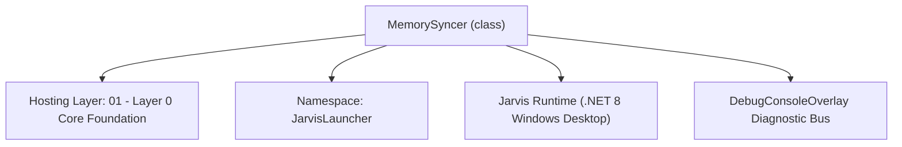
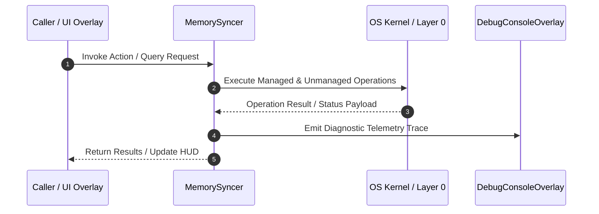

# MemorySyncer - Technical Specification

> [!NOTE] Subsystem Architectural Blueprint & Developer Reference
> **Source File**: `Modules\Layer0\Common\MemorySyncer.cs`  
> **Namespace**: `JarvisLauncher`  
> **Original Author / Developer**: `heaplyn`  
> **Implementation Date**: `2026-08-15`  



---

## 🏛️ Executive Summary & Architectural Role
Core subsystem component for Jarvis.

`MemorySyncer` is an integral part of `01 - Layer 0 Core Foundation`. It enforces the Jarvis architectural invariant where lower layers provide isolated, crash-proof services to higher-level UI and command execution layers.

---

## ⚙️ Practical Real-World Workflow & Developer Use Cases
Runs in the background every 2 minutes, scanning local IDEs (Cursor, Windsurf, VS Code, Cline, Roo-Code) for `.cursorrules`, `.clinerules`, custom instructions, and recent coding tasks, saving them to `Data/Instructions/SyncedMemories.md`.

### 🎯 Primary Use Cases:
1. **Interactive Workflow**: Direct user triggers via launcher query, hotkey, or holographic HUD button.
2. **Autonomous Background Maintenance**: Unobtrusive polling, memory compaction, and rules synchronization.
3. **Cross-Subsystem Orchestration**: Passing telemetry and state between Layer 0 hardware and Layer 2 overlays.

---

## 🔍 Detailed Breakdown: What Each Component Does
- `Start()`: Launches a non-blocking `CancellationTokenSource` loop.
- `SyncAllMemoriesAsync()`: Aggregates workspace rules, IDE global settings, and Roo-Code task histories into a clean Markdown document.

---

## 🛠️ Troubleshooting Guide & How to Fix Common Errors

### ⚠️ Potential Bug: `JSON Parse Failure on Corrupted clinesettings.json`
- **Root Cause & Trigger**: If an IDE crashes mid-write, `JsonDocument.Parse` throws `JsonException`.
- **Step-by-Step Fix & Defensive Code**:
  ```csharp
  // Fix Implementation:
  // Wrap individual file parsers in localized `try-catch` blocks so one corrupt file never halts the entire sync pipeline.
  ```


---

## 🔬 Member Definitions & Method Signatures

| Method Name | Visibility & Modifiers | Return Type | Parameter Signature |
| :--- | :--- | :--- | :--- |
| `Start` | `public static` | `void` | `*none*` |
| `Stop` | `public static` | `void` | `*none*` |
| `SyncWorkspaceRules` | `private static` | `void` | `StringBuilder sb` |
| `SyncGeneralCodingSettings` | `private static` | `void` | `StringBuilder sb` |
| `SyncClineCustomInstructions` | `private static` | `void` | `StringBuilder sb` |


---

## 💻 Source Code Reference

```

using System;
using System.IO;
using System.Text;
using System.Text.Json;
using System.Threading;
using System.Threading.Tasks;
using System.Collections.Generic;
using System.Linq;

namespace JarvisLauncher
{
    public static class MemorySyncer
    {
        private static CancellationTokenSource? _cts;
        private static readonly string SyncedMemoriesPath = Path.Combine(InstructionsManager.InstructionsDirectory, "SyncedMemories.md");

        public static void Start()
        {
            if (_cts != null) return;
            _cts = new CancellationTokenSource();
            
            // Run initial sync
            Task.Run(async () =>
            {
                await SyncAllMemoriesAsync();
                await MainSyncLoop(_cts.Token);
            });
        }

        public static void Stop()
        {
            _cts?.Cancel();
            _cts = null;
        }

        private static async Task MainSyncLoop(CancellationToken token)
        {
            while (!token.IsCancellationRequested)
            {
                try
                {
                    await AdaptiveSleeper.DelayAsync(TimeSpan.FromMinutes(2), token);
                    await SyncAllMemoriesAsync();
                }
                catch (TaskCanceledException) { break; }
                catch (Exception ex)
                {
                    System.Diagnostics.Debug.WriteLine($"MemorySyncer Loop Error: {ex.Message}");
                }
            }
        }

        public static async Task SyncAllMemoriesAsync()
        {
            try
            {
                var sb = new StringBuilder();
                sb.AppendLine("# SYNCED MEMORIES FROM EXTERNAL AI CODING APPS");
                sb.AppendLine("This file is automatically generated. Do not edit directly.");
                sb.AppendLine($"Last synced: {DateTime.Now:yyyy-MM-dd HH:mm:ss}");
                sb.AppendLine();

                // 1. Sync Workspace Rules
                SyncWorkspaceRules(sb);

                // 2. Sync Cursor & Windsurf settings
                SyncGeneralCodingSettings(sb);

                // 3. Sync Cline / Roo-Code Custom Instructions
                SyncClineCustomInstructions(sb);

                // 4. Sync Cline / Roo-Code Recent Tasks
                await SyncRecentClineTasksAsync(sb);

                // Write to file
                string content = sb.ToString();
                string dir = Path.GetDirectoryName(SyncedMemoriesPath)!;
                if (!Directory.Exists(dir)) Directory.CreateDirectory(dir);
                await File.WriteAllTextAsync(SyncedMemoriesPath, content);
                
                DebugConsoleOverlay.Log("MemorySyncer", "Synced memories from external AI coding apps successfully.");
            }
            catch (Exception ex)
            {
                DebugConsoleOverlay.Log("MemorySyncer-Error", $"Failed to sync memories: {ex.Message}");
            }
        }

        private static void SyncWorkspaceRules(StringBuilder sb)
        {
            try
            {
                var currentMem = WorkspaceMemoryManager.GetCurrent();
                if (string.IsNullOrEmpty(currentMem.ActiveFilePath)) return;

                string? projectDir = Path.GetDirectoryName(currentMem.ActiveFilePath);
                if (string.IsNullOrEmpty(projectDir) || !Directory.Exists(projectDir)) return;

                sb.AppendLine("## Workspace-Specific Coding Rules");

                var ruleFiles = new Dictionary<string, string>
                {
                    { ".cursorrules", Path.Combine(projectDir, ".cursorrules") },
                    { ".clinerules", Path.Combine(projectDir, ".clinerules") },
                    { ".windsurfrules", Path.Combine(projectDir, ".windsurfrules") },
                    { ".codeiumrules", Path.Combine(projectDir, ".codeiumrules") },
                    { "Copilot Instructions", Path.Combine(projectDir, ".github", "copilot-instructions.md") }
                };

                bool foundRules = false;
                foreach (var pair in ruleFiles)
                {
                    if (File.Exists(pair.Value))
                    {
                        string content = File.ReadAllText(pair.Value);
                        sb.AppendLine($"### {pair.Key} (from {Path.GetFileName(projectDir)})");
                        sb.AppendLine("``​`markdown");
                        sb.AppendLine(content.Trim());
                        sb.AppendLine("``​`");
                        sb.AppendLine();
                        foundRules = true;
                    }
                }

                if (!foundRules)
                {
                    sb.AppendLine("No project-specific rule files found in active directory.");
                    sb.AppendLine();
                }
            }
            catch (Exception ex)
            {
                sb.AppendLine($"[Error syncing workspace rules: {ex.Message}]");
            }
        }

        private static void SyncGeneralCodingSettings(StringBuilder sb)
        {
            try
            {
                string appData = Environment.GetFolderPath(Environment.SpecialFolder.ApplicationData);
                var settingsPaths = new Dictionary<string, string>
                {
                    { "Cursor", Path.Combine(appData, "Cursor", "User", "settings.json") },
                    { "Windsurf", Path.Combine(appData, "Windsurf", "User", "settings.json") },
                    { "VS Code", Path.Combine(appData, "Code", "User", "settings.json") }
                };

                sb.AppendLine("## Global IDE Custom Instructions");

                bool foundSettings = false;
                foreach (var pair in settingsPaths)
                {
                    if (File.Exists(pair.Value))
                    {
                        string json = File.ReadAllText(pair.Value);
                        using var doc = JsonDocument.Parse(json);
                        
                        // Look for custom instruction keys (e.g. cursor.general.customInstructions)
                        bool foundKey = false;
                        if (doc.RootElement.TryGetProperty("cursor.general.customInstructions", out var instProp))
                        {
                            string text = instProp.GetString() ?? string.Empty;
                            if (!string.IsNullOrWhiteSpace(text))
                            {
                                sb.AppendLine($"### {pair.Key} General Custom Instructions");
                                sb.AppendLine(text.Trim());
                                sb.AppendLine();
                                foundKey = true;
                                foundSettings = true;
                            }
                        }

                        if (!foundKey)
                        {
                            // Check other potential keys
                            foreach (var prop in doc.RootElement.EnumerateObject())
                            {
                                if (prop.Name.Contains("customInstructions", StringComparison.OrdinalIgnoreCase) ||
                                    prop.Name.Contains("ai.rules", StringComparison.OrdinalIgnoreCase))
                                {
                                    string text = prop.Value.GetString() ?? string.Empty;
                                    if (!string.IsNullOrWhiteSpace(text))
                                    {
                                        sb.AppendLine($"### {pair.Key} - {prop.Name}");
                                        sb.AppendLine(text.Trim());
                                        sb.AppendLine();
                                        foundSettings = true;
                                    }
                                }
                            }
                        }
                    }
                }

                if (!foundSettings)
                {
                    sb.AppendLine("No global custom instructions found in IDE settings files.");
                    sb.AppendLine();
                }
            }
            catch (Exception ex)
            {
                sb.AppendLine($"[Error syncing IDE settings: {ex.Message}]");
            }
        }

        private static void SyncClineCustomInstructions(StringBuilder sb)
        {
            try
            {
                string appData = Environment.GetFolderPath(Environment.SpecialFolder.ApplicationData);
                var clinePaths = new Dictionary<string, string>
                {
                    { "Roo-Code", Path.Combine(appData, "Code", "User", "globalStorage", "roopin.roo-cline", "settings", "clinesettings.json") },
                    { "Cline", Path.Combine(appData, "Code", "User", "globalStorage", "saoudrizwan.claude-dev", "settings", "clinesettings.json") }
                };

                sb.AppendLine("## Roo-Code & Cline Custom Instructions");

                bool foundInstructions = false;
                foreach (var pair in clinePaths)
                {
                    if (File.Exists(pair.Value))
                    {
                        string json = File.ReadAllText(pair.Value);
                        using var doc = JsonDocument.Parse(json);
                        if (doc.RootElement.TryGetProperty("customInstructions", out var instProp))
                        {
                            string text = instProp.GetString() ?? string.Empty;
                            if (!string.IsNullOrWhiteSpace(text))
                            {
                                sb.AppendLine($"### {pair.Key} Instructions");
                                sb.AppendLine(text.Trim());
                                sb.AppendLine();
                                foundInstructions = true;
                            }
                        }
                    }
                }

                if (!foundInstructions)
                {
                    sb.AppendLine("No global Roo-Code or Cline custom instructions found.");
                    sb.AppendLine();
                }
            }
            catch (Exception ex)
            {
                sb.AppendLine($"[Error syncing Cline instructions: {ex.Message}]");
            }
        }

        private static async Task SyncRecentClineTasksAsync(StringBuilder sb)
        {
            try
            {
                string appData = Environment.GetFolderPath(Environment.SpecialFolder.ApplicationData);
                var taskDirs = new Dictionary<string, string>
                {
                    { "Roo-Code", Path.Combine(appData, "Code", "User", "globalStorage", "roopin.roo-cline", "tasks") },
                    { "Cline", Path.Combine(appData, "Code", "User", "globalStorage", "saoudrizwan.claude-dev", "tasks") }
                };

                sb.AppendLine("## Recent AI Coding Tasks & History");

                bool foundTasks = false;
                foreach (var pair in taskDirs)
                {
                    if (Directory.Exists(pair.Value))
                    {
                        var taskFiles = Directory.GetFiles(pair.Value, "*.json")
                            .Select(f => new FileInfo(f))
                            .OrderByDescending(f => f.LastWriteTime)
                            .Take(3) // Sync the latest 3 active tasks
                            .ToList();

                        foreach (var file in taskFiles)
                        {
                            try
                            {
                                string json = await File.ReadAllTextAsync(file.FullName);
                                using var doc = JsonDocument.Parse(json);
                                
                                string taskPrompt = string.Empty;
                                if (doc.RootElement.TryGetProperty("task", out var taskProp))
                                {
                                    taskPrompt = taskProp.GetString() ?? string.Empty;
                                }

                                if (string.IsNullOrWhiteSpace(taskPrompt))
                                {
                                    // Sometimes stored in first message or under a different property
                                    continue;
                                }

                                sb.AppendLine($"### {pair.Key} Task ({file.LastWriteTime:yyyy-MM-dd HH:mm})");
                                sb.AppendLine($"- **Goal**: {taskPrompt.Trim()}");
                                
                                // Try to extract summary of work if available
                                if (doc.RootElement.TryGetProperty("clinesettings", out var settingsProp))
                                {
                                    // Roo-Code/Cline metadata
                                }

                                sb.AppendLine();
                                foundTasks = true;
                            }
                            catch { }
                        }
                    }
                }

                if (!foundTasks)
                {
                    sb.AppendLine("No recent AI coding tasks found.");
                    sb.AppendLine();
                }
            }
            catch (Exception ex)
            {
                sb.AppendLine($"[Error syncing AI coding tasks: {ex.Message}]");
            }
        }
    }
}
```

---

## ⚡ Execution Flow & Sequence



---

## 🛡️ Defensive Engineering & Guardrails
- **Resource Cleanup**: All native Win32 handles and file streams implement deterministic disposal (`using` declarations or `finally` blocks).
- **Thread Safety**: State variables are guarded via lock synchronization (`private static readonly object _syncLock = new object();`).
- **Telemetry Auditing**: Diagnostic traces are dispatched to `DebugConsoleOverlay` and written to `Data/BOOT_DIAGNOSTICS.log`.

---

## 🔗 Related WikiLinks
- [[Master Map of Content & System Index]]
- [[Core System Architecture & 4-Layer Hierarchy]]
- [[NativeMethods & Win32 Kernel Interop Master Manual]]
- [[AiAPI Gateway & Multi-Model Routing Architecture]]
- [[BaseOverlay & GPU Holographic Windowing Engine]]
- [[SystemMonitorOverlay & Diagnostic Telemetry HUD]]
- [[Max PC Optimization Pipeline & Autonomic Engine]]
