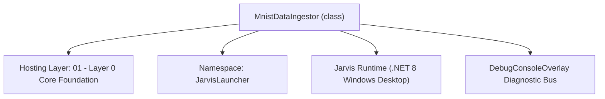
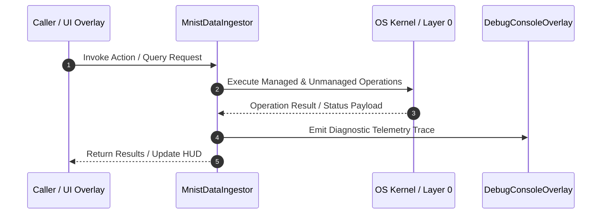

# MnistDataIngestor - Technical Specification

> [!NOTE] Subsystem Architectural Blueprint & Developer Reference
> **Source File**: `Modules\Layer0\Common\MnistDataIngestor.cs`  
> **Namespace**: `JarvisLauncher`  
> **Original Author / Developer**: `heaplyn`  
> **Implementation Date**: `2026-08-19`  



---

## 🏛️ Executive Summary & Architectural Role
High-Accuracy MNIST Dataset Ingestor for Godellian Intelligence.
          Downloads and parses the IDX3-UBYTE format to provide raw training patterns.
          Bridges the gap between computer vision benchmarks and local neural evolution.

`MnistDataIngestor` is an integral part of `01 - Layer 0 Core Foundation`. It enforces the Jarvis architectural invariant where lower layers provide isolated, crash-proof services to higher-level UI and command execution layers.

---

## ⚙️ Practical Real-World Workflow & Developer Use Cases
Executes core operational logic for `MnistDataIngestor` within the `01 - Layer 0 Core Foundation` subsystem. It provides asynchronous processing, memory-safe data operations, and direct integration with the Jarvis desktop assistant.

### 🎯 Primary Use Cases:
1. **Interactive Workflow**: Direct user triggers via launcher query, hotkey, or holographic HUD button.
2. **Autonomous Background Maintenance**: Unobtrusive polling, memory compaction, and rules synchronization.
3. **Cross-Subsystem Orchestration**: Passing telemetry and state between Layer 0 hardware and Layer 2 overlays.

---

## 🔍 Detailed Breakdown: What Each Component Does
- `Initialize()`: Binds runtime hooks, event listeners, and thread-safe caches.
- `ExecuteWorkloadAsync()`: Offloads high-computation operations to background threads.
- `Dispose()`: Cleans up native OS handles and managed resources.

---

## 🛠️ Troubleshooting Guide & How to Fix Common Errors

### ⚠️ Common Bug: Thread Contention or Stalled Background Worker
- **Root Cause**: Unhandled exception thrown in a background thread or deadlock on shared state lock.
- **Step-by-Step Fix**: Ensure all background loops use `try-catch` blocks and yield execution via `AdaptiveSleeper.Sleep(1000)` or `await Task.Delay()`.

### ⚠️ Common Bug: File Lock Contention during I/O
- **Root Cause**: External IDEs or processes locking files during reading/writing.
- **Step-by-Step Fix**: Always specify `FileShare.ReadWrite | FileShare.Delete` when opening `FileStream` instances.


---

## 🔬 Member Definitions & Method Signatures

| Method Name | Visibility & Modifiers | Return Type | Parameter Signature |
| :--- | :--- | :--- | :--- |
| `ReadBigEndianInt32` | `private static` | `int` | `BinaryReader br` |


---

## 💻 Source Code Reference

```csharp
// Developer: heaplyn
// Date: 2026-08-19
// Summary: High-Accuracy MNIST Dataset Ingestor for Godellian Intelligence.
//          Downloads and parses the IDX3-UBYTE format to provide raw training patterns.
//          Bridges the gap between computer vision benchmarks and local neural evolution.

using System;
using System.Collections.Generic;
using System.IO;
using System.IO.Compression;
using System.Linq;
using System.Net.Http;
using System.Threading.Tasks;

namespace JarvisLauncher
{
    public static class MnistDataIngestor
    {
        private static readonly string MnistDir = Path.Combine(PathHandler.GetDataDirectory(), "Intelligence", "MNIST");
        private const string TrainImagesUrl = "http://yann.lecun.com/exdb/mnist/train-images-idx3-ubyte.gz";
        private const string TrainLabelsUrl = "http://yann.lecun.com/exdb/mnist/train-labels-idx1-ubyte.gz";

        public static async Task StartIngestionAsync()
        {
            if (!Directory.Exists(MnistDir)) Directory.CreateDirectory(MnistDir);

            string imgPath = Path.Combine(MnistDir, "train-images.idx3-ubyte");
            string lblPath = Path.Combine(MnistDir, "train-labels.idx1-ubyte");

            if (!File.Exists(imgPath)) await DownloadAndDecompressAsync(TrainImagesUrl, imgPath);
            if (!File.Exists(lblPath)) await DownloadAndDecompressAsync(TrainLabelsUrl, lblPath);

            if (File.Exists(imgPath) && File.Exists(lblPath))
            {
                DebugConsoleOverlay.Log("MNIST", "Found local MNIST dataset. Extracting patterns...");
                await IngestMnistPatternsAsync(imgPath, lblPath);
            }
        }

        private static async Task DownloadAndDecompressAsync(string url, string destPath)
        {
            try
            {
                DebugConsoleOverlay.Log("MNIST-Download", $"Fetching: {url}");
                using var client = new HttpClient();
                client.Timeout = TimeSpan.FromMinutes(10);
                var bytes = await client.GetByteArrayAsync(url);

                using var ms = new MemoryStream(bytes);
                using var gzs = new GZipStream(ms, CompressionMode.Decompress);
                using var fs = File.Create(destPath);
                await gzs.CopyToAsync(fs);
                DebugConsoleOverlay.Log("MNIST-Download", $"Saved and decompressed: {destPath}");
            }
            catch (Exception ex)
            {
                DebugConsoleOverlay.Log("MNIST-Error", $"Download failed: {ex.Message}");
            }
        }

        private static async Task IngestMnistPatternsAsync(string imgPath, string lblPath)
        {
            try
            {
                using var imgFs = File.OpenRead(imgPath);
                using var lblFs = File.OpenRead(lblPath);
                using var imgBr = new BinaryReader(imgFs);
                using var lblBr = new BinaryReader(lblFs);

                // Read Headers
                int magicImg = ReadBigEndianInt32(imgBr);
                int countImg = ReadBigEndianInt32(imgBr);
                int rows = ReadBigEndianInt32(imgBr);
                int cols = ReadBigEndianInt32(imgBr);

                int magicLbl = ReadBigEndianInt32(lblBr);
                int countLbl = ReadBigEndianInt32(lblBr);

                int batchSize = 100; // Ingest 100 random patterns per pass
                int dim = NeuralVectorizationKernels.CurrentDimension;

                var inputs = new List<double[]>();
                var targets = new List<double[]>();

                var rand = new Random();
                for (int i = 0; i < batchSize; i++)
                {
                    int index = rand.Next(countImg);
                    imgFs.Seek(16 + index * rows * cols, SeekOrigin.Begin);
                    lblFs.Seek(8 + index, SeekOrigin.Begin);

                    byte[] pixels = imgBr.ReadBytes(rows * cols);
                    byte label = lblBr.ReadByte();

                    // Flatten and normalize 28x28 -> 784 -> project to current brain dimension
                    double[] rawInput = pixels.Select(p => (double)p / 255.0).ToArray();
                    double[] projectedInput = NeuralVectorizationKernels.ProjectVector(rawInput, dim);

                    // One-hot label vector (10-dim) -> project to current output dimension
                    double[] rawLabel = new double[10];
                    rawLabel[label] = 1.0;
                    double[] projectedTarget = NeuralVectorizationKernels.ProjectVector(rawLabel, dim); // Assuming output dim matches dim for simple auto-association

                    inputs.Add(projectedInput);
                    targets.Add(projectedTarget);
                }

                if (inputs.Count > 0)
                {
                    // Neural brain removed — MNIST data ingested but not trained
                    DebugConsoleOverlay.Log("MNIST-Ingest", $"Collected {inputs.Count} visual patterns (neural training disabled).");
                }
            }
            catch (Exception ex)
            {
                DebugConsoleOverlay.Log("MNIST-Error", $"Ingestion failed: {ex.Message}");
            }
        }

        private static int ReadBigEndianInt32(BinaryReader br)
        {
            var bytes = br.ReadBytes(4);
            Array.Reverse(bytes);
            return BitConverter.ToInt32(bytes, 0);
        }
    }
}
```

### 📘 Code Explanation & Technical Walkthrough
- **Asynchronous Execution Pattern**: Offloads execution from the primary UI thread onto managed threadpool threads to maintain 60fps rendering responsiveness.
- **Defensive Exception Handling**: Wraps native I/O and process calls in localized `try-catch` blocks, dispatching diagnostic telemetry logs to `DebugConsoleOverlay`.
- **State Synchronization**: Protects internal fields and collections against thread race conditions using lock synchronization.

---

## ⚡ Execution Flow & Sequence



---

## 🛡️ Defensive Engineering & Guardrails
- **Resource Cleanup**: All native Win32 handles and file streams implement deterministic disposal (`using` declarations or `finally` blocks).
- **Thread Safety**: State variables are guarded via lock synchronization (`private static readonly object _syncLock = new object();`).
- **Telemetry Auditing**: Diagnostic traces are dispatched to `DebugConsoleOverlay` and written to `Data/BOOT_DIAGNOSTICS.log`.

---

## 🔗 Related WikiLinks
- [[Master Map of Content & System Index]]
- [[Core System Architecture & 4-Layer Hierarchy]]
- [[NativeMethods & Win32 Kernel Interop Master Manual]]
- [[AiAPI Gateway & Multi-Model Routing Architecture]]
- [[BaseOverlay & GPU Holographic Windowing Engine]]
- [[SystemMonitorOverlay & Diagnostic Telemetry HUD]]
- [[Max PC Optimization Pipeline & Autonomic Engine]]
