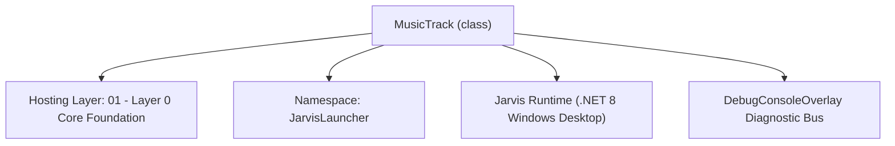
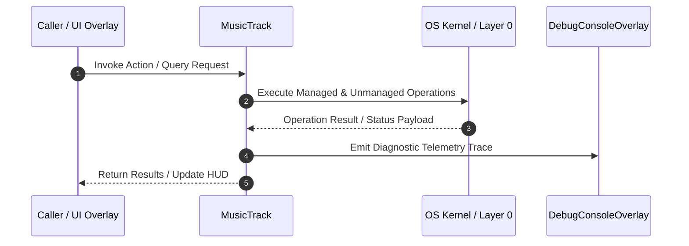

# MusicPlaylistManager - Technical Specification

> [!NOTE] Subsystem Architectural Blueprint & Developer Reference
> **Source File**: `Modules\Layer0\Common\MusicPlaylistManager.cs`  
> **Namespace**: `JarvisLauncher`  
> **Original Author / Developer**: `heaplyn`  
> **Implementation Date**: `2026-08-09`  



---

## 🏛️ Executive Summary & Architectural Role
Data models and persistence manager for music playlists, custom folders, track metadata, and online stream links inside Data/MusicPlaylists.json.

`MusicTrack` is an integral part of `01 - Layer 0 Core Foundation`. It enforces the Jarvis architectural invariant where lower layers provide isolated, crash-proof services to higher-level UI and command execution layers.

---

## ⚙️ Practical Real-World Workflow & Developer Use Cases
Executes core operational logic for `MusicPlaylistManager` within the `01 - Layer 0 Core Foundation` subsystem. It provides asynchronous processing, memory-safe data operations, and direct integration with the Jarvis desktop assistant.

### 🎯 Primary Use Cases:
1. **Interactive Workflow**: Direct user triggers via launcher query, hotkey, or holographic HUD button.
2. **Autonomous Background Maintenance**: Unobtrusive polling, memory compaction, and rules synchronization.
3. **Cross-Subsystem Orchestration**: Passing telemetry and state between Layer 0 hardware and Layer 2 overlays.

---

## 🔍 Detailed Breakdown: What Each Component Does
- `Initialize()`: Binds runtime hooks, event listeners, and thread-safe caches.
- `ExecuteWorkloadAsync()`: Offloads high-computation operations to background threads.
- `Dispose()`: Cleans up native OS handles and managed resources.

---

## 🛠️ Troubleshooting Guide & How to Fix Common Errors

### ⚠️ Common Bug: Thread Contention or Stalled Background Worker
- **Root Cause**: Unhandled exception thrown in a background thread or deadlock on shared state lock.
- **Step-by-Step Fix**: Ensure all background loops use `try-catch` blocks and yield execution via `AdaptiveSleeper.Sleep(1000)` or `await Task.Delay()`.

### ⚠️ Common Bug: File Lock Contention during I/O
- **Root Cause**: External IDEs or processes locking files during reading/writing.
- **Step-by-Step Fix**: Always specify `FileShare.ReadWrite | FileShare.Delete` when opening `FileStream` instances.


---

## 🔬 Member Definitions & Method Signatures

| Method Name | Visibility & Modifiers | Return Type | Parameter Signature |
| :--- | :--- | :--- | :--- |
| `GetFilePath` | `private static` | `string` | `*none*` |
| `LoadLibrary` | `public static` | `MusicLibraryData` | `*none*` |
| `AddTrackToFolderAndAllSongs` | `public static` | `void` | `MusicLibraryData library, MusicFolder targetFolder, MusicTrack track` |
| `SaveLibrary` | `public static` | `void` | `MusicLibraryData data` |


---

## 💻 Source Code Reference

```csharp
// Developer: heaplyn
// Date: 2026-08-09
// Summary: Data models and persistence manager for music playlists, custom folders, track metadata, and online stream links inside Data/MusicPlaylists.json.

using System;
using System.Collections.Generic;
using System.IO;
using System.Linq;
using System.Text.Json;

namespace JarvisLauncher
{
    public class MusicTrack
    {
        public string Id { get; set; } = Guid.NewGuid().ToString();
        public string Title { get; set; } = string.Empty;
        public string Artist { get; set; } = "Unknown Artist";
        public string PathOrUrl { get; set; } = string.Empty; // Local .mp3/.wav/.flac path OR web stream URL
        public bool IsStreamUrl { get; set; } = false;
        public DateTime AddedAt { get; set; } = DateTime.Now;
    }

    public class MusicFolder
    {
        public string Id { get; set; } = Guid.NewGuid().ToString();
        public string FolderName { get; set; } = "Default Playlist";
        public List<MusicTrack> Tracks { get; set; } = new List<MusicTrack>();
    }

    public class MusicLibraryData
    {
        public List<MusicFolder> Folders { get; set; } = new List<MusicFolder>();
        public string LastActiveFolderId { get; set; } = string.Empty;
    }

    public static class MusicPlaylistManager
    {
        private static string GetFilePath()
        {
            string dataDir = PathHandler.GetDataDirectory();
            return Path.Combine(dataDir, "MusicPlaylists.json");
        }

        public static MusicLibraryData LoadLibrary()
        {
            try
            {
                string p = GetFilePath();
                if (File.Exists(p))
                {
                    string json = File.ReadAllText(p);
                    var data = JsonSerializer.Deserialize<MusicLibraryData>(json);
                    if (data != null && data.Folders.Count > 0)
                    {
                        DebugConsoleOverlay.Log("Music", $"Loaded playlist library from {p} ({data.Folders.Sum(f => f.Tracks.Count)} tracks)");
                        return data;
                    }
                }
            }
            catch (Exception ex)
            {
                DebugConsoleOverlay.Log("Music-Error", $"Failed to load playlist library: {ex.Message}");
            }

            // Default initial setup
            DebugConsoleOverlay.Log("Music", "Creating new default playlist library.");
            var defaultLibrary = new MusicLibraryData();
            var allSongsFolder = new MusicFolder { FolderName = "🎵 All Songs" };
            var defaultFolder = new MusicFolder { FolderName = "Favorites" };
            
            defaultLibrary.Folders.Add(allSongsFolder);
            defaultLibrary.Folders.Add(defaultFolder);
            defaultLibrary.LastActiveFolderId = allSongsFolder.Id;
            SaveLibrary(defaultLibrary);
            return defaultLibrary;
        }

        public static void AddTrackToFolderAndAllSongs(MusicLibraryData library, MusicFolder targetFolder, MusicTrack track)
        {
            // 1. Add track to target folder
            if (!targetFolder.Tracks.Any(t => t.PathOrUrl == track.PathOrUrl))
            {
                targetFolder.Tracks.Add(track);
            }

            // 2. Add track to "🎵 All Songs" folder automatically
            var allSongsFolder = library.Folders.FirstOrDefault(f => f.FolderName == "🎵 All Songs");
            if (allSongsFolder == null)
            {
                allSongsFolder = new MusicFolder { FolderName = "🎵 All Songs" };
                library.Folders.Insert(0, allSongsFolder);
            }

            if (!allSongsFolder.Tracks.Any(t => t.PathOrUrl == track.PathOrUrl))
            {
                var clone = new MusicTrack
                {
                    Title = track.Title,
                    Artist = track.Artist,
                    PathOrUrl = track.PathOrUrl,
                    IsStreamUrl = track.IsStreamUrl,
                    AddedAt = track.AddedAt
                };
                allSongsFolder.Tracks.Add(clone);
            }

            SaveLibrary(library);
        }

        public static void SaveLibrary(MusicLibraryData data)
        {
            if (data == null) return;
            try
            {
                string p = GetFilePath();
                var options = new JsonSerializerOptions { WriteIndented = true };
                string json = JsonSerializer.Serialize(data, options);

                // Write to a temporary file first to prevent corruption
                string tempPath = p + ".tmp";
                File.WriteAllText(tempPath, json);

                if (File.Exists(p)) File.Delete(p);
                File.Move(tempPath, p);

                DebugConsoleOverlay.Log("Music-System", $"Playlist library successfully persisted to disk ({data.Folders.Count} folders).");
            }
            catch (Exception ex)
            {
                DebugConsoleOverlay.Log("Music-Error", $"Failed to save playlist library: {ex.Message}");
            }
        }
    }
}
```

### 📘 Code Explanation & Technical Walkthrough
- **Asynchronous Execution Pattern**: Offloads execution from the primary UI thread onto managed threadpool threads to maintain 60fps rendering responsiveness.
- **Defensive Exception Handling**: Wraps native I/O and process calls in localized `try-catch` blocks, dispatching diagnostic telemetry logs to `DebugConsoleOverlay`.
- **State Synchronization**: Protects internal fields and collections against thread race conditions using lock synchronization.

---

## ⚡ Execution Flow & Sequence



---

## 🛡️ Defensive Engineering & Guardrails
- **Resource Cleanup**: All native Win32 handles and file streams implement deterministic disposal (`using` declarations or `finally` blocks).
- **Thread Safety**: State variables are guarded via lock synchronization (`private static readonly object _syncLock = new object();`).
- **Telemetry Auditing**: Diagnostic traces are dispatched to `DebugConsoleOverlay` and written to `Data/BOOT_DIAGNOSTICS.log`.

---

## 🔗 Related WikiLinks
- [[Master Map of Content & System Index]]
- [[Core System Architecture & 4-Layer Hierarchy]]
- [[NativeMethods & Win32 Kernel Interop Master Manual]]
- [[AiAPI Gateway & Multi-Model Routing Architecture]]
- [[BaseOverlay & GPU Holographic Windowing Engine]]
- [[SystemMonitorOverlay & Diagnostic Telemetry HUD]]
- [[Max PC Optimization Pipeline & Autonomic Engine]]
