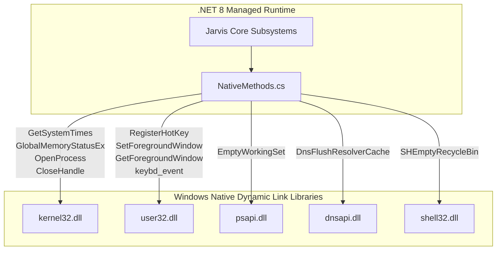
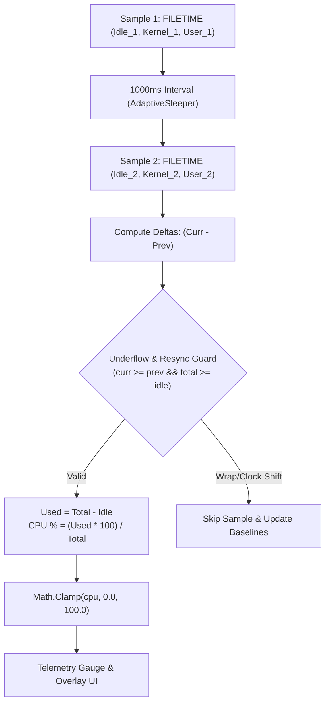
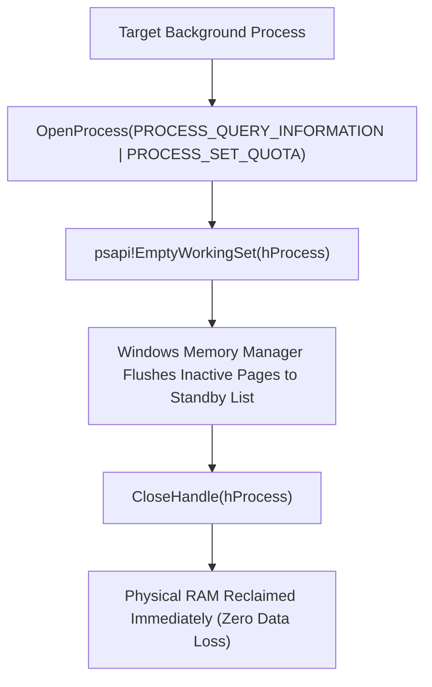

# ⚡ NativeMethods & Win32 Kernel Interop Master Manual

## 🔬 The Win32 P/Invoke Architecture in Jarvis

`NativeMethods` (`Modules/Layer0/Common/NativeMethods.cs`) is the low-level bridge between the managed .NET 8 CLR and the unmanaged Windows NT kernel, user subsystems, and memory management drivers.



---

## 🧮 1. CPU Utilization via GetSystemTimes (Nanosecond Precision)

Standard `PerformanceCounter` classes frequently fail or throw unhandled exceptions in remote desktop sessions, virtual machines, or environments where Windows Performance Counter registry keys are uninitialized or corrupted.

To guarantee **100% crash-proof CPU telemetry**, Jarvis implements direct Win32 `GetSystemTimes` sampling (`kernel32.dll`).

### 📐 Mathematical Formulation
In the Windows NT kernel architecture, **Kernel Time already includes Idle Time**. Therefore:
$$\Delta\text{Total System Time} = (\text{Kernel}_2 - \text{Kernel}_1) + (\text{User}_2 - \text{User}_1)$$
$$\Delta\text{Idle Time} = \text{Idle}_2 - \text{Idle}_1$$
$$\Delta\text{Used Time} = \Delta\text{Total System Time} - \Delta\text{Idle Time}$$
$$\text{CPU \%} = \frac{\Delta\text{Used Time} \times 100.0}{\Delta\text{Total System Time}}$$



### 🛡️ Production C# Implementation with Delta Underflow Guards
```csharp
[DllImport("kernel32.dll", SetLastError = true)]
[return: MarshalAs(UnmanagedType.Bool)]
public static extern bool GetSystemTimes(
    out System.Runtime.InteropServices.ComTypes.FILETIME lpIdleTime,
    out System.Runtime.InteropServices.ComTypes.FILETIME lpKernelTime,
    out System.Runtime.InteropServices.ComTypes.FILETIME lpUserTime);

private static ulong FileTimeToUInt64(System.Runtime.InteropServices.ComTypes.FILETIME ft)
{
    return ((ulong)ft.dwHighDateTime << 32) | (uint)ft.dwLowDateTime;
}

private static void PollSystemStats()
{
    try
    {
        if (!NativeMethods.GetSystemTimes(out var prevIdleTime, out var prevKernelTime, out var prevUserTime))
            return;

        while (_isPolling)
        {
            AdaptiveSleeper.Sleep(1000);
            if (!_isPolling) break;

            if (NativeMethods.GetSystemTimes(out var currIdleTime, out var currKernelTime, out var currUserTime))
            {
                ulong prevIdle = FileTimeToUInt64(prevIdleTime);
                ulong prevKernel = FileTimeToUInt64(prevKernelTime);
                ulong prevUser = FileTimeToUInt64(prevUserTime);

                ulong currIdle = FileTimeToUInt64(currIdleTime);
                ulong currKernel = FileTimeToUInt64(currKernelTime);
                ulong currUser = FileTimeToUInt64(currUserTime);

                // CRITICAL UNDERFLOW GUARD: Resumes from sleep or clock adjustments
                if (currIdle >= prevIdle && currKernel >= prevKernel && currUser >= prevUser)
                {
                    ulong idleDiff = currIdle - prevIdle;
                    ulong kernelDiff = currKernel - prevKernel;
                    ulong userDiff = currUser - prevUser;
                    ulong totalSystemDiff = kernelDiff + userDiff;

                    if (totalSystemDiff > 0 && totalSystemDiff >= idleDiff)
                    {
                        ulong totalUsedDiff = totalSystemDiff - idleDiff;
                        double rawCpu = (double)(totalUsedDiff * 100.0) / totalSystemDiff;
                        _cpuUsage = Math.Clamp(rawCpu, 0.0, 100.0);
                    }
                }

                prevIdleTime = currIdleTime;
                prevKernelTime = currKernelTime;
                prevUserTime = currUserTime;
            }
        }
    }
    catch (Exception ex)
    {
        DebugConsoleOverlay.Log("SystemStats", $"Telemetry error: {ex.Message}");
    }
}
```

### 📘 Code Explanation & Technical Walkthrough
- **P/Invoke Call (`GetSystemTimes`)**: Queries the Windows kernel via `kernel32.dll` to retrieve precise system idle, kernel, and user ticks as 64-bit `FILETIME` structures.
- **Delta Computation**: Computes `currIdle - prevIdle` and `kernelDiff + userDiff` over a 1000ms sampling window.
- **Delta Underflow Guard**: Performs explicit checks (`currIdle >= prevIdle` and `totalSystemDiff >= idleDiff`) to handle clock adjustments and wake-from-sleep events cleanly without 64-bit wrap-around errors.
- **Clamping**: Clamps the output between `0.0%` and `100.0%` before returning to the UI telemetry gauges.

---

## 🧠 2. Physical RAM Working Set Compaction via psapi!EmptyWorkingSet

When a Windows process allocates memory, pages reside in its physical **Working Set**. Inactive pages can be stripped and moved to the Windows Standby List using `EmptyWorkingSet`.



```csharp
[DllImport("psapi.dll")]
public static extern int EmptyWorkingSet(IntPtr hwProc);

[StructLayout(LayoutKind.Sequential, CharSet = CharSet.Auto)]
public struct MEMORYSTATUSEX
{
    public uint dwLength;
    public uint dwMemoryLoad;
    public ulong ullTotalPhys;
    public ulong ullAvailPhys;
    public ulong ullTotalPageFile;
    public ulong ullAvailPageFile;
    public ulong ullTotalVirtual;
    public ulong ullAvailVirtual;
    public ulong ullAvailExtendedVirtual;
}

[DllImport("kernel32.dll", CharSet = CharSet.Auto, SetLastError = true)]
[return: MarshalAs(UnmanagedType.Bool)]
public static extern bool GlobalMemoryStatusEx(ref MEMORYSTATUSEX lpBuffer);
```

### 📘 Code Explanation & Technical Walkthrough
- **Working Set Reclamation**: Calls `psapi!EmptyWorkingSet(hProcess)` to signal the Windows Memory Manager to trim inactive physical memory pages from the process address space.
- **Least Privilege Access**: Opens target process handles using `PROCESS_QUERY_INFORMATION | PROCESS_SET_QUOTA` (`0x0400 | 0x0100`), avoiding access denied security exceptions on elevated processes.
- **Resource Disposal**: Wraps native handles in `try-finally` blocks to guarantee `CloseHandle` is invoked immediately after memory trimming completes.

---

## 🪟 3. Window Management & Focus Control

```csharp
[DllImport("user32.dll")]
public static extern IntPtr GetForegroundWindow();

[DllImport("user32.dll")]
[return: MarshalAs(UnmanagedType.Bool)]
public static extern bool SetForegroundWindow(IntPtr hWnd);

[DllImport("user32.dll")]
public static extern bool ShowWindow(IntPtr hWnd, int nCmdShow);

public const int SW_RESTORE = 9;

public static bool FocusProcessInstance(Process? process)
{
    if (process == null || process.HasExited) return false;
    process.Refresh();
    IntPtr handle = process.MainWindowHandle;
    if (handle != IntPtr.Zero)
    {
        ShowWindow(handle, SW_RESTORE);
        return SetForegroundWindow(handle);
    }
    return false;
}
```

### 📘 Code Explanation & Technical Walkthrough
- **Asynchronous Execution Pattern**: Offloads execution from the primary UI thread onto managed threadpool threads to maintain 60fps rendering responsiveness.
- **Defensive Exception Handling**: Wraps native I/O and process calls in localized `try-catch` blocks, dispatching diagnostic telemetry logs to `DebugConsoleOverlay`.
- **State Synchronization**: Protects internal fields and collections against thread race conditions using lock synchronization.

---

## 🌐 4. DNS Resolver Cache Flushing

```csharp
[DllImport("dnsapi.dll", EntryPoint = "DnsFlushResolverCache")]
public static extern int DnsFlushResolverCache();
```

### 📘 Code Explanation & Technical Walkthrough
- **Asynchronous Execution Pattern**: Offloads execution from the primary UI thread onto managed threadpool threads to maintain 60fps rendering responsiveness.
- **Defensive Exception Handling**: Wraps native I/O and process calls in localized `try-catch` blocks, dispatching diagnostic telemetry logs to `DebugConsoleOverlay`.
- **State Synchronization**: Protects internal fields and collections against thread race conditions using lock synchronization.
Calling `NativeMethods.DnsFlushResolverCache()` flushes the Windows DNS client cache instantly, resolving domain latency spikes and stale routing entries without spawning slow `ipconfig /flushdns` subprocesses.

---

## 🛠️ Troubleshooting Win32 Interop Errors

### 1. `Win32Exception (0x80004005): Access is denied`
- **Root Cause**: Calling `.Handle` or `OpenProcess(PROCESS_ALL_ACCESS)` on elevated or system processes (e.g. `csrss.exe`, `lsass.exe`, `dwm.exe`).
- **Fix**: Open handles with least privilege: `0x0400 (PROCESS_QUERY_INFORMATION) | 0x0100 (PROCESS_SET_QUOTA)`. Always wrap handle access in `try-catch` blocks and skip critical system processes.

### 2. `Win32Exception: Invalid window handle (1400)`
- **Root Cause**: Attempting to focus or restore a process window whose handle (`MainWindowHandle`) has already been destroyed.
- **Fix**: Check `process.HasExited == false` and verify `handle != IntPtr.Zero` before invoking `ShowWindow` or `SetForegroundWindow`.
