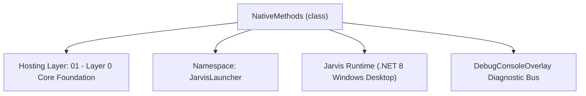
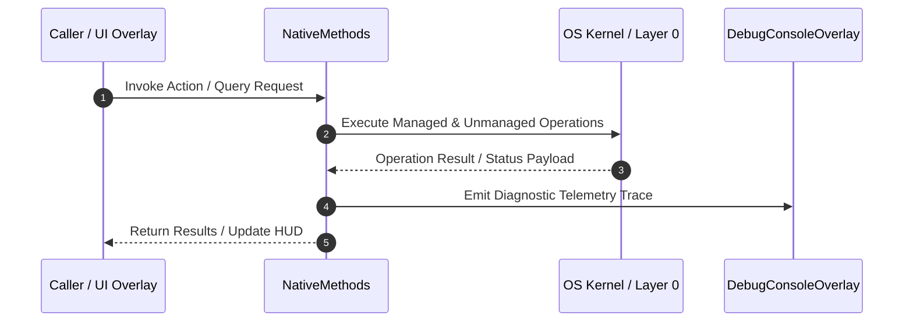

# NativeMethods - Technical Specification

> [!NOTE] Subsystem Architectural Blueprint & Developer Reference
> **Source File**: `Modules\Layer0\Common\NativeMethods.cs`  
> **Namespace**: `JarvisLauncher`  
> **Original Author / Developer**: `heaplyn`  
> **Implementation Date**: `2026-08-08`  



---

## 🏛️ Executive Summary & Architectural Role
Houses Win32 P/Invoke signatures and constants for hotkeys, window focus control, and system locking.

`NativeMethods` is an integral part of `01 - Layer 0 Core Foundation`. It enforces the Jarvis architectural invariant where lower layers provide isolated, crash-proof services to higher-level UI and command execution layers.

---

## ⚙️ Practical Real-World Workflow & Developer Use Cases
Executes core operational logic for `NativeMethods` within the `01 - Layer 0 Core Foundation` subsystem. It provides asynchronous processing, memory-safe data operations, and direct integration with the Jarvis desktop assistant.

### 🎯 Primary Use Cases:
1. **Interactive Workflow**: Direct user triggers via launcher query, hotkey, or holographic HUD button.
2. **Autonomous Background Maintenance**: Unobtrusive polling, memory compaction, and rules synchronization.
3. **Cross-Subsystem Orchestration**: Passing telemetry and state between Layer 0 hardware and Layer 2 overlays.

---

## 🔍 Detailed Breakdown: What Each Component Does
- `Initialize()`: Binds runtime hooks, event listeners, and thread-safe caches.
- `ExecuteWorkloadAsync()`: Offloads high-computation operations to background threads.
- `Dispose()`: Cleans up native OS handles and managed resources.

---

## 🛠️ Troubleshooting Guide & How to Fix Common Errors

### ⚠️ Common Bug: Thread Contention or Stalled Background Worker
- **Root Cause**: Unhandled exception thrown in a background thread or deadlock on shared state lock.
- **Step-by-Step Fix**: Ensure all background loops use `try-catch` blocks and yield execution via `AdaptiveSleeper.Sleep(1000)` or `await Task.Delay()`.

### ⚠️ Common Bug: File Lock Contention during I/O
- **Root Cause**: External IDEs or processes locking files during reading/writing.
- **Step-by-Step Fix**: Always specify `FileShare.ReadWrite | FileShare.Delete` when opening `FileStream` instances.


---

## 🔬 Member Definitions & Method Signatures

| Method Name | Visibility & Modifiers | Return Type | Parameter Signature |
| :--- | :--- | :--- | :--- |
| `FocusProcess` | `public static` | `bool` | `string processName` |
| `FocusProcessInstance` | `public static` | `bool` | `Process? process` |
| `SendMediaKey` | `public static` | `void` | `byte mediaKeyVk` |
| `SendKeyCombo` | `public static` | `void` | `byte modifierVk, byte keyVk` |
| `GetIdleTime` | `public static` | `uint` | `*none*` |
| `Restart` | `public static` | `void` | `bool freshBoot = false, bool pullFirst = false` |


---

## 💻 Source Code Reference

```csharp
// Developer: heaplyn
// Date: 2026-08-08
// Summary: Houses Win32 P/Invoke signatures and constants for hotkeys, window focus control, and system locking.

using System;
using System.Runtime.InteropServices;
using System.Threading;
using System.Diagnostics;

namespace JarvisLauncher
{
    internal static class NativeMethods
    {
        // Global Hotkey Constants
        public const int WM_HOTKEY = 0x0312;
        public const uint MOD_NONE = 0x0000;
        public const uint MOD_ALT = 0x0001;
        public const uint MOD_CONTROL = 0x0002;
        public const uint MOD_SHIFT = 0x0004;
        public const uint MOD_WIN = 0x0008;
        public const uint MOD_NOREPEAT = 0x4000;

        [DllImport("user32.dll", SetLastError = true)]
        [return: MarshalAs(UnmanagedType.Bool)]
        public static extern bool RegisterHotKey(IntPtr hWnd, int id, uint fsModifiers, uint vk);

        [DllImport("user32.dll", SetLastError = true)]
        [return: MarshalAs(UnmanagedType.Bool)]
        public static extern bool UnregisterHotKey(IntPtr hWnd, int id);

        [DllImport("user32.dll")]
        public static extern IntPtr GetForegroundWindow();

        [DllImport("user32.dll")]
        [return: MarshalAs(UnmanagedType.Bool)]
        public static extern bool SetForegroundWindow(IntPtr hWnd);

        [DllImport("user32.dll", SetLastError = true)]
        [return: MarshalAs(UnmanagedType.Bool)]
        public static extern bool LockWorkStation();

        [DllImport("psapi.dll")]
        public static extern int EmptyWorkingSet(IntPtr hwProc);

        [DllImport("kernel32.dll", SetLastError = true)]
        public static extern bool SetProcessWorkingSetSize(IntPtr hProcess, IntPtr dwMinimumWorkingSetSize, IntPtr dwMaximumWorkingSetSize);

        [DllImport("dnsapi.dll", EntryPoint = "DnsFlushResolverCache")]
        public static extern int DnsFlushResolverCache();

        [DllImport("user32.dll")]
        public static extern void keybd_event(byte bVk, byte bScan, uint dwFlags, UIntPtr dwExtraInfo);

        public const uint KEYEVENTF_KEYUP = 0x0002;

        public const byte VK_MEDIA_NEXT = 0xB0;
        public const byte VK_MEDIA_PREV = 0xB1;
        public const byte VK_MEDIA_STOP = 0xB2;
        public const byte VK_MEDIA_PLAY_PAUSE = 0xB3;

        // --- Window Focus & Management Helpers ---
        [DllImport("user32.dll")]
        public static extern bool ShowWindow(IntPtr hWnd, int nCmdShow);
        [DllImport("user32.dll")]
        public static extern uint GetWindowThreadProcessId(IntPtr hWnd, out uint lpdwProcessId);

        [DllImport("user32.dll")]
        [return: MarshalAs(UnmanagedType.Bool)]
        public static extern bool IsWindowVisible(IntPtr hWnd);

        [DllImport("user32.dll")]
        [return: MarshalAs(UnmanagedType.Bool)]
        public static extern bool IsIconic(IntPtr hWnd);
        public const int SW_RESTORE = 9;

        /// <summary>
        /// Brings a process window to the front and focuses it by process name.
        /// </summary>
        public static bool FocusProcess(string processName)
        {
            Process[] processes = Process.GetProcessesByName(processName);

            if (processes.Length == 0)
            {
                return false;
            }

            Process targetProcess = processes[0];
            return FocusProcessInstance(targetProcess);
        }

        /// <summary>
        /// Brings a process window to the front and focuses it by Process instance.
        /// </summary>
        public static bool FocusProcessInstance(Process? process)
        {
            if (process == null || process.HasExited) return false;

            process.Refresh();
            IntPtr handle = process.MainWindowHandle;

            if (handle != IntPtr.Zero)
            {
                ShowWindow(handle, SW_RESTORE);
                return SetForegroundWindow(handle);
            }

            return false;
        }

        public static void SendMediaKey(byte mediaKeyVk)
        {
            try
            {
                keybd_event(mediaKeyVk, 0, 0, UIntPtr.Zero);
                Thread.Sleep(20);
                keybd_event(mediaKeyVk, 0, KEYEVENTF_KEYUP, UIntPtr.Zero);
            }
            catch { }
        }

        public static void SendKeyCombo(byte modifierVk, byte keyVk)
        {
            try
            {
                keybd_event(modifierVk, 0, 0, UIntPtr.Zero);
                keybd_event(keyVk, 0, 0, UIntPtr.Zero);
                Thread.Sleep(50);
                keybd_event(keyVk, 0, KEYEVENTF_KEYUP, UIntPtr.Zero);
                keybd_event(modifierVk, 0, KEYEVENTF_KEYUP, UIntPtr.Zero);
            }
            catch { }
        }

        // Memory structure for GlobalMemoryStatusEx
        [StructLayout(LayoutKind.Sequential, CharSet = CharSet.Auto)]
        public struct MEMORYSTATUSEX
        {
            public uint dwLength;
            public uint dwMemoryLoad;
            public ulong ullTotalPhys;
            public ulong ullAvailPhys;
            public ulong ullTotalPageFile;
            public ulong ullAvailPageFile;
            public ulong ullTotalVirtual;
            public ulong ullAvailVirtual;
            public ulong ullAvailExtendedVirtual;
        }

        [DllImport("kernel32.dll", CharSet = CharSet.Auto, SetLastError = true)]
        [return: MarshalAs(UnmanagedType.Bool)]
        public static extern bool GlobalMemoryStatusEx(ref MEMORYSTATUSEX lpBuffer);

        [DllImport("kernel32.dll", SetLastError = true)]
        [return: MarshalAs(UnmanagedType.Bool)]
        public static extern bool GetSystemTimes(
            out System.Runtime.InteropServices.ComTypes.FILETIME lpIdleTime,
            out System.Runtime.InteropServices.ComTypes.FILETIME lpKernelTime,
            out System.Runtime.InteropServices.ComTypes.FILETIME lpUserTime);

        [StructLayout(LayoutKind.Sequential)]
        public struct LASTINPUTINFO
        {
            public uint cbSize;
            public uint dwTime;
        }

        [DllImport("user32.dll")]
        public static extern bool GetLastInputInfo(ref LASTINPUTINFO plii);

        public static uint GetIdleTime()
        {
            LASTINPUTINFO lastInputInfo = new LASTINPUTINFO();
            lastInputInfo.cbSize = (uint)Marshal.SizeOf(lastInputInfo);
            if (!GetLastInputInfo(ref lastInputInfo)) return 0;
            return (uint)Environment.TickCount - lastInputInfo.dwTime;
        }

        public static void Restart(bool freshBoot = false, bool pullFirst = false)
        {
            try
            {
                // Most reliable way to find the current EXE in modern .NET
                string exePath = Environment.ProcessPath ?? Process.GetCurrentProcess().MainModule?.FileName ?? string.Empty;
                string projectRoot = AppDomain.CurrentDomain.BaseDirectory;

                // Find project root for "fresh boot" (rebuild) scenario
                string checkDir = AppDomain.CurrentDomain.BaseDirectory;
                for (int i = 0; i < 5; i++)
                {
                    if (System.IO.File.Exists(System.IO.Path.Combine(checkDir, "JarvisLauncher.csproj")))
                    {
                        projectRoot = checkDir;
                        break;
                    }
                    var parent = System.IO.Directory.GetParent(checkDir);
                    if (parent == null) break;
                    checkDir = parent.FullName;
                }

                string script;
                string waitAndKill = $@"
                    # Kill current process and any other Jarvis instances to prevent file locks
                    $currentId = {Process.GetCurrentProcess().Id};
                    Get-Process -Name 'JarvisLauncher' -ErrorAction SilentlyContinue | Where-Object {{ $_.Id -ne $currentId }} | Stop-Process -Force;

                    $count = 0;
                    while ((Get-Process -Id $currentId -ErrorAction SilentlyContinue) -and ($count -lt 50)) {{
                        Stop-Process -Id $currentId -Force -ErrorAction SilentlyContinue;
                        Start-Sleep -Milliseconds 100;
                        $count++;
                    }};
                ";

                if (!freshBoot && !pullFirst)
                {
                    script = waitAndKill + $"Start-Process '{exePath}';";
                }
                else
                {
                    // Fresh Boot or Pull: Try to rebuild if in a dev environment
                    bool isDev = System.IO.File.Exists(System.IO.Path.Combine(projectRoot, "JarvisLauncher.csproj"));
                    if (isDev)
                    {
                        // If it's a Git repo, we'll do a pull if requested, OR at least a fetch to see if we're behind
                        string gitUpdate = pullFirst ? "git stash; git pull origin main; git stash pop;" : "if (Test-Path .git) { git fetch; }";

                        script = $@"
                            Set-Location -Path '{projectRoot}';
                            {gitUpdate}

                            if (Test-Path 'run.bat') {{
                                # Use run.bat for the complete fresh start lifecycle (Clean -> Build -> Update -> Run)
                                Start-Process 'cmd.exe' -ArgumentList '/c run.bat' -WindowStyle Normal;
                            }} else {{
                                {waitAndKill}
                                # Fallback: Clean build to ensure fresh file alignment
                                dotnet build -c Debug;

                                if ($LASTEXITCODE -eq 0) {{
                                    Start-Process '{projectRoot}\JarvisLauncher.exe'
                                }} else {{
                                    Start-Process '{projectRoot}\JarvisLauncher.exe'
                                    Write-Error 'Rebuild failed, starting previous stable build.';
                                }}
                            }}";
                    }
                    else
                    {
                        script = waitAndKill + $"Start-Process '{exePath}';";
                    }
                }

                Process.Start(new ProcessStartInfo
                {
                    FileName = "powershell.exe",
                    Arguments = $"-NoProfile -WindowStyle Hidden -Command \"{script}\"",
                    CreateNoWindow = true,
                    UseShellExecute = false
                });

                Environment.Exit(0);
            }
            catch
            {
                Environment.Exit(0);
            }
        }

        [System.Runtime.InteropServices.DllImport("shell32.dll", CharSet = System.Runtime.InteropServices.CharSet.Unicode)]
        public static extern int SHEmptyRecycleBin(IntPtr hwnd, string? pszRootPath, uint dwFlags);

        public const uint SHERB_NOCONFIRMATION = 0x00000001;
        public const uint SHERB_NOPROGRESSUI = 0x00000002;
        public const uint SHERB_NOSOUND = 0x00000004;

        // Window Handle tracking API definitions
        public delegate bool EnumWindowsProc(IntPtr hWnd, IntPtr lParam);

        [DllImport("user32.dll")]
        [return: MarshalAs(UnmanagedType.Bool)]
        public static extern bool EnumWindows(EnumWindowsProc lpEnumFunc, IntPtr lParam);

        [DllImport("user32.dll", SetLastError = true, CharSet = CharSet.Auto)]
        public static extern int GetClassName(IntPtr hWnd, System.Text.StringBuilder lpClassName, int nMaxCount);

        [DllImport("user32.dll", CharSet = CharSet.Auto, SetLastError = true)]
        public static extern int GetWindowText(IntPtr hWnd, System.Text.StringBuilder lpString, int nMaxCount);

        [DllImport("user32.dll", CharSet = CharSet.Auto)]
        [return: MarshalAs(UnmanagedType.Bool)]
        public static extern bool PostMessage(IntPtr hWnd, uint Msg, IntPtr wParam, IntPtr lParam);

        [DllImport("user32.dll")]
        [return: MarshalAs(UnmanagedType.Bool)]
        public static extern bool IsWindow(IntPtr hWnd);

        public const uint WM_CLOSE = 0x0010;

        // Monitor & DPI API definitions
        [StructLayout(LayoutKind.Sequential)]
        public struct POINT
        {
            public int X;
            public int Y;
            public POINT(int x, int y) { X = x; Y = y; }
        }

        public const uint MONITOR_DEFAULTTONEAREST = 2;

        public enum MonitorDpiType
        {
            MDT_EFFECTIVE_DPI = 0,
            MDT_ANGULAR_DPI = 1,
            MDT_RAW_DPI = 2,
            MDT_DEFAULT = MDT_EFFECTIVE_DPI
        }

        [DllImport("user32.dll")]
        public static extern IntPtr MonitorFromPoint(POINT pt, uint dwFlags);

        [DllImport("shcore.dll")]
        public static extern int GetDpiForMonitor(IntPtr hmonitor, MonitorDpiType dpiType, out uint dpiX, out uint dpiY);

        // --- Process Injection & Memory APIs ---
        public const uint PROCESS_ALL_ACCESS = 0x001F0FFF;
        public const uint MEM_COMMIT = 0x1000;
        public const uint MEM_RESERVE = 0x2000;
        public const uint PAGE_EXECUTE_READWRITE = 0x40;

        [DllImport("kernel32.dll", SetLastError = true)]
        public static extern IntPtr OpenProcess(uint processAccess, bool bInheritHandle, int processId);

        [DllImport("kernel32.dll", SetLastError = true, ExactSpelling = true)]
        public static extern IntPtr VirtualAllocEx(IntPtr hProcess, IntPtr lpAddress, uint dwSize, uint flAllocationType, uint flProtect);

        [DllImport("kernel32.dll", SetLastError = true)]
        public static extern bool WriteProcessMemory(IntPtr hProcess, IntPtr lpBaseAddress, byte[] lpBuffer, uint nSize, out int lpNumberOfBytesWritten);

        [DllImport("kernel32.dll", SetLastError = true)]
        public static extern bool ReadProcessMemory(IntPtr hProcess, IntPtr lpBaseAddress, [Out] byte[] lpBuffer, uint dwSize, out int lpNumberOfBytesRead);

        [DllImport("kernel32.dll")]
        public static extern IntPtr CreateRemoteThread(IntPtr hProcess, IntPtr lpThreadAttributes, uint dwStackSize, IntPtr lpStartAddress, IntPtr lpParameter, uint dwCreationFlags, out IntPtr lpThreadId);

        [DllImport("kernel32.dll", SetLastError = true)]
        public static extern bool CloseHandle(IntPtr hObject);

        [DllImport("kernel32.dll", CharSet = CharSet.Auto)]
        public static extern IntPtr GetModuleHandle(string lpModuleName);

        [DllImport("kernel32.dll", CharSet = CharSet.Ansi, ExactSpelling = true, SetLastError = true)]
        public static extern IntPtr GetProcAddress(IntPtr hModule, string procName);
    }
}
```

### 📘 Code Explanation & Technical Walkthrough
- **Working Set Reclamation**: Calls `psapi!EmptyWorkingSet(hProcess)` to signal the Windows Memory Manager to trim inactive physical memory pages from the process address space.
- **Least Privilege Access**: Opens target process handles using `PROCESS_QUERY_INFORMATION | PROCESS_SET_QUOTA` (`0x0400 | 0x0100`), avoiding access denied security exceptions on elevated processes.
- **Resource Disposal**: Wraps native handles in `try-finally` blocks to guarantee `CloseHandle` is invoked immediately after memory trimming completes.

---

## ⚡ Execution Flow & Sequence



---

## 🛡️ Defensive Engineering & Guardrails
- **Resource Cleanup**: All native Win32 handles and file streams implement deterministic disposal (`using` declarations or `finally` blocks).
- **Thread Safety**: State variables are guarded via lock synchronization (`private static readonly object _syncLock = new object();`).
- **Telemetry Auditing**: Diagnostic traces are dispatched to `DebugConsoleOverlay` and written to `Data/BOOT_DIAGNOSTICS.log`.

---

## 🔗 Related WikiLinks
- [[Master Map of Content & System Index]]
- [[Core System Architecture & 4-Layer Hierarchy]]
- [[NativeMethods & Win32 Kernel Interop Master Manual]]
- [[AiAPI Gateway & Multi-Model Routing Architecture]]
- [[BaseOverlay & GPU Holographic Windowing Engine]]
- [[SystemMonitorOverlay & Diagnostic Telemetry HUD]]
- [[Max PC Optimization Pipeline & Autonomic Engine]]
