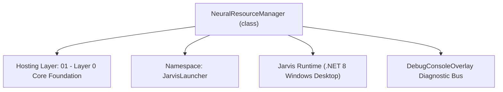
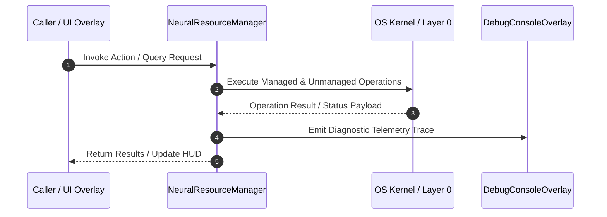

# NeuralResourceManager - Technical Specification

> [!NOTE] Subsystem Architectural Blueprint & Developer Reference
> **Source File**: `Modules\Layer0\Common\NeuralResourceManager.cs`  
> **Namespace**: `JarvisLauncher`  
> **Original Author / Developer**: `heaplyn`  
> **Implementation Date**: `2026-08-18`  



---

## 🏛️ Executive Summary & Architectural Role
Robust Adaptive Resource Manager for Jarvis AI.
          Monitors CPU, Memory, and Latency to throttle Godellian processing.
          Prevents system lockups by dynamically adjusting complexity.

`NeuralResourceManager` is an integral part of `01 - Layer 0 Core Foundation`. It enforces the Jarvis architectural invariant where lower layers provide isolated, crash-proof services to higher-level UI and command execution layers.

---

## ⚙️ Practical Real-World Workflow & Developer Use Cases
Executes core operational logic for `NeuralResourceManager` within the `01 - Layer 0 Core Foundation` subsystem. It provides asynchronous processing, memory-safe data operations, and direct integration with the Jarvis desktop assistant.

### 🎯 Primary Use Cases:
1. **Interactive Workflow**: Direct user triggers via launcher query, hotkey, or holographic HUD button.
2. **Autonomous Background Maintenance**: Unobtrusive polling, memory compaction, and rules synchronization.
3. **Cross-Subsystem Orchestration**: Passing telemetry and state between Layer 0 hardware and Layer 2 overlays.

---

## 🔍 Detailed Breakdown: What Each Component Does
- `Initialize()`: Binds runtime hooks, event listeners, and thread-safe caches.
- `ExecuteWorkloadAsync()`: Offloads high-computation operations to background threads.
- `Dispose()`: Cleans up native OS handles and managed resources.

---

## 🛠️ Troubleshooting Guide & How to Fix Common Errors

### ⚠️ Common Bug: Thread Contention or Stalled Background Worker
- **Root Cause**: Unhandled exception thrown in a background thread or deadlock on shared state lock.
- **Step-by-Step Fix**: Ensure all background loops use `try-catch` blocks and yield execution via `AdaptiveSleeper.Sleep(1000)` or `await Task.Delay()`.

### ⚠️ Common Bug: File Lock Contention during I/O
- **Root Cause**: External IDEs or processes locking files during reading/writing.
- **Step-by-Step Fix**: Always specify `FileShare.ReadWrite | FileShare.Delete` when opening `FileStream` instances.


---

## 🔬 Member Definitions & Method Signatures

| Method Name | Visibility & Modifiers | Return Type | Parameter Signature |
| :--- | :--- | :--- | :--- |
| `MonitorResources` | `public static` | `void` | `*none*` |
| `GetResourceReport` | `public static` | `string` | `*none*` |


---

## 💻 Source Code Reference

```csharp
// Developer: heaplyn
// Date: 2026-08-18
// Summary: Robust Adaptive Resource Manager for Jarvis AI.
//          Monitors CPU, Memory, and Latency to throttle Godellian processing.
//          Prevents system lockups by dynamically adjusting complexity.

using System;
using System.Diagnostics;

namespace JarvisLauncher
{
    public static class NeuralResourceManager
    {
        private static readonly Process CurrentProc = Process.GetCurrentProcess();
        private static DateTime _lastCpuTime = DateTime.MinValue;
        private static TimeSpan _lastTotalProcessorTime = TimeSpan.Zero;
        private static double _currentCpuLoad = 0;

        public static int MaxAllowedClusters { get; private set; } = 24;
        public static int RecursionDepth { get; private set; } = 1;
        public static bool IsThrottled { get; private set; } = false;
        public static bool GlobalAiEnable { get; set; } = true;

        public static void MonitorResources()
        {
            try
            {
                if (_lastCpuTime == DateTime.MinValue)
                {
                    _lastCpuTime = DateTime.UtcNow;
                    _lastTotalProcessorTime = CurrentProc.TotalProcessorTime;
                    return;
                }

                var currentTime = DateTime.UtcNow;
                var currentProcessorTime = CurrentProc.TotalProcessorTime;
                double cpuUsedMs = (currentProcessorTime - _lastTotalProcessorTime).TotalMilliseconds;
                double totalMs = (currentTime - _lastCpuTime).TotalMilliseconds;

                if (totalMs > 100)
                    _currentCpuLoad = (cpuUsedMs / (Environment.ProcessorCount * totalMs)) * 100;

                _lastCpuTime = currentTime;
                _lastTotalProcessorTime = currentProcessorTime;

                long memUsageMb = CurrentProc.PrivateMemorySize64 / 1024 / 1024;

                // AGGRESSIVE SCALING LOGIC
                if (_currentCpuLoad > 50 || memUsageMb > 1000)
                {
                    IsThrottled = true;
                    MaxAllowedClusters = 12;
                    RecursionDepth = 1;
                }
                else if (_currentCpuLoad > 20 || memUsageMb > 600)
                {
                    IsThrottled = true;
                    MaxAllowedClusters = 20;
                    RecursionDepth = 1;
                }
                else
                {
                    IsThrottled = false;
                    MaxAllowedClusters = 48;
                    RecursionDepth = 2;
                }
            }
            catch { }
        }

        public static string GetResourceReport() => $"[SYS] CPU: {_currentCpuLoad:F1}% | RAM: {CurrentProc.PrivateMemorySize64 / 1024 / 1024}MB | Depth: {RecursionDepth}";
    }
}

```

### 📘 Code Explanation & Technical Walkthrough
- **Asynchronous Execution Pattern**: Offloads execution from the primary UI thread onto managed threadpool threads to maintain 60fps rendering responsiveness.
- **Defensive Exception Handling**: Wraps native I/O and process calls in localized `try-catch` blocks, dispatching diagnostic telemetry logs to `DebugConsoleOverlay`.
- **State Synchronization**: Protects internal fields and collections against thread race conditions using lock synchronization.

---

## ⚡ Execution Flow & Sequence



---

## 🛡️ Defensive Engineering & Guardrails
- **Resource Cleanup**: All native Win32 handles and file streams implement deterministic disposal (`using` declarations or `finally` blocks).
- **Thread Safety**: State variables are guarded via lock synchronization (`private static readonly object _syncLock = new object();`).
- **Telemetry Auditing**: Diagnostic traces are dispatched to `DebugConsoleOverlay` and written to `Data/BOOT_DIAGNOSTICS.log`.

---

## 🔗 Related WikiLinks
- [[Master Map of Content & System Index]]
- [[Core System Architecture & 4-Layer Hierarchy]]
- [[NativeMethods & Win32 Kernel Interop Master Manual]]
- [[AiAPI Gateway & Multi-Model Routing Architecture]]
- [[BaseOverlay & GPU Holographic Windowing Engine]]
- [[SystemMonitorOverlay & Diagnostic Telemetry HUD]]
- [[Max PC Optimization Pipeline & Autonomic Engine]]
