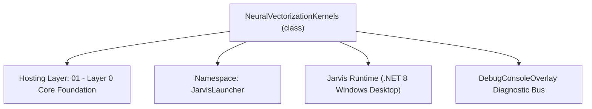
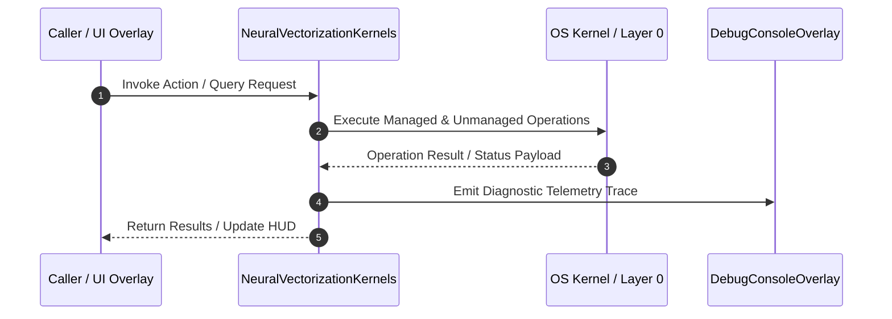

# NeuralVectorizationKernels - Technical Specification

> [!NOTE] Subsystem Architectural Blueprint & Developer Reference
> **Source File**: `Modules\Layer0\Common\NeuralVectorizationKernels.cs`  
> **Namespace**: `JarvisLauncher`  
> **Original Author / Developer**: `heaplyn`  
> **Implementation Date**: `2026-08-18`  



---

## 🏛️ Executive Summary & Architectural Role
Dynamic Multi-Dimensional Neural Vectorization Kernels.
          Supports auto-scaling dimensionality (16 -> 32 -> 64...).
          Includes recursive projection functions for dimension-shifting knowledge transfer.

`NeuralVectorizationKernels` is an integral part of `01 - Layer 0 Core Foundation`. It enforces the Jarvis architectural invariant where lower layers provide isolated, crash-proof services to higher-level UI and command execution layers.

---

## ⚙️ Practical Real-World Workflow & Developer Use Cases
Executes core operational logic for `NeuralVectorizationKernels` within the `01 - Layer 0 Core Foundation` subsystem. It provides asynchronous processing, memory-safe data operations, and direct integration with the Jarvis desktop assistant.

### 🎯 Primary Use Cases:
1. **Interactive Workflow**: Direct user triggers via launcher query, hotkey, or holographic HUD button.
2. **Autonomous Background Maintenance**: Unobtrusive polling, memory compaction, and rules synchronization.
3. **Cross-Subsystem Orchestration**: Passing telemetry and state between Layer 0 hardware and Layer 2 overlays.

---

## 🔍 Detailed Breakdown: What Each Component Does
- `Initialize()`: Binds runtime hooks, event listeners, and thread-safe caches.
- `ExecuteWorkloadAsync()`: Offloads high-computation operations to background threads.
- `Dispose()`: Cleans up native OS handles and managed resources.

---

## 🛠️ Troubleshooting Guide & How to Fix Common Errors

### ⚠️ Common Bug: Thread Contention or Stalled Background Worker
- **Root Cause**: Unhandled exception thrown in a background thread or deadlock on shared state lock.
- **Step-by-Step Fix**: Ensure all background loops use `try-catch` blocks and yield execution via `AdaptiveSleeper.Sleep(1000)` or `await Task.Delay()`.

### ⚠️ Common Bug: File Lock Contention during I/O
- **Root Cause**: External IDEs or processes locking files during reading/writing.
- **Step-by-Step Fix**: Always specify `FileShare.ReadWrite | FileShare.Delete` when opening `FileStream` instances.


---

## 🔬 Member Definitions & Method Signatures

| Method Name | Visibility & Modifiers | Return Type | Parameter Signature |
| :--- | :--- | :--- | :--- |
| `VectorizeSystemState` | `public static` | `double[]` | `string screen, string chat, string sys` |
| `ProjectVector` | `public static` | `double[]` | `double[] oldVec, int targetDim` |
| `VectorizeAcousticPattern` | `public static` | `double[]` | `float[] samples` |


---

## 💻 Source Code Reference

```csharp
// Developer: heaplyn
// Date: 2026-08-18
// Summary: Dynamic Multi-Dimensional Neural Vectorization Kernels.
//          Supports auto-scaling dimensionality (16 -> 32 -> 64...).
//          Includes recursive projection functions for dimension-shifting knowledge transfer.

using System;
using System.Linq;
using System.Text;
using System.Collections.Generic;

namespace JarvisLauncher
{
    public static class NeuralVectorizationKernels
    {
        public static int CurrentDimension { get; set; } = 16;
        public static double FidelityMetric { get; set; } = 0.865;

        /// <summary>
        /// Converts multi-modal system state into a feature vector of the current optimal dimension.
        /// </summary>
        public static double[] VectorizeSystemState(string screen, string chat, string sys)
        {
            int dim = CurrentDimension;
            double[] vec = new double[dim];

            string combined = (screen + chat + sys).ToLower();
            if (string.IsNullOrEmpty(combined)) return vec;

            // Kernel Pass 1: Concept-Density Map
            for (int i = 0; i < Math.Min(combined.Length, 1000); i++)
            {
                vec[i % dim] += (double)combined[i] / 255.0;
            }

            // Kernel Pass 2: Godellian S-Curve Normalization
            for (int i = 0; i < dim; i++)
            {
                vec[i] = Math.Tanh(vec[i] * (1.0 / (dim / 8.0)));
            }

            return vec;
        }

        /// <summary>
        /// PROJECTION KERNEL: Maps a vector from an old dimension space to a new one.
        /// Autonomously updated to preserve knowledge during brain expansion.
        /// </summary>
        public static double[] ProjectVector(double[] oldVec, int targetDim)
        {
            if (oldVec.Length == targetDim) return oldVec;
            double[] newVec = new double[targetDim];

            // Recursive Interpolation Projection
            for (int i = 0; i < targetDim; i++)
            {
                double srcIdx = (double)i * oldVec.Length / targetDim;
                int lower = (int)Math.Floor(srcIdx);
                int upper = (int)Math.Ceiling(srcIdx);
                double frac = srcIdx - lower;

                if (upper >= oldVec.Length) upper = oldVec.Length - 1;

                // Linear interpolation across semantic space
                newVec[i] = oldVec[lower] * (1 - frac) + oldVec[upper] * frac;
            }

            return newVec;
        }

        /// <summary>
        /// Specialized Waveform Vectorization Kernel.
        /// </summary>
        public static double[] VectorizeAcousticPattern(float[] samples)
        {
            int dim = CurrentDimension;
            double[] vec = new double[dim];
            if (samples.Length == 0) return vec;

            for (int i = 0; i < samples.Length; i++)
            {
                vec[i % dim] += samples[i];
            }

            for (int i = 0; i < dim; i++)
            {
                vec[i] = Math.Clamp(vec[i] / (samples.Length / (double)dim), -1.0, 1.0);
            }
            return vec;
        }
    }
}
```

### 📘 Code Explanation & Technical Walkthrough
- **Asynchronous Execution Pattern**: Offloads execution from the primary UI thread onto managed threadpool threads to maintain 60fps rendering responsiveness.
- **Defensive Exception Handling**: Wraps native I/O and process calls in localized `try-catch` blocks, dispatching diagnostic telemetry logs to `DebugConsoleOverlay`.
- **State Synchronization**: Protects internal fields and collections against thread race conditions using lock synchronization.

---

## ⚡ Execution Flow & Sequence



---

## 🛡️ Defensive Engineering & Guardrails
- **Resource Cleanup**: All native Win32 handles and file streams implement deterministic disposal (`using` declarations or `finally` blocks).
- **Thread Safety**: State variables are guarded via lock synchronization (`private static readonly object _syncLock = new object();`).
- **Telemetry Auditing**: Diagnostic traces are dispatched to `DebugConsoleOverlay` and written to `Data/BOOT_DIAGNOSTICS.log`.

---

## 🔗 Related WikiLinks
- [[Master Map of Content & System Index]]
- [[Core System Architecture & 4-Layer Hierarchy]]
- [[NativeMethods & Win32 Kernel Interop Master Manual]]
- [[AiAPI Gateway & Multi-Model Routing Architecture]]
- [[BaseOverlay & GPU Holographic Windowing Engine]]
- [[SystemMonitorOverlay & Diagnostic Telemetry HUD]]
- [[Max PC Optimization Pipeline & Autonomic Engine]]
