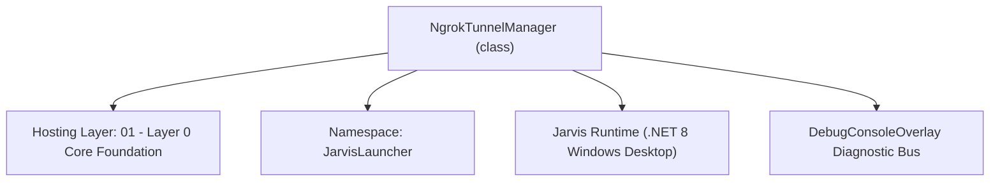
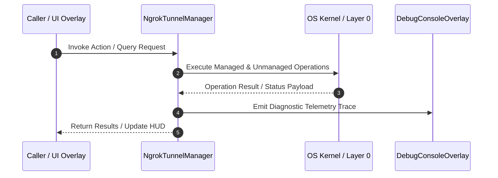

# NgrokTunnelManager - Technical Specification

> [!NOTE] Subsystem Architectural Blueprint & Developer Reference
> **Source File**: `Modules\Layer0\Common\NgrokTunnelManager.cs`  
> **Namespace**: `JarvisLauncher`  
> **Original Author / Developer**: `copilot (added ngrok support)`  
> **Implementation Date**: `2026-08-12`  



---

## 🏛️ Executive Summary & Architectural Role
Lightweight ngrok tunnel manager that downloads ngrok, sets auth token, and exposes public URL.

`NgrokTunnelManager` is an integral part of `01 - Layer 0 Core Foundation`. It enforces the Jarvis architectural invariant where lower layers provide isolated, crash-proof services to higher-level UI and command execution layers.

---

## ⚙️ Practical Real-World Workflow & Developer Use Cases
Executes core operational logic for `NgrokTunnelManager` within the `01 - Layer 0 Core Foundation` subsystem. It provides asynchronous processing, memory-safe data operations, and direct integration with the Jarvis desktop assistant.

### 🎯 Primary Use Cases:
1. **Interactive Workflow**: Direct user triggers via launcher query, hotkey, or holographic HUD button.
2. **Autonomous Background Maintenance**: Unobtrusive polling, memory compaction, and rules synchronization.
3. **Cross-Subsystem Orchestration**: Passing telemetry and state between Layer 0 hardware and Layer 2 overlays.

---

## 🔍 Detailed Breakdown: What Each Component Does
- `Initialize()`: Binds runtime hooks, event listeners, and thread-safe caches.
- `ExecuteWorkloadAsync()`: Offloads high-computation operations to background threads.
- `Dispose()`: Cleans up native OS handles and managed resources.

---

## 🛠️ Troubleshooting Guide & How to Fix Common Errors

### ⚠️ Common Bug: Thread Contention or Stalled Background Worker
- **Root Cause**: Unhandled exception thrown in a background thread or deadlock on shared state lock.
- **Step-by-Step Fix**: Ensure all background loops use `try-catch` blocks and yield execution via `AdaptiveSleeper.Sleep(1000)` or `await Task.Delay()`.

### ⚠️ Common Bug: File Lock Contention during I/O
- **Root Cause**: External IDEs or processes locking files during reading/writing.
- **Step-by-Step Fix**: Always specify `FileShare.ReadWrite | FileShare.Delete` when opening `FileStream` instances.


---

## 🔬 Member Definitions & Method Signatures

| Method Name | Visibility & Modifiers | Return Type | Parameter Signature |
| :--- | :--- | :--- | :--- |
| `GetNgrokVersion` | `private static` | `Version?` | `string exePath` |
| `GetProjectNgrokExePath` | `private static` | `string?` | `*none*` |
| `SaveAuthToken` | `public static` | `void` | `string token` |
| `StopTunnel` | `public static` | `void` | `*none*` |


---

## 💻 Source Code Reference

```csharp
// Developer: copilot (added ngrok support)
// Date: 2026-08-12
// Summary: Lightweight ngrok tunnel manager that downloads ngrok, sets auth token, and exposes public URL.

using System;
using System.Diagnostics;
using System.IO;
using System.Net.Http;
using System.Text.RegularExpressions;
using System.Threading;
using System.Threading.Tasks;
using System.IO.Compression;

namespace JarvisLauncher
{
    public static class NgrokTunnelManager
    {
        private static Process? _tunnelProcess;
        private static string? _publicUrl = null;
        public static string? PublicUrl => _publicUrl;
        public static bool IsRunning => _tunnelProcess != null && !_tunnelProcess.HasExited;

        public static async Task<string> StartTunnelAsync(int targetPort = -1)
        {
            // SECURITY: refuse to expose the bridge to the internet unless it is locked down first.
            if (string.IsNullOrEmpty(SettingsManager.Current.BACKUP_PC_SECRET))
                return "❌ Refused: set BACKUP_PC_SECRET before starting an ngrok tunnel. The server must require a secret before it is exposed.";

            if (targetPort <= 0) targetPort = MobileBridgeServer.Port;
            StopTunnel();

            // Ensure MobileBridgeServer is active before launching tunnel
            MobileBridgeServer.Start(targetPort);

            string toolsDir = Path.Combine(AppDomain.CurrentDomain.BaseDirectory, "Data", "Tools");
            if (!Directory.Exists(toolsDir)) Directory.CreateDirectory(toolsDir);

            string exePath = Path.Combine(toolsDir, "ngrok.exe");

            await EnsureBinaryAsync(exePath);

            // 1a. Check current ngrok version and download latest if it's too old for free accounts
            try
            {
                var version = GetNgrokVersion(exePath);
                if (version != null)
                {
                    var min = new Version(3, 20, 0);
                    if (version < min)
                    {
                        TextOverlay.Show($"⚠️ ngrok version {version} is too old. Downloading the latest ngrok...", 4000);
                        await DownloadLatestNgrokBinaryAsync(exePath);
                        var newVer = GetNgrokVersion(exePath);
                        if (newVer == null || newVer < min)
                        {
                            throw new Exception($"Your ngrok agent version \"{version}\" is too old. Please replace ngrok with a newer version from ngrok.com/download.");
                        }
                    }
                }
            }
                catch
            {
                try { Process.Start(new ProcessStartInfo { FileName = "https://ngrok.com/download", UseShellExecute = true }); } catch { }
                throw;
            }

            string tokenPath = Path.Combine(toolsDir, "ngrok_token.txt");
            if (File.Exists(tokenPath))
            {
                string token = File.ReadAllText(tokenPath).Trim();
                if (!string.IsNullOrEmpty(token))
                {
                    // Ensure ngrok is authtoken'd (best-effort)
                    try
                    {
                        var psiAuth = new ProcessStartInfo
                        {
                            FileName = exePath,
                            Arguments = $"authtoken {token}",
                            RedirectStandardOutput = true,
                            RedirectStandardError = true,
                            UseShellExecute = false,
                            CreateNoWindow = true
                        };
                        var p = Process.Start(psiAuth);
                        p?.WaitForExit(4000);
                        p?.Dispose();
                    }
                    catch { }
                }
            }

            string arguments = $"http 127.0.0.1:{targetPort} --log=stdout --log-format=json";

            try
            {
                return await LaunchNgrokProcess(exePath, arguments, targetPort);
            }
            catch (Exception)
            {
                StopTunnel();
                throw;
            }
        }

        private static Version? GetNgrokVersion(string exePath)
        {
            try
            {
                var psi = new ProcessStartInfo
                {
                    FileName = exePath,
                    Arguments = "version",
                    RedirectStandardOutput = true,
                    RedirectStandardError = true,
                    UseShellExecute = false,
                    CreateNoWindow = true
                };
                using var p = Process.Start(psi);
                if (p == null) return null;
                string outp = p.StandardOutput.ReadToEnd();
                p.WaitForExit(3000);
                // output often like: ngrok version 3.20.0
                var m = Regex.Match(outp, @"(\d+\.)?(\d+\.)?(\*|\d+)");
                if (m.Success)
                {
                    if (Version.TryParse(m.Value, out var v)) return v;
                }
            }
            catch { }
            return null;
        }

        private static string? GetProjectNgrokExePath()
        {
            try
            {
                string baseDir = AppDomain.CurrentDomain.BaseDirectory;
                string maybeProjectTools = Path.GetFullPath(Path.Combine(baseDir, "..", "..", "..", "Data", "Tools", "ngrok.exe"));
                if (File.Exists(maybeProjectTools))
                {
                    return maybeProjectTools;
                }
            }
            catch { }
            return null;
        }

        private static async Task EnsureBinaryAsync(string exePath)
        {
            // If a newer ngrok binary exists in the source Data/Tools folder while debugging,
            // copy that version into the runtime output folder so the app does not keep using an old build artifact.
            try
            {
                string? projectExe = GetProjectNgrokExePath();
                if (!string.IsNullOrEmpty(projectExe) && File.Exists(projectExe))
                {
                    var projectVersion = GetNgrokVersion(projectExe);
                    var currentVersion = File.Exists(exePath) ? GetNgrokVersion(exePath) : null;
                    if (!File.Exists(exePath) || (projectVersion != null && (currentVersion == null || projectVersion > currentVersion)))
                    {
                        Directory.CreateDirectory(Path.GetDirectoryName(exePath) ?? Path.GetDirectoryName(AppDomain.CurrentDomain.BaseDirectory)!);
                        File.Copy(projectExe, exePath, true);
                        TextOverlay.Show("⚡ Copied newer ngrok binary from project Data/Tools...", 3000);
                        return;
                    }
                }
            }
            catch { }

            if (File.Exists(exePath)) return;

            TextOverlay.Show("⚡ Downloading ngrok tunnel engine...", 3000);
            await DownloadLatestNgrokBinaryAsync(exePath);
            TextOverlay.Show("✅ ngrok ready!", 2000);
        }

        private static async Task<string> LaunchNgrokProcess(string exePath, string arguments, int targetPort)
        {
            StopTunnel();

            var psi = new ProcessStartInfo
            {
                FileName = exePath,
                Arguments = arguments,
                RedirectStandardError = true,
                RedirectStandardOutput = true,
                UseShellExecute = false,
                CreateNoWindow = true
            };

            _tunnelProcess = new Process { StartInfo = psi };
            var tcs = new TaskCompletionSource<string>(TaskCreationOptions.RunContinuationsAsynchronously);

            Action<string?> checkLine = (line) =>
            {
                if (string.IsNullOrWhiteSpace(line)) return;
                ChatOverlay.LogConsoleAction("Ngrok Log", line);

                // Try to parse JSON lines that may contain "url":"https://..."
                var urlMatch = Regex.Match(line, @"https://[a-z0-9\\-]+\.ngrok\.io", RegexOptions.IgnoreCase);
                if (urlMatch.Success)
                {
                    _publicUrl = urlMatch.Value;
                    tcs.TrySetResult(_publicUrl);
                    return;
                }

                if (line.Contains("failed", StringComparison.OrdinalIgnoreCase) || line.Contains("error", StringComparison.OrdinalIgnoreCase))
                {
                    // If the agent is too old, show helpful instructions
                    if (line.Contains("version", StringComparison.OrdinalIgnoreCase) && line.Contains("too old", StringComparison.OrdinalIgnoreCase))
                    {
                        TextOverlay.Show("ngrok agent too old — opening download page...", 5000);
                        try { Process.Start(new ProcessStartInfo { FileName = "https://ngrok.com/download", UseShellExecute = true }); } catch { }
                    }
                    tcs.TrySetException(new Exception($"ngrok Engine Error: {line}"));
                }
            };

            _tunnelProcess.ErrorDataReceived += (s, e) => checkLine(e.Data);
            _tunnelProcess.OutputDataReceived += (s, e) => checkLine(e.Data);

            TextOverlay.Show("⏳ Connecting ngrok Tunnel...\\nPlease wait up to 30 seconds.", 6000);

            try
            {
                _tunnelProcess.Start();
                _tunnelProcess.BeginErrorReadLine();
                _tunnelProcess.BeginOutputReadLine();
            }
            catch (Exception ex)
            {
                throw new Exception($"Failed to start ngrok process: {ex.Message}");
            }

            using var cts = new CancellationTokenSource(TimeSpan.FromSeconds(30));
            try
            {
                using (cts.Token.Register(() => tcs.TrySetException(new TimeoutException("Timed out waiting for ngrok URL. Check your firewall/network."))))
                {
                    string url = await tcs.Task;
                    TextOverlay.Show($"🌐 ngrok Tunnel Live:\\n{url}", 6000);
                    return url;
                }
            }
            catch
            {
                StopTunnel();
                throw;
            }
        }

        public static void SaveAuthToken(string token)
        {
            try
            {
                string toolsDir = Path.Combine(AppDomain.CurrentDomain.BaseDirectory, "Data", "Tools");
                if (!Directory.Exists(toolsDir)) Directory.CreateDirectory(toolsDir);
                File.WriteAllText(Path.Combine(toolsDir, "ngrok_token.txt"), token.Trim());
            }
            catch { }
        }

        public static async Task UpdateNgrokAsync()
        {
            string toolsDir = Path.Combine(AppDomain.CurrentDomain.BaseDirectory, "Data", "Tools");
            if (!Directory.Exists(toolsDir)) Directory.CreateDirectory(toolsDir);
            string exePath = Path.Combine(toolsDir, "ngrok.exe");
            // Prefer a newer project-level ngrok binary, but always download the latest if it does not exist or remains out of date.
            string? projectExe = GetProjectNgrokExePath();
            if (!string.IsNullOrEmpty(projectExe) && File.Exists(projectExe))
            {
                var projectVersion = GetNgrokVersion(projectExe);
                var currentVersion = File.Exists(exePath) ? GetNgrokVersion(exePath) : null;
                if (currentVersion == null || (projectVersion != null && projectVersion > currentVersion))
                {
                    File.Copy(projectExe, exePath, true);
                    TextOverlay.Show("⚡ Copied newer ngrok binary from project Data/Tools...", 3000);
                    return;
                }
            }
            TextOverlay.Show("⚡ Downloading latest ngrok tunnel engine...", 3000);
            await DownloadLatestNgrokBinaryAsync(exePath);
            TextOverlay.Show("✅ ngrok updated!", 2000);
        }

        private static async Task DownloadLatestNgrokBinaryAsync(string exePath)
        {
            string zipUrl = "https://bin.equinox.io/c/bNyj1mQVY4c/ngrok-v3-stable-windows-amd64.zip";
            using var client = new HttpClient();
            client.DefaultRequestHeaders.Add("User-Agent", "JarvisLauncher/1.0");
            var data = await client.GetByteArrayAsync(zipUrl);
            string toolsDir = Path.GetDirectoryName(exePath) ?? Path.Combine(AppDomain.CurrentDomain.BaseDirectory, "Data", "Tools");
            string tmpZip = Path.Combine(Path.GetTempPath(), $"ngrok_{Guid.NewGuid()}.zip");
            await File.WriteAllBytesAsync(tmpZip, data);
            try
            {
                if (File.Exists(exePath)) File.Delete(exePath);
                ZipFile.ExtractToDirectory(tmpZip, toolsDir);
            }
            finally
            {
                try { File.Delete(tmpZip); } catch { }
            }
        }

        public static void StopTunnel()
        {
            try
            {
                if (_tunnelProcess != null && !_tunnelProcess.HasExited)
                {
                    _tunnelProcess.Kill(true);
                    _tunnelProcess.Dispose();
                    _tunnelProcess = null;
                }
                _publicUrl = null;
            }
            catch { }
        }
    }
}
```

### 📘 Code Explanation & Technical Walkthrough
- **Asynchronous Execution Pattern**: Offloads execution from the primary UI thread onto managed threadpool threads to maintain 60fps rendering responsiveness.
- **Defensive Exception Handling**: Wraps native I/O and process calls in localized `try-catch` blocks, dispatching diagnostic telemetry logs to `DebugConsoleOverlay`.
- **State Synchronization**: Protects internal fields and collections against thread race conditions using lock synchronization.

---

## ⚡ Execution Flow & Sequence



---

## 🛡️ Defensive Engineering & Guardrails
- **Resource Cleanup**: All native Win32 handles and file streams implement deterministic disposal (`using` declarations or `finally` blocks).
- **Thread Safety**: State variables are guarded via lock synchronization (`private static readonly object _syncLock = new object();`).
- **Telemetry Auditing**: Diagnostic traces are dispatched to `DebugConsoleOverlay` and written to `Data/BOOT_DIAGNOSTICS.log`.

---

## 🔗 Related WikiLinks
- [[Master Map of Content & System Index]]
- [[Core System Architecture & 4-Layer Hierarchy]]
- [[NativeMethods & Win32 Kernel Interop Master Manual]]
- [[AiAPI Gateway & Multi-Model Routing Architecture]]
- [[BaseOverlay & GPU Holographic Windowing Engine]]
- [[SystemMonitorOverlay & Diagnostic Telemetry HUD]]
- [[Max PC Optimization Pipeline & Autonomic Engine]]
