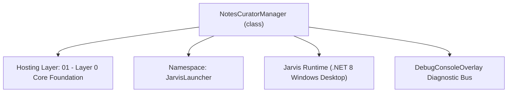
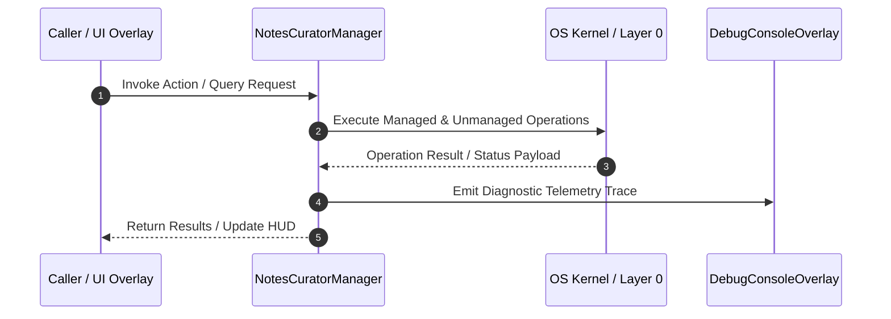

# NotesCuratorManager - Technical Specification

> [!NOTE] Subsystem Architectural Blueprint & Developer Reference
> **Source File**: `Modules\Layer0\Common\NotesCuratorManager.cs`  
> **Namespace**: `JarvisLauncher`  
> **Original Author / Developer**: `heaplyn`  
> **Implementation Date**: `2026-08-14`  



---

## 🏛️ Executive Summary & Architectural Role
Autonomous AI Notes Curator. Periodically triggers an AI turn to review, organize, and summarize the hierarchical notes system.

`NotesCuratorManager` is an integral part of `01 - Layer 0 Core Foundation`. It enforces the Jarvis architectural invariant where lower layers provide isolated, crash-proof services to higher-level UI and command execution layers.

---

## ⚙️ Practical Real-World Workflow & Developer Use Cases
Executes core operational logic for `NotesCuratorManager` within the `01 - Layer 0 Core Foundation` subsystem. It provides asynchronous processing, memory-safe data operations, and direct integration with the Jarvis desktop assistant.

### 🎯 Primary Use Cases:
1. **Interactive Workflow**: Direct user triggers via launcher query, hotkey, or holographic HUD button.
2. **Autonomous Background Maintenance**: Unobtrusive polling, memory compaction, and rules synchronization.
3. **Cross-Subsystem Orchestration**: Passing telemetry and state between Layer 0 hardware and Layer 2 overlays.

---

## 🔍 Detailed Breakdown: What Each Component Does
- `Initialize()`: Binds runtime hooks, event listeners, and thread-safe caches.
- `ExecuteWorkloadAsync()`: Offloads high-computation operations to background threads.
- `Dispose()`: Cleans up native OS handles and managed resources.

---

## 🛠️ Troubleshooting Guide & How to Fix Common Errors

### ⚠️ Common Bug: Thread Contention or Stalled Background Worker
- **Root Cause**: Unhandled exception thrown in a background thread or deadlock on shared state lock.
- **Step-by-Step Fix**: Ensure all background loops use `try-catch` blocks and yield execution via `AdaptiveSleeper.Sleep(1000)` or `await Task.Delay()`.

### ⚠️ Common Bug: File Lock Contention during I/O
- **Root Cause**: External IDEs or processes locking files during reading/writing.
- **Step-by-Step Fix**: Always specify `FileShare.ReadWrite | FileShare.Delete` when opening `FileStream` instances.


---

## 🔬 Member Definitions & Method Signatures

| Method Name | Visibility & Modifiers | Return Type | Parameter Signature |
| :--- | :--- | :--- | :--- |
| `Initialize` | `public static` | `void` | `*none*` |
| `FormatHierarchyForAi` | `private static` | `string` | `List<NoteItem> items, int indent = 0` |


---

## 💻 Source Code Reference

```csharp
// Developer: heaplyn
// Date: 2026-08-14
// Summary: Autonomous AI Notes Curator. Periodically triggers an AI turn to review, organize, and summarize the hierarchical notes system.

using System;
using System.Collections.Generic;
using System.IO;
using System.Linq;
using System.Text;
using System.Threading.Tasks;
using System.Windows.Threading;

namespace JarvisLauncher
{
    public static class NotesCuratorManager
    {
        private static DispatcherTimer? _curationTimer;
        private static bool _isCurationInProgress = false;

        public static void Initialize()
        {
            // Trigger curation every 4 hours (14400 seconds)
            _curationTimer = new DispatcherTimer
            {
                Interval = TimeSpan.FromHours(4)
            };
            _curationTimer.Tick += (s, e) => _ = PerformAutonomousCurationAsync();
            _curationTimer.Start();

            // Perform an initial curation check on startup (delayed slightly to allow boot sequence to finish)
            Task.Delay(10000).ContinueWith(_ => PerformAutonomousCurationAsync());
        }

        public static async Task PerformAutonomousCurationAsync()
        {
            if (_isCurationInProgress) return;
            _isCurationInProgress = true;

            try
            {
                DebugConsoleOverlay.Log("Notes Curator", "Starting autonomous AI notes organization turn...");

                // 1. Build a summary of the current hierarchy
                var hierarchy = NotesManager.GetHierarchy();
                string hierarchyStr = FormatHierarchyForAi(hierarchy);

                // 2. Read specific files that might need summarizing (e.g., Quick Notes)
                string quickNotesContent = NotesManager.LoadNote("Quick Notes.txt");

                string prompt = "## TASK: AUTONOMOUS NOTES CURATION\n" +
                               "Review the current notes hierarchy and content below. Your goal is to organize, clean, and build onto this system.\n\n" +
                               "### CURRENT HIERARCHY:\n" + hierarchyStr + "\n\n" +
                               "### RECENT QUICK NOTES:\n" + (string.IsNullOrWhiteSpace(quickNotesContent) ? "[Empty]" : quickNotesContent) + "\n\n" +
                               "### INSTRUCTIONS:\n" +
                               "1. If 'Quick Notes.txt' is long, move relevant entries into specific categories or new notes.\n" +
                               "2. If you see related notes, suggest creating a new category and moving them into it.\n" +
                               "3. Fix typos in filenames or structure if needed.\n" +
                               "4. Use [WRITE_FILE], [DELETE_PATH], etc. to perform the actions.\n" +
                               "5. If no changes are needed, respond with 'Hierarchy is optimal.'";

                string aiDecision = await AiAPI.AskGemini(prompt);

                // 3. Process the AI's organizational commands
                string results = AgentExecutor.ProcessAIResponse(aiDecision);

                DebugConsoleOverlay.Log("Notes Curator", "Curation turn complete. Result: " + results);
            }
            catch (Exception ex)
            {
                DebugConsoleOverlay.Log("Notes Curator Error", ex.Message);
            }
            finally
            {
                _isCurationInProgress = false;
            }
        }

        private static string FormatHierarchyForAi(List<NoteItem> items, int indent = 0)
        {
            var sb = new StringBuilder();
            string space = new string(' ', indent * 2);

            foreach (var item in items)
            {
                sb.AppendLine($"{space}- {(item.IS_FOLDER ? "[DIR] " : "[FILE] ")}{item.NAME} (Path: {item.RELATIVE_PATH})");
                if (item.IS_FOLDER && item.CHILDREN.Any())
                {
                    sb.Append(FormatHierarchyForAi(item.CHILDREN, indent + 1));
                }
            }

            return sb.ToString();
        }
    }
}
```

### 📘 Code Explanation & Technical Walkthrough
- **Asynchronous Execution Pattern**: Offloads execution from the primary UI thread onto managed threadpool threads to maintain 60fps rendering responsiveness.
- **Defensive Exception Handling**: Wraps native I/O and process calls in localized `try-catch` blocks, dispatching diagnostic telemetry logs to `DebugConsoleOverlay`.
- **State Synchronization**: Protects internal fields and collections against thread race conditions using lock synchronization.

---

## ⚡ Execution Flow & Sequence



---

## 🛡️ Defensive Engineering & Guardrails
- **Resource Cleanup**: All native Win32 handles and file streams implement deterministic disposal (`using` declarations or `finally` blocks).
- **Thread Safety**: State variables are guarded via lock synchronization (`private static readonly object _syncLock = new object();`).
- **Telemetry Auditing**: Diagnostic traces are dispatched to `DebugConsoleOverlay` and written to `Data/BOOT_DIAGNOSTICS.log`.

---

## 🔗 Related WikiLinks
- [[Master Map of Content & System Index]]
- [[Core System Architecture & 4-Layer Hierarchy]]
- [[NativeMethods & Win32 Kernel Interop Master Manual]]
- [[AiAPI Gateway & Multi-Model Routing Architecture]]
- [[BaseOverlay & GPU Holographic Windowing Engine]]
- [[SystemMonitorOverlay & Diagnostic Telemetry HUD]]
- [[Max PC Optimization Pipeline & Autonomic Engine]]
