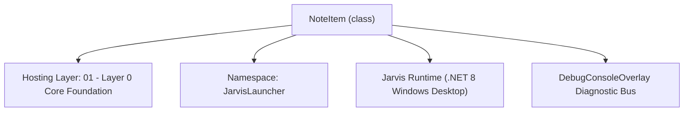
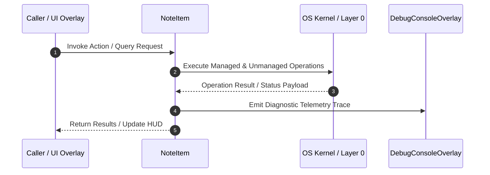

# NotesManager - Technical Specification

> [!NOTE] Subsystem Architectural Blueprint & Developer Reference
> **Source File**: `Modules\Layer0\Common\NotesManager.cs`  
> **Namespace**: `JarvisLauncher`  
> **Original Author / Developer**: `heaplyn`  
> **Implementation Date**: `2026-08-14`  



---

## 🏛️ Executive Summary & Architectural Role
Hierarchical Notes Manager. Handles loading/saving notes organized into folders (categories).

`NoteItem` is an integral part of `01 - Layer 0 Core Foundation`. It enforces the Jarvis architectural invariant where lower layers provide isolated, crash-proof services to higher-level UI and command execution layers.

---

## ⚙️ Practical Real-World Workflow & Developer Use Cases
Executes core operational logic for `NotesManager` within the `01 - Layer 0 Core Foundation` subsystem. It provides asynchronous processing, memory-safe data operations, and direct integration with the Jarvis desktop assistant.

### 🎯 Primary Use Cases:
1. **Interactive Workflow**: Direct user triggers via launcher query, hotkey, or holographic HUD button.
2. **Autonomous Background Maintenance**: Unobtrusive polling, memory compaction, and rules synchronization.
3. **Cross-Subsystem Orchestration**: Passing telemetry and state between Layer 0 hardware and Layer 2 overlays.

---

## 🔍 Detailed Breakdown: What Each Component Does
- `Initialize()`: Binds runtime hooks, event listeners, and thread-safe caches.
- `ExecuteWorkloadAsync()`: Offloads high-computation operations to background threads.
- `Dispose()`: Cleans up native OS handles and managed resources.

---

## 🛠️ Troubleshooting Guide & How to Fix Common Errors

### ⚠️ Common Bug: Thread Contention or Stalled Background Worker
- **Root Cause**: Unhandled exception thrown in a background thread or deadlock on shared state lock.
- **Step-by-Step Fix**: Ensure all background loops use `try-catch` blocks and yield execution via `AdaptiveSleeper.Sleep(1000)` or `await Task.Delay()`.

### ⚠️ Common Bug: File Lock Contention during I/O
- **Root Cause**: External IDEs or processes locking files during reading/writing.
- **Step-by-Step Fix**: Always specify `FileShare.ReadWrite | FileShare.Delete` when opening `FileStream` instances.


---

## 🔬 Member Definitions & Method Signatures

| Method Name | Visibility & Modifiers | Return Type | Parameter Signature |
| :--- | :--- | :--- | :--- |
| `GetNotesDirectory` | `public static` | `string` | `*none*` |
| `GetHierarchy` | `public static` | `List<NoteItem>` | `*none*` |
| `GetItemsRecursive` | `private static` | `List<NoteItem>` | `string fullPath, string relative` |
| `CreateCategory` | `public static` | `void` | `string parentRelativePath, string categoryName` |
| `CreateNote` | `public static` | `string` | `string categoryRelativePath, string noteName` |
| `SaveNote` | `public static` | `void` | `string relativePath, string content` |
| `LoadNote` | `public static` | `string` | `string relativePath` |
| `DeleteItem` | `public static` | `void` | `string relativePath` |


---

## 💻 Source Code Reference

```csharp
// Developer: heaplyn
// Date: 2026-08-14
// Summary: Hierarchical Notes Manager. Handles loading/saving notes organized into folders (categories).

using System;
using System.Collections.Generic;
using System.IO;
using System.Linq;

namespace JarvisLauncher
{
    public class NoteItem
    {
        public string NAME { get; set; } = string.Empty;
        public string RELATIVE_PATH { get; set; } = string.Empty;
        public bool IS_FOLDER { get; set; }
        public List<NoteItem> CHILDREN { get; set; } = new List<NoteItem>();
    }

    public static class NotesManager
    {
        private static string NotesDir => Path.Combine(PathHandler.GetDataDirectory(), "Notes");

        static NotesManager()
        {
            if (!Directory.Exists(NotesDir))
            {
                Directory.CreateDirectory(NotesDir);
            }
        }

        public static string GetNotesDirectory() => NotesDir;

        public static List<NoteItem> GetHierarchy()
        {
            return GetItemsRecursive(NotesDir, "");
        }

        private static List<NoteItem> GetItemsRecursive(string fullPath, string relative)
        {
            var items = new List<NoteItem>();
            try
            {
                // Add directories first
                foreach (var dir in Directory.GetDirectories(fullPath))
                {
                    string name = Path.GetFileName(dir);
                    string rel = Path.Combine(relative, name);
                    items.Add(new NoteItem
                    {
                        NAME = name,
                        RELATIVE_PATH = rel,
                        IS_FOLDER = true,
                        CHILDREN = GetItemsRecursive(dir, rel)
                    });
                }

                // Add .txt, .md, and .pdf files
                foreach (var file in Directory.GetFiles(fullPath, "*.*")
                    .Where(f => f.EndsWith(".txt") || f.EndsWith(".md") || f.EndsWith(".pdf")))
                {
                    string name = Path.GetFileName(file);
                    items.Add(new NoteItem
                    {
                        NAME = name,
                        RELATIVE_PATH = Path.Combine(relative, name),
                        IS_FOLDER = false
                    });
                }
            }
            catch { }
            return items.OrderBy(i => !i.IS_FOLDER).ThenBy(i => i.NAME).ToList();
        }

        public static void CreateCategory(string parentRelativePath, string categoryName)
        {
            string targetDir = Path.Combine(NotesDir, parentRelativePath, categoryName);
            if (!Directory.Exists(targetDir))
            {
                Directory.CreateDirectory(targetDir);
            }
        }

        public static string CreateNote(string categoryRelativePath, string noteName)
        {
            if (!noteName.EndsWith(".txt") && !noteName.EndsWith(".md"))
            {
                noteName += ".txt";
            }

            string path = Path.Combine(NotesDir, categoryRelativePath, noteName);
            if (!File.Exists(path))
            {
                File.WriteAllText(path, $"# {Path.GetFileNameWithoutExtension(noteName)}\n\nCreated: {DateTime.Now:F}");
            }
            return path;
        }

        public static void SaveNote(string relativePath, string content)
        {
            string fullPath = Path.Combine(NotesDir, relativePath);
            File.WriteAllText(fullPath, content);
        }

        public static string LoadNote(string relativePath)
        {
            string fullPath = Path.Combine(NotesDir, relativePath);
            return File.Exists(fullPath) ? File.ReadAllText(fullPath) : string.Empty;
        }

        public static void DeleteItem(string relativePath)
        {
            string fullPath = Path.Combine(NotesDir, relativePath);
            if (File.Exists(fullPath)) File.Delete(fullPath);
            else if (Directory.Exists(fullPath)) Directory.Delete(fullPath, true);
        }
    }
}
```

### 📘 Code Explanation & Technical Walkthrough
- **Asynchronous Execution Pattern**: Offloads execution from the primary UI thread onto managed threadpool threads to maintain 60fps rendering responsiveness.
- **Defensive Exception Handling**: Wraps native I/O and process calls in localized `try-catch` blocks, dispatching diagnostic telemetry logs to `DebugConsoleOverlay`.
- **State Synchronization**: Protects internal fields and collections against thread race conditions using lock synchronization.

---

## ⚡ Execution Flow & Sequence



---

## 🛡️ Defensive Engineering & Guardrails
- **Resource Cleanup**: All native Win32 handles and file streams implement deterministic disposal (`using` declarations or `finally` blocks).
- **Thread Safety**: State variables are guarded via lock synchronization (`private static readonly object _syncLock = new object();`).
- **Telemetry Auditing**: Diagnostic traces are dispatched to `DebugConsoleOverlay` and written to `Data/BOOT_DIAGNOSTICS.log`.

---

## 🔗 Related WikiLinks
- [[Master Map of Content & System Index]]
- [[Core System Architecture & 4-Layer Hierarchy]]
- [[NativeMethods & Win32 Kernel Interop Master Manual]]
- [[AiAPI Gateway & Multi-Model Routing Architecture]]
- [[BaseOverlay & GPU Holographic Windowing Engine]]
- [[SystemMonitorOverlay & Diagnostic Telemetry HUD]]
- [[Max PC Optimization Pipeline & Autonomic Engine]]
