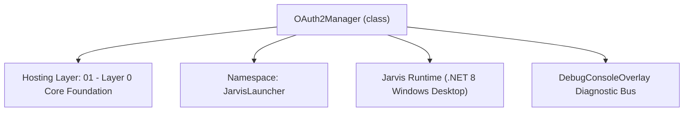
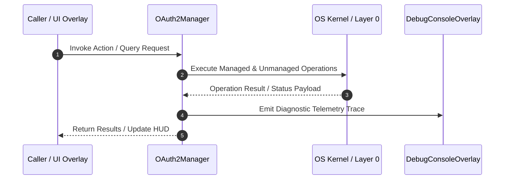

# OAuth2Manager - Technical Specification

> [!NOTE] Subsystem Architectural Blueprint & Developer Reference
> **Source File**: `Modules\Layer0\Common\OAuth2Manager.cs`  
> **Namespace**: `JarvisLauncher`  
> **Original Author / Developer**: `heaplyn`  
> **Implementation Date**: `2026-08-18`  



---

## 🏛️ Executive Summary & Architectural Role
Universal OAuth2 Engine for Google / Gemini AI and GitHub.
          Enhanced with automated session persistence and non-blocking redirects.
          Fixed corrupted redirect URI and STA thread issues.

`OAuth2Manager` is an integral part of `01 - Layer 0 Core Foundation`. It enforces the Jarvis architectural invariant where lower layers provide isolated, crash-proof services to higher-level UI and command execution layers.

---

## ⚙️ Practical Real-World Workflow & Developer Use Cases
Executes core operational logic for `OAuth2Manager` within the `01 - Layer 0 Core Foundation` subsystem. It provides asynchronous processing, memory-safe data operations, and direct integration with the Jarvis desktop assistant.

### 🎯 Primary Use Cases:
1. **Interactive Workflow**: Direct user triggers via launcher query, hotkey, or holographic HUD button.
2. **Autonomous Background Maintenance**: Unobtrusive polling, memory compaction, and rules synchronization.
3. **Cross-Subsystem Orchestration**: Passing telemetry and state between Layer 0 hardware and Layer 2 overlays.

---

## 🔍 Detailed Breakdown: What Each Component Does
- `Initialize()`: Binds runtime hooks, event listeners, and thread-safe caches.
- `ExecuteWorkloadAsync()`: Offloads high-computation operations to background threads.
- `Dispose()`: Cleans up native OS handles and managed resources.

---

## 🛠️ Troubleshooting Guide & How to Fix Common Errors

### ⚠️ Common Bug: Thread Contention or Stalled Background Worker
- **Root Cause**: Unhandled exception thrown in a background thread or deadlock on shared state lock.
- **Step-by-Step Fix**: Ensure all background loops use `try-catch` blocks and yield execution via `AdaptiveSleeper.Sleep(1000)` or `await Task.Delay()`.

### ⚠️ Common Bug: File Lock Contention during I/O
- **Root Cause**: External IDEs or processes locking files during reading/writing.
- **Step-by-Step Fix**: Always specify `FileShare.ReadWrite | FileShare.Delete` when opening `FileStream` instances.


---

## 🔬 Member Definitions & Method Signatures

| Method Name | Visibility & Modifiers | Return Type | Parameter Signature |
| :--- | :--- | :--- | :--- |
| `AddGoogleAccountAsync` | `public static` | `Task<bool>` | `Action<string>? statusCallback = null` |
| `GetRandomUnusedPort` | `private static` | `int` | `*none*` |
| `GeneratePkceVerifier` | `private static` | `string` | `*none*` |
| `GeneratePkceChallenge` | `private static` | `string` | `string v` |
| `SignOutGoogle` | `public static` | `void` | `*none*` |
| `SignOutGithub` | `public static` | `void` | `*none*` |


---

## 💻 Source Code Reference

```csharp
// Developer: heaplyn
// Date: 2026-08-18
// Summary: Universal OAuth2 Engine for Google / Gemini AI and GitHub.
//          Enhanced with automated session persistence and non-blocking redirects.
//          Fixed corrupted redirect URI and STA thread issues.

using System;
using System.Collections.Generic;
using System.Diagnostics;
using System.IO;
using System.Net;
using System.Net.Http;
using System.Net.Sockets;
using System.Security.Cryptography;
using System.Text;
using System.Text.Json;
using System.Threading;
using System.Threading.Tasks;
using System.Windows;

namespace JarvisLauncher
{
    public static class OAuth2Manager
    {
        private static readonly HttpClient _http = new HttpClient();

        // Environment-Aware Client ID
        public static string GoogleClientId => Environment.GetEnvironmentVariable("GOOGLE_OAUTH_CLIENT_ID")
            ?? (!string.IsNullOrWhiteSpace(CoreRegistry.Data.Settings.Current.GOOGLE_OAUTH_CLIENT_ID)
                ? CoreRegistry.Data.Settings.Current.GOOGLE_OAUTH_CLIENT_ID
                : "1092610474410-idgtl29cts68fq4vblaa3ibvuj09ph0t.apps.googleusercontent.com");

        public static async Task<bool> EnsureGoogleAuthenticatedAsync(Action<string>? statusCallback = null)
        {
            var s = CoreRegistry.Data.Settings.Current;
            if (string.IsNullOrWhiteSpace(s.GOOGLE_OAUTH_ACCESS_TOKEN) && string.IsNullOrWhiteSpace(s.GOOGLE_OAUTH_REFRESH_TOKEN))
                return await LoginGoogleOAuth2Async(statusCallback);

            statusCallback?.Invoke("🔍 Verifying current login session...");
            if (await VerifyGoogleTokenValidityAsync(s.GOOGLE_OAUTH_ACCESS_TOKEN)) return true;

            if (!string.IsNullOrWhiteSpace(s.GOOGLE_OAUTH_REFRESH_TOKEN))
            {
                statusCallback?.Invoke("🔄 Session expired. Renewing credentials...");
                if (await RefreshGoogleTokenAsync()) return true;
            }

            return await LoginGoogleOAuth2Async(statusCallback);
        }

        // Scopes cover: identity, Gemini + Google Cloud (cloud-platform lets us call the Gemini API
        // with the OAuth token — no API key needed), and the common "Google things": Gmail, Calendar,
        // Drive. NOTE: the Gmail/Calendar/Drive scopes are "sensitive" — until this OAuth app is
        // Google-verified for them, users see an "unverified app" screen and can proceed for their
        // own account via "Advanced".
        // Default scopes: identity + cloud-platform (enough for Gemini via the OAuth token). The
        // heavy Gmail/Calendar/Drive scopes are opt-in via GOOGLE_EXTRA_SCOPES so a plain login
        // doesn't trigger the "sensitive scope" verification wall.
        private static string GoogleScopes
        {
            get
            {
                string extra = CoreRegistry.Data.Settings.Current.GOOGLE_EXTRA_SCOPES ?? "";
                return ("openid email profile https://www.googleapis.com/auth/cloud-platform " + extra).Trim();
            }
        }

        /// <param name="forceAccountPicker">Show Google's account chooser (for "add / switch account").</param>
        public static async Task<bool> LoginGoogleOAuth2Async(Action<string>? statusCallback = null, bool forceAccountPicker = false)
        {
            string clientId = GoogleClientId;
            int port = GetRandomUnusedPort();
            string redirectUri = $"http://localhost:{port}/";

            string codeVerifier = GeneratePkceVerifier();
            string codeChallenge = GeneratePkceChallenge(codeVerifier);

            statusCallback?.Invoke("🔑 Opening Google login in browser...");

            string prompt = forceAccountPicker ? "select_account consent" : "consent";
            string authUrl = $"https://accounts.google.com/o/oauth2/v2/auth?" +
                             $"client_id={Uri.EscapeDataString(clientId)}&" +
                             $"redirect_uri={Uri.EscapeDataString(redirectUri)}&" +
                             $"response_type=code&" +
                             $"scope={Uri.EscapeDataString(GoogleScopes)}&" +
                             $"code_challenge={Uri.EscapeDataString(codeChallenge)}&" +
                             $"code_challenge_method=S256&" +
                             $"access_type=offline&" +
                             $"prompt={Uri.EscapeDataString(prompt)}";

            string code = await ListenForAuthorizationCodeAsync(authUrl, redirectUri, "Google");
            if (string.IsNullOrEmpty(code)) return false;

            statusCallback?.Invoke("⏳ Exchanging code for access token...");
            return await ExchangeGoogleCodeAsync(code, clientId, redirectUri, codeVerifier);
        }

        private static async Task<string> ListenForAuthorizationCodeAsync(string authUrl, string redirectUri, string providerName)
        {
            HttpListener? listener = null;
            try
            {
                listener = new HttpListener();
                listener.Prefixes.Add(redirectUri);
                listener.Start();

                Process.Start(new ProcessStartInfo { FileName = authUrl, UseShellExecute = true });

                using var cts = new CancellationTokenSource(TimeSpan.FromSeconds(120));
                var context = await listener.GetContextAsync().WaitAsync(cts.Token);

                var req = context.Request;
                var res = context.Response;
                string code = req.QueryString["code"] ?? string.Empty;
                string? error = req.QueryString["error"];

                string html;
                if (!string.IsNullOrEmpty(error))
                {
                    // e.g. access_denied when the bundled OAuth app is in "Testing" and this account
                    // isn't an approved tester. Explain the two real fixes in the browser page + log.
                    DebugConsoleOverlay.Log("OAuth-Error", $"{providerName} authorization failed: {error}");
                    html = "<html><body style='font-family:sans-serif;background:#0f172a;color:#e2e8f0;text-align:center;padding:50px;'>" +
                           $"<h1 style='color:#f59e0b;'>⚠️ {providerName} sign-in blocked ({error})</h1>" +
                           "<p>The built-in Google app is in test mode and can't approve arbitrary accounts.</p>" +
                           "<div style='max-width:560px;margin:20px auto;text-align:left;color:#94a3b8;'>" +
                           "<p><b>Easiest fix (Gemini):</b> skip Google login — in Jarvis, LLM settings &rarr; Gemini &rarr; <b>Get Key</b>, create a free API key, paste it.</p>" +
                           "<p><b>For Gmail/Calendar/Drive:</b> create your own OAuth <i>Desktop</i> client at console.cloud.google.com &rarr; Credentials, then paste its Client ID into Jarvis (Accounts tab).</p>" +
                           "</div><p>You can close this tab.</p></body></html>";
                }
                else
                {
                    html = $"<html><body style='font-family:sans-serif;background:#0f172a;color:#38bdf8;text-align:center;padding-top:50px;'>" +
                           $"<h1>✅ {providerName} Auth Successful!</h1>" +
                           $"<p>Return to Jarvis.</p></body></html>";
                }

                byte[] buffer = Encoding.UTF8.GetBytes(html);
                res.ContentLength64 = buffer.Length;
                await res.OutputStream.WriteAsync(buffer, 0, buffer.Length);
                res.OutputStream.Close();

                return code;
            }
            catch (Exception ex) { DebugConsoleOverlay.Log("OAuth-Error", ex.Message); return string.Empty; }
            finally { listener?.Stop(); }
        }

        private static async Task<bool> ExchangeGoogleCodeAsync(string code, string clientId, string redirectUri, string codeVerifier)
        {
            try
            {
                var s = CoreRegistry.Data.Settings.Current;
                var values = new Dictionary<string, string> {
                    ["code"] = code, ["client_id"] = clientId, ["redirect_uri"] = redirectUri,
                    ["grant_type"] = "authorization_code", ["code_verifier"] = codeVerifier
                };
                if (!string.IsNullOrWhiteSpace(s.GOOGLE_OAUTH_CLIENT_SECRET)) values["client_secret"] = s.GOOGLE_OAUTH_CLIENT_SECRET;

                var resp = await _http.PostAsync("https://oauth2.googleapis.com/token", new FormUrlEncodedContent(values));
                if (!resp.IsSuccessStatusCode) return false;

                using var doc = JsonDocument.Parse(await resp.Content.ReadAsStringAsync());
                var root = doc.RootElement;
                s.GOOGLE_OAUTH_ACCESS_TOKEN = root.GetProperty("access_token").GetString() ?? "";
                if (root.TryGetProperty("refresh_token", out var rt)) s.GOOGLE_OAUTH_REFRESH_TOKEN = rt.GetString() ?? "";

                await FetchGoogleUserInfoAsync(s.GOOGLE_OAUTH_ACCESS_TOKEN);

                // Record (or update) this account in the multi-account store and make it active.
                GoogleAccountManager.UpsertAndActivate(new GoogleAccount
                {
                    Email = s.GOOGLE_OAUTH_USER_EMAIL,
                    AccessToken = s.GOOGLE_OAUTH_ACCESS_TOKEN,
                    RefreshToken = s.GOOGLE_OAUTH_REFRESH_TOKEN
                });

                CoreRegistry.Data.Settings.Save();
                return true;
            }
            catch { return false; }
        }

        private static async Task<bool> RefreshGoogleTokenAsync()
        {
            try
            {
                var s = CoreRegistry.Data.Settings.Current;
                var values = new Dictionary<string, string> {
                    ["client_id"] = GoogleClientId, ["refresh_token"] = s.GOOGLE_OAUTH_REFRESH_TOKEN, ["grant_type"] = "refresh_token"
                };
                if (!string.IsNullOrWhiteSpace(s.GOOGLE_OAUTH_CLIENT_SECRET)) values["client_secret"] = s.GOOGLE_OAUTH_CLIENT_SECRET;

                var resp = await _http.PostAsync("https://oauth2.googleapis.com/token", new FormUrlEncodedContent(values));
                if (!resp.IsSuccessStatusCode) return false;

                using var doc = JsonDocument.Parse(await resp.Content.ReadAsStringAsync());
                s.GOOGLE_OAUTH_ACCESS_TOKEN = doc.RootElement.GetProperty("access_token").GetString() ?? "";
                GoogleAccountManager.UpdateActiveTokens(s.GOOGLE_OAUTH_ACCESS_TOKEN);
                CoreRegistry.Data.Settings.Save();
                return true;
            } catch { return false; }
        }

        /// <summary>Connect an additional Google account (shows the account chooser) and make it active.</summary>
        public static Task<bool> AddGoogleAccountAsync(Action<string>? statusCallback = null)
            => LoginGoogleOAuth2Async(statusCallback, forceAccountPicker: true);

        /// <summary>Returns a valid access token for the active account, refreshing if needed.</summary>
        public static async Task<string> GetValidAccessTokenAsync()
        {
            var s = CoreRegistry.Data.Settings.Current;
            if (!string.IsNullOrWhiteSpace(s.GOOGLE_OAUTH_ACCESS_TOKEN) &&
                await VerifyGoogleTokenValidityAsync(s.GOOGLE_OAUTH_ACCESS_TOKEN))
                return s.GOOGLE_OAUTH_ACCESS_TOKEN;
            if (!string.IsNullOrWhiteSpace(s.GOOGLE_OAUTH_REFRESH_TOKEN) && await RefreshGoogleTokenAsync())
                return s.GOOGLE_OAUTH_ACCESS_TOKEN;
            return string.Empty;
        }

        private static async Task<bool> VerifyGoogleTokenValidityAsync(string token)
        {
            if (string.IsNullOrEmpty(token)) return false;
            try { return (await _http.GetAsync($"https://oauth2.googleapis.com/tokeninfo?access_token={token}")).IsSuccessStatusCode; }
            catch { return false; }
        }

        private static async Task FetchGoogleUserInfoAsync(string token)
        {
            try {
                var req = new HttpRequestMessage(HttpMethod.Get, "https://www.googleapis.com/oauth2/v2/userinfo");
                req.Headers.Authorization = new System.Net.Http.Headers.AuthenticationHeaderValue("Bearer", token);
                var resp = await _http.SendAsync(req);
                if (resp.IsSuccessStatusCode) {
                    using var doc = JsonDocument.Parse(await resp.Content.ReadAsStringAsync());
                    CoreRegistry.Data.Settings.Current.GOOGLE_OAUTH_USER_EMAIL = doc.RootElement.GetProperty("email").GetString() ?? "";
                }
            } catch { }
        }

        private static int GetRandomUnusedPort()
        {
            using var l = new TcpListener(IPAddress.Loopback, 0); l.Start();
            int p = ((IPEndPoint)l.LocalEndpoint).Port; l.Stop(); return p;
        }

        private static string GeneratePkceVerifier()
        {
            byte[] b = new byte[32]; RandomNumberGenerator.Fill(b);
            return Convert.ToBase64String(b).Replace("+", "-").Replace("/", "_").Replace("=", "");
        }

        private static string GeneratePkceChallenge(string v)
        {
            using var sha = SHA256.Create();
            return Convert.ToBase64String(sha.ComputeHash(Encoding.UTF8.GetBytes(v))).Replace("+", "-").Replace("/", "_").Replace("=", "");
        }

        public static void SignOutGoogle()
        {
            var s = CoreRegistry.Data.Settings.Current;
            s.GOOGLE_OAUTH_ACCESS_TOKEN = string.Empty;
            s.GOOGLE_OAUTH_REFRESH_TOKEN = string.Empty;
            s.GOOGLE_OAUTH_USER_EMAIL = string.Empty;
            CoreRegistry.Data.Settings.Save();
        }

        public static void SignOutGithub()
        {
            var s = CoreRegistry.Data.Settings.Current;
            s.GITHUB_TOKEN = string.Empty;
            s.GITHUB_OAUTH_USER_LOGIN = string.Empty;
            CoreRegistry.Data.Settings.Save();
        }

        public static async Task<bool> LoginGithubOAuth2Async(Action<string>? statusCallback = null)
        {
            string clientId = string.IsNullOrWhiteSpace(CoreRegistry.Data.Settings.Current.GITHUB_OAUTH_CLIENT_ID)
                ? "Ov23liXXXXXXXXXXXXXX"
                : CoreRegistry.Data.Settings.Current.GITHUB_OAUTH_CLIENT_ID;

            int port = GetRandomUnusedPort();
            string redirectUri = $"http://localhost:{port}/";

            statusCallback?.Invoke("🐙 Opening GitHub authorization in browser...");
            string authUrl = $"https://github.com/login/oauth/authorize?client_id={clientId}&redirect_uri={redirectUri}&scope=repo user gist workflow";

            string code = await ListenForAuthorizationCodeAsync(authUrl, redirectUri, "GitHub");
            if (string.IsNullOrEmpty(code)) return false;

            return await ExchangeGithubCodeAsync(code, clientId, redirectUri);
        }

        private static async Task<bool> ExchangeGithubCodeAsync(string code, string clientId, string redirectUri)
        {
            try {
                var values = new Dictionary<string, string> { ["client_id"] = clientId, ["code"] = code, ["redirect_uri"] = redirectUri };
                var req = new HttpRequestMessage(HttpMethod.Post, "https://github.com/login/oauth/access_token") { Content = new FormUrlEncodedContent(values) };
                req.Headers.Add("Accept", "application/json");
                var res = await _http.SendAsync(req);
                using var doc = JsonDocument.Parse(await res.Content.ReadAsStringAsync());
                CoreRegistry.Data.Settings.Current.GITHUB_TOKEN = doc.RootElement.GetProperty("access_token").GetString() ?? "";
                CoreRegistry.Data.Settings.Save();
                return true;
            } catch { return false; }
        }
    }
}
```

### 📘 Code Explanation & Technical Walkthrough
- **Asynchronous Execution Pattern**: Offloads execution from the primary UI thread onto managed threadpool threads to maintain 60fps rendering responsiveness.
- **Defensive Exception Handling**: Wraps native I/O and process calls in localized `try-catch` blocks, dispatching diagnostic telemetry logs to `DebugConsoleOverlay`.
- **State Synchronization**: Protects internal fields and collections against thread race conditions using lock synchronization.

---

## ⚡ Execution Flow & Sequence



---

## 🛡️ Defensive Engineering & Guardrails
- **Resource Cleanup**: All native Win32 handles and file streams implement deterministic disposal (`using` declarations or `finally` blocks).
- **Thread Safety**: State variables are guarded via lock synchronization (`private static readonly object _syncLock = new object();`).
- **Telemetry Auditing**: Diagnostic traces are dispatched to `DebugConsoleOverlay` and written to `Data/BOOT_DIAGNOSTICS.log`.

---

## 🔗 Related WikiLinks
- [[Master Map of Content & System Index]]
- [[Core System Architecture & 4-Layer Hierarchy]]
- [[NativeMethods & Win32 Kernel Interop Master Manual]]
- [[AiAPI Gateway & Multi-Model Routing Architecture]]
- [[BaseOverlay & GPU Holographic Windowing Engine]]
- [[SystemMonitorOverlay & Diagnostic Telemetry HUD]]
- [[Max PC Optimization Pipeline & Autonomic Engine]]
