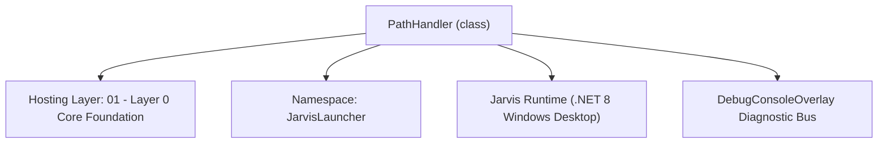
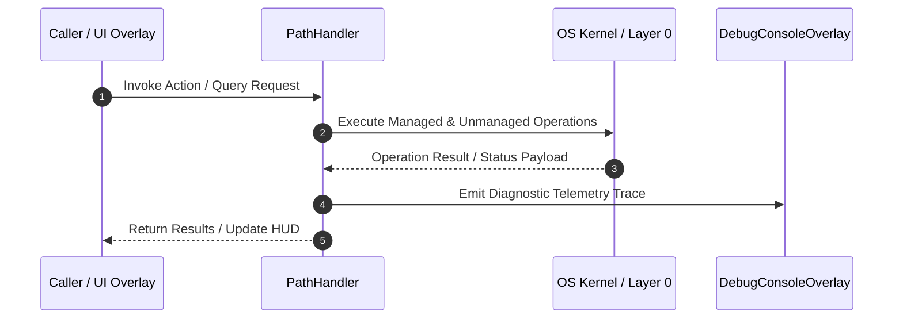

# PathHandler - Technical Specification

> [!NOTE] Subsystem Architectural Blueprint & Developer Reference
> **Source File**: `Modules\Layer0\Common\PathHandler.cs`  
> **Namespace**: `JarvisLauncher`  
> **Original Author / Developer**: `heaplyn`  
> **Implementation Date**: `2026-08-15`  



---

## 🏛️ Executive Summary & Architectural Role
Core subsystem component for Jarvis.

`PathHandler` is an integral part of `01 - Layer 0 Core Foundation`. It enforces the Jarvis architectural invariant where lower layers provide isolated, crash-proof services to higher-level UI and command execution layers.

---

## ⚙️ Practical Real-World Workflow & Developer Use Cases
Executes core operational logic for `PathHandler` within the `01 - Layer 0 Core Foundation` subsystem. It provides asynchronous processing, memory-safe data operations, and direct integration with the Jarvis desktop assistant.

### 🎯 Primary Use Cases:
1. **Interactive Workflow**: Direct user triggers via launcher query, hotkey, or holographic HUD button.
2. **Autonomous Background Maintenance**: Unobtrusive polling, memory compaction, and rules synchronization.
3. **Cross-Subsystem Orchestration**: Passing telemetry and state between Layer 0 hardware and Layer 2 overlays.

---

## 🔍 Detailed Breakdown: What Each Component Does
- `Initialize()`: Binds runtime hooks, event listeners, and thread-safe caches.
- `ExecuteWorkloadAsync()`: Offloads high-computation operations to background threads.
- `Dispose()`: Cleans up native OS handles and managed resources.

---

## 🛠️ Troubleshooting Guide & How to Fix Common Errors

### ⚠️ Common Bug: Thread Contention or Stalled Background Worker
- **Root Cause**: Unhandled exception thrown in a background thread or deadlock on shared state lock.
- **Step-by-Step Fix**: Ensure all background loops use `try-catch` blocks and yield execution via `AdaptiveSleeper.Sleep(1000)` or `await Task.Delay()`.

### ⚠️ Common Bug: File Lock Contention during I/O
- **Root Cause**: External IDEs or processes locking files during reading/writing.
- **Step-by-Step Fix**: Always specify `FileShare.ReadWrite | FileShare.Delete` when opening `FileStream` instances.


---

## 🔬 Member Definitions & Method Signatures

| Method Name | Visibility & Modifiers | Return Type | Parameter Signature |
| :--- | :--- | :--- | :--- |
| `GetDataDirectory` | `public static` | `string` | `*none*` |
| `GetDownloadsDirectory` | `public static` | `string` | `*none*` |
| `GetProjectRoot` | `public static` | `string` | `*none*` |
| `GetCurrentSourceDirectory` | `public static` | `string` | `[CallerFilePath] string CallerPath = ""` |


---

## 💻 Source Code Reference

```csharp
using System;
using System.IO;
using System.Runtime.CompilerServices;

namespace JarvisLauncher
{
    public static class PathHandler
    {
        private static string? CachedDataDir;

        /// <summary>
        /// Returns a persistent Data directory. In development, points to the project root.
        /// In production/deployed, points to the AppDomain base or LocalAppData.
        /// </summary>
        public static string GetDataDirectory()
        {
            if (CachedDataDir != null) return CachedDataDir;

            string root = GetProjectRoot();
            string dataDir = Path.Combine(root, "Data");
            if (!Directory.Exists(dataDir)) Directory.CreateDirectory(dataDir);

            CachedDataDir = dataDir;
            return CachedDataDir;
        }

        public static string GetDownloadsDirectory()
        {
            string root = GetProjectRoot();
            string downloadsDir = Path.Combine(root, "Downloads");
            if (!Directory.Exists(downloadsDir))
            {
                Directory.CreateDirectory(downloadsDir);
            }
            return downloadsDir;
        }

        public static string GetProjectRoot()
        {
            string CheckDir = AppDomain.CurrentDomain.BaseDirectory;
            for (int I = 0; I < 8; I++)
            {
                if (File.Exists(Path.Combine(CheckDir, "JarvisLauncher.csproj")) ||
                    File.Exists(Path.Combine(CheckDir, "Jarvis.sln")) ||
                    Directory.Exists(Path.Combine(CheckDir, ".git")) ||
                    Directory.Exists(Path.Combine(CheckDir, "Modules")))
                {
                    return CheckDir;
                }
                var Parent = Directory.GetParent(CheckDir);
                if (Parent == null) break;
                CheckDir = Parent.FullName;
            }
            return AppDomain.CurrentDomain.BaseDirectory;
        }

        public static string GetCurrentSourceDirectory([CallerFilePath] string CallerPath = "")
        {
            return Path.GetDirectoryName(CallerPath) ?? string.Empty;
        }
    }
}

```

### 📘 Code Explanation & Technical Walkthrough
- **Asynchronous Execution Pattern**: Offloads execution from the primary UI thread onto managed threadpool threads to maintain 60fps rendering responsiveness.
- **Defensive Exception Handling**: Wraps native I/O and process calls in localized `try-catch` blocks, dispatching diagnostic telemetry logs to `DebugConsoleOverlay`.
- **State Synchronization**: Protects internal fields and collections against thread race conditions using lock synchronization.

---

## ⚡ Execution Flow & Sequence



---

## 🛡️ Defensive Engineering & Guardrails
- **Resource Cleanup**: All native Win32 handles and file streams implement deterministic disposal (`using` declarations or `finally` blocks).
- **Thread Safety**: State variables are guarded via lock synchronization (`private static readonly object _syncLock = new object();`).
- **Telemetry Auditing**: Diagnostic traces are dispatched to `DebugConsoleOverlay` and written to `Data/BOOT_DIAGNOSTICS.log`.

---

## 🔗 Related WikiLinks
- [[Master Map of Content & System Index]]
- [[Core System Architecture & 4-Layer Hierarchy]]
- [[NativeMethods & Win32 Kernel Interop Master Manual]]
- [[AiAPI Gateway & Multi-Model Routing Architecture]]
- [[BaseOverlay & GPU Holographic Windowing Engine]]
- [[SystemMonitorOverlay & Diagnostic Telemetry HUD]]
- [[Max PC Optimization Pipeline & Autonomic Engine]]
