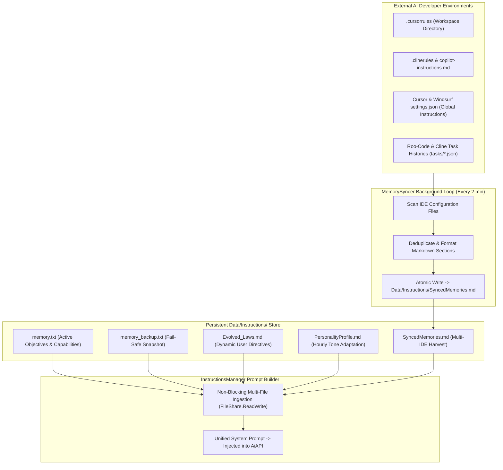

# 🧬 Persistent Memory & Multi-IDE Rules Sync Architecture

## 🧠 Cognitive Memory & Multi-IDE Synchronization

Jarvis maintains persistent knowledge across sessions through an autonomous background sync engine that bridges the launcher with external AI coding environments (Cursor, Windsurf, VS Code, Cline, Roo-Code).



---

## 📂 Persistent Memory Files Matrix

| File Path | Update Frequency | Purpose & Contents |
| :--- | :--- | :--- |
| `Data/Instructions/memory.txt` | On user/AI command | Core objectives, verified capabilities, active project paths, and silent operation flags. |
| `Data/Instructions/memory_backup.txt` | Synced on every write | Redundant fail-safe snapshot to recover from unexpected file corruption. |
| `Data/Instructions/SyncedMemories.md` | Every 2 minutes | Harvested rules from `.cursorrules`, `.clinerules`, and recent Roo-Code tasks. |
| `Data/Instructions/Evolved_Laws.md` | On user correction | Learned heuristics (e.g. *"Always use Ring 0 utilities for formatting in Jarvis"*). |
| `Data/Instructions/PersonalityProfile.md` | Every 1 hour | Adaptive conversational tone and vibe analysis generated by `PersonalityEvolver`. |

---

## 🛡️ Non-Blocking File Streaming & Size Safety Guards

```csharp
private static string ReadFileNonBlocking(string filePath)
{
    try
    {
        using var fs = new FileStream(filePath, FileMode.Open, FileAccess.Read, FileShare.ReadWrite | FileShare.Delete);
        using var sr = new StreamReader(fs, Encoding.UTF8);
        return sr.ReadToEnd();
    }
    catch
    {
        return string.Empty;
    }
}
```

### 📘 Code Explanation & Technical Walkthrough
- **Non-Blocking Streaming**: Uses `FileMode.Open` with `FileShare.ReadWrite | FileShare.Delete` to read/write persistent state files while preventing file lock collisions with external IDEs or text editors.
- **Encoding Safety**: Utilizes `Encoding.UTF8` stream readers and writers to prevent multi-byte character corruption.
- **Atomic Backup Guard**: Automatically writes a duplicate copy to `memory_backup.txt` whenever `memory.txt` is saved.

### 🔒 Size Safety Caps
To prevent oversized logs or memory dumps from overwhelming the AI context window, `InstructionsManager` enforces a **256 KB safety size cap per file**:
```csharp
var fi = new FileInfo(file);
if (fi.Length > 256 * 1024)
{
    DebugConsoleOverlay.Log("Instructions-Warning", $"Skipping oversized file: {fi.Name} ({fi.Length / 1024} KB)");
    continue;
}
```

### 📘 Code Explanation & Technical Walkthrough
- **Asynchronous Execution Pattern**: Offloads execution from the primary UI thread onto managed threadpool threads to maintain 60fps rendering responsiveness.
- **Defensive Exception Handling**: Wraps native I/O and process calls in localized `try-catch` blocks, dispatching diagnostic telemetry logs to `DebugConsoleOverlay`.
- **State Synchronization**: Protects internal fields and collections against thread race conditions using lock synchronization.
