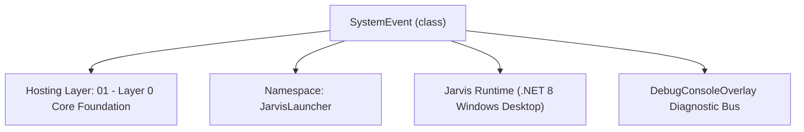
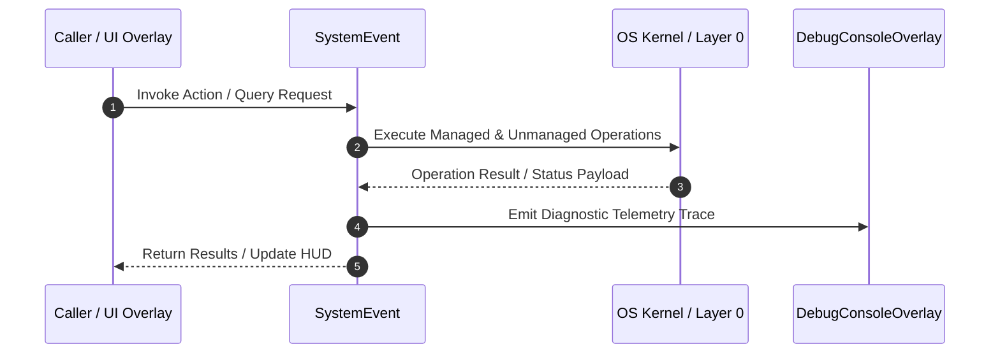

# PredictiveStreamManager - Technical Specification

> [!NOTE] Subsystem Architectural Blueprint & Developer Reference
> **Source File**: `Modules\Layer0\Common\PredictiveStreamManager.cs`  
> **Namespace**: `JarvisLauncher`  
> **Original Author / Developer**: `heaplyn`  
> **Implementation Date**: `2026-08-15`  



---

## 🏛️ Executive Summary & Architectural Role
Predictive Data Stream & Environment Snapshot Manager.
          Maintains a "Continuous Data Stream" of system events and a high-level "Info Pass" for quick retrieval.
          Uses lightweight LLM cycles to predict user intent and proactive actions based on background activity.

`SystemEvent` is an integral part of `01 - Layer 0 Core Foundation`. It enforces the Jarvis architectural invariant where lower layers provide isolated, crash-proof services to higher-level UI and command execution layers.

---

## ⚙️ Practical Real-World Workflow & Developer Use Cases
Executes core operational logic for `PredictiveStreamManager` within the `01 - Layer 0 Core Foundation` subsystem. It provides asynchronous processing, memory-safe data operations, and direct integration with the Jarvis desktop assistant.

### 🎯 Primary Use Cases:
1. **Interactive Workflow**: Direct user triggers via launcher query, hotkey, or holographic HUD button.
2. **Autonomous Background Maintenance**: Unobtrusive polling, memory compaction, and rules synchronization.
3. **Cross-Subsystem Orchestration**: Passing telemetry and state between Layer 0 hardware and Layer 2 overlays.

---

## 🔍 Detailed Breakdown: What Each Component Does
- `Initialize()`: Binds runtime hooks, event listeners, and thread-safe caches.
- `ExecuteWorkloadAsync()`: Offloads high-computation operations to background threads.
- `Dispose()`: Cleans up native OS handles and managed resources.

---

## 🛠️ Troubleshooting Guide & How to Fix Common Errors

### ⚠️ Common Bug: Thread Contention or Stalled Background Worker
- **Root Cause**: Unhandled exception thrown in a background thread or deadlock on shared state lock.
- **Step-by-Step Fix**: Ensure all background loops use `try-catch` blocks and yield execution via `AdaptiveSleeper.Sleep(1000)` or `await Task.Delay()`.

### ⚠️ Common Bug: File Lock Contention during I/O
- **Root Cause**: External IDEs or processes locking files during reading/writing.
- **Step-by-Step Fix**: Always specify `FileShare.ReadWrite | FileShare.Delete` when opening `FileStream` instances.


---

## 🔬 Member Definitions & Method Signatures

| Method Name | Visibility & Modifiers | Return Type | Parameter Signature |
| :--- | :--- | :--- | :--- |
| `Start` | `public static` | `void` | `*none*` |
| `IngestEvent` | `public static` | `void` | `string source, string data` |
| `GetInfoPass` | `public static` | `string` | `*none*` |
| `GetCurrentPrediction` | `public static` | `string` | `*none*` |


---

## 💻 Source Code Reference

```csharp
// Developer: heaplyn
// Date: 2026-08-15
// Summary: Predictive Data Stream & Environment Snapshot Manager.
//          Maintains a "Continuous Data Stream" of system events and a high-level "Info Pass" for quick retrieval.
//          Uses lightweight LLM cycles to predict user intent and proactive actions based on background activity.

using System;
using System.Collections.Generic;
using System.IO;
using System.Linq;
using System.Text;
using System.Threading.Tasks;

namespace JarvisLauncher
{
    public class SystemEvent
    {
        public DateTime Timestamp { get; set; } = DateTime.Now;
        public string Source { get; set; } = string.Empty; // e.g., "VOICE", "WINDOW", "CLIPBOARD"
        public string Data { get; set; } = string.Empty;
    }

    public static class PredictiveStreamManager
    {
        private static bool IsRunning = false;
        private static readonly List<SystemEvent> _streamBuffer = new List<SystemEvent>();
        private static string _cachedInfoPass = "System Ready.";
        private static string _currentPrediction = "Idle";
        private static readonly object _lock = new object();

        public static void Start()
        {
            if (IsRunning) return;
            IsRunning = true;

            Task.Run(async () =>
            {
                while (IsRunning)
                {
                    try
                    {
                        await ProcessStreamCycleAsync();
                    }
                    catch (Exception ex)
                    {
                        DebugConsoleOverlay.Log("Predictive-Error", ex.Message);
                    }

                    // Process cycle every 60 seconds to avoid saturating the LLM backend
                    await AdaptiveSleeper.DelayAsync(60000);
                }
            });

            DebugConsoleOverlay.Log("Predictive-System", "Continuous Data Stream active (60s cycle).");
        }

        public static void IngestEvent(string source, string data)
        {
            if (string.IsNullOrWhiteSpace(data)) return;
            lock (_lock)
            {
                _streamBuffer.Add(new SystemEvent { Source = source, Data = data });
                // Keep only last 50 events for context window
                if (_streamBuffer.Count > 50) _streamBuffer.RemoveAt(0);
            }
        }

        public static string GetInfoPass()
        {
            lock (_lock) return _cachedInfoPass;
        }

        public static string GetCurrentPrediction()
        {
            lock (_lock) return _currentPrediction;
        }

        private static async Task ProcessStreamCycleAsync()
        {
            List<SystemEvent> events;
            lock (_lock) events = _streamBuffer.ToList();

            if (events.Count == 0) return;

            // Build a "Continuous Stream" summary for the LLM
            var sb = new StringBuilder();
            sb.AppendLine("## CONTINUOUS BACKGROUND DATA STREAM");
            foreach (var ev in events.TakeLast(15))
            {
                sb.AppendLine($"[{ev.Timestamp:HH:mm:ss}] {ev.Source}: {ev.Data}");
            }

            string activeWindow = ScreenMonitorEngine.ActiveWindowTitle;
            sb.AppendLine($"Foreground: {activeWindow}");

            // The "Predictive" LLM pass
            string prompt = "You are the Jarvis Predictive Core. Analyze this background data stream and foreground state.\n" +
                            "1. Generate a 2-sentence 'INFO PASS' (A quick summary of what the user is currently doing).\n" +
                            "2. Generate a 'PREDICTION' (What is the user likely to do next or need help with?).\n\n" +
                            "DATA STREAM:\n" + sb.ToString() + "\n\n" +
                            "Format your response EXACTLY as:\nINFO_PASS: <summary>\nPREDICTION: <prediction>";

            try
            {
                // Use the fastest model for predictions to avoid lag
                string response = await LlmRouter.AskAsync(prompt, null);

                var lines = response.Split('\n');
                foreach (var line in lines)
                {
                    if (line.StartsWith("INFO_PASS:", StringComparison.OrdinalIgnoreCase))
                    {
                        lock (_lock) _cachedInfoPass = line.Substring(10).Trim();
                    }
                    else if (line.StartsWith("PREDICTION:", StringComparison.OrdinalIgnoreCase))
                    {
                        lock (_lock) _currentPrediction = line.Substring(11).Trim();
                    }
                }

                DebugConsoleOverlay.Log("Predictive-Update", $"Pass: {_cachedInfoPass} | Prediction: {_currentPrediction}");
            }
            catch { }
        }
    }
}
```

### 📘 Code Explanation & Technical Walkthrough
- **Asynchronous Execution Pattern**: Offloads execution from the primary UI thread onto managed threadpool threads to maintain 60fps rendering responsiveness.
- **Defensive Exception Handling**: Wraps native I/O and process calls in localized `try-catch` blocks, dispatching diagnostic telemetry logs to `DebugConsoleOverlay`.
- **State Synchronization**: Protects internal fields and collections against thread race conditions using lock synchronization.

---

## ⚡ Execution Flow & Sequence



---

## 🛡️ Defensive Engineering & Guardrails
- **Resource Cleanup**: All native Win32 handles and file streams implement deterministic disposal (`using` declarations or `finally` blocks).
- **Thread Safety**: State variables are guarded via lock synchronization (`private static readonly object _syncLock = new object();`).
- **Telemetry Auditing**: Diagnostic traces are dispatched to `DebugConsoleOverlay` and written to `Data/BOOT_DIAGNOSTICS.log`.

---

## 🔗 Related WikiLinks
- [[Master Map of Content & System Index]]
- [[Core System Architecture & 4-Layer Hierarchy]]
- [[NativeMethods & Win32 Kernel Interop Master Manual]]
- [[AiAPI Gateway & Multi-Model Routing Architecture]]
- [[BaseOverlay & GPU Holographic Windowing Engine]]
- [[SystemMonitorOverlay & Diagnostic Telemetry HUD]]
- [[Max PC Optimization Pipeline & Autonomic Engine]]
