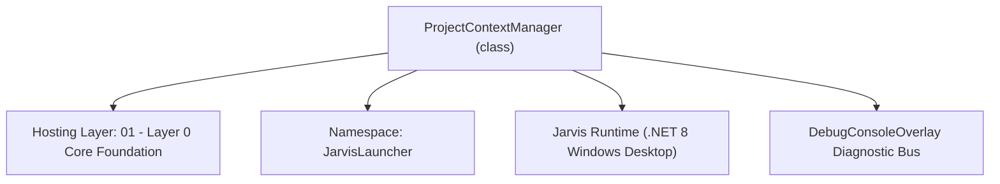
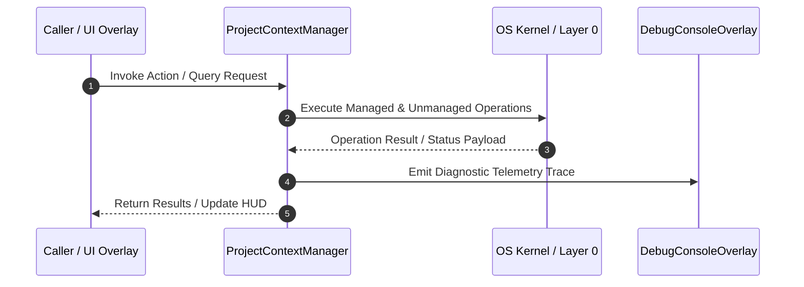

# ProjectContextManager - Technical Specification

> [!NOTE] Subsystem Architectural Blueprint & Developer Reference
> **Source File**: `Modules\Layer0\Common\ProjectContextManager.cs`  
> **Namespace**: `JarvisLauncher`  
> **Original Author / Developer**: `heaplyn`  
> **Implementation Date**: `2026-08-17`  



---

## 🏛️ Executive Summary & Architectural Role
Deep Project Context Manager.
          Indexes project structure and runs AI-powered file analysis to build a comprehensive system map.

`ProjectContextManager` is an integral part of `01 - Layer 0 Core Foundation`. It enforces the Jarvis architectural invariant where lower layers provide isolated, crash-proof services to higher-level UI and command execution layers.

---

## ⚙️ Practical Real-World Workflow & Developer Use Cases
Executes core operational logic for `ProjectContextManager` within the `01 - Layer 0 Core Foundation` subsystem. It provides asynchronous processing, memory-safe data operations, and direct integration with the Jarvis desktop assistant.

### 🎯 Primary Use Cases:
1. **Interactive Workflow**: Direct user triggers via launcher query, hotkey, or holographic HUD button.
2. **Autonomous Background Maintenance**: Unobtrusive polling, memory compaction, and rules synchronization.
3. **Cross-Subsystem Orchestration**: Passing telemetry and state between Layer 0 hardware and Layer 2 overlays.

---

## 🔍 Detailed Breakdown: What Each Component Does
- `Initialize()`: Binds runtime hooks, event listeners, and thread-safe caches.
- `ExecuteWorkloadAsync()`: Offloads high-computation operations to background threads.
- `Dispose()`: Cleans up native OS handles and managed resources.

---

## 🛠️ Troubleshooting Guide & How to Fix Common Errors

### ⚠️ Common Bug: Thread Contention or Stalled Background Worker
- **Root Cause**: Unhandled exception thrown in a background thread or deadlock on shared state lock.
- **Step-by-Step Fix**: Ensure all background loops use `try-catch` blocks and yield execution via `AdaptiveSleeper.Sleep(1000)` or `await Task.Delay()`.

### ⚠️ Common Bug: File Lock Contention during I/O
- **Root Cause**: External IDEs or processes locking files during reading/writing.
- **Step-by-Step Fix**: Always specify `FileShare.ReadWrite | FileShare.Delete` when opening `FileStream` instances.


---

## 🔬 Member Definitions & Method Signatures

| Method Name | Visibility & Modifiers | Return Type | Parameter Signature |
| :--- | :--- | :--- | :--- |
| `GetFileSummaries` | `public ` | `List<FileSummary>` | `*none*` |
| `RefreshIndexAsync` | `public async` | `Task` | `string rootPath` |
| `GetProjectSummaryAsync` | `public async` | `Task<string>` | `*none*` |
| `RunDeepAnalysisAsync` | `public async` | `Task` | `Action<string, double> progressCallback` |


---

## 💻 Source Code Reference

```csharp
// Developer: heaplyn
// Date: 2026-08-17
// Summary: Deep Project Context Manager.
//          Indexes project structure and runs AI-powered file analysis to build a comprehensive system map.

using System;
using System.Collections.Generic;
using System.IO;
using System.Linq;
using System.Text;
using System.Threading.Tasks;

namespace JarvisLauncher
{
    public class ProjectContextManager : IProjectContextService
    {
        private string _rootPath = string.Empty;
        private readonly List<FileSummary> _summaries = new();
        private readonly string[] _targetExts = { ".cs", ".xaml", ".bat", ".md", ".json", ".bat", ".bat", ".bat" };
        private readonly string[] _ignoredDirs = { "bin", "obj", ".git", ".vs", "node_modules", "publish" };

        public List<FileSummary> GetFileSummaries() => _summaries;

        public async Task RefreshIndexAsync(string rootPath)
        {
            _rootPath = rootPath;
            if (!Directory.Exists(rootPath)) return;

            // Basic Indexing (Structural)
            _ = ProjectSymbolIndexer.IndexProjectAsync(rootPath);
        }

        public async Task<string> GetProjectSummaryAsync()
        {
            var sb = new StringBuilder();
            sb.AppendLine("## JARVIS SYSTEM KNOWLEDGE: CURRENT PROJECT");
            sb.AppendLine($"Project Root: {_rootPath}");
            sb.AppendLine(ProjectMapManager.BuildProjectTree(_rootPath, 2));

            if (_summaries.Any())
            {
                sb.AppendLine("\n## MODULE ANALYSIS");
                foreach (var s in _summaries.OrderByDescending(x => x.Size).Take(30))
                {
                    sb.AppendLine($"- {Path.GetFileName(s.FilePath)}: {s.Summary}");
                }
            }
            else {
                sb.AppendLine("\n(Deep analysis not yet performed. AI has structural context only.)");
            }

            return sb.ToString();
        }

        public async Task RunDeepAnalysisAsync(Action<string, double> progressCallback)
        {
            if (string.IsNullOrEmpty(_rootPath)) return;

            var files = Directory.GetFiles(_rootPath, "*.*", SearchOption.AllDirectories)
                .Where(f => _targetExts.Contains(Path.GetExtension(f).ToLower()))
                .Where(f => !_ignoredDirs.Any(d => f.Contains($"\\{d}\\") || f.Contains($"/{d}/")))
                .ToList();

            _summaries.Clear();
            int processed = 0;
            int total = files.Count;

            // Use a semaphore to control parallelism (prevent hitting LLM rate limits or crashing system)
            var semaphore = new System.Threading.SemaphoreSlim(4);
            var tasks = files.Select(async file =>
            {
                await semaphore.WaitAsync();
                try
                {
                    string content = await File.ReadAllTextAsync(file);
                    if (content.Length > 20000) content = content.Substring(0, 20000);

                    string prompt = $"TASK: Provide a ONE-SENTENCE technical summary of this file's purpose in the project.\nFILE: {Path.GetFileName(file)}\nCONTENT:\n{content}";

                    string summary = await CoreRegistry.Intelligence.Llm.AskAsync(prompt);

                    lock (_summaries)
                    {
                        _summaries.Add(new FileSummary { FilePath = file, Summary = summary.Trim(), Size = new FileInfo(file).Length });
                        processed++;
                        double percent = (double)processed / total * 100;
                        progressCallback?.Invoke($"Analyzing {Path.GetFileName(file)}...", percent);
                    }
                }
                catch (Exception ex)
                {
                    DebugConsoleOverlay.Log("ProjectContext", $"Failed to analyze {file}: {ex.Message}");
                }
                finally
                {
                    semaphore.Release();
                }
            });

            await Task.WhenAll(tasks);

            progressCallback?.Invoke("Deep Analysis Complete.", 100);

            // Save deep map to local file for persistence
            try {
                string mapPath = Path.Combine(PathHandler.GetDataDirectory(), "project_deep_map.json");
                File.WriteAllText(mapPath, System.Text.Json.JsonSerializer.Serialize(_summaries, new System.Text.Json.JsonSerializerOptions { WriteIndented = true }));
            } catch { }
        }
    }
}
```

### 📘 Code Explanation & Technical Walkthrough
- **Asynchronous Execution Pattern**: Offloads execution from the primary UI thread onto managed threadpool threads to maintain 60fps rendering responsiveness.
- **Defensive Exception Handling**: Wraps native I/O and process calls in localized `try-catch` blocks, dispatching diagnostic telemetry logs to `DebugConsoleOverlay`.
- **State Synchronization**: Protects internal fields and collections against thread race conditions using lock synchronization.

---

## ⚡ Execution Flow & Sequence



---

## 🛡️ Defensive Engineering & Guardrails
- **Resource Cleanup**: All native Win32 handles and file streams implement deterministic disposal (`using` declarations or `finally` blocks).
- **Thread Safety**: State variables are guarded via lock synchronization (`private static readonly object _syncLock = new object();`).
- **Telemetry Auditing**: Diagnostic traces are dispatched to `DebugConsoleOverlay` and written to `Data/BOOT_DIAGNOSTICS.log`.

---

## 🔗 Related WikiLinks
- [[Master Map of Content & System Index]]
- [[Core System Architecture & 4-Layer Hierarchy]]
- [[NativeMethods & Win32 Kernel Interop Master Manual]]
- [[AiAPI Gateway & Multi-Model Routing Architecture]]
- [[BaseOverlay & GPU Holographic Windowing Engine]]
- [[SystemMonitorOverlay & Diagnostic Telemetry HUD]]
- [[Max PC Optimization Pipeline & Autonomic Engine]]
