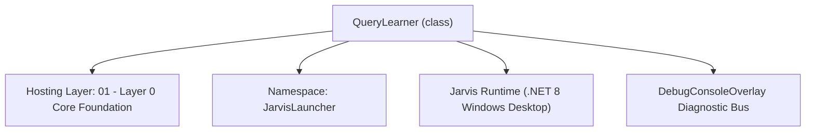
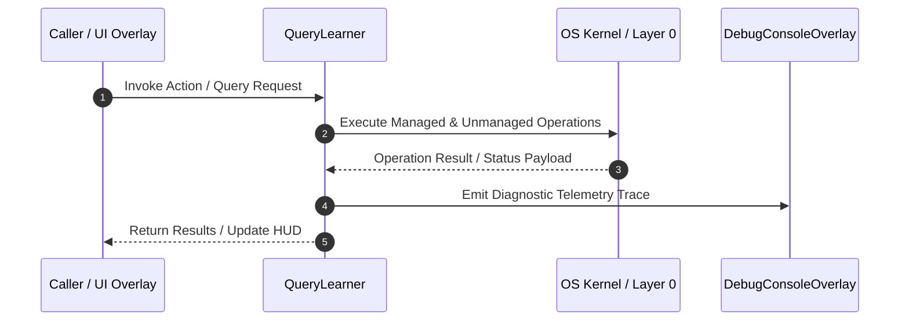

# QueryLearner - Technical Specification

> [!NOTE] Subsystem Architectural Blueprint & Developer Reference
> **Source File**: `Modules\Layer0\Common\QueryLearner.cs`  
> **Namespace**: `JarvisLauncher`  
> **Original Author / Developer**: `heaplyn`  
> **Implementation Date**: `2026-08-13`  



---

## 🏛️ Executive Summary & Architectural Role
Lightweight frequency-based ML model that records (query → chosen result) pairs
 and boosts future suggestion scores for commonly-selected entries. Persists to Data/usage_model.json.

`QueryLearner` is an integral part of `01 - Layer 0 Core Foundation`. It enforces the Jarvis architectural invariant where lower layers provide isolated, crash-proof services to higher-level UI and command execution layers.

---

## ⚙️ Practical Real-World Workflow & Developer Use Cases
Executes core operational logic for `QueryLearner` within the `01 - Layer 0 Core Foundation` subsystem. It provides asynchronous processing, memory-safe data operations, and direct integration with the Jarvis desktop assistant.

### 🎯 Primary Use Cases:
1. **Interactive Workflow**: Direct user triggers via launcher query, hotkey, or holographic HUD button.
2. **Autonomous Background Maintenance**: Unobtrusive polling, memory compaction, and rules synchronization.
3. **Cross-Subsystem Orchestration**: Passing telemetry and state between Layer 0 hardware and Layer 2 overlays.

---

## 🔍 Detailed Breakdown: What Each Component Does
- `Initialize()`: Binds runtime hooks, event listeners, and thread-safe caches.
- `ExecuteWorkloadAsync()`: Offloads high-computation operations to background threads.
- `Dispose()`: Cleans up native OS handles and managed resources.

---

## 🛠️ Troubleshooting Guide & How to Fix Common Errors

### ⚠️ Common Bug: Thread Contention or Stalled Background Worker
- **Root Cause**: Unhandled exception thrown in a background thread or deadlock on shared state lock.
- **Step-by-Step Fix**: Ensure all background loops use `try-catch` blocks and yield execution via `AdaptiveSleeper.Sleep(1000)` or `await Task.Delay()`.

### ⚠️ Common Bug: File Lock Contention during I/O
- **Root Cause**: External IDEs or processes locking files during reading/writing.
- **Step-by-Step Fix**: Always specify `FileShare.ReadWrite | FileShare.Delete` when opening `FileStream` instances.


---

## 🔬 Member Definitions & Method Signatures

| Method Name | Visibility & Modifiers | Return Type | Parameter Signature |
| :--- | :--- | :--- | :--- |
| `RecordSelection` | `public static` | `void` | `string query, string resultTitle` |
| `GetBoost` | `public static` | `double` | `string query, string resultTitle` |
| `CleanTitle` | `private static` | `string` | `string t` |
| `MakeKey` | `private static` | `string` | `string query, string resultTitle` |
| `NormalizeQuery` | `private static` | `string` | `string q` |
| `EnsureLoaded` | `private static` | `void` | `*none*` |
| `SaveAsync` | `private static` | `void` | `*none*` |


---

## 💻 Source Code Reference

```csharp
// Developer: heaplyn
// Date: 2026-08-13
// Summary: Lightweight frequency-based ML model that records (query → chosen result) pairs
// and boosts future suggestion scores for commonly-selected entries. Persists to Data/usage_model.json.

using System;
using System.Collections.Generic;
using System.IO;
using System.Linq;
using System.Text.Json;

namespace JarvisLauncher
{
    public static class QueryLearner
    {
        private static readonly HashSet<string> InvalidTitles = new(StringComparer.OrdinalIgnoreCase)
        {
            "open", "start", "run", "launch", "search", "show", "play", "kill", "run: open", "run: start"
        };

        // key: "normalizedQuery|resultTitle"  →  value: hit count
        private static Dictionary<string, int> _model = new(StringComparer.OrdinalIgnoreCase);
        private static readonly string _modelPath = Path.Combine(
            AppDomain.CurrentDomain.BaseDirectory, "Data", "usage_model.json");

        private static bool _loaded = false;

        // ── Public API ───────────────────────────────────────────────────────────

        /// <summary>
        /// Records that the user selected <paramref name="resultTitle"/> after typing <paramref name="query"/>.
        /// Call this every time the user executes a suggestion from the results list.
        /// </summary>
        public static void RecordSelection(string query, string resultTitle)
        {
            EnsureLoaded();
            if (string.IsNullOrWhiteSpace(query) || string.IsNullOrWhiteSpace(resultTitle)) return;

            string cleanTitle = CleanTitle(resultTitle);
            if (InvalidTitles.Contains(cleanTitle)) return;

            string key = MakeKey(query, cleanTitle);
            _model.TryGetValue(key, out int count);
            _model[key] = count + 1;

            // Also record a prefix-agnostic key so partial matches learn from full queries
            var tokens = NormalizeQuery(query).Split(' ', StringSplitOptions.RemoveEmptyEntries);
            foreach (var token in tokens)
            {
                if (token.Length >= 2 && token != NormalizeQuery(query))
                {
                    string prefixKey = MakeKey(token, cleanTitle);
                    _model.TryGetValue(prefixKey, out int pc);
                    _model[prefixKey] = pc + 1;
                }
            }

            SaveAsync();
        }

        /// <summary>
        /// Returns a score boost [0.0 – 3.0] for a result based on past usage frequency.
        /// </summary>
        public static double GetBoost(string query, string resultTitle)
        {
            EnsureLoaded();
            if (string.IsNullOrWhiteSpace(query) || string.IsNullOrWhiteSpace(resultTitle)) return 0.0;

            string cleanTitle = CleanTitle(resultTitle);
            if (InvalidTitles.Contains(cleanTitle)) return 0.0;

            string key = MakeKey(query, cleanTitle);
            _model.TryGetValue(key, out int count);

            return count > 0 ? Math.Min(3.0, Math.Sqrt(count) * 0.5) : 0.0;
        }

        /// <summary>
        /// Returns the top-N most frequently chosen results for any query prefix.
        /// </summary>
        public static List<(string ResultTitle, string OriginalQuery, int Count)> GetTopResults(string queryPrefix, int topN = 5)
        {
            EnsureLoaded();
            string prefix = NormalizeQuery(queryPrefix);
            var hits = new List<(string, string, int)>();

            foreach (var kvp in _model)
            {
                var parts = kvp.Key.Split('\0');
                if (parts.Length == 2 && parts[0].StartsWith(prefix, StringComparison.OrdinalIgnoreCase) && kvp.Value > 0)
                {
                    string title = parts[1];
                    string origQuery = parts[0];
                    if (!InvalidTitles.Contains(title))
                    {
                        hits.Add((title, origQuery, kvp.Value));
                    }
                }
            }

            hits.Sort((a, b) => b.Item3.CompareTo(a.Item3));
            return hits.Count > topN ? hits.GetRange(0, topN) : hits;
        }

        // ── Internals ────────────────────────────────────────────────────────────

        private static string CleanTitle(string t)
        {
            string clean = t.Trim();
            if (clean.StartsWith("⭐ ")) clean = clean.Substring(2).Trim();
            if (clean.StartsWith("Run: ")) clean = clean.Substring(5).Trim();
            return clean;
        }

        private static string MakeKey(string query, string resultTitle)
            => $"{NormalizeQuery(query)}\0{CleanTitle(resultTitle).ToLowerInvariant()}";

        private static string NormalizeQuery(string q)
            => q.Trim().ToLowerInvariant();

        private static void EnsureLoaded()
        {
            if (_loaded) return;
            _loaded = true;
            try
            {
                if (File.Exists(_modelPath))
                {
                    string json = File.ReadAllText(_modelPath);
                    var loaded = JsonSerializer.Deserialize<Dictionary<string, int>>(json);
                    if (loaded != null)
                    {
                        // Purge invalid entries
                        _model = loaded.Where(kvp =>
                        {
                            var parts = kvp.Key.Split('\0');
                            if (parts.Length == 2 && InvalidTitles.Contains(parts[1])) return false;
                            return true;
                        }).ToDictionary(kvp => kvp.Key, kvp => kvp.Value, StringComparer.OrdinalIgnoreCase);
                    }
                }
            }
            catch { /* corrupt model — start fresh */ }
        }

        private static void SaveAsync()
        {
            System.Threading.Tasks.Task.Run(() =>
            {
                try
                {
                    string? dir = Path.GetDirectoryName(_modelPath);
                    if (!string.IsNullOrEmpty(dir) && !Directory.Exists(dir))
                    {
                        Directory.CreateDirectory(dir);
                    }
                    string json = JsonSerializer.Serialize(_model, new JsonSerializerOptions { WriteIndented = true });
                    File.WriteAllText(_modelPath, json);
                }
                catch { }
            });
        }
    }
}
```

### 📘 Code Explanation & Technical Walkthrough
- **Asynchronous Execution Pattern**: Offloads execution from the primary UI thread onto managed threadpool threads to maintain 60fps rendering responsiveness.
- **Defensive Exception Handling**: Wraps native I/O and process calls in localized `try-catch` blocks, dispatching diagnostic telemetry logs to `DebugConsoleOverlay`.
- **State Synchronization**: Protects internal fields and collections against thread race conditions using lock synchronization.

---

## ⚡ Execution Flow & Sequence



---

## 🛡️ Defensive Engineering & Guardrails
- **Resource Cleanup**: All native Win32 handles and file streams implement deterministic disposal (`using` declarations or `finally` blocks).
- **Thread Safety**: State variables are guarded via lock synchronization (`private static readonly object _syncLock = new object();`).
- **Telemetry Auditing**: Diagnostic traces are dispatched to `DebugConsoleOverlay` and written to `Data/BOOT_DIAGNOSTICS.log`.

---

## 🔗 Related WikiLinks
- [[Master Map of Content & System Index]]
- [[Core System Architecture & 4-Layer Hierarchy]]
- [[NativeMethods & Win32 Kernel Interop Master Manual]]
- [[AiAPI Gateway & Multi-Model Routing Architecture]]
- [[BaseOverlay & GPU Holographic Windowing Engine]]
- [[SystemMonitorOverlay & Diagnostic Telemetry HUD]]
- [[Max PC Optimization Pipeline & Autonomic Engine]]
