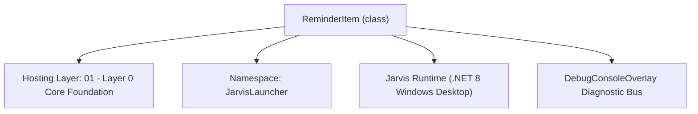
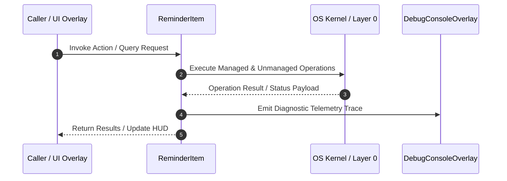

# ReminderManager - Technical Specification

> [!NOTE] Subsystem Architectural Blueprint & Developer Reference
> **Source File**: `Modules\Layer0\Common\ReminderManager.cs`  
> **Namespace**: `JarvisLauncher`  
> **Original Author / Developer**: `copilot`  
> **Implementation Date**: `2026-08-13`  



---

## 🏛️ Executive Summary & Architectural Role
Handles background reminder scheduling, JSON serialization, and sound/visual notifications when reminders mature.

`ReminderItem` is an integral part of `01 - Layer 0 Core Foundation`. It enforces the Jarvis architectural invariant where lower layers provide isolated, crash-proof services to higher-level UI and command execution layers.

---

## ⚙️ Practical Real-World Workflow & Developer Use Cases
Executes core operational logic for `ReminderManager` within the `01 - Layer 0 Core Foundation` subsystem. It provides asynchronous processing, memory-safe data operations, and direct integration with the Jarvis desktop assistant.

### 🎯 Primary Use Cases:
1. **Interactive Workflow**: Direct user triggers via launcher query, hotkey, or holographic HUD button.
2. **Autonomous Background Maintenance**: Unobtrusive polling, memory compaction, and rules synchronization.
3. **Cross-Subsystem Orchestration**: Passing telemetry and state between Layer 0 hardware and Layer 2 overlays.

---

## 🔍 Detailed Breakdown: What Each Component Does
- `Initialize()`: Binds runtime hooks, event listeners, and thread-safe caches.
- `ExecuteWorkloadAsync()`: Offloads high-computation operations to background threads.
- `Dispose()`: Cleans up native OS handles and managed resources.

---

## 🛠️ Troubleshooting Guide & How to Fix Common Errors

### ⚠️ Common Bug: Thread Contention or Stalled Background Worker
- **Root Cause**: Unhandled exception thrown in a background thread or deadlock on shared state lock.
- **Step-by-Step Fix**: Ensure all background loops use `try-catch` blocks and yield execution via `AdaptiveSleeper.Sleep(1000)` or `await Task.Delay()`.

### ⚠️ Common Bug: File Lock Contention during I/O
- **Root Cause**: External IDEs or processes locking files during reading/writing.
- **Step-by-Step Fix**: Always specify `FileShare.ReadWrite | FileShare.Delete` when opening `FileStream` instances.


---

## 🔬 Member Definitions & Method Signatures

| Method Name | Visibility & Modifiers | Return Type | Parameter Signature |
| :--- | :--- | :--- | :--- |
| `Initialize` | `public static` | `void` | `*none*` |
| `GetFilePath` | `private static` | `string` | `*none*` |
| `LoadReminders` | `public static` | `List<ReminderItem>` | `*none*` |
| `SaveReminders` | `public static` | `void` | `*none*` |
| `AddReminder` | `public static` | `void` | `string message, DateTime targetTime` |
| `DeleteReminder` | `public static` | `bool` | `int userIndex` |
| `CheckReminders` | `private static` | `void` | `*none*` |
| `GetActiveReminders` | `public static` | `List<ReminderItem>` | `*none*` |


---

## 💻 Source Code Reference

```csharp
// Developer: copilot
// Date: 2026-08-13
// Summary: Handles background reminder scheduling, JSON serialization, and sound/visual notifications when reminders mature.

using System;
using System.Collections.Generic;
using System.IO;
using System.Linq;
using System.Text.Json;
using System.Windows.Threading;
using System.Media;

namespace JarvisLauncher
{
    public class ReminderItem
    {
        public Guid Id { get; set; } = Guid.NewGuid();
        public string Message { get; set; } = string.Empty;
        public DateTime TargetTime { get; set; }
        public bool IsCompleted { get; set; } = false;
        public DateTime CreatedAt { get; set; } = DateTime.Now;
    }

    public static class ReminderManager
    {
        private static List<ReminderItem> _reminders = new List<ReminderItem>();
        private static DispatcherTimer? _checkTimer;
        private static readonly object _lock = new object();

        public static void Initialize()
        {
            LoadReminders();

            _checkTimer = new DispatcherTimer { Interval = TimeSpan.FromSeconds(15) };
            _checkTimer.Tick += (s, e) => CheckReminders();
            _checkTimer.Start();
        }

        private static string GetFilePath()
        {
            string dataDir = Path.Combine(AppDomain.CurrentDomain.BaseDirectory, "Data");
            if (!Directory.Exists(dataDir))
            {
                string devPath = Path.GetFullPath(Path.Combine(AppDomain.CurrentDomain.BaseDirectory, @"..\..\..\Data"));
                if (Directory.Exists(devPath))
                {
                    dataDir = devPath;
                }
                else
                {
                    Directory.CreateDirectory(dataDir);
                }
            }
            return Path.Combine(dataDir, "Reminders.json");
        }

        public static List<ReminderItem> LoadReminders()
        {
            lock (_lock)
            {
                try
                {
                    string path = GetFilePath();
                    if (File.Exists(path))
                    {
                        string json = File.ReadAllText(path);
                        _reminders = JsonSerializer.Deserialize<List<ReminderItem>>(json) ?? new List<ReminderItem>();
                    }
                    else
                    {
                        _reminders = new List<ReminderItem>();
                    }
                }
                catch
                {
                    _reminders = new List<ReminderItem>();
                }
                return _reminders;
            }
        }

        public static void SaveReminders()
        {
            lock (_lock)
            {
                try
                {
                    string path = GetFilePath();
                    string json = JsonSerializer.Serialize(_reminders, new JsonSerializerOptions { WriteIndented = true });
                    File.WriteAllText(path, json);
                }
                catch { }
            }
        }

        public static void AddReminder(string message, DateTime targetTime)
        {
            lock (_lock)
            {
                _reminders.Add(new ReminderItem
                {
                    Message = message,
                    TargetTime = targetTime
                });
                SaveReminders();
            }
        }

        public static bool DeleteReminder(int userIndex)
        {
            lock (_lock)
            {
                var active = _reminders.Where(r => !r.IsCompleted).ToList();
                int idx = userIndex - 1;
                if (idx >= 0 && idx < active.Count)
                {
                    var item = active[idx];
                    _reminders.Remove(item);
                    SaveReminders();
                    return true;
                }
                return false;
            }
        }

        private static void CheckReminders()
        {
            List<ReminderItem> dueReminders = new List<ReminderItem>();

            lock (_lock)
            {
                var now = DateTime.Now;
                foreach (var item in _reminders)
                {
                    if (!item.IsCompleted && item.TargetTime <= now)
                    {
                        item.IsCompleted = true;
                        dueReminders.Add(item);
                    }
                }

                if (dueReminders.Count > 0)
                {
                    SaveReminders();
                }
            }

            foreach (var item in dueReminders)
            {
                // Play notification alert sound
                try
                {
                    SystemSounds.Hand.Play();
                }
                catch { }

                // Speak out loud via TTS!
                try
                {
                    TtsManager.Speak($"Reminder alert: {item.Message}");
                }
                catch { }

                // Display visual alert overlay
                TextOverlay.Show($"🔔 REMINDER ALERT!\n{item.Message}", 6000);
                DebugConsoleOverlay.Log("System", $"Reminder fired: {item.Message}");
            }
        }

        public static List<ReminderItem> GetActiveReminders()
        {
            lock (_lock)
            {
                return _reminders.Where(r => !r.IsCompleted).OrderBy(r => r.TargetTime).ToList();
            }
        }
    }
}
```

### 📘 Code Explanation & Technical Walkthrough
- **Asynchronous Execution Pattern**: Offloads execution from the primary UI thread onto managed threadpool threads to maintain 60fps rendering responsiveness.
- **Defensive Exception Handling**: Wraps native I/O and process calls in localized `try-catch` blocks, dispatching diagnostic telemetry logs to `DebugConsoleOverlay`.
- **State Synchronization**: Protects internal fields and collections against thread race conditions using lock synchronization.

---

## ⚡ Execution Flow & Sequence



---

## 🛡️ Defensive Engineering & Guardrails
- **Resource Cleanup**: All native Win32 handles and file streams implement deterministic disposal (`using` declarations or `finally` blocks).
- **Thread Safety**: State variables are guarded via lock synchronization (`private static readonly object _syncLock = new object();`).
- **Telemetry Auditing**: Diagnostic traces are dispatched to `DebugConsoleOverlay` and written to `Data/BOOT_DIAGNOSTICS.log`.

---

## 🔗 Related WikiLinks
- [[Master Map of Content & System Index]]
- [[Core System Architecture & 4-Layer Hierarchy]]
- [[NativeMethods & Win32 Kernel Interop Master Manual]]
- [[AiAPI Gateway & Multi-Model Routing Architecture]]
- [[BaseOverlay & GPU Holographic Windowing Engine]]
- [[SystemMonitorOverlay & Diagnostic Telemetry HUD]]
- [[Max PC Optimization Pipeline & Autonomic Engine]]
