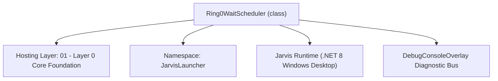
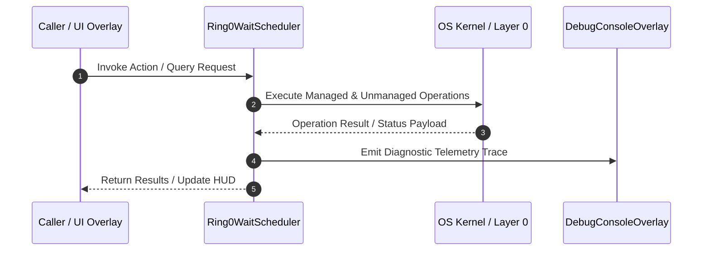

# Ring0WaitScheduler - Technical Specification

> [!NOTE] Subsystem Architectural Blueprint & Developer Reference
> **Source File**: `Modules\Layer0\System\Ring0WaitScheduler.cs`  
> **Namespace**: `JarvisLauncher`  
> **Original Author / Developer**: `heaplyn`  
> **Implementation Date**: `2026-09-01`  



---

## 🏛️ Executive Summary & Architectural Role
Ring0 (Layer0) shared wait scheduler. A SINGLE background thread services a list
          of pending waiters instead of every background loop owning its own timer/Task.Delay.
          Deadlines are coalesced to a minimum-timeout granularity so many waiters that come
          due around the same time wake the CPU ONCE, not N times. Fewer timer objects and
          fewer thread wakeups => lower CPU and better power behavior (the CPU can stay in
          low-power states longer between batched wakeups).

          This is the wait primitive behind AdaptiveSleeper.DelayAsync; anything that already
          calls AdaptiveSleeper.DelayAsync automatically rides this single scheduler thread.

`Ring0WaitScheduler` is an integral part of `01 - Layer 0 Core Foundation`. It enforces the Jarvis architectural invariant where lower layers provide isolated, crash-proof services to higher-level UI and command execution layers.

---

## ⚙️ Practical Real-World Workflow & Developer Use Cases
Executes core operational logic for `Ring0WaitScheduler` within the `01 - Layer 0 Core Foundation` subsystem. It provides asynchronous processing, memory-safe data operations, and direct integration with the Jarvis desktop assistant.

### 🎯 Primary Use Cases:
1. **Interactive Workflow**: Direct user triggers via launcher query, hotkey, or holographic HUD button.
2. **Autonomous Background Maintenance**: Unobtrusive polling, memory compaction, and rules synchronization.
3. **Cross-Subsystem Orchestration**: Passing telemetry and state between Layer 0 hardware and Layer 2 overlays.

---

## 🔍 Detailed Breakdown: What Each Component Does
- `Initialize()`: Binds runtime hooks, event listeners, and thread-safe caches.
- `ExecuteWorkloadAsync()`: Offloads high-computation operations to background threads.
- `Dispose()`: Cleans up native OS handles and managed resources.

---

## 🛠️ Troubleshooting Guide & How to Fix Common Errors

### ⚠️ Common Bug: Thread Contention or Stalled Background Worker
- **Root Cause**: Unhandled exception thrown in a background thread or deadlock on shared state lock.
- **Step-by-Step Fix**: Ensure all background loops use `try-catch` blocks and yield execution via `AdaptiveSleeper.Sleep(1000)` or `await Task.Delay()`.

### ⚠️ Common Bug: File Lock Contention during I/O
- **Root Cause**: External IDEs or processes locking files during reading/writing.
- **Step-by-Step Fix**: Always specify `FileShare.ReadWrite | FileShare.Delete` when opening `FileStream` instances.


---

## 🔬 Member Definitions & Method Signatures

| Method Name | Visibility & Modifiers | Return Type | Parameter Signature |
| :--- | :--- | :--- | :--- |
| `Start` | `public static` | `void` | `*none*` |
| `WaitAsync` | `public static` | `Task` | `int delayMs, CancellationToken ct = default` |
| `EnsureThread` | `private static` | `void` | `*none*` |
| `Loop` | `private static` | `void` | `*none*` |


---

## 💻 Source Code Reference

```csharp
// Developer: heaplyn
// Date: 2026-09-01
// Summary: Ring0 (Layer0) shared wait scheduler. A SINGLE background thread services a list
//          of pending waiters instead of every background loop owning its own timer/Task.Delay.
//          Deadlines are coalesced to a minimum-timeout granularity so many waiters that come
//          due around the same time wake the CPU ONCE, not N times. Fewer timer objects and
//          fewer thread wakeups => lower CPU and better power behavior (the CPU can stay in
//          low-power states longer between batched wakeups).
//
//          This is the wait primitive behind AdaptiveSleeper.DelayAsync; anything that already
//          calls AdaptiveSleeper.DelayAsync automatically rides this single scheduler thread.

using System;
using System.Collections.Generic;
using System.Threading;
using System.Threading.Tasks;

namespace JarvisLauncher
{
    public static class Ring0WaitScheduler
    {
        private sealed class Waiter
        {
            public long DueTicks;                       // Environment.TickCount64 deadline (ms)
            public TaskCompletionSource<bool> Tcs = null!;
            public CancellationTokenRegistration Reg;
        }

        /// <summary>
        /// Coalescing floor. The scheduler wakes at most about once per this many ms, and every
        /// requested delay is rounded UP to the next multiple of it, so near-simultaneous waiters
        /// share a single wakeup. Larger = fewer wakeups / less CPU, at the cost of coarser timing.
        /// </summary>
        public static int MinTimeoutMs { get; set; } = 250;

        private static readonly List<Waiter> _waiters = new();
        private static readonly object _gate = new();
        private static readonly AutoResetEvent _signal = new(false);
        private static int _started;

        // Diagnostics
        public static int PendingCount { get { lock (_gate) return _waiters.Count; } }

        /// <summary>Idempotent warm-up (safe to call at boot).</summary>
        public static void Start() => EnsureThread();

        /// <summary>
        /// Completes after ~delayMs, serviced by the shared scheduler thread. The deadline is
        /// coalesced to MinTimeoutMs. Honors cancellation.
        /// </summary>
        public static Task WaitAsync(int delayMs, CancellationToken ct = default)
        {
            if (ct.IsCancellationRequested) return Task.FromCanceled(ct);
            if (delayMs <= 0) return Task.CompletedTask;

            EnsureThread();

            int gran = Math.Max(1, MinTimeoutMs);
            long due = Environment.TickCount64 + delayMs;
            due = ((due + gran - 1) / gran) * gran;   // round UP to the next coalescing bucket

            var tcs = new TaskCompletionSource<bool>(TaskCreationOptions.RunContinuationsAsynchronously);
            var w = new Waiter { DueTicks = due, Tcs = tcs };

            if (ct.CanBeCanceled)
            {
                w.Reg = ct.Register(static state =>
                {
                    var waiter = (Waiter)state!;
                    lock (_gate) { _waiters.Remove(waiter); }
                    waiter.Tcs.TrySetCanceled();
                    _signal.Set();
                }, w);
            }

            lock (_gate) { _waiters.Add(w); }
            _signal.Set();   // wake the scheduler so it re-evaluates the nearest deadline
            return tcs.Task;
        }

        private static void EnsureThread()
        {
            if (Interlocked.CompareExchange(ref _started, 1, 0) != 0) return;
            var t = new Thread(Loop)
            {
                IsBackground = true,
                Priority = ThreadPriority.BelowNormal,
                Name = "Ring0-WaitScheduler"
            };
            t.Start();
        }

        private static void Loop()
        {
            var due = new List<Waiter>();
            while (true)
            {
                int waitMs;
                due.Clear();

                lock (_gate)
                {
                    long now = Environment.TickCount64;

                    // Collect everything that is due (coalesced: one pass fires the whole batch).
                    for (int i = _waiters.Count - 1; i >= 0; i--)
                    {
                        if (_waiters[i].DueTicks <= now)
                        {
                            due.Add(_waiters[i]);
                            _waiters.RemoveAt(i);
                        }
                    }

                    if (_waiters.Count == 0)
                    {
                        waitMs = Timeout.Infinite;   // nothing pending: sleep until a waiter arrives
                    }
                    else
                    {
                        long nearest = long.MaxValue;
                        for (int i = 0; i < _waiters.Count; i++)
                            if (_waiters[i].DueTicks < nearest) nearest = _waiters[i].DueTicks;

                        long delta = nearest - Environment.TickCount64;
                        // Never spin faster than the coalescing floor; clamp to int range.
                        waitMs = (int)Math.Clamp(delta, MinTimeoutMs, int.MaxValue);
                    }
                }

                // Fire OUTSIDE the lock so continuations never run while holding _gate.
                for (int i = 0; i < due.Count; i++)
                {
                    due[i].Reg.Dispose();
                    due[i].Tcs.TrySetResult(true);
                }

                _signal.WaitOne(waitMs);   // wakes on timeout OR when a waiter is added/cancelled
            }
        }
    }
}
```

### 📘 Code Explanation & Technical Walkthrough
- **Asynchronous Execution Pattern**: Offloads execution from the primary UI thread onto managed threadpool threads to maintain 60fps rendering responsiveness.
- **Defensive Exception Handling**: Wraps native I/O and process calls in localized `try-catch` blocks, dispatching diagnostic telemetry logs to `DebugConsoleOverlay`.
- **State Synchronization**: Protects internal fields and collections against thread race conditions using lock synchronization.

---

## ⚡ Execution Flow & Sequence



---

## 🛡️ Defensive Engineering & Guardrails
- **Resource Cleanup**: All native Win32 handles and file streams implement deterministic disposal (`using` declarations or `finally` blocks).
- **Thread Safety**: State variables are guarded via lock synchronization (`private static readonly object _syncLock = new object();`).
- **Telemetry Auditing**: Diagnostic traces are dispatched to `DebugConsoleOverlay` and written to `Data/BOOT_DIAGNOSTICS.log`.

---

## 🔗 Related WikiLinks
- [[Master Map of Content & System Index]]
- [[Core System Architecture & 4-Layer Hierarchy]]
- [[NativeMethods & Win32 Kernel Interop Master Manual]]
- [[AiAPI Gateway & Multi-Model Routing Architecture]]
- [[BaseOverlay & GPU Holographic Windowing Engine]]
- [[SystemMonitorOverlay & Diagnostic Telemetry HUD]]
- [[Max PC Optimization Pipeline & Autonomic Engine]]
