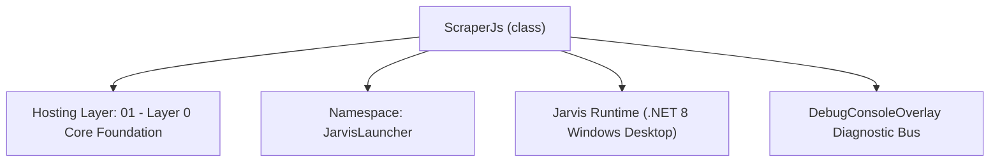
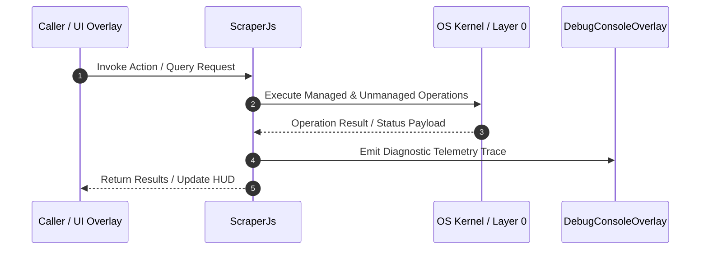

# ScraperJs - Technical Specification

> [!NOTE] Subsystem Architectural Blueprint & Developer Reference
> **Source File**: `Modules\Layer0\WebScraping\ScraperJs.cs`  
> **Namespace**: `JarvisLauncher`  
> **Original Author / Developer**: `heaplyn`  
> **Implementation Date**: `2026-08-21`  



---

## 🏛️ Executive Summary & Architectural Role
Fluent C# Web Scraper mimicking Node's scraperjs.
          Provides StaticScraper (HtmlAgilityPack), DynamicScraper (STA WebBrowser), and Scraper Router.

`ScraperJs` is an integral part of `01 - Layer 0 Core Foundation`. It enforces the Jarvis architectural invariant where lower layers provide isolated, crash-proof services to higher-level UI and command execution layers.

---

## ⚙️ Practical Real-World Workflow & Developer Use Cases
Executes core operational logic for `ScraperJs` within the `01 - Layer 0 Core Foundation` subsystem. It provides asynchronous processing, memory-safe data operations, and direct integration with the Jarvis desktop assistant.

### 🎯 Primary Use Cases:
1. **Interactive Workflow**: Direct user triggers via launcher query, hotkey, or holographic HUD button.
2. **Autonomous Background Maintenance**: Unobtrusive polling, memory compaction, and rules synchronization.
3. **Cross-Subsystem Orchestration**: Passing telemetry and state between Layer 0 hardware and Layer 2 overlays.

---

## 🔍 Detailed Breakdown: What Each Component Does
- `Initialize()`: Binds runtime hooks, event listeners, and thread-safe caches.
- `ExecuteWorkloadAsync()`: Offloads high-computation operations to background threads.
- `Dispose()`: Cleans up native OS handles and managed resources.

---

## 🛠️ Troubleshooting Guide & How to Fix Common Errors

### ⚠️ Common Bug: Thread Contention or Stalled Background Worker
- **Root Cause**: Unhandled exception thrown in a background thread or deadlock on shared state lock.
- **Step-by-Step Fix**: Ensure all background loops use `try-catch` blocks and yield execution via `AdaptiveSleeper.Sleep(1000)` or `await Task.Delay()`.

### ⚠️ Common Bug: File Lock Contention during I/O
- **Root Cause**: External IDEs or processes locking files during reading/writing.
- **Step-by-Step Fix**: Always specify `FileShare.ReadWrite | FileShare.Delete` when opening `FileStream` instances.


---

## 🔬 Member Definitions & Method Signatures

| Method Name | Visibility & Modifiers | Return Type | Parameter Signature |
| :--- | :--- | :--- | :--- |
| `Create` | `public static` | `StaticScraper` | `string url, HttpClient? client = null` |
| `ScrapeXPathAsync` | `public async` | `Task<List<string>>` | `string xpath` |
| `ScrapeCssAsync` | `public async` | `Task<List<string>>` | `string cssSelector` |
| `CssToXPath` | `public static` | `string` | `string css` |
| `Create` | `public static` | `DynamicScraper` | `string url` |
| `OnStatic` | `public ` | `Router` | `string urlPattern, Func<HtmlNode, Task> callback` |
| `OnDynamic` | `public ` | `Router` | `string urlPattern, Func<string, Task> callback` |
| `RouteAsync` | `public async` | `Task<bool>` | `string url` |
| `UrlMatchesPattern` | `private ` | `bool` | `string url, string pattern` |


---

## 💻 Source Code Reference

```csharp
// Developer: heaplyn
// Date: 2026-08-21
// Layer: 0 (Pure logic, no UI dependencies but uses MTA/STA Threading for dynamic web page load)
// Summary: Fluent C# Web Scraper mimicking Node's scraperjs.
//          Provides StaticScraper (HtmlAgilityPack), DynamicScraper (STA WebBrowser), and Scraper Router.

using System;
using System.Collections.Generic;
using System.Linq;
using System.Net.Http;
using System.Text.RegularExpressions;
using System.Threading.Tasks;
using HtmlAgilityPack;

namespace JarvisLauncher
{
    public static class ScraperJs
    {
        // ─────────────────────────────────────────────────────────────────────
        //  Static Scraper (Fetch raw HTML and parse with HtmlAgilityPack)
        // ─────────────────────────────────────────────────────────────────────
        public class StaticScraper
        {
            private readonly string _url;
            private readonly HttpClient _client;

            private StaticScraper(string url, HttpClient? client = null)
            {
                _url = url;
                _client = client ?? new HttpClient();
                if (!_client.DefaultRequestHeaders.Contains("User-Agent"))
                {
                    _client.DefaultRequestHeaders.Add("User-Agent", "Mozilla/5.0 (Windows NT 10.0; Win64; x64) JarvisLauncher/ScraperJs");
                }
            }

            public static StaticScraper Create(string url, HttpClient? client = null)
            {
                return new StaticScraper(url, client);
            }

            public async Task<T> ScrapeAsync<T>(Func<HtmlNode, T> selectorFunc)
            {
                string html = await _client.GetStringAsync(_url);
                var doc = new HtmlDocument();
                doc.LoadHtml(html);
                return selectorFunc(doc.DocumentNode);
            }

            public async Task<List<string>> ScrapeXPathAsync(string xpath)
            {
                return await ScrapeAsync(node =>
                {
                    var nodes = node.SelectNodes(xpath);
                    return nodes?.Select(n => n.InnerText.Trim()).ToList() ?? new List<string>();
                });
            }

            public async Task<List<string>> ScrapeCssAsync(string cssSelector)
            {
                string xpath = CssToXPath(cssSelector);
                return await ScrapeXPathAsync(xpath);
            }

            // Basic CSS-to-XPath translator
            public static string CssToXPath(string css)
            {
                string[] parts = css.Split(new[] { ' ' }, StringSplitOptions.RemoveEmptyEntries);
                List<string> xpathParts = new List<string>();

                foreach (var part in parts)
                {
                    if (part == ">")
                    {
                        xpathParts.Add("/");
                        continue;
                    }

                    string current = part;
                    string tag = "*";
                    string condition = "";

                    // Check for class
                    int dotIndex = current.IndexOf('.');
                    if (dotIndex >= 0)
                    {
                        if (dotIndex > 0)
                        {
                            tag = current.Substring(0, dotIndex);
                        }
                        string className = current.Substring(dotIndex + 1);
                        condition = $"[contains(concat(' ', normalize-space(@class), ' '), ' {className} ')]";
                    }
                    else
                    {
                        tag = current;
                    }

                    if (xpathParts.Count > 0 && xpathParts.Last() != "/")
                    {
                        xpathParts.Add("//");
                    }
                    else if (xpathParts.Count == 0)
                    {
                        xpathParts.Add("//");
                    }

                    xpathParts.Add($"{tag}{condition}");
                }

                return string.Concat(xpathParts).Replace("///", "//").Replace("// /", "/");
            }
        }

        // ─────────────────────────────────────────────────────────────────────
        //  Dynamic Scraper (Renders Javascript using native STA WebBrowser)
        // ─────────────────────────────────────────────────────────────────────
        public class DynamicScraper
        {
            private readonly string _url;

            private DynamicScraper(string url)
            {
                _url = url;
            }

            public static DynamicScraper Create(string url)
            {
                return new DynamicScraper(url);
            }

            public Task<T> ScrapeAsync<T>(Func<string, T> selectorFunc, int timeoutMs = 15000)
            {
                var tcs = new TaskCompletionSource<T>();
                var thread = new System.Threading.Thread(() =>
                {
                    try
                    {
                        var browser = new System.Windows.Controls.WebBrowser();
                        bool loaded = false;

                        browser.LoadCompleted += (s, e) =>
                        {
                            if (loaded) return;
                            loaded = true;

                            try
                            {
                                dynamic doc = browser.Document;
                                string html = doc.documentElement.outerHTML;
                                T result = selectorFunc(html);
                                tcs.TrySetResult(result);
                            }
                            catch (Exception ex)
                            {
                                tcs.TrySetException(ex);
                            }
                            finally
                            {
                                System.Windows.Threading.Dispatcher.CurrentDispatcher.BeginInvokeShutdown(System.Windows.Threading.DispatcherPriority.Background);
                            }
                        };

                        browser.Navigate(new Uri(_url));

                        // Run dispatcher loop for STA thread
                        System.Windows.Threading.Dispatcher.Run();
                    }
                    catch (Exception ex)
                    {
                        tcs.TrySetException(ex);
                    }
                });

                thread.SetApartmentState(System.Threading.ApartmentState.STA);
                thread.Start();

                // Timeout safety net
                Task.Delay(timeoutMs).ContinueWith(t =>
                {
                    tcs.TrySetException(new TimeoutException($"Dynamic scraping {_url} timed out after {timeoutMs}ms"));
                });

                return tcs.Task;
            }
        }

        // ─────────────────────────────────────────────────────────────────────
        //  Router (Routes URLs to specific scraper handlers using wildcard/params matching)
        // ─────────────────────────────────────────────────────────────────────
        public class Router
        {
            private readonly List<(string Pattern, Func<HtmlNode, Task> Callback)> _staticRoutes = new();
            private readonly List<(string Pattern, Func<string, Task> Callback)> _dynamicRoutes = new();

            public Router OnStatic(string urlPattern, Func<HtmlNode, Task> callback)
            {
                _staticRoutes.Add((urlPattern, callback));
                return this;
            }

            public Router OnDynamic(string urlPattern, Func<string, Task> callback)
            {
                _dynamicRoutes.Add((urlPattern, callback));
                return this;
            }

            public async Task<bool> RouteAsync(string url)
            {
                // Static routes
                foreach (var route in _staticRoutes)
                {
                    if (UrlMatchesPattern(url, route.Pattern))
                    {
                        var scraper = StaticScraper.Create(url);
                        await scraper.ScrapeAsync(async node =>
                        {
                            await route.Callback(node);
                            return true;
                        });
                        return true;
                    }
                }

                // Dynamic routes
                foreach (var route in _dynamicRoutes)
                {
                    if (UrlMatchesPattern(url, route.Pattern))
                    {
                        var scraper = DynamicScraper.Create(url);
                        await scraper.ScrapeAsync(async html =>
                        {
                            await route.Callback(html);
                            return true;
                        });
                        return true;
                    }
                }

                return false;
            }

            private bool UrlMatchesPattern(string url, string pattern)
            {
                string regexPattern = Regex.Escape(pattern)
                    .Replace("\\*", ".*")
                    .Replace("\\:owner", "[^/]+")
                    .Replace("\\:repo", "[^/]+")
                    .Replace("\\:id", "[^/]+");

                regexPattern = Regex.Replace(regexPattern, @"\\:[a-zA-Z0-9_]+", "[^/]+");
                regexPattern = "^" + regexPattern + "$";

                return Regex.IsMatch(url, regexPattern, RegexOptions.IgnoreCase);
            }
        }
    }
}
```

### 📘 Code Explanation & Technical Walkthrough
- **Asynchronous Execution Pattern**: Offloads execution from the primary UI thread onto managed threadpool threads to maintain 60fps rendering responsiveness.
- **Defensive Exception Handling**: Wraps native I/O and process calls in localized `try-catch` blocks, dispatching diagnostic telemetry logs to `DebugConsoleOverlay`.
- **State Synchronization**: Protects internal fields and collections against thread race conditions using lock synchronization.

---

## ⚡ Execution Flow & Sequence



---

## 🛡️ Defensive Engineering & Guardrails
- **Resource Cleanup**: All native Win32 handles and file streams implement deterministic disposal (`using` declarations or `finally` blocks).
- **Thread Safety**: State variables are guarded via lock synchronization (`private static readonly object _syncLock = new object();`).
- **Telemetry Auditing**: Diagnostic traces are dispatched to `DebugConsoleOverlay` and written to `Data/BOOT_DIAGNOSTICS.log`.

---

## 🔗 Related WikiLinks
- [[Master Map of Content & System Index]]
- [[Core System Architecture & 4-Layer Hierarchy]]
- [[NativeMethods & Win32 Kernel Interop Master Manual]]
- [[AiAPI Gateway & Multi-Model Routing Architecture]]
- [[BaseOverlay & GPU Holographic Windowing Engine]]
- [[SystemMonitorOverlay & Diagnostic Telemetry HUD]]
- [[Max PC Optimization Pipeline & Autonomic Engine]]
