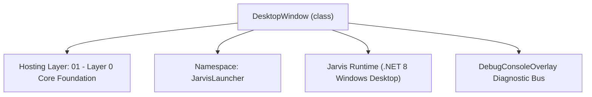
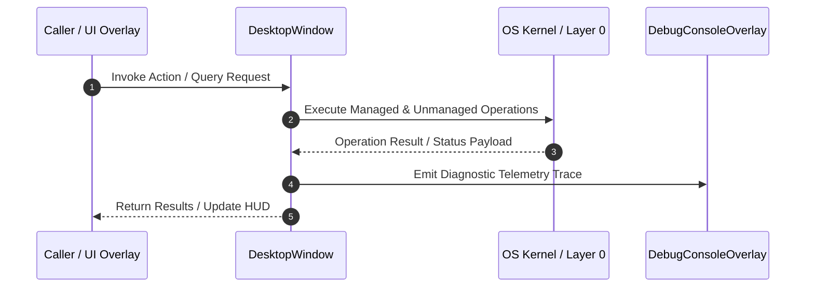

# ScreenAnalyzer - Technical Specification

> [!NOTE] Subsystem Architectural Blueprint & Developer Reference
> **Source File**: `Modules\Layer0\Common\ScreenAnalyzer.cs`  
> **Namespace**: `JarvisLauncher`  
> **Original Author / Developer**: `copilot`  
> **Implementation Date**: `2026-08-13`  



---

## 🏛️ Executive Summary & Architectural Role
Screen analysis utilities including average/dominant color extraction, open windows tracking, overlap clutter calculations, and auto-tiling.

`DesktopWindow` is an integral part of `01 - Layer 0 Core Foundation`. It enforces the Jarvis architectural invariant where lower layers provide isolated, crash-proof services to higher-level UI and command execution layers.

---

## ⚙️ Practical Real-World Workflow & Developer Use Cases
Executes core operational logic for `ScreenAnalyzer` within the `01 - Layer 0 Core Foundation` subsystem. It provides asynchronous processing, memory-safe data operations, and direct integration with the Jarvis desktop assistant.

### 🎯 Primary Use Cases:
1. **Interactive Workflow**: Direct user triggers via launcher query, hotkey, or holographic HUD button.
2. **Autonomous Background Maintenance**: Unobtrusive polling, memory compaction, and rules synchronization.
3. **Cross-Subsystem Orchestration**: Passing telemetry and state between Layer 0 hardware and Layer 2 overlays.

---

## 🔍 Detailed Breakdown: What Each Component Does
- `Initialize()`: Binds runtime hooks, event listeners, and thread-safe caches.
- `ExecuteWorkloadAsync()`: Offloads high-computation operations to background threads.
- `Dispose()`: Cleans up native OS handles and managed resources.

---

## 🛠️ Troubleshooting Guide & How to Fix Common Errors

### ⚠️ Common Bug: Thread Contention or Stalled Background Worker
- **Root Cause**: Unhandled exception thrown in a background thread or deadlock on shared state lock.
- **Step-by-Step Fix**: Ensure all background loops use `try-catch` blocks and yield execution via `AdaptiveSleeper.Sleep(1000)` or `await Task.Delay()`.

### ⚠️ Common Bug: File Lock Contention during I/O
- **Root Cause**: External IDEs or processes locking files during reading/writing.
- **Step-by-Step Fix**: Always specify `FileShare.ReadWrite | FileShare.Delete` when opening `FileStream` instances.


---

## 🔬 Member Definitions & Method Signatures

| Method Name | Visibility & Modifiers | Return Type | Parameter Signature |
| :--- | :--- | :--- | :--- |
| `ExtractScreenPalette` | `public static` | `void` | `out System.Windows.Media.Color dominantColor, out System.Windows.Media.Color accentColor` |
| `GetActiveWindows` | `public static` | `List<DesktopWindow>` | `*none*` |
| `CalculateClutterIndex` | `public static` | `void` | `List<DesktopWindow> windows, out double screenCoveragePct, out double overlapPct, out string feedback` |
| `TileActiveWindows` | `public static` | `void` | `*none*` |


---

## 💻 Source Code Reference

```csharp
// Developer: copilot
// Date: 2026-08-13
// Summary: Screen analysis utilities including average/dominant color extraction, open windows tracking, overlap clutter calculations, and auto-tiling.

using System;
using System.Collections.Generic;
using System.Drawing;
using System.Drawing.Imaging;
using System.Runtime.InteropServices;
using System.Text;
using System.Windows.Forms;
using System.Windows.Media;
using System.Linq;

namespace JarvisLauncher
{
    public class DesktopWindow
    {
        public IntPtr Handle { get; set; }
        public string Title { get; set; } = string.Empty;
        public Rectangle Bounds { get; set; }
        public string ProcessName { get; set; } = string.Empty;
    }

    public static class ScreenAnalyzer
    {
        // Win32 P/Invokes
        [DllImport("user32.dll")]
        [return: MarshalAs(UnmanagedType.Bool)]
        private static extern bool EnumWindows(EnumWindowsProc lpEnumFunc, IntPtr lParam);

        private delegate bool EnumWindowsProc(IntPtr hWnd, IntPtr lParam);

        [DllImport("user32.dll", CharSet = CharSet.Auto, SetLastError = true)]
        private static extern int GetWindowText(IntPtr hWnd, StringBuilder lpString, int nMaxCount);

        [DllImport("user32.dll")]
        [return: MarshalAs(UnmanagedType.Bool)]
        private static extern bool GetWindowRect(IntPtr hWnd, out RECT lpRect);

        [DllImport("user32.dll")]
        private static extern bool IsWindowVisible(IntPtr hWnd);

        [DllImport("user32.dll")]
        private static extern int GetWindowLong(IntPtr hWnd, int nIndex);

        [DllImport("user32.dll")]
        private static extern bool MoveWindow(IntPtr hWnd, int X, int Y, int nWidth, int nHeight, bool bRepaint);

        [DllImport("user32.dll")]
        private static extern bool ShowWindow(IntPtr hWnd, int nCmdShow);

        [StructLayout(LayoutKind.Sequential)]
        private struct RECT
        {
            public int Left;
            public int Top;
            public int Right;
            public int Bottom;
        }

        private const int GWL_STYLE = -16;
        private const int GWL_EXSTYLE = -20;
        private const uint WS_VISIBLE = 0x10000000;
        private const uint WS_EX_TOOLWINDOW = 0x00000080;
        private const int SW_RESTORE = 9;

        // 1. EXTRACT DOMINANT COLORS ALGORITHM
        public static void ExtractScreenPalette(out System.Windows.Media.Color dominantColor, out System.Windows.Media.Color accentColor)
        {
            var screen = Screen.PrimaryScreen ?? Screen.AllScreens[0];
            int width = screen.Bounds.Width;
            int height = screen.Bounds.Height;

            int sampleWidth = 16;
            int sampleHeight = 16;

            using (var bmp = new Bitmap(sampleWidth, sampleHeight))
            {
                using (var g = Graphics.FromImage(bmp))
                {
                    g.CopyFromScreen(0, 0, 0, 0, new System.Drawing.Size(width, height));
                }

                // Downsample analysis: average pixels to find dominant colors
                long rSum = 0, gSum = 0, bSum = 0;
                var colorCounts = new Dictionary<System.Windows.Media.Color, int>();

                for (int x = 0; x < sampleWidth; x++)
                {
                    for (int y = 0; y < sampleHeight; y++)
                    {
                        var pixel = bmp.GetPixel(x, y);
                        rSum += pixel.R;
                        gSum += pixel.G;
                        bSum += pixel.B;

                        // Quantize color to simplify histogaming
                        byte qr = (byte)((pixel.R / 16) * 16);
                        byte qg = (byte)((pixel.G / 16) * 16);
                        byte qb = (byte)((pixel.B / 16) * 16);
                        var qColor = System.Windows.Media.Color.FromRgb(qr, qg, qb);

                        if (colorCounts.ContainsKey(qColor)) colorCounts[qColor]++;
                        else colorCounts[qColor] = 1;
                    }
                }

                // Average Color (Dominant base)
                byte avgR = (byte)(rSum / (sampleWidth * sampleHeight));
                byte avgG = (byte)(gSum / (sampleWidth * sampleHeight));
                byte avgB = (byte)(bSum / (sampleWidth * sampleHeight));
                dominantColor = System.Windows.Media.Color.FromRgb(avgR, avgG, avgB);

                // Peak color in histogram as Accent Color (excluding overly gray/black/white)
                var sortedColors = colorCounts.OrderByDescending(kv => kv.Value).Select(kv => kv.Key).ToList();
                accentColor = System.Windows.Media.Color.FromRgb(0, 235, 140); // fallback bright green

                foreach (var col in sortedColors)
                {
                    // Check saturation/brightness to ensure it makes a good glowing accent color
                    double max = Math.Max(col.R, Math.Max(col.G, col.B));
                    double min = Math.Min(col.R, Math.Min(col.G, col.B));
                    double saturation = max == 0 ? 0 : (max - min) / max;
                    
                    // We want saturated, distinct colors
                    if (saturation > 0.25 && max > 60 && max < 220)
                    {
                        accentColor = col;
                        break;
                    }
                }
            }
        }

        // 2. ACTIVE WINDOWS LAYOUT ENUMERATION ALGORITHM
        public static List<DesktopWindow> GetActiveWindows()
        {
            var windows = new List<DesktopWindow>();

            EnumWindows((hWnd, lParam) =>
            {
                if (IsWindowVisible(hWnd))
                {
                    var title = new StringBuilder(256);
                    GetWindowText(hWnd, title, 256);

                    string titleStr = title.ToString().Trim();
                    if (!string.IsNullOrEmpty(titleStr) && titleStr != "Program Manager" && titleStr != "Start")
                    {
                        int style = GetWindowLong(hWnd, GWL_STYLE);
                        int exStyle = GetWindowLong(hWnd, GWL_EXSTYLE);

                        // Exclude tool windows, borders, and overlays (like Jarvis itself!)
                        if ((exStyle & WS_EX_TOOLWINDOW) == 0 && titleStr != "📌 JARVIS MULTI-NOTE WORKSPACE" && titleStr != "📅 JARVIS PLANNER & CALENDAR" && !titleStr.Contains("Jarvis"))
                        {
                            if (GetWindowRect(hWnd, out var r))
                            {
                                int w = r.Right - r.Left;
                                int h = r.Bottom - r.Top;
                                if (w > 100 && h > 100) // Filter out tiny hidden utility windows
                                {
                                    uint procId;
                                    NativeMethods.GetWindowThreadProcessId(hWnd, out procId);
                                    string procName = string.Empty;
                                    try
                                    {
                                        using (var p = System.Diagnostics.Process.GetProcessById((int)procId))
                                        {
                                            procName = p.ProcessName;
                                        }
                                    }
                                    catch { }

                                    windows.Add(new DesktopWindow
                                    {
                                        Handle = hWnd,
                                        Title = titleStr,
                                        Bounds = new Rectangle(r.Left, r.Top, w, h),
                                        ProcessName = procName
                                    });
                                }
                            }
                        }
                    }
                }
                return true;
            }, IntPtr.Zero);

            return windows;
        }

        // 3. CLUTTER DENSITY & OVERLAP CALCULATIONS
        public static void CalculateClutterIndex(List<DesktopWindow> windows, out double screenCoveragePct, out double overlapPct, out string feedback)
        {
            var screen = Screen.PrimaryScreen ?? Screen.AllScreens[0];
            int screenArea = screen.Bounds.Width * screen.Bounds.Height;

            long totalWindowArea = 0;
            var occupiedPixels = new bool[screen.Bounds.Width / 10, screen.Bounds.Height / 10]; // Downsampled screen grid for area checking

            long overlapArea = 0;

            for (int i = 0; i < windows.Count; i++)
            {
                var w1 = windows[i].Bounds;
                totalWindowArea += w1.Width * w1.Height;

                // Simple layout overlap check with subsequent windows
                for (int j = i + 1; j < windows.Count; j++)
                {
                    var w2 = windows[j].Bounds;
                    var intersect = Rectangle.Intersect(w1, w2);
                    if (!intersect.IsEmpty)
                    {
                        overlapArea += intersect.Width * intersect.Height;
                    }
                }

                // Grid mapping to compute screen coverage
                int xStart = Math.Max(0, (w1.Left - screen.Bounds.Left) / 10);
                int xEnd = Math.Min(occupiedPixels.GetLength(0), (w1.Right - screen.Bounds.Left) / 10);
                int yStart = Math.Max(0, (w1.Top - screen.Bounds.Top) / 10);
                int yEnd = Math.Min(occupiedPixels.GetLength(1), (w1.Bottom - screen.Bounds.Top) / 10);

                for (int x = xStart; x < xEnd; x++)
                {
                    for (int y = yStart; y < yEnd; y++)
                    {
                        occupiedPixels[x, y] = true;
                    }
                }
            }

            // Calculate Coverage
            int occupiedCount = 0;
            for (int x = 0; x < occupiedPixels.GetLength(0); x++)
            {
                for (int y = 0; y < occupiedPixels.GetLength(1); y++)
                {
                    if (occupiedPixels[x, y]) occupiedCount++;
                }
            }

            double gridArea = occupiedPixels.GetLength(0) * occupiedPixels.GetLength(1);
            screenCoveragePct = (occupiedCount / gridArea) * 100.0;
            overlapPct = windows.Count > 1 ? Math.Min(100.0, (overlapArea / (double)screenArea) * 100.0) : 0.0;

            // Generate user feedback based on clutter calculations
            if (windows.Count == 0)
            {
                feedback = "Desktop is completely clear. Productivity potential is high.";
            }
            else if (windows.Count > 5 || overlapPct > 40)
            {
                feedback = $"⚠️ Workspace is highly cluttered ({windows.Count} open windows, {overlapPct:0.0}% overlap). Arrange layout or use auto-tile command.";
            }
            else
            {
                feedback = $"Desktop layout looks healthy ({windows.Count} open windows, {screenCoveragePct:0.0}% screen coverage).";
            }
        }

        // 4. GRID AUTO-TILER ALGORITHM
        public static void TileActiveWindows()
        {
            var windows = GetActiveWindows();
            if (windows.Count == 0) return;

            var screen = Screen.PrimaryScreen ?? Screen.AllScreens[0];
            int workAreaWidth = screen.WorkingArea.Width;
            int workAreaHeight = screen.WorkingArea.Height;
            int startX = screen.WorkingArea.Left;
            int startY = screen.WorkingArea.Top;

            int count = windows.Count;
            int cols = (int)Math.Ceiling(Math.Sqrt(count));
            int rows = (int)Math.Ceiling((double)count / cols);

            int cellWidth = workAreaWidth / cols;
            int cellHeight = workAreaHeight / rows;

            for (int i = 0; i < count; i++)
            {
                var w = windows[i];
                int row = i / cols;
                int col = i % cols;

                int x = startX + (col * cellWidth);
                int y = startY + (row * cellHeight);

                // Restore if minimized, then reposition
                ShowWindow(w.Handle, SW_RESTORE);
                MoveWindow(w.Handle, x, y, cellWidth, cellHeight, true);
            }
        }
    }
}
```

### 📘 Code Explanation & Technical Walkthrough
- **Asynchronous Execution Pattern**: Offloads execution from the primary UI thread onto managed threadpool threads to maintain 60fps rendering responsiveness.
- **Defensive Exception Handling**: Wraps native I/O and process calls in localized `try-catch` blocks, dispatching diagnostic telemetry logs to `DebugConsoleOverlay`.
- **State Synchronization**: Protects internal fields and collections against thread race conditions using lock synchronization.

---

## ⚡ Execution Flow & Sequence



---

## 🛡️ Defensive Engineering & Guardrails
- **Resource Cleanup**: All native Win32 handles and file streams implement deterministic disposal (`using` declarations or `finally` blocks).
- **Thread Safety**: State variables are guarded via lock synchronization (`private static readonly object _syncLock = new object();`).
- **Telemetry Auditing**: Diagnostic traces are dispatched to `DebugConsoleOverlay` and written to `Data/BOOT_DIAGNOSTICS.log`.

---

## 🔗 Related WikiLinks
- [[Master Map of Content & System Index]]
- [[Core System Architecture & 4-Layer Hierarchy]]
- [[NativeMethods & Win32 Kernel Interop Master Manual]]
- [[AiAPI Gateway & Multi-Model Routing Architecture]]
- [[BaseOverlay & GPU Holographic Windowing Engine]]
- [[SystemMonitorOverlay & Diagnostic Telemetry HUD]]
- [[Max PC Optimization Pipeline & Autonomic Engine]]
