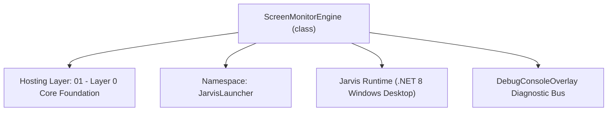
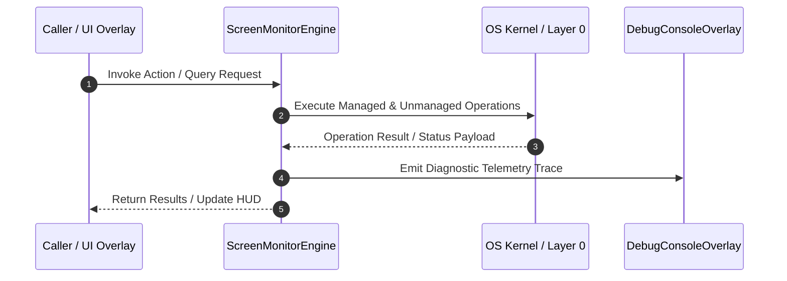

# ScreenMonitorEngine - Technical Specification

> [!NOTE] Subsystem Architectural Blueprint & Developer Reference
> **Source File**: `Modules\Layer0\Common\ScreenMonitorEngine.cs`  
> **Namespace**: `JarvisLauncher`  
> **Original Author / Developer**: `heaplyn`  
> **Implementation Date**: `2026-08-13`  



---

## 🏛️ Executive Summary & Architectural Role
Continuous Real-Time Screen Monitoring & Context Engine.
 Captures background screen snapshots, monitors active window changes, and provides AI Vision context.

`ScreenMonitorEngine` is an integral part of `01 - Layer 0 Core Foundation`. It enforces the Jarvis architectural invariant where lower layers provide isolated, crash-proof services to higher-level UI and command execution layers.

---

## ⚙️ Practical Real-World Workflow & Developer Use Cases
Executes core operational logic for `ScreenMonitorEngine` within the `01 - Layer 0 Core Foundation` subsystem. It provides asynchronous processing, memory-safe data operations, and direct integration with the Jarvis desktop assistant.

### 🎯 Primary Use Cases:
1. **Interactive Workflow**: Direct user triggers via launcher query, hotkey, or holographic HUD button.
2. **Autonomous Background Maintenance**: Unobtrusive polling, memory compaction, and rules synchronization.
3. **Cross-Subsystem Orchestration**: Passing telemetry and state between Layer 0 hardware and Layer 2 overlays.

---

## 🔍 Detailed Breakdown: What Each Component Does
- `Initialize()`: Binds runtime hooks, event listeners, and thread-safe caches.
- `ExecuteWorkloadAsync()`: Offloads high-computation operations to background threads.
- `Dispose()`: Cleans up native OS handles and managed resources.

---

## 🛠️ Troubleshooting Guide & How to Fix Common Errors

### ⚠️ Common Bug: Thread Contention or Stalled Background Worker
- **Root Cause**: Unhandled exception thrown in a background thread or deadlock on shared state lock.
- **Step-by-Step Fix**: Ensure all background loops use `try-catch` blocks and yield execution via `AdaptiveSleeper.Sleep(1000)` or `await Task.Delay()`.

### ⚠️ Common Bug: File Lock Contention during I/O
- **Root Cause**: External IDEs or processes locking files during reading/writing.
- **Step-by-Step Fix**: Always specify `FileShare.ReadWrite | FileShare.Delete` when opening `FileStream` instances.


---

## 🔬 Member Definitions & Method Signatures

| Method Name | Visibility & Modifiers | Return Type | Parameter Signature |
| :--- | :--- | :--- | :--- |
| `Start` | `public static` | `void` | `int intervalSec = 5` |
| `Stop` | `public static` | `void` | `*none*` |
| `Toggle` | `public static` | `void` | `*none*` |
| `OnMonitorTick` | `private static` | `void` | `object? state` |
| `CapturePrimaryScreen` | `public static` | `string` | `*none*` |
| `UpdateActiveWindowInfo` | `public static` | `void` | `*none*` |


---

## 💻 Source Code Reference

```csharp
// Developer: heaplyn
// Date: 2026-08-13
// Summary: Continuous Real-Time Screen Monitoring & Context Engine.
// Captures background screen snapshots, monitors active window changes, and provides AI Vision context.

using System;
using System.Diagnostics;
using System.Drawing;
using System.Drawing.Imaging;
using System.IO;
using System.Runtime.InteropServices;
using System.Text;
using System.Threading;
using System.Threading.Tasks;
using System.Windows;

namespace JarvisLauncher
{
    public static class ScreenMonitorEngine
    {
        [DllImport("user32.dll")]
        private static extern IntPtr GetForegroundWindow();

        [DllImport("user32.dll")]
        private static extern int GetWindowText(IntPtr hWnd, StringBuilder text, int count);

        [DllImport("user32.dll")]
        private static extern uint GetWindowThreadProcessId(IntPtr hWnd, out uint lpdwProcessId);

        private static readonly string ScreenshotDir = Path.Combine(AppDomain.CurrentDomain.BaseDirectory, "Data", "Screenshots");
        private static readonly string LatestScreenshotPath = Path.Combine(ScreenshotDir, "LatestScreen.png");
        private static System.Threading.Timer? _monitorTimer;
        private static readonly object _lock = new();

        public static bool IsMonitoring { get; private set; } = false;
        public static int IntervalSeconds { get; set; } = 5;
        public static string ActiveWindowTitle { get; private set; } = string.Empty;
        public static string ActiveProcessName { get; private set; } = string.Empty;
        public static DateTime LastCaptureTime { get; private set; } = DateTime.MinValue;
        public static string LastAiSummary { get; private set; } = string.Empty;

        public static event Action<string, string>? OnScreenCaptured;

        static ScreenMonitorEngine()
        {
            Directory.CreateDirectory(ScreenshotDir);
        }

        public static void Start(int intervalSec = 5)
        {
            lock (_lock)
            {
                IntervalSeconds = Math.Max(1, intervalSec);
                IsMonitoring = true;
                _monitorTimer?.Dispose();
                _monitorTimer = new System.Threading.Timer(OnMonitorTick, null, 0, IntervalSeconds * 1000);
                DebugConsoleOverlay.Log("Screen Monitor", $"Continuous Screen Monitoring STARTED ({IntervalSeconds}s interval)");
            }
        }

        public static void Stop()
        {
            lock (_lock)
            {
                IsMonitoring = false;
                _monitorTimer?.Change(Timeout.Infinite, Timeout.Infinite);
                _monitorTimer?.Dispose();
                _monitorTimer = null;
                DebugConsoleOverlay.Log("Screen Monitor", "Continuous Screen Monitoring STOPPED");
            }
        }

        public static void Toggle()
        {
            if (IsMonitoring) Stop();
            else Start(IntervalSeconds);
        }

        private static int _aiAnalysisCounter = 0;
        private static void OnMonitorTick(object? state)
        {
            try
            {
                string capturePath = CapturePrimaryScreen();
                UpdateActiveWindowInfo();

                if (!string.IsNullOrEmpty(capturePath))
                {
                    OnScreenCaptured?.Invoke(capturePath, ActiveWindowTitle);
                }

                // Periodically perform deep AI analysis (every 3 mins)
                _aiAnalysisCounter++;
                if (_aiAnalysisCounter >= 36) // 36 * 5s = 180s = 3m
                {
                    _aiAnalysisCounter = 0;
                    Task.Run(async () => {
                        string summary = await AnalyzeScreenWithAiAsync();
                        ChronoLogManager.LogEvent("Vision", $"Screen Analysis: {summary}");
                    });
                }
            }
            catch (Exception ex)
            {
                System.Diagnostics.Debug.WriteLine($"Screen Monitor Tick Error: {ex.Message}");
            }
        }

        public static string CapturePrimaryScreen()
        {
            lock (_lock)
            {
                try
                {
                    Directory.CreateDirectory(ScreenshotDir);

                    // Use VirtualScreen to capture ALL monitors if present, or at least full resolution
                    var virtualScreen = System.Windows.Forms.SystemInformation.VirtualScreen;
                    int screenWidth = virtualScreen.Width;
                    int screenHeight = virtualScreen.Height;
                    int left = virtualScreen.Left;
                    int top = virtualScreen.Top;

                    using var bmp = new Bitmap(screenWidth, screenHeight, PixelFormat.Format32bppArgb);
                    using (var g = Graphics.FromImage(bmp))
                    {
                        g.CopyFromScreen(left, top, 0, 0, bmp.Size, CopyPixelOperation.SourceCopy);
                    }

                    bmp.Save(LatestScreenshotPath, ImageFormat.Png);
                    LastCaptureTime = DateTime.Now;
                    return LatestScreenshotPath;
                }
                catch (Exception ex)
                {
                    DebugConsoleOverlay.Log("Screen Capture Error", ex.Message);
                    return string.Empty;
                }
            }
        }

        public static void UpdateActiveWindowInfo()
        {
            try
            {
                IntPtr hwnd = GetForegroundWindow();
                if (hwnd != IntPtr.Zero)
                {
                    var sb = new StringBuilder(256);
                    if (GetWindowText(hwnd, sb, 256) > 0)
                    {
                        ActiveWindowTitle = sb.ToString();
                    }

                    GetWindowThreadProcessId(hwnd, out uint pid);
                    if (pid > 0)
                    {
                        var proc = Process.GetProcessById((int)pid);
                        ActiveProcessName = proc.ProcessName;
                    }
                }
            }
            catch { }
        }

        public static async Task<string> AnalyzeScreenWithAiAsync(string customPrompt = "")
        {
            string screenPath = CapturePrimaryScreen();
            if (string.IsNullOrEmpty(screenPath) || !File.Exists(screenPath))
            {
                return "⚠️ Failed to capture screen snapshot.";
            }

            UpdateActiveWindowInfo();

            string prompt = string.IsNullOrWhiteSpace(customPrompt)
                ? $"Analyze this computer screen. The active window is '{ActiveWindowTitle}' ({ActiveProcessName}). Describe what key applications, text, code, or visual components are open and highlight any notable status or actions."
                : $"Screen Analysis Request: \"{customPrompt}\". Active Window: '{ActiveWindowTitle}' ({ActiveProcessName}).";

            DebugConsoleOverlay.Log("AI Vision Analysis", $"Analyzing screen image ({new FileInfo(screenPath).Length / 1024} KB)...");

            try
            {
                byte[] imageBytes = File.ReadAllBytes(screenPath);
                string base64 = Convert.ToBase64String(imageBytes);

                // Query Gemini 1.5 Flash Vision Model with image base64
                string aiResponse = await AiAPI.AnalyzeImageBase64Async(prompt, base64, "image/png");
                LastAiSummary = aiResponse;
                return aiResponse;
            }
            catch (Exception ex)
            {
                return $"⚠️ AI Screen Vision Error: {ex.Message}";
            }
        }
    }
}
```

### 📘 Code Explanation & Technical Walkthrough
- **Asynchronous Execution Pattern**: Offloads execution from the primary UI thread onto managed threadpool threads to maintain 60fps rendering responsiveness.
- **Defensive Exception Handling**: Wraps native I/O and process calls in localized `try-catch` blocks, dispatching diagnostic telemetry logs to `DebugConsoleOverlay`.
- **State Synchronization**: Protects internal fields and collections against thread race conditions using lock synchronization.

---

## ⚡ Execution Flow & Sequence



---

## 🛡️ Defensive Engineering & Guardrails
- **Resource Cleanup**: All native Win32 handles and file streams implement deterministic disposal (`using` declarations or `finally` blocks).
- **Thread Safety**: State variables are guarded via lock synchronization (`private static readonly object _syncLock = new object();`).
- **Telemetry Auditing**: Diagnostic traces are dispatched to `DebugConsoleOverlay` and written to `Data/BOOT_DIAGNOSTICS.log`.

---

## 🔗 Related WikiLinks
- [[Master Map of Content & System Index]]
- [[Core System Architecture & 4-Layer Hierarchy]]
- [[NativeMethods & Win32 Kernel Interop Master Manual]]
- [[AiAPI Gateway & Multi-Model Routing Architecture]]
- [[BaseOverlay & GPU Holographic Windowing Engine]]
- [[SystemMonitorOverlay & Diagnostic Telemetry HUD]]
- [[Max PC Optimization Pipeline & Autonomic Engine]]
