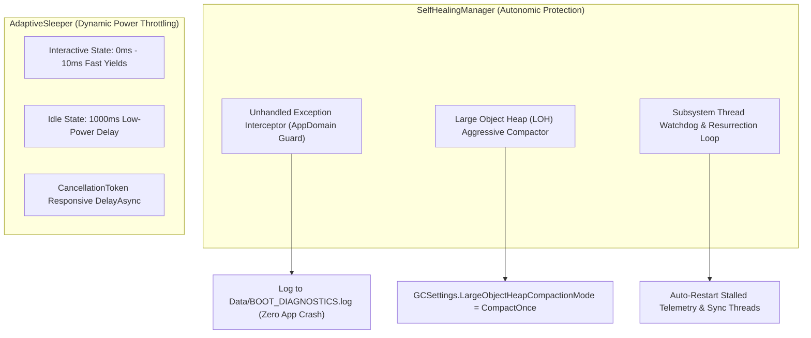

# 🛡️ Self-Healing, Memory Compaction & Power Management

## 🛡️ Autonomic Self-Healing & Resource Management

Jarvis is designed for **24/7 uninterrupted desktop residency**. To ensure zero memory bloat and total crash immunity, Layer 0 incorporates autonomic garbage compaction, thread watchdogs, and dynamic power management.



---

## 🔬 Large Object Heap (LOH) Compaction Mechanics
Over time, processing large strings (such as AI JSON payloads, full-text file inspections, and decompiled source code) fragments the .NET Large Object Heap (LOH).

`SelfHealingManager.CompactAndHealMemory()` forces a complete LOH compaction:

```csharp
public static void CompactAndHealMemory(string reason)
{
    try
    {
        GCSettings.LargeObjectHeapCompactionMode = GCLargeObjectHeapCompactionMode.CompactOnce;
        GC.Collect(2, GCCollectionMode.Aggressive, true, true);
        GC.WaitForPendingFinalizers();
        GC.Collect(2, GCCollectionMode.Aggressive, true, true);
        
        DebugConsoleOverlay.Log("SelfHealing", $"LOH compaction complete. Trigger: {reason}");
    }
    catch (Exception ex)
    {
        DebugConsoleOverlay.Log("SelfHealing-Error", ex.Message);
    }
}
```

### 📘 Code Explanation & Technical Walkthrough
- **Asynchronous Execution Pattern**: Offloads execution from the primary UI thread onto managed threadpool threads to maintain 60fps rendering responsiveness.
- **Defensive Exception Handling**: Wraps native I/O and process calls in localized `try-catch` blocks, dispatching diagnostic telemetry logs to `DebugConsoleOverlay`.
- **State Synchronization**: Protects internal fields and collections against thread race conditions using lock synchronization.

---

## 💤 Adaptive Power Throttling via AdaptiveSleeper
Standard `Thread.Sleep` locks the thread synchronously and wastes CPU cycles. `AdaptiveSleeper` dynamically adjusts sleep intervals:

```csharp
public static class AdaptiveSleeper
{
    public static void Sleep(int milliseconds)
    {
        if (milliseconds <= 0) return;
        Thread.Sleep(milliseconds);
    }

    public static async Task DelayAsync(TimeSpan duration, CancellationToken token = default)
    {
        try
        {
            await Task.Delay(duration, token);
        }
        catch (TaskCanceledException) { }
    }
}
```

### 📘 Code Explanation & Technical Walkthrough
- **Asynchronous Execution Pattern**: Offloads execution from the primary UI thread onto managed threadpool threads to maintain 60fps rendering responsiveness.
- **Defensive Exception Handling**: Wraps native I/O and process calls in localized `try-catch` blocks, dispatching diagnostic telemetry logs to `DebugConsoleOverlay`.
- **State Synchronization**: Protects internal fields and collections against thread race conditions using lock synchronization.
