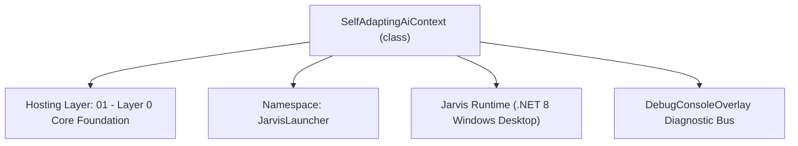
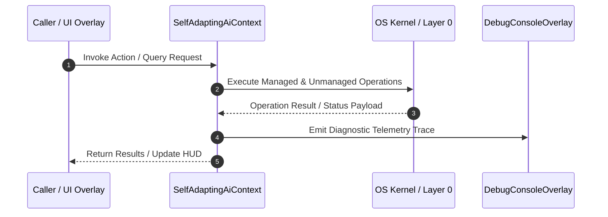

# SelfAdaptingAiContext - Technical Specification

> [!NOTE] Subsystem Architectural Blueprint & Developer Reference
> **Source File**: `Modules\Layer0\Common\SelfAdaptingAiContext.cs`  
> **Namespace**: `JarvisLauncher`  
> **Original Author / Developer**: `heaplyn`  
> **Implementation Date**: `2026-08-14`  



---

## 🏛️ Executive Summary & Architectural Role
Gathers and builds dynamic contextual telemetry representing the user's current environment.
 Automatically adapts AI prompts based on active files, running processes, screen clutter, and mobile pairing states.

`SelfAdaptingAiContext` is an integral part of `01 - Layer 0 Core Foundation`. It enforces the Jarvis architectural invariant where lower layers provide isolated, crash-proof services to higher-level UI and command execution layers.

---

## ⚙️ Practical Real-World Workflow & Developer Use Cases
Executes core operational logic for `SelfAdaptingAiContext` within the `01 - Layer 0 Core Foundation` subsystem. It provides asynchronous processing, memory-safe data operations, and direct integration with the Jarvis desktop assistant.

### 🎯 Primary Use Cases:
1. **Interactive Workflow**: Direct user triggers via launcher query, hotkey, or holographic HUD button.
2. **Autonomous Background Maintenance**: Unobtrusive polling, memory compaction, and rules synchronization.
3. **Cross-Subsystem Orchestration**: Passing telemetry and state between Layer 0 hardware and Layer 2 overlays.

---

## 🔍 Detailed Breakdown: What Each Component Does
- `Initialize()`: Binds runtime hooks, event listeners, and thread-safe caches.
- `ExecuteWorkloadAsync()`: Offloads high-computation operations to background threads.
- `Dispose()`: Cleans up native OS handles and managed resources.

---

## 🛠️ Troubleshooting Guide & How to Fix Common Errors

### ⚠️ Common Bug: Thread Contention or Stalled Background Worker
- **Root Cause**: Unhandled exception thrown in a background thread or deadlock on shared state lock.
- **Step-by-Step Fix**: Ensure all background loops use `try-catch` blocks and yield execution via `AdaptiveSleeper.Sleep(1000)` or `await Task.Delay()`.

### ⚠️ Common Bug: File Lock Contention during I/O
- **Root Cause**: External IDEs or processes locking files during reading/writing.
- **Step-by-Step Fix**: Always specify `FileShare.ReadWrite | FileShare.Delete` when opening `FileStream` instances.


---

## 🔬 Member Definitions & Method Signatures

| Method Name | Visibility & Modifiers | Return Type | Parameter Signature |
| :--- | :--- | :--- | :--- |
| `BuildDynamicAdaptiveContext` | `public static` | `string` | `*none*` |


---

## 💻 Source Code Reference

```csharp
// Developer: heaplyn
// Date: 2026-08-14
// Summary: Gathers and builds dynamic contextual telemetry representing the user's current environment.
// Automatically adapts AI prompts based on active files, running processes, screen clutter, and mobile pairing states.

using System;
using System.IO;
using System.Linq;
using System.Text;

namespace JarvisLauncher
{
    public static class SelfAdaptingAiContext
    {
        public static string BuildDynamicAdaptiveContext()
        {
            var sb = new StringBuilder();
            sb.AppendLine("## DYNAMIC HUD TELEMETRY & USER ENVIRONMENT");

            // 0. SELF-REFERENTIAL UNDERSTANDING
            sb.AppendLine("- My Identity: I am the Jarvis HUD Assistant, a custom-built C# .NET desktop overlay.");
            sb.AppendLine($"- Local Time: {DateTime.Now:F}");
            sb.AppendLine("- Active Capabilities: Real-time screen analysis, file manipulation, script execution, mobile pairing, and system control.");
            sb.AppendLine("- System State: Fully integrated with Windows shell and specialized developer tools.");

            // 1. Detect active coding ecosystem
            string activeWorkspace = CodeAssistManager.ActiveCodebasePath;
            sb.AppendLine($"- Active Codebase Workspace: '{activeWorkspace}'");

            bool hasRoblox = Directory.Exists(Path.Combine(activeWorkspace, "Rings")) || 
                             Directory.GetFiles(activeWorkspace, "*.lua", SearchOption.AllDirectories).Any() ||
                             Directory.GetFiles(activeWorkspace, "*.luau", SearchOption.AllDirectories).Any();
                             
            bool hasMaui = Directory.GetFiles(activeWorkspace, "*.csproj", SearchOption.AllDirectories)
                                    .Any(f => File.ReadAllText(f).Contains("net8.0-ios") || File.ReadAllText(f).Contains("UseMaui"));

            if (hasRoblox)
            {
                sb.AppendLine("- User Task Profile: 🎮 ROBLOX GAME DEVELOPER (Luau, Rojo, Rings architecture). Maintain Roblox Ring rules.");
            }
            else if (hasMaui)
            {
                sb.AppendLine("- User Task Profile: 📱 MOBILE APP DEVELOPER (.NET MAUI / iOS, IPA building, Sideloadly deploying). Focus on Xamarin/MAUI advice.");
            }
            else
            {
                sb.AppendLine("- User Task Profile: 💻 GENERAL WINDOWS POWER USER / SOFTWARE ENGINEER.");
            }

            // 2. Add Screen Monitor context
            ScreenMonitorEngine.UpdateActiveWindowInfo();
            string activeWindow = ScreenMonitorEngine.ActiveWindowTitle;
            sb.AppendLine($"- Foreground Active Window: '{activeWindow}'");

            // 3. Add Mobile Pairing stats
            bool mobileActive = MobileBridgeServer.IsActive;
            sb.AppendLine($"- Mobile Companion Hub Status: {(mobileActive ? "🟢 Connected" : "🔴 Disconnected")}");
            if (mobileActive)
            {
                sb.AppendLine($"- Mobile Server API Link: {MobileBridgeServer.ServerUrl}");
            }

            // 4. Add Sideloadly status
            sb.AppendLine($"- iOS Sideloader (Sideloadly): {(SideloadlyIntegrator.IsInstalled ? "🟢 Installed" : "🔴 Not Installed (needs sideloadly.exe)")}");

            // 5. Add Self-Taught System Knowledge
            string knowledge = SystemKnowledgeManager.GetSystemKnowledge();
            if (!string.IsNullOrEmpty(knowledge))
            {
                sb.AppendLine("\n" + knowledge);
            }

            // 6. Add Clipboard peek to predict active intent
            try
            {
                string clip = System.Windows.Clipboard.GetText().Trim();
                if (!string.IsNullOrEmpty(clip))
                {
                    string preview = clip.Length > 160 ? clip.Substring(0, 160) + "..." : clip;
                    sb.AppendLine($"- Recent User Clipboard Text: \"{preview.Replace("\r", " ").Replace("\n", " ")}\"");
                }
            }
            catch { }

            sb.AppendLine("Use these details to tailor your response. Be direct and adapt code suggestions to these languages and paths without prompting.");
            return sb.ToString();
        }
    }
}
```

### 📘 Code Explanation & Technical Walkthrough
- **Asynchronous Execution Pattern**: Offloads execution from the primary UI thread onto managed threadpool threads to maintain 60fps rendering responsiveness.
- **Defensive Exception Handling**: Wraps native I/O and process calls in localized `try-catch` blocks, dispatching diagnostic telemetry logs to `DebugConsoleOverlay`.
- **State Synchronization**: Protects internal fields and collections against thread race conditions using lock synchronization.

---

## ⚡ Execution Flow & Sequence



---

## 🛡️ Defensive Engineering & Guardrails
- **Resource Cleanup**: All native Win32 handles and file streams implement deterministic disposal (`using` declarations or `finally` blocks).
- **Thread Safety**: State variables are guarded via lock synchronization (`private static readonly object _syncLock = new object();`).
- **Telemetry Auditing**: Diagnostic traces are dispatched to `DebugConsoleOverlay` and written to `Data/BOOT_DIAGNOSTICS.log`.

---

## 🔗 Related WikiLinks
- [[Master Map of Content & System Index]]
- [[Core System Architecture & 4-Layer Hierarchy]]
- [[NativeMethods & Win32 Kernel Interop Master Manual]]
- [[AiAPI Gateway & Multi-Model Routing Architecture]]
- [[BaseOverlay & GPU Holographic Windowing Engine]]
- [[SystemMonitorOverlay & Diagnostic Telemetry HUD]]
- [[Max PC Optimization Pipeline & Autonomic Engine]]
