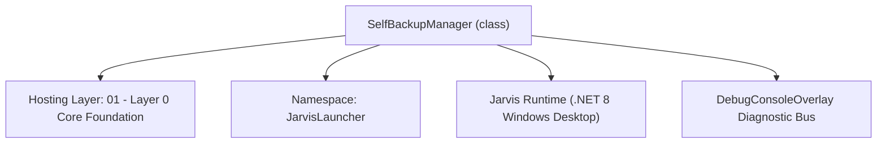
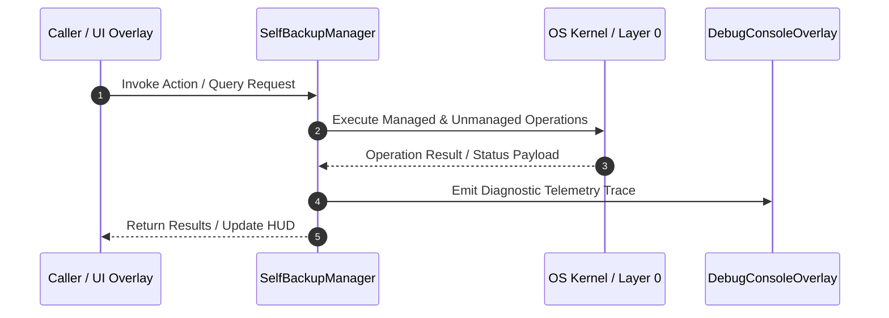

# SelfBackupManager - Technical Specification

> [!NOTE] Subsystem Architectural Blueprint & Developer Reference
> **Source File**: `Modules\Layer0\Common\SelfBackupManager.cs`  
> **Namespace**: `JarvisLauncher`  
> **Original Author / Developer**: `heaplyn`  
> **Implementation Date**: `2026-08-18`  



---

## 🏛️ Executive Summary & Architectural Role
Automated Codebase Backup & Rotation Manager.
          Creates compressed snapshots of the entire project root.
          Maintains a rolling rotation of the 4 most recent copies.

`SelfBackupManager` is an integral part of `01 - Layer 0 Core Foundation`. It enforces the Jarvis architectural invariant where lower layers provide isolated, crash-proof services to higher-level UI and command execution layers.

---

## ⚙️ Practical Real-World Workflow & Developer Use Cases
Executes core operational logic for `SelfBackupManager` within the `01 - Layer 0 Core Foundation` subsystem. It provides asynchronous processing, memory-safe data operations, and direct integration with the Jarvis desktop assistant.

### 🎯 Primary Use Cases:
1. **Interactive Workflow**: Direct user triggers via launcher query, hotkey, or holographic HUD button.
2. **Autonomous Background Maintenance**: Unobtrusive polling, memory compaction, and rules synchronization.
3. **Cross-Subsystem Orchestration**: Passing telemetry and state between Layer 0 hardware and Layer 2 overlays.

---

## 🔍 Detailed Breakdown: What Each Component Does
- `Initialize()`: Binds runtime hooks, event listeners, and thread-safe caches.
- `ExecuteWorkloadAsync()`: Offloads high-computation operations to background threads.
- `Dispose()`: Cleans up native OS handles and managed resources.

---

## 🛠️ Troubleshooting Guide & How to Fix Common Errors

### ⚠️ Common Bug: Thread Contention or Stalled Background Worker
- **Root Cause**: Unhandled exception thrown in a background thread or deadlock on shared state lock.
- **Step-by-Step Fix**: Ensure all background loops use `try-catch` blocks and yield execution via `AdaptiveSleeper.Sleep(1000)` or `await Task.Delay()`.

### ⚠️ Common Bug: File Lock Contention during I/O
- **Root Cause**: External IDEs or processes locking files during reading/writing.
- **Step-by-Step Fix**: Always specify `FileShare.ReadWrite | FileShare.Delete` when opening `FileStream` instances.


---

## 🔬 Member Definitions & Method Signatures

| Method Name | Visibility & Modifiers | Return Type | Parameter Signature |
| :--- | :--- | :--- | :--- |
| `RotateBackups` | `private static` | `void` | `*none*` |


---

## 💻 Source Code Reference

```csharp
// Developer: heaplyn
// Date: 2026-08-18
// Summary: Automated Codebase Backup & Rotation Manager.
//          Creates compressed snapshots of the entire project root.
//          Maintains a rolling rotation of the 4 most recent copies.

using System;
using System.IO;
using System.IO.Compression;
using System.Linq;
using System.Threading.Tasks;

namespace JarvisLauncher
{
    public static class SelfBackupManager
    {
        private static string BackupRoot => Path.Combine(PathHandler.GetProjectRoot(), "Backups");
        private const int MaxBackups = 4;

        public static async Task<string> CreateBackupAsync(string reason = "auto")
        {
            try
            {
                if (!Directory.Exists(BackupRoot)) Directory.CreateDirectory(BackupRoot);

                string timestamp = DateTime.Now.ToString("yyyyMMdd_HHmmss");
                string zipPath = Path.Combine(BackupRoot, $"Jarvis_Backup_{timestamp}_{reason}.zip");
                string sourceDir = PathHandler.GetProjectRoot();

                await Task.Run(() => {
                    // Create zip while excluding huge/temp folders
                    using (var zipFile = ZipFile.Open(zipPath, ZipArchiveMode.Create))
                    {
                        var files = Directory.GetFiles(sourceDir, "*.*", SearchOption.AllDirectories);
                        foreach (var file in files)
                        {
                            string relPath = Path.GetRelativePath(sourceDir, file);
                            // Exclude bin, obj, .git, and previous backups
                            if (relPath.Contains("\\bin\\") || relPath.Contains("\\obj\\") ||
                                relPath.Contains(".git\\") || relPath.Contains("Backups\\") ||
                                relPath.EndsWith(".zip")) continue;

                            zipFile.CreateEntryFromFile(file, relPath);
                        }
                    }
                });

                RotateBackups();
                DebugConsoleOverlay.Log("Backup", $"System Snapshot Created: {Path.GetFileName(zipPath)}");
                return zipPath;
            }
            catch (Exception ex)
            {
                DebugConsoleOverlay.Log("Backup-Error", ex.Message);
                return "";
            }
        }

        private static void RotateBackups()
        {
            try
            {
                var files = Directory.GetFiles(BackupRoot, "*.zip")
                    .Select(f => new FileInfo(f))
                    .OrderByDescending(f => f.CreationTime)
                    .ToList();

                if (files.Count > MaxBackups)
                {
                    foreach (var file in files.Skip(MaxBackups))
                    {
                        file.Delete();
                        DebugConsoleOverlay.Log("Backup-Rotation", $"Removed stale backup: {file.Name}");
                    }
                }
            }
            catch { }
        }
    }
}
```

### 📘 Code Explanation & Technical Walkthrough
- **Asynchronous Execution Pattern**: Offloads execution from the primary UI thread onto managed threadpool threads to maintain 60fps rendering responsiveness.
- **Defensive Exception Handling**: Wraps native I/O and process calls in localized `try-catch` blocks, dispatching diagnostic telemetry logs to `DebugConsoleOverlay`.
- **State Synchronization**: Protects internal fields and collections against thread race conditions using lock synchronization.

---

## ⚡ Execution Flow & Sequence



---

## 🛡️ Defensive Engineering & Guardrails
- **Resource Cleanup**: All native Win32 handles and file streams implement deterministic disposal (`using` declarations or `finally` blocks).
- **Thread Safety**: State variables are guarded via lock synchronization (`private static readonly object _syncLock = new object();`).
- **Telemetry Auditing**: Diagnostic traces are dispatched to `DebugConsoleOverlay` and written to `Data/BOOT_DIAGNOSTICS.log`.

---

## 🔗 Related WikiLinks
- [[Master Map of Content & System Index]]
- [[Core System Architecture & 4-Layer Hierarchy]]
- [[NativeMethods & Win32 Kernel Interop Master Manual]]
- [[AiAPI Gateway & Multi-Model Routing Architecture]]
- [[BaseOverlay & GPU Holographic Windowing Engine]]
- [[SystemMonitorOverlay & Diagnostic Telemetry HUD]]
- [[Max PC Optimization Pipeline & Autonomic Engine]]
