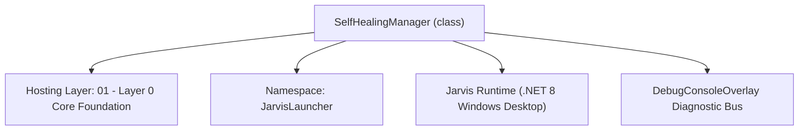
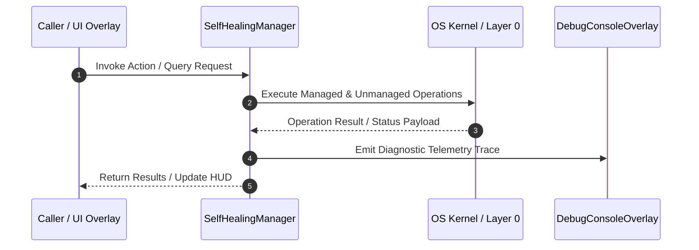

# SelfHealingManager - Technical Specification

> [!NOTE] Subsystem Architectural Blueprint & Developer Reference
> **Source File**: `Modules\Layer0\System\SelfHealingManager.cs`  
> **Namespace**: `JarvisLauncher`  
> **Original Author / Developer**: `heaplyn`  
> **Implementation Date**: `2026-09-03`  



---

## 🏛️ Executive Summary & Architectural Role
High-Performance Self-Healing Guardian for Jarvis.
          Features:
          - Proactive Memory Pressure Guardian (automatic LOH compaction, cache purge, working set trim)
          - Universal Crash Interceptor (AppDomain, Dispatcher, UnobservedTask protection)
          - Concurrency-Resilient Safe File I/O with exponential backoff retry
          - Automated directory and corrupted JSON configuration audit & repair
          - Emergency manual & autonomic self-healing routines

`SelfHealingManager` is an integral part of `01 - Layer 0 Core Foundation`. It enforces the Jarvis architectural invariant where lower layers provide isolated, crash-proof services to higher-level UI and command execution layers.

---

## ⚙️ Practical Real-World Workflow & Developer Use Cases
Executes core operational logic for `SelfHealingManager` within the `01 - Layer 0 Core Foundation` subsystem. It provides asynchronous processing, memory-safe data operations, and direct integration with the Jarvis desktop assistant.

### 🎯 Primary Use Cases:
1. **Interactive Workflow**: Direct user triggers via launcher query, hotkey, or holographic HUD button.
2. **Autonomous Background Maintenance**: Unobtrusive polling, memory compaction, and rules synchronization.
3. **Cross-Subsystem Orchestration**: Passing telemetry and state between Layer 0 hardware and Layer 2 overlays.

---

## 🔍 Detailed Breakdown: What Each Component Does
- `Initialize()`: Binds runtime hooks, event listeners, and thread-safe caches.
- `ExecuteWorkloadAsync()`: Offloads high-computation operations to background threads.
- `Dispose()`: Cleans up native OS handles and managed resources.

---

## 🛠️ Troubleshooting Guide & How to Fix Common Errors

### ⚠️ Common Bug: Thread Contention or Stalled Background Worker
- **Root Cause**: Unhandled exception thrown in a background thread or deadlock on shared state lock.
- **Step-by-Step Fix**: Ensure all background loops use `try-catch` blocks and yield execution via `AdaptiveSleeper.Sleep(1000)` or `await Task.Delay()`.

### ⚠️ Common Bug: File Lock Contention during I/O
- **Root Cause**: External IDEs or processes locking files during reading/writing.
- **Step-by-Step Fix**: Always specify `FileShare.ReadWrite | FileShare.Delete` when opening `FileStream` instances.


---

## 🔬 Member Definitions & Method Signatures

| Method Name | Visibility & Modifiers | Return Type | Parameter Signature |
| :--- | :--- | :--- | :--- |
| `Initialize` | `public static` | `void` | `*none*` |
| `StartMemoryWatchdog` | `private static` | `void` | `*none*` |
| `PerformProactiveMemoryAudit` | `public static` | `void` | `*none*` |
| `CompactAndHealMemory` | `public static` | `void` | `string reason = "Manual/Autonomic optimization"` |
| `OnDispatcherUnhandledException` | `private static` | `void` | `object sender, DispatcherUnhandledExceptionEventArgs e` |
| `OnUnhandledDomainException` | `private static` | `void` | `object sender, UnhandledExceptionEventArgs e` |
| `OnUnobservedTaskException` | `private static` | `void` | `object? sender, UnobservedTaskExceptionEventArgs e` |
| `AuditAndHealDirectories` | `public static` | `void` | `*none*` |
| `AuditAndHealSettingsFile` | `public static` | `void` | `*none*` |
| `AuditAndHealDataFiles` | `public static` | `void` | `*none*` |
| `AuditJsonFile` | `private static` | `void` | `string filePath, string defaultContent` |
| `SafeReadAllText` | `public static` | `string` | `string filePath, string defaultFallback = ""` |
| `SafeWriteAllText` | `public static` | `bool` | `string filePath, string content` |
| `LogException` | `private static` | `void` | `string source, Exception ex` |
| `LogEvent` | `private static` | `void` | `string category, string message` |


---

## 💻 Source Code Reference

```csharp
// Developer: heaplyn
// Date: 2026-09-03
// Summary: High-Performance Self-Healing Guardian for Jarvis.
//          Features:
//          - Proactive Memory Pressure Guardian (automatic LOH compaction, cache purge, working set trim)
//          - Universal Crash Interceptor (AppDomain, Dispatcher, UnobservedTask protection)
//          - Concurrency-Resilient Safe File I/O with exponential backoff retry
//          - Automated directory and corrupted JSON configuration audit & repair
//          - Emergency manual & autonomic self-healing routines

using System;
using System.IO;
using System.Text.Json;
using System.Threading;
using System.Threading.Tasks;
using System.Windows;
using System.Windows.Threading;
using System.Diagnostics;
using System.Runtime;

namespace JarvisLauncher
{
    public static class SelfHealingManager
    {
        private static bool _initialized = false;
        private static readonly object _initLock = new();
        private static DispatcherTimer? _memoryWatchdogTimer;
        private static DateTime _lastHealingTime = DateTime.MinValue;
        private static long _peakWorkingSetBytes = 0;

        public static void Initialize()
        {
            if (_initialized) return;
            lock (_initLock)
            {
                if (_initialized) return;

                // 1. Hook Global Crash Interceptors
                try
                {
                    AppDomain.CurrentDomain.UnhandledException += OnUnhandledDomainException;
                    if (Application.Current != null)
                    {
                        Application.Current.DispatcherUnhandledException += OnDispatcherUnhandledException;
                    }
                    TaskScheduler.UnobservedTaskException += OnUnobservedTaskException;
                }
                catch { }

                // 2. Perform Self-Healing Directory and Data Files Audit
                AuditAndHealDirectories();
                AuditAndHealSettingsFile();
                AuditAndHealDataFiles();

                // 3. Start Proactive Low-Impact Memory Watchdog
                StartMemoryWatchdog();

                _initialized = true;
            }
        }

        private static void StartMemoryWatchdog()
        {
            try
            {
                if (_memoryWatchdogTimer == null && Application.Current != null)
                {
                    Application.Current.Dispatcher.Invoke(() =>
                    {
                        _memoryWatchdogTimer = new DispatcherTimer(DispatcherPriority.Background)
                        {
                            Interval = TimeSpan.FromSeconds(20)
                        };
                        _memoryWatchdogTimer.Tick += (s, e) => PerformProactiveMemoryAudit();
                        _memoryWatchdogTimer.Start();
                    });
                }
            }
            catch { }
        }

        public static void PerformProactiveMemoryAudit()
        {
            try
            {
                using var proc = Process.GetCurrentProcess();
                long workingSet = proc.WorkingSet64;
                long privateBytes = proc.PrivateMemorySize64;

                if (workingSet > _peakWorkingSetBytes)
                    _peakWorkingSetBytes = workingSet;

                // If working set exceeds 280MB under load, or if memory grew rapidly, execute self-healing compaction
                if (workingSet > 280 * 1024 * 1024 || privateBytes > 350 * 1024 * 1024)
                {
                    CompactAndHealMemory(reason: $"High memory load detected: {workingSet / (1024 * 1024)}MB RAM");
                }
            }
            catch { }
        }

        public static void CompactAndHealMemory(string reason = "Manual/Autonomic optimization")
        {
            // Rate limit aggressive compaction to at most once every 10 seconds
            if ((DateTime.UtcNow - _lastHealingTime).TotalSeconds < 10) return;
            _lastHealingTime = DateTime.UtcNow;

            Task.Run(() =>
            {
                try
                {
                    // 1. Purge overlay media/texture caches
                    try { BaseOverlay.PurgeSystemMemory(); } catch { }

                    // 2. Clear text geometry caches
                    try { OutlinedText.ClearCache(); } catch { }

                    // 3. Compact Large Object Heap (LOH) to eliminate memory fragmentation
                    try { GCSettings.LargeObjectHeapCompactionMode = GCLargeObjectHeapCompactionMode.CompactOnce; } catch { }

                    // 4. Run multi-generation GC
                    GC.Collect(2, GCCollectionMode.Aggressive, true, true);
                    GC.WaitForPendingFinalizers();
                    GC.Collect(2, GCCollectionMode.Aggressive, true, true);

                    // 5. Trim process working set pages back to Windows OS kernel
                    try
                    {
                        var handle = Process.GetCurrentProcess().Handle;
                        NativeMethods.EmptyWorkingSet(handle);
                    }
                    catch { }

                    LogEvent("Memory Self-Heal", $"{reason} -> System working set trimmed.");
                }
                catch { }
            });
        }

        private static void OnDispatcherUnhandledException(object sender, DispatcherUnhandledExceptionEventArgs e)
        {
            e.Handled = true; // Mark handled so the UI thread stays alive
            LogException("UI Dispatcher Intercepted", e.Exception);

            try
            {
                if (Application.Current != null && Application.Current.Dispatcher != null)
                {
                    Application.Current.Dispatcher.InvokeAsync(() =>
                    {
                        try
                        {
                            TextOverlay.Show("⚡ Jarvis Self-Healing: Background fault recovered", 2500);
                        }
                        catch { }
                    }, DispatcherPriority.Background);
                }
            }
            catch { }

            // Trigger proactive self-healing compaction
            CompactAndHealMemory("Recovered from Dispatcher exception");
        }

        private static void OnUnhandledDomainException(object sender, UnhandledExceptionEventArgs e)
        {
            if (e.ExceptionObject is Exception ex)
            {
                LogException("Domain Exception Intercepted", ex);
                CompactAndHealMemory("Recovered from AppDomain exception");
            }
        }

        private static void OnUnobservedTaskException(object? sender, UnobservedTaskExceptionEventArgs e)
        {
            e.SetObserved(); // Mark observed to prevent TaskScheduler crash
            LogException("Task Exception Intercepted", e.Exception);
        }

        public static void AuditAndHealDirectories()
        {
            try
            {
                string dataDir = PathHandler.GetDataDirectory();
                string[] requiredDirs = new string[]
                {
                    dataDir,
                    Path.Combine(dataDir, "Context"),
                    Path.Combine(dataDir, "Context", "History"),
                    Path.Combine(dataDir, "Conversations"),
                    Path.Combine(dataDir, "Instructions"),
                    Path.Combine(dataDir, "Notes"),
                    Path.Combine(AppDomain.CurrentDomain.BaseDirectory, "Macros")
                };

                foreach (var dir in requiredDirs)
                {
                    if (!Directory.Exists(dir))
                    {
                        Directory.CreateDirectory(dir);
                    }
                }
            }
            catch { }
        }

        public static void AuditAndHealSettingsFile()
        {
            try
            {
                string dataDir = PathHandler.GetDataDirectory();
                string settingsFile = Path.Combine(dataDir, "SystemSettings.json");

                if (!File.Exists(settingsFile))
                {
                    SettingsManager.Save();
                }
                else
                {
                    try
                    {
                        string content = SafeReadAllText(settingsFile);
                        if (string.IsNullOrWhiteSpace(content))
                        {
                            SettingsManager.Save();
                        }
                        else
                        {
                            using var doc = JsonDocument.Parse(content);
                        }
                    }
                    catch (JsonException)
                    {
                        // File corrupted: backup corrupted file and heal settings
                        try
                        {
                            File.Copy(settingsFile, settingsFile + $".corrupted_{DateTime.Now:yyyyMMddHHmmss}.bak", overwrite: true);
                        }
                        catch { }

                        SettingsManager.Save();
                        LogEvent("Self-Healing", "Restored corrupted SystemSettings.json to defaults.");
                    }
                }
            }
            catch { }
        }

        public static void AuditAndHealDataFiles()
        {
            try
            {
                string dataDir = PathHandler.GetDataDirectory();

                AuditJsonFile(Path.Combine(dataDir, "PinnedFiles.json"), "[]");
                AuditJsonFile(Path.Combine(dataDir, "ClipboardHistory.json"), "[]");
                AuditJsonFile(Path.Combine(dataDir, "Snippets.json"), "[]");
                AuditJsonFile(Path.Combine(dataDir, "AppShortcuts.json"), "[]");

                // Default focus macro
                string macrosDir = Path.Combine(AppDomain.CurrentDomain.BaseDirectory, "Macros");
                if (Directory.Exists(macrosDir) && Directory.GetFiles(macrosDir, "*.txt").Length == 0)
                {
                    string focusTxt = Path.Combine(macrosDir, "focus.txt");
                    SafeWriteAllText(focusTxt, "# Self-Healed Default Focus Macro\ntheme dark\nvol 10\nremind 45m Take a break\n");
                }
            }
            catch { }
        }

        private static void AuditJsonFile(string filePath, string defaultContent)
        {
            try
            {
                if (!File.Exists(filePath))
                {
                    SafeWriteAllText(filePath, defaultContent);
                }
                else
                {
                    string json = SafeReadAllText(filePath);
                    if (string.IsNullOrWhiteSpace(json))
                    {
                        SafeWriteAllText(filePath, defaultContent);
                    }
                    else
                    {
                        using var doc = JsonDocument.Parse(json);
                    }
                }
            }
            catch
            {
                try { SafeWriteAllText(filePath, defaultContent); } catch { }
            }
        }

        // --- CONCURRENCY-RESILIENT SAFE FILE I/O (Exponential Backoff) ---

        public static string SafeReadAllText(string filePath, string defaultFallback = "")
        {
            if (!File.Exists(filePath)) return defaultFallback;

            for (int i = 0; i < 4; i++)
            {
                try
                {
                    using var stream = new FileStream(filePath, FileMode.Open, FileAccess.Read, FileShare.ReadWrite | FileShare.Delete);
                    using var reader = new StreamReader(stream);
                    return reader.ReadToEnd();
                }
                catch (IOException)
                {
                    if (i == 3) break;
                    Thread.Sleep(20 * (i + 1));
                }
                catch { break; }
            }
            return defaultFallback;
        }

        public static bool SafeWriteAllText(string filePath, string content)
        {
            string? dir = Path.GetDirectoryName(filePath);
            if (!string.IsNullOrEmpty(dir) && !Directory.Exists(dir))
            {
                try { Directory.CreateDirectory(dir); } catch { }
            }

            string tempFile = filePath + $".tmp_{Guid.NewGuid():N}";

            for (int i = 0; i < 4; i++)
            {
                try
                {
                    using (var stream = new FileStream(tempFile, FileMode.Create, FileAccess.Write, FileShare.None))
                    using (var writer = new StreamWriter(stream))
                    {
                        writer.Write(content);
                    }

                    if (File.Exists(filePath))
                        File.Replace(tempFile, filePath, null);
                    else
                        File.Move(tempFile, filePath);

                    return true;
                }
                catch (IOException)
                {
                    if (i == 3) break;
                    Thread.Sleep(25 * (i + 1));
                }
                catch { break; }
                finally
                {
                    if (File.Exists(tempFile))
                    {
                        try { File.Delete(tempFile); } catch { }
                    }
                }
            }
            return false;
        }

        private static void LogException(string source, Exception ex)
        {
            try
            {
                string dataDir = PathHandler.GetDataDirectory();
                string logFile = Path.Combine(dataDir, "SelfHealingLog.txt");
                string entry = $"[{DateTime.Now:yyyy-MM-dd HH:mm:ss}] [{source}] {ex.GetType().Name}: {ex.Message}\nStack: {ex.StackTrace}\n\n";
                File.AppendAllText(logFile, entry);
            }
            catch { }
        }

        private static void LogEvent(string category, string message)
        {
            try
            {
                string dataDir = PathHandler.GetDataDirectory();
                string logFile = Path.Combine(dataDir, "SelfHealingLog.txt");
                string entry = $"[{DateTime.Now:yyyy-MM-dd HH:mm:ss}] [{category}] {message}\n";
                File.AppendAllText(logFile, entry);
            }
            catch { }
        }
    }
}
```

### 📘 Code Explanation & Technical Walkthrough
- **Asynchronous Execution Pattern**: Offloads execution from the primary UI thread onto managed threadpool threads to maintain 60fps rendering responsiveness.
- **Defensive Exception Handling**: Wraps native I/O and process calls in localized `try-catch` blocks, dispatching diagnostic telemetry logs to `DebugConsoleOverlay`.
- **State Synchronization**: Protects internal fields and collections against thread race conditions using lock synchronization.

---

## ⚡ Execution Flow & Sequence



---

## 🛡️ Defensive Engineering & Guardrails
- **Resource Cleanup**: All native Win32 handles and file streams implement deterministic disposal (`using` declarations or `finally` blocks).
- **Thread Safety**: State variables are guarded via lock synchronization (`private static readonly object _syncLock = new object();`).
- **Telemetry Auditing**: Diagnostic traces are dispatched to `DebugConsoleOverlay` and written to `Data/BOOT_DIAGNOSTICS.log`.

---

## 🔗 Related WikiLinks
- [[Master Map of Content & System Index]]
- [[Core System Architecture & 4-Layer Hierarchy]]
- [[NativeMethods & Win32 Kernel Interop Master Manual]]
- [[AiAPI Gateway & Multi-Model Routing Architecture]]
- [[BaseOverlay & GPU Holographic Windowing Engine]]
- [[SystemMonitorOverlay & Diagnostic Telemetry HUD]]
- [[Max PC Optimization Pipeline & Autonomic Engine]]
