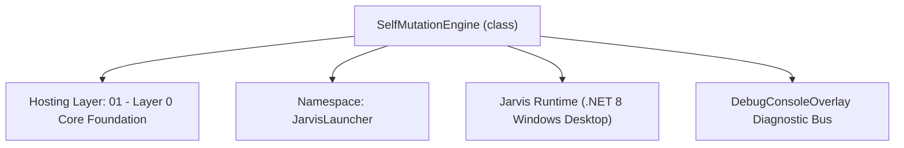
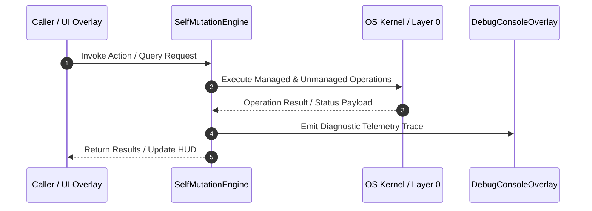

# SelfMutationEngine - Technical Specification

> [!NOTE] Subsystem Architectural Blueprint & Developer Reference
> **Source File**: `Modules\Layer0\Common\SelfMutationEngine.cs`  
> **Namespace**: `JarvisLauncher`  
> **Original Author / Developer**: `heaplyn`  
> **Implementation Date**: `2026-08-18`  



---

## 🏛️ Executive Summary & Architectural Role
AI Auto-Evolution & Code Self-Mutation Engine.
          Enhanced to support partial code modification and full project backups.

`SelfMutationEngine` is an integral part of `01 - Layer 0 Core Foundation`. It enforces the Jarvis architectural invariant where lower layers provide isolated, crash-proof services to higher-level UI and command execution layers.

---

## ⚙️ Practical Real-World Workflow & Developer Use Cases
Executes core operational logic for `SelfMutationEngine` within the `01 - Layer 0 Core Foundation` subsystem. It provides asynchronous processing, memory-safe data operations, and direct integration with the Jarvis desktop assistant.

### 🎯 Primary Use Cases:
1. **Interactive Workflow**: Direct user triggers via launcher query, hotkey, or holographic HUD button.
2. **Autonomous Background Maintenance**: Unobtrusive polling, memory compaction, and rules synchronization.
3. **Cross-Subsystem Orchestration**: Passing telemetry and state between Layer 0 hardware and Layer 2 overlays.

---

## 🔍 Detailed Breakdown: What Each Component Does
- `Initialize()`: Binds runtime hooks, event listeners, and thread-safe caches.
- `ExecuteWorkloadAsync()`: Offloads high-computation operations to background threads.
- `Dispose()`: Cleans up native OS handles and managed resources.

---

## 🛠️ Troubleshooting Guide & How to Fix Common Errors

### ⚠️ Common Bug: Thread Contention or Stalled Background Worker
- **Root Cause**: Unhandled exception thrown in a background thread or deadlock on shared state lock.
- **Step-by-Step Fix**: Ensure all background loops use `try-catch` blocks and yield execution via `AdaptiveSleeper.Sleep(1000)` or `await Task.Delay()`.

### ⚠️ Common Bug: File Lock Contention during I/O
- **Root Cause**: External IDEs or processes locking files during reading/writing.
- **Step-by-Step Fix**: Always specify `FileShare.ReadWrite | FileShare.Delete` when opening `FileStream` instances.


---

## 🔬 Member Definitions & Method Signatures

| Method Name | Visibility & Modifiers | Return Type | Parameter Signature |
| :--- | :--- | :--- | :--- |


---

## 💻 Source Code Reference

```csharp
// Developer: heaplyn
// Date: 2026-08-18
// Summary: AI Auto-Evolution & Code Self-Mutation Engine.
//          Enhanced to support partial code modification and full project backups.

using System;
using System.Diagnostics;
using System.IO;
using System.Text;
using System.Threading.Tasks;
using System.Collections.Generic;
using System.Linq;

namespace JarvisLauncher
{
    public static class SelfMutationEngine
    {
        public static string MutationStatus { get; private set; } = "Idle.";
        public static string MutationLogs { get; private set; } = "";

        public static async Task<MutationResult> ModifyCodeAsync(string relPath, string search, string replace)
        {
            string fullPath = Path.Combine(PathHandler.GetProjectRoot(), relPath);
            if (!File.Exists(fullPath)) return new MutationResult(false, $"File not found: {relPath}");

            string content = File.ReadAllText(fullPath);
            if (!content.Contains(search)) return new MutationResult(false, "Search string not found in target file.");

            string newContent = content.Replace(search, replace);
            return await MutateCodeAsync(fullPath, newContent);
        }

        public static async Task<MutationResult> MutateCodeAsync(string targetFilePath, string newCodeContent)
        {
            if (!File.Exists(targetFilePath)) return new MutationResult(false, "Target not found.");

            MutationStatus = "Evolving: Creating full system backup...";
            await SelfBackupManager.CreateBackupAsync("pre_mutation");

            string originalContent = File.ReadAllText(targetFilePath);

            try
            {
                File.WriteAllText(targetFilePath, newCodeContent);
            }
            catch (Exception ex)
            {
                return new MutationResult(false, $"Write failed: {ex.Message}");
            }

            MutationStatus = "Evolving: Verifying Neural Integrity (Build)...";
            bool buildSuccess = await RunBuildCheckAsync();

            if (buildSuccess)
            {
                DebugConsoleOverlay.Log("Evolution-Code", $"Mutation successful in {Path.GetFileName(targetFilePath)}. Sir, I'm restarting to apply changes.");
                _ = Task.Delay(2000).ContinueWith(_ => {
                    System.Windows.Application.Current.Dispatcher.Invoke(() => { try { NativeMethods.Restart(); } catch { Environment.Exit(0); } });
                });
                return new MutationResult(true, "Evolution successful. System rebooting.");
            }
            else
            {
                // Revert
                File.WriteAllText(targetFilePath, originalContent);
                return new MutationResult(false, "Build failed. Mutation reverted for safety.");
            }
        }

        private static async Task<bool> RunBuildCheckAsync()
        {
            string projectDir = PathHandler.GetProjectRoot();
            var startInfo = new ProcessStartInfo {
                FileName = "dotnet", Arguments = "build", WorkingDirectory = projectDir,
                RedirectStandardOutput = true, RedirectStandardError = true,
                UseShellExecute = false, CreateNoWindow = true
            };

            return await Task.Run(() => {
                try {
                    using var process = Process.Start(startInfo);
                    if (process == null) return false;
                    process.WaitForExit(45000);
                    return process.ExitCode == 0;
                } catch { return false; }
            });
        }
    }

    public class MutationResult
    {
        public bool Success { get; }
        public string Message { get; }
        public MutationResult(bool success, string msg) { Success = success; Message = msg; }
    }
}
```

### 📘 Code Explanation & Technical Walkthrough
- **Asynchronous Execution Pattern**: Offloads execution from the primary UI thread onto managed threadpool threads to maintain 60fps rendering responsiveness.
- **Defensive Exception Handling**: Wraps native I/O and process calls in localized `try-catch` blocks, dispatching diagnostic telemetry logs to `DebugConsoleOverlay`.
- **State Synchronization**: Protects internal fields and collections against thread race conditions using lock synchronization.

---

## ⚡ Execution Flow & Sequence



---

## 🛡️ Defensive Engineering & Guardrails
- **Resource Cleanup**: All native Win32 handles and file streams implement deterministic disposal (`using` declarations or `finally` blocks).
- **Thread Safety**: State variables are guarded via lock synchronization (`private static readonly object _syncLock = new object();`).
- **Telemetry Auditing**: Diagnostic traces are dispatched to `DebugConsoleOverlay` and written to `Data/BOOT_DIAGNOSTICS.log`.

---

## 🔗 Related WikiLinks
- [[Master Map of Content & System Index]]
- [[Core System Architecture & 4-Layer Hierarchy]]
- [[NativeMethods & Win32 Kernel Interop Master Manual]]
- [[AiAPI Gateway & Multi-Model Routing Architecture]]
- [[BaseOverlay & GPU Holographic Windowing Engine]]
- [[SystemMonitorOverlay & Diagnostic Telemetry HUD]]
- [[Max PC Optimization Pipeline & Autonomic Engine]]
