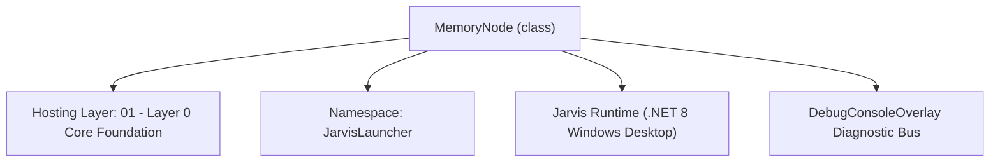
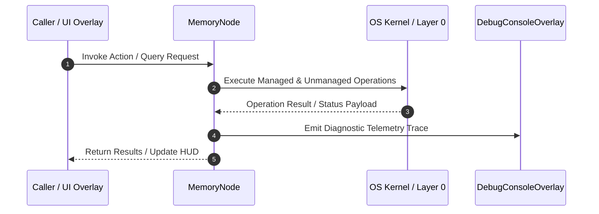

# SemanticMemoryManager - Technical Specification

> [!NOTE] Subsystem Architectural Blueprint & Developer Reference
> **Source File**: `Modules\Layer0\Common\SemanticMemoryManager.cs`  
> **Namespace**: `JarvisLauncher`  
> **Original Author / Developer**: `heaplyn`  
> **Implementation Date**: `2026-08-16`  



---

## 🏛️ Executive Summary & Architectural Role
Long-Term Semantic & Contextual Memory System.
          Stores user facts, codebase details, environmental audio history, and activity timelines.
          Provides a unified mental model for the AI to understand the user's life and work.

`MemoryNode` is an integral part of `01 - Layer 0 Core Foundation`. It enforces the Jarvis architectural invariant where lower layers provide isolated, crash-proof services to higher-level UI and command execution layers.

---

## ⚙️ Practical Real-World Workflow & Developer Use Cases
Executes core operational logic for `SemanticMemoryManager` within the `01 - Layer 0 Core Foundation` subsystem. It provides asynchronous processing, memory-safe data operations, and direct integration with the Jarvis desktop assistant.

### 🎯 Primary Use Cases:
1. **Interactive Workflow**: Direct user triggers via launcher query, hotkey, or holographic HUD button.
2. **Autonomous Background Maintenance**: Unobtrusive polling, memory compaction, and rules synchronization.
3. **Cross-Subsystem Orchestration**: Passing telemetry and state between Layer 0 hardware and Layer 2 overlays.

---

## 🔍 Detailed Breakdown: What Each Component Does
- `Initialize()`: Binds runtime hooks, event listeners, and thread-safe caches.
- `ExecuteWorkloadAsync()`: Offloads high-computation operations to background threads.
- `Dispose()`: Cleans up native OS handles and managed resources.

---

## 🛠️ Troubleshooting Guide & How to Fix Common Errors

### ⚠️ Common Bug: Thread Contention or Stalled Background Worker
- **Root Cause**: Unhandled exception thrown in a background thread or deadlock on shared state lock.
- **Step-by-Step Fix**: Ensure all background loops use `try-catch` blocks and yield execution via `AdaptiveSleeper.Sleep(1000)` or `await Task.Delay()`.

### ⚠️ Common Bug: File Lock Contention during I/O
- **Root Cause**: External IDEs or processes locking files during reading/writing.
- **Step-by-Step Fix**: Always specify `FileShare.ReadWrite | FileShare.Delete` when opening `FileStream` instances.


---

## 🔬 Member Definitions & Method Signatures

| Method Name | Visibility & Modifiers | Return Type | Parameter Signature |
| :--- | :--- | :--- | :--- |
| `LoadRegistry` | `public static` | `void` | `*none*` |
| `SaveRegistry` | `public static` | `void` | `*none*` |
| `AddTrackedFile` | `public static` | `void` | `string path` |
| `GetRegistry` | `public static` | `DynamicKnowledgeRegistry` | `*none*` |
| `GetNodes` | `public static` | `List<MemoryNode>` | `*none*` |
| `LoadMemories` | `public static` | `void` | `*none*` |
| `SaveMemories` | `public static` | `void` | `*none*` |
| `AddMemory` | `public static` | `void` | `string content, string category = "General", string subCategory = "", double importance = 0.5, Dictionary<string, string>? metadata = null` |
| `GetMemoryContextForAi` | `public static` | `string` | `*none*` |
| `LogAudioEvent` | `public static` | `void` | `string soundType, double confidence` |
| `LogProjectActivity` | `public static` | `void` | `string projectName, string action` |
| `ResetDatabase` | `public static` | `void` | `*none*` |
| `FilterByImportance` | `public static` | `int` | `double thresholdPercentage` |
| `NukeMemory` | `public static` | `int` | `string category` |


---

## 💻 Source Code Reference

```csharp
// Developer: heaplyn
// Date: 2026-08-16
// Summary: Long-Term Semantic & Contextual Memory System.
//          Stores user facts, codebase details, environmental audio history, and activity timelines.
//          Provides a unified mental model for the AI to understand the user's life and work.

using System;
using System.Collections.Generic;
using System.IO;
using System.Linq;
using System.Text;
using System.Text.Json;
using System.Threading.Tasks;

namespace JarvisLauncher
{
    public class MemoryNode
    {
        public string Content { get; set; } = string.Empty;
        public DateTime Timestamp { get; set; } = DateTime.Now;
        public string Category { get; set; } = "General"; // Personal, Project, Audio, Activity, Knowledge
        public string SubCategory { get; set; } = string.Empty;
        public double Importance { get; set; } = 0.5;
        public Dictionary<string, string> Metadata { get; set; } = new Dictionary<string, string>();
    }

    public class DynamicKnowledgeRegistry
    {
        public List<string> ManagedFiles { get; set; } = new List<string>();
        public List<string> TrackedFolders { get; set; } = new List<string>();
        public Dictionary<string, string> CoreDirectives { get; set; } = new Dictionary<string, string>();
    }

    public static class SemanticMemoryManager
    {
        private static readonly string MemoryPath = Path.Combine(PathHandler.GetDataDirectory(), "SemanticMemory.json");
        private static readonly string RegistryPath = Path.Combine(PathHandler.GetDataDirectory(), "KnowledgeRegistry.json");

        private static List<MemoryNode> _nodes = new List<MemoryNode>();
        private static DynamicKnowledgeRegistry _registry = new DynamicKnowledgeRegistry();
        private static readonly object _lock = new object();

        static SemanticMemoryManager()
        {
            LoadMemories();
            LoadRegistry();
        }

        public static void LoadRegistry()
        {
            try {
                if (File.Exists(RegistryPath)) _registry = JsonSerializer.Deserialize<DynamicKnowledgeRegistry>(File.ReadAllText(RegistryPath)) ?? new();
            } catch { }
        }

        public static void SaveRegistry()
        {
            try { File.WriteAllText(RegistryPath, JsonSerializer.Serialize(_registry, new JsonSerializerOptions { WriteIndented = true })); } catch { }
        }

        public static void AddTrackedFile(string path) {
            lock (_lock) { if (!_registry.ManagedFiles.Contains(path)) _registry.ManagedFiles.Add(path); SaveRegistry(); }
        }

        public static DynamicKnowledgeRegistry GetRegistry() => _registry;
        public static List<MemoryNode> GetNodes() => _nodes.ToList();

        public static void LoadMemories()
        {
            try
            {
                if (File.Exists(MemoryPath))
                {
                    string json = File.ReadAllText(MemoryPath);
                    _nodes = JsonSerializer.Deserialize<List<MemoryNode>>(json) ?? new List<MemoryNode>();
                }
            }
            catch { }
        }

        public static void SaveMemories()
        {
            try
            {
                string json = JsonSerializer.Serialize(_nodes, new JsonSerializerOptions { WriteIndented = true });
                File.WriteAllText(MemoryPath, json);
            }
            catch { }
        }

        public static void AddMemory(string content, string category = "General", string subCategory = "", double importance = 0.5, Dictionary<string, string>? metadata = null)
        {
            lock (_lock)
            {
                // Prevent identical spam (especially for audio/activity)
                if (_nodes.Any(n => n.Content.Equals(content, StringComparison.OrdinalIgnoreCase) && (DateTime.Now - n.Timestamp).TotalMinutes < 5)) return;

                _nodes.Add(new MemoryNode
                {
                    Content = content,
                    Category = category,
                    SubCategory = subCategory,
                    Importance = importance,
                    Metadata = metadata ?? new Dictionary<string, string>()
                });

                // Keep memory size manageable (last 1000 nodes)
                if (_nodes.Count > 1000) _nodes.RemoveAt(0);
                SaveMemories();

                // --- AUTO-SYNC TO CONTEXT FOLDER ---
                var newNode = _nodes.Last();
                _ = Task.Run(() => ContextNotesManager.SyncMemoryToNotesAsync(newNode));
            }
        }

        public static async Task<string> GetRecentChatContextAsync()
        {
            try {
                string dir = Path.Combine(PathHandler.GetDataDirectory(), "Conversations");
                if (!Directory.Exists(dir)) return "No recent chats.";
                var lastFile = Directory.GetFiles(dir, "*.json").OrderByDescending(File.GetLastWriteTime).FirstOrDefault();
                if (lastFile == null) return "No chat logs.";
                string json = await File.ReadAllTextAsync(lastFile);
                var turns = JsonSerializer.Deserialize<List<ChatTurn>>(json);
                if (turns == null) return "Empty log.";
                return string.Join("\n", turns.TakeLast(5).Select(t => $"[{(t.Role == "user" ? "User" : "Jarvis")}]: {t.Text}"));
            } catch { return "Chat log access failure."; }
        }

        public static string GetMemoryContextForAi()
        {
            lock (_lock)
            {
                if (_nodes.Count == 0) return "I'm still learning about your environment and projects, Boss.";

                var sb = new StringBuilder();
                sb.AppendLine("## WORLD MODEL & LONG-TERM MEMORY");

                // 1. Core Identity & User Facts (Highest Priority)
                var personal = _nodes.Where(n => n.Category == "Personal").OrderByDescending(n => n.Importance).Take(30).ToList();
                if (personal.Any()) {
                    sb.AppendLine("### [USER PROFILE]");
                    foreach (var n in personal) sb.AppendLine($"- {n.Content}");
                }

                // 2. Technical & Project Knowledge
                var knowledge = _nodes.Where(n => n.Category == "Knowledge" || n.Category == "Project").OrderByDescending(n => n.Timestamp).Take(40).ToList();
                if (knowledge.Any()) {
                    sb.AppendLine("\n### [KNOWLEDGE BASE & PROJECT STATE]");
                    foreach (var n in knowledge) sb.AppendLine($"- [{n.Timestamp:MM/dd HH:mm}] {n.Content}");
                }

                // 3. Environmental Awareness (Audio/Visual)
                var awareness = _nodes.Where(n => n.Category == "Audio" || n.Category == "Visual").OrderByDescending(n => n.Timestamp).Take(15).ToList();
                if (awareness.Any()) {
                    sb.AppendLine("\n### [ENVIRONMENTAL SENSORS]");
                    foreach (var n in awareness) sb.AppendLine($"- {n.Content}");
                }

                // 4. Activity Timeline
                var activity = _nodes.Where(n => n.Category == "Activity").OrderByDescending(n => n.Timestamp).Take(20).ToList();
                if (activity.Any()) {
                    sb.AppendLine("\n### [RECENT CHRONOLOGY]");
                    foreach (var n in activity) sb.AppendLine($"- {n.Timestamp:HH:mm}: {n.Content}");
                }

                // 5. Past Session Summaries
                var summaries = _nodes.Where(n => n.Category == "Session").OrderByDescending(n => n.Timestamp).Take(5).Reverse();
                if (summaries.Any()) {
                    sb.AppendLine("\n### [HISTORICAL SESSIONS]");
                    foreach (var n in summaries) sb.AppendLine($"- {n.Content}");
                }

                // 6. Managed Registry
                if (_registry.ManagedFiles.Any()) {
                    sb.AppendLine("\n### [MANAGED SYSTEM FILES]");
                    foreach (var f in _registry.ManagedFiles.TakeLast(10)) sb.AppendLine($"- {f}");
                }

                return sb.ToString();
            }
        }

        public static async Task ExtractFactsFromChatAsync(string userMessage, string aiResponse)
        {
            if (string.IsNullOrWhiteSpace(userMessage) || string.IsNullOrWhiteSpace(aiResponse)) return;

            string prompt = "### TASK\nExtract 1-3 critical new facts about the user or their active project from this interaction. Focus on names, preferences, file paths, or complex logic details.\n\n" +
                            "### FORMAT\nOutput ONLY short bullet points. If no NEW facts are present, respond with 'NONE'.\n\n" +
                            $"USER: {userMessage}\n" +
                            $"JARVIS: {aiResponse}";

            try
            {
                string result = await LlmRouter.AskAsync(prompt, null);
                if (!string.IsNullOrWhiteSpace(result) && !result.Contains("NONE"))
                {
                    var lines = result.Split('\n', StringSplitOptions.RemoveEmptyEntries);
                    foreach (var line in lines)
                    {
                        string clean = line.TrimStart('-', '*', ' ').Trim();
                        if (!string.IsNullOrEmpty(clean)) AddMemory(clean, "Personal", importance: 0.8);
                    }
                }
            }
            catch { }
        }

        public static async Task SummarizeAndStoreSessionAsync(List<ChatTurn> history)
        {
            if (history == null || history.Count < 4) return;

            var fullText = new StringBuilder();
            foreach (var turn in history) fullText.AppendLine($"{(turn.Role == "user" ? "User" : "Jarvis")}: {turn.Text}");

            string prompt = "### TASK\nSummarize this entire chat session into 1-2 powerful sentences that capture the core goals achieved or discussed.\n\n" +
                            "### CONTENT\n" + fullText.ToString();

            try {
                string summary = await LlmRouter.AskAsync(prompt, null);
                if (!string.IsNullOrWhiteSpace(summary)) {
                    AddMemory(summary.Trim(), "Session", importance: 0.9);
                }
            } catch { }
        }

        public static void LogAudioEvent(string soundType, double confidence)
        {
            if (confidence < 0.6) return;
            string content = $"Detected background sound: {soundType}";
            AddMemory(content, "Audio", soundType, 0.4);
        }

        public static void LogProjectActivity(string projectName, string action)
        {
            string content = $"Working on {projectName}: {action}";
            AddMemory(content, "Project", projectName, 0.6);
        }

        public static void ResetDatabase()
        {
            lock (_lock)
            {
                _nodes.Clear();
                SaveMemories();
                DebugConsoleOverlay.Log("Memory", "Semantic Memory Database has been RESET.");
            }
        }

        public static int FilterByImportance(double thresholdPercentage)
        {
            lock (_lock)
            {
                double threshold = thresholdPercentage / 100.0;
                int initialCount = _nodes.Count;
                _nodes = _nodes.Where(n => n.Importance >= threshold).ToList();
                int removed = initialCount - _nodes.Count;
                SaveMemories();
                DebugConsoleOverlay.Log("Memory", $"Filtered database. Removed {removed} nodes below {thresholdPercentage}% importance.");
                return removed;
            }
        }

        public static int NukeMemory(string category)
        {
            lock (_lock)
            {
                int initialCount = _nodes.Count;
                if (category.Equals("all", StringComparison.OrdinalIgnoreCase))
                {
                    _nodes.Clear();
                }
                else
                {
                    _nodes.RemoveAll(n => n.Category.Equals(category, StringComparison.OrdinalIgnoreCase) || n.SubCategory.Equals(category, StringComparison.OrdinalIgnoreCase));
                }
                int removed = initialCount - _nodes.Count;
                SaveMemories();
                DebugConsoleOverlay.Log("Memory", $"Nuked {removed} nodes from category: {category}.");
                return removed;
            }
        }
    }
}
```

### 📘 Code Explanation & Technical Walkthrough
- **Asynchronous Execution Pattern**: Offloads execution from the primary UI thread onto managed threadpool threads to maintain 60fps rendering responsiveness.
- **Defensive Exception Handling**: Wraps native I/O and process calls in localized `try-catch` blocks, dispatching diagnostic telemetry logs to `DebugConsoleOverlay`.
- **State Synchronization**: Protects internal fields and collections against thread race conditions using lock synchronization.

---

## ⚡ Execution Flow & Sequence



---

## 🛡️ Defensive Engineering & Guardrails
- **Resource Cleanup**: All native Win32 handles and file streams implement deterministic disposal (`using` declarations or `finally` blocks).
- **Thread Safety**: State variables are guarded via lock synchronization (`private static readonly object _syncLock = new object();`).
- **Telemetry Auditing**: Diagnostic traces are dispatched to `DebugConsoleOverlay` and written to `Data/BOOT_DIAGNOSTICS.log`.

---

## 🔗 Related WikiLinks
- [[Master Map of Content & System Index]]
- [[Core System Architecture & 4-Layer Hierarchy]]
- [[NativeMethods & Win32 Kernel Interop Master Manual]]
- [[AiAPI Gateway & Multi-Model Routing Architecture]]
- [[BaseOverlay & GPU Holographic Windowing Engine]]
- [[SystemMonitorOverlay & Diagnostic Telemetry HUD]]
- [[Max PC Optimization Pipeline & Autonomic Engine]]
