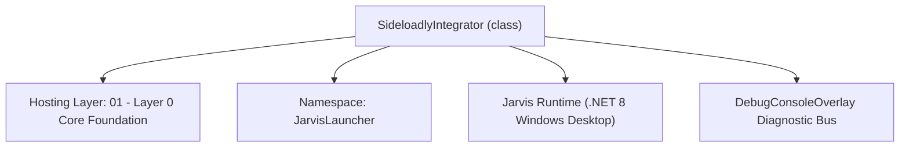
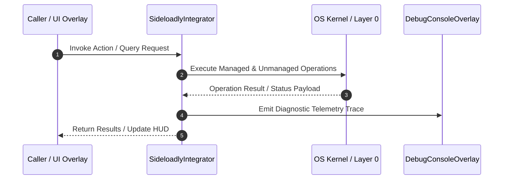

# SideloadlyIntegrator - Technical Specification

> [!NOTE] Subsystem Architectural Blueprint & Developer Reference
> **Source File**: `Modules\Layer0\Common\SideloadlyIntegrator.cs`  
> **Namespace**: `JarvisLauncher`  
> **Original Author / Developer**: `heaplyn`  
> **Implementation Date**: `2026-08-15`  



---

## 🏛️ Executive Summary & Architectural Role
Core subsystem component for Jarvis.

`SideloadlyIntegrator` is an integral part of `01 - Layer 0 Core Foundation`. It enforces the Jarvis architectural invariant where lower layers provide isolated, crash-proof services to higher-level UI and command execution layers.

---

## ⚙️ Practical Real-World Workflow & Developer Use Cases
Executes core operational logic for `SideloadlyIntegrator` within the `01 - Layer 0 Core Foundation` subsystem. It provides asynchronous processing, memory-safe data operations, and direct integration with the Jarvis desktop assistant.

### 🎯 Primary Use Cases:
1. **Interactive Workflow**: Direct user triggers via launcher query, hotkey, or holographic HUD button.
2. **Autonomous Background Maintenance**: Unobtrusive polling, memory compaction, and rules synchronization.
3. **Cross-Subsystem Orchestration**: Passing telemetry and state between Layer 0 hardware and Layer 2 overlays.

---

## 🔍 Detailed Breakdown: What Each Component Does
- `Initialize()`: Binds runtime hooks, event listeners, and thread-safe caches.
- `ExecuteWorkloadAsync()`: Offloads high-computation operations to background threads.
- `Dispose()`: Cleans up native OS handles and managed resources.

---

## 🛠️ Troubleshooting Guide & How to Fix Common Errors

### ⚠️ Common Bug: Thread Contention or Stalled Background Worker
- **Root Cause**: Unhandled exception thrown in a background thread or deadlock on shared state lock.
- **Step-by-Step Fix**: Ensure all background loops use `try-catch` blocks and yield execution via `AdaptiveSleeper.Sleep(1000)` or `await Task.Delay()`.

### ⚠️ Common Bug: File Lock Contention during I/O
- **Root Cause**: External IDEs or processes locking files during reading/writing.
- **Step-by-Step Fix**: Always specify `FileShare.ReadWrite | FileShare.Delete` when opening `FileStream` instances.


---

## 🔬 Member Definitions & Method Signatures

| Method Name | Visibility & Modifiers | Return Type | Parameter Signature |
| :--- | :--- | :--- | :--- |
| `GetIpaBundlerPath` | `public static` | `string` | `*none*` |
| `EnsureIpaBundlerDownloaded` | `public static` | `void` | `*none*` |
| `GetSideloadlyPath` | `public static` | `string?` | `*none*` |
| `RunSideload` | `public static` | `void` | `string ipaPath` |
| `TriggerDownload` | `public static` | `void` | `*none*` |


---

## 💻 Source Code Reference

```csharp
using System;
using System.Diagnostics;
using System.IO;
using System.Net.Http;
using System.Threading.Tasks;

namespace JarvisLauncher
{
    public static class SideloadlyIntegrator
    {
        private static readonly string[] SearchPaths = new[]
        {
            @"C:\Program Files\Sideloadly\Sideloadly.exe",
            @"C:\Program Files (x86)\Sideloadly\Sideloadly.exe",
            Path.Combine(Environment.GetFolderPath(Environment.SpecialFolder.LocalApplicationData), @"Programs\Sideloadly\Sideloadly.exe")
        };

        public static string GetIpaBundlerPath()
        {
            string toolsDir = Path.Combine(AppDomain.CurrentDomain.BaseDirectory, "Data", "Tools");
            return Path.Combine(toolsDir, "apptoipa.exe");
        }

        public static void EnsureIpaBundlerDownloaded()
        {
            string exePath = GetIpaBundlerPath();
            if (File.Exists(exePath)) return;

            try
            {
                string dir = Path.GetDirectoryName(exePath)!;
                if (!Directory.Exists(dir)) Directory.CreateDirectory(dir);

                DebugConsoleOverlay.Log("IPABundler", "Downloading IPABundler (apptoipa.exe) from GitHub...");
                using (var client = new HttpClient())
                {
                    var data = client.GetByteArrayAsync("https://github.com/deqline/IPABundler/releases/download/3.0/apptoipa.exe").GetAwaiter().GetResult();
                    File.WriteAllBytes(exePath, data);
                }
                DebugConsoleOverlay.Log("IPABundler", "IPABundler downloaded successfully.");
            }
            catch (Exception ex)
            {
                DebugConsoleOverlay.Log("IPABundler", $"Failed to download IPABundler: {ex.Message}");
            }
        }

        public static string? GetSideloadlyPath()
        {
            foreach (var path in SearchPaths)
            {
                if (File.Exists(path)) return path;
            }
            return null;
        }

        public static bool IsInstalled => GetSideloadlyPath() != null;

        public static void RunSideload(string ipaPath)
        {
            // Download IPABundler in background when sideloading is requested
            Task.Run(() => EnsureIpaBundlerDownloaded());

            string? execPath = GetSideloadlyPath();
            if (string.IsNullOrEmpty(execPath) || !File.Exists(execPath))
            {
                TriggerDownload();
                return;
            }

            string finalIpa = ipaPath;
            if (Directory.Exists(ipaPath) || (!string.IsNullOrEmpty(ipaPath) && ipaPath.EndsWith(".app", StringComparison.OrdinalIgnoreCase)))
            {
                EnsureIpaBundlerDownloaded();
                string bundlerPath = GetIpaBundlerPath();
                if (File.Exists(bundlerPath))
                {
                    string parentDir = Path.GetDirectoryName(ipaPath) ?? AppDomain.CurrentDomain.BaseDirectory;
                    string appName = Path.GetFileNameWithoutExtension(ipaPath);
                    string targetIpa = Path.Combine(parentDir, $"{appName}.ipa");
                    
                    try
                    {
                        TextOverlay.Show("📦 Converting .app to .ipa using IPABundler...", 3000);
                        var psiBundler = new ProcessStartInfo
                        {
                            FileName = bundlerPath,
                            Arguments = $"\"{ipaPath}\"",
                            WorkingDirectory = parentDir,
                            CreateNoWindow = true,
                            UseShellExecute = false
                        };
                        using var procBundler = Process.Start(psiBundler);
                        procBundler?.WaitForExit();
                        if (File.Exists(targetIpa))
                        {
                            finalIpa = targetIpa;
                        }
                    }
                    catch (Exception ex)
                    {
                        DebugConsoleOverlay.Log("IPABundler", $"Failed to bundle .app using IPABundler: {ex.Message}");
                    }
                }
            }

            if (!File.Exists(finalIpa))
            {
                TextOverlay.Show("⚠️ No compiled IPA found to sideload.", 3000);
                return;
            }

            try
            {
                // Run Sideloadly directly passing the IPA as argument
                var psi = new ProcessStartInfo
                {
                    FileName = execPath,
                    Arguments = $"--ipa=\"{finalIpa}\"",
                    UseShellExecute = true
                };
                Process.Start(psi);
                TextOverlay.Show("📲 Launching Sideloadly...", 2500);
            }
            catch (Exception ex)
            {
                TextOverlay.Show($"⚠️ Failed to start Sideloadly: {ex.Message}", 4000);
            }
        }

        public static void TriggerDownload()
        {
            try
            {
                string args = "/c start cmd /k \"echo Installing Sideloadly via Winget... & winget install -e --id iOSGods.Sideloadly --accept-source-agreements --accept-package-agreements & echo. & echo Done! Press any key to close. & pause > null\"";
                Process.Start("cmd.exe", args);
                TextOverlay.Show("📲 Initializing Sideloadly installation via Winget...", 3500);
            }
            catch
            {
                try
                {
                    // Open default browser to Sideloadly download page
                    Process.Start(new ProcessStartInfo
                    {
                        FileName = "https://sideloadly.io/index.html",
                        UseShellExecute = true
                    });
                    TextOverlay.Show("🌐 Opening Sideloadly Download Page...", 3000);
                }
                catch { }
            }
        }
    }
}
```

### 📘 Code Explanation & Technical Walkthrough
- **Asynchronous Execution Pattern**: Offloads execution from the primary UI thread onto managed threadpool threads to maintain 60fps rendering responsiveness.
- **Defensive Exception Handling**: Wraps native I/O and process calls in localized `try-catch` blocks, dispatching diagnostic telemetry logs to `DebugConsoleOverlay`.
- **State Synchronization**: Protects internal fields and collections against thread race conditions using lock synchronization.

---

## ⚡ Execution Flow & Sequence



---

## 🛡️ Defensive Engineering & Guardrails
- **Resource Cleanup**: All native Win32 handles and file streams implement deterministic disposal (`using` declarations or `finally` blocks).
- **Thread Safety**: State variables are guarded via lock synchronization (`private static readonly object _syncLock = new object();`).
- **Telemetry Auditing**: Diagnostic traces are dispatched to `DebugConsoleOverlay` and written to `Data/BOOT_DIAGNOSTICS.log`.

---

## 🔗 Related WikiLinks
- [[Master Map of Content & System Index]]
- [[Core System Architecture & 4-Layer Hierarchy]]
- [[NativeMethods & Win32 Kernel Interop Master Manual]]
- [[AiAPI Gateway & Multi-Model Routing Architecture]]
- [[BaseOverlay & GPU Holographic Windowing Engine]]
- [[SystemMonitorOverlay & Diagnostic Telemetry HUD]]
- [[Max PC Optimization Pipeline & Autonomic Engine]]
