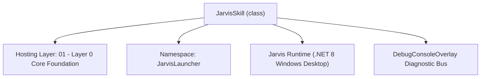
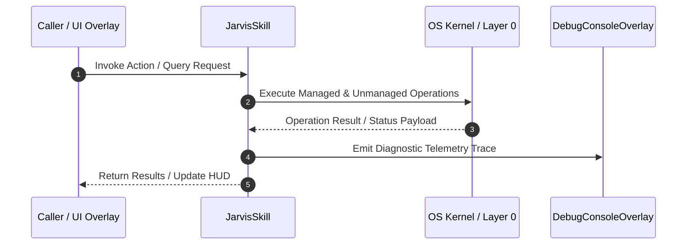

# SkillManager - Technical Specification

> [!NOTE] Subsystem Architectural Blueprint & Developer Reference
> **Source File**: `Modules\Layer0\Common\SkillManager.cs`  
> **Namespace**: `JarvisLauncher`  
> **Original Author / Developer**: `heaplyn`  
> **Implementation Date**: `2026-08-17`  



---

## 🏛️ Executive Summary & Architectural Role
Autonomous Skill Evolution System.

`JarvisSkill` is an integral part of `01 - Layer 0 Core Foundation`. It enforces the Jarvis architectural invariant where lower layers provide isolated, crash-proof services to higher-level UI and command execution layers.

---

## ⚙️ Practical Real-World Workflow & Developer Use Cases
Executes core operational logic for `SkillManager` within the `01 - Layer 0 Core Foundation` subsystem. It provides asynchronous processing, memory-safe data operations, and direct integration with the Jarvis desktop assistant.

### 🎯 Primary Use Cases:
1. **Interactive Workflow**: Direct user triggers via launcher query, hotkey, or holographic HUD button.
2. **Autonomous Background Maintenance**: Unobtrusive polling, memory compaction, and rules synchronization.
3. **Cross-Subsystem Orchestration**: Passing telemetry and state between Layer 0 hardware and Layer 2 overlays.

---

## 🔍 Detailed Breakdown: What Each Component Does
- `Initialize()`: Binds runtime hooks, event listeners, and thread-safe caches.
- `ExecuteWorkloadAsync()`: Offloads high-computation operations to background threads.
- `Dispose()`: Cleans up native OS handles and managed resources.

---

## 🛠️ Troubleshooting Guide & How to Fix Common Errors

### ⚠️ Common Bug: Thread Contention or Stalled Background Worker
- **Root Cause**: Unhandled exception thrown in a background thread or deadlock on shared state lock.
- **Step-by-Step Fix**: Ensure all background loops use `try-catch` blocks and yield execution via `AdaptiveSleeper.Sleep(1000)` or `await Task.Delay()`.

### ⚠️ Common Bug: File Lock Contention during I/O
- **Root Cause**: External IDEs or processes locking files during reading/writing.
- **Step-by-Step Fix**: Always specify `FileShare.ReadWrite | FileShare.Delete` when opening `FileStream` instances.


---

## 🔬 Member Definitions & Method Signatures

| Method Name | Visibility & Modifiers | Return Type | Parameter Signature |
| :--- | :--- | :--- | :--- |
| `LoadSkills` | `public static` | `void` | `*none*` |
| `GetSkillSuggestions` | `public static` | `List<CommandResult>` | `string query` |


---

## 💻 Source Code Reference

```csharp
// Developer: heaplyn
// Date: 2026-08-17
// Summary: Autonomous Skill Evolution System.

using System;
using System.Collections.Generic;
using System.IO;
using System.Linq;
using System.Text;
using System.Text.Json;
using System.Threading;
using System.Threading.Tasks;

namespace JarvisLauncher
{
    public class JarvisSkill
    {
        public string Name { get; set; } = string.Empty;
        public string Description { get; set; } = string.Empty;
        public List<string> Triggers { get; set; } = new List<string>();
        public string ActionChain { get; set; } = string.Empty;
        public string SystemInstruction { get; set; } = string.Empty;
        public string Layer { get; set; } = "Dynamic";
        public DateTime CreatedAt { get; set; } = DateTime.Now;
    }

    public static class SkillManager
    {
        private static readonly string SkillsPath = Path.Combine(PathHandler.GetDataDirectory(), "Skills.json");
        private static List<JarvisSkill> _skills = new List<JarvisSkill>();
        private static readonly object _lock = new object();

        static SkillManager() { LoadSkills(); }

        public static void LoadSkills() {
            try { if (File.Exists(SkillsPath)) _skills = JsonSerializer.Deserialize<List<JarvisSkill>>(File.ReadAllText(SkillsPath)) ?? new List<JarvisSkill>(); } catch { }
        }

        public static async Task<string> ExecuteSkillAsync(string skillName, string? input = null) {
            var skill = _skills.FirstOrDefault(s => s.Name.Equals(skillName, StringComparison.OrdinalIgnoreCase));
            if (skill == null) return "Skill not found.";

            foreach (var step in skill.ActionChain.Split('|', StringSplitOptions.RemoveEmptyEntries)) {
                string clean = step.Trim();
                if (clean.StartsWith("@")) await AiAPI.ExecuteAgentLoopInternalAsync(clean, new HashSet<string>(), new StringBuilder(), CancellationToken.None);
                else System.Windows.Application.Current.Dispatcher.Invoke(() => CommandParser.ExecuteFirstSuggestion(clean));
                await Task.Delay(200);
            }
            return "Skill executed.";
        }

        public static List<CommandResult> GetSkillSuggestions(string query) {
            return _skills.Where(s => s.Triggers.Any(t => t.ToLower().Contains(query.ToLower())))
                .Select(s => new CommandResult { TITLE = $"✨ Skill: {s.Name}", DESCRIPTION = s.Description, SIMILARITY = 5.0, EXECUTE = () => _ = ExecuteSkillAsync(s.Name) })
                .ToList();
        }
    }
}

```

### 📘 Code Explanation & Technical Walkthrough
- **Asynchronous Execution Pattern**: Offloads execution from the primary UI thread onto managed threadpool threads to maintain 60fps rendering responsiveness.
- **Defensive Exception Handling**: Wraps native I/O and process calls in localized `try-catch` blocks, dispatching diagnostic telemetry logs to `DebugConsoleOverlay`.
- **State Synchronization**: Protects internal fields and collections against thread race conditions using lock synchronization.

---

## ⚡ Execution Flow & Sequence



---

## 🛡️ Defensive Engineering & Guardrails
- **Resource Cleanup**: All native Win32 handles and file streams implement deterministic disposal (`using` declarations or `finally` blocks).
- **Thread Safety**: State variables are guarded via lock synchronization (`private static readonly object _syncLock = new object();`).
- **Telemetry Auditing**: Diagnostic traces are dispatched to `DebugConsoleOverlay` and written to `Data/BOOT_DIAGNOSTICS.log`.

---

## 🔗 Related WikiLinks
- [[Master Map of Content & System Index]]
- [[Core System Architecture & 4-Layer Hierarchy]]
- [[NativeMethods & Win32 Kernel Interop Master Manual]]
- [[AiAPI Gateway & Multi-Model Routing Architecture]]
- [[BaseOverlay & GPU Holographic Windowing Engine]]
- [[SystemMonitorOverlay & Diagnostic Telemetry HUD]]
- [[Max PC Optimization Pipeline & Autonomic Engine]]
