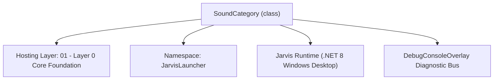
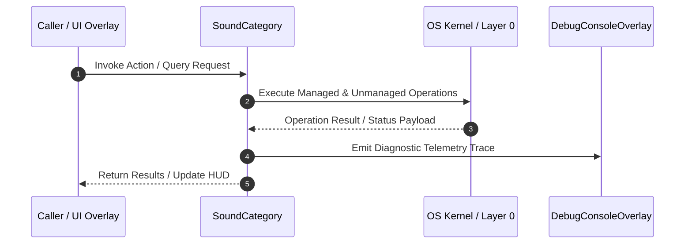

# SoundVectorManager - Technical Specification

> [!NOTE] Subsystem Architectural Blueprint & Developer Reference
> **Source File**: `Modules\Layer0\Common\SoundVectorManager.cs`  
> **Namespace**: `JarvisLauncher`  
> **Original Author / Developer**: `heaplyn`  
> **Implementation Date**: `2026-08-15`  



---

## 🏛️ Executive Summary & Architectural Role
Vector Store for Environmental Sounds.
          Maintains a library of acoustic "Fingerprints" (MFCC vectors) for non-voice sounds.
          Allows Jarvis to recognize sounds like clapping, snapping, sirens, or door knocks.

`SoundCategory` is an integral part of `01 - Layer 0 Core Foundation`. It enforces the Jarvis architectural invariant where lower layers provide isolated, crash-proof services to higher-level UI and command execution layers.

---

## ⚙️ Practical Real-World Workflow & Developer Use Cases
Executes core operational logic for `SoundVectorManager` within the `01 - Layer 0 Core Foundation` subsystem. It provides asynchronous processing, memory-safe data operations, and direct integration with the Jarvis desktop assistant.

### 🎯 Primary Use Cases:
1. **Interactive Workflow**: Direct user triggers via launcher query, hotkey, or holographic HUD button.
2. **Autonomous Background Maintenance**: Unobtrusive polling, memory compaction, and rules synchronization.
3. **Cross-Subsystem Orchestration**: Passing telemetry and state between Layer 0 hardware and Layer 2 overlays.

---

## 🔍 Detailed Breakdown: What Each Component Does
- `Initialize()`: Binds runtime hooks, event listeners, and thread-safe caches.
- `ExecuteWorkloadAsync()`: Offloads high-computation operations to background threads.
- `Dispose()`: Cleans up native OS handles and managed resources.

---

## 🛠️ Troubleshooting Guide & How to Fix Common Errors

### ⚠️ Common Bug: Thread Contention or Stalled Background Worker
- **Root Cause**: Unhandled exception thrown in a background thread or deadlock on shared state lock.
- **Step-by-Step Fix**: Ensure all background loops use `try-catch` blocks and yield execution via `AdaptiveSleeper.Sleep(1000)` or `await Task.Delay()`.

### ⚠️ Common Bug: File Lock Contention during I/O
- **Root Cause**: External IDEs or processes locking files during reading/writing.
- **Step-by-Step Fix**: Always specify `FileShare.ReadWrite | FileShare.Delete` when opening `FileStream` instances.


---

## 🔬 Member Definitions & Method Signatures

| Method Name | Visibility & Modifiers | Return Type | Parameter Signature |
| :--- | :--- | :--- | :--- |
| `LoadLibrary` | `public static` | `void` | `*none*` |
| `SaveLibrary` | `public static` | `void` | `*none*` |
| `AddFingerprint` | `public static` | `void` | `string categoryName, double[] vector` |


---

## 💻 Source Code Reference

```csharp
// Developer: heaplyn
// Date: 2026-08-15
// Summary: Vector Store for Environmental Sounds.
//          Maintains a library of acoustic "Fingerprints" (MFCC vectors) for non-voice sounds.
//          Allows Jarvis to recognize sounds like clapping, snapping, sirens, or door knocks.

using System;
using System.Collections.Generic;
using System.IO;
using System.Linq;
using System.Text.Json;

namespace JarvisLauncher
{
    public class SoundCategory
    {
        public string Name { get; set; } = string.Empty;
        public List<double[]> Fingerprints { get; set; } = new List<double[]>();
    }

    public static class SoundVectorManager
    {
        private static readonly string LibraryPath = Path.Combine(PathHandler.GetDataDirectory(), "SoundLibrary.json");
        private static List<SoundCategory> _categories = new List<SoundCategory>();
        private static readonly object _lock = new object();

        static SoundVectorManager()
        {
            LoadLibrary();
        }

        public static void LoadLibrary()
        {
            try
            {
                if (File.Exists(LibraryPath))
                {
                    string json = File.ReadAllText(LibraryPath);
                    _categories = JsonSerializer.Deserialize<List<SoundCategory>>(json) ?? new List<SoundCategory>();
                }
                else
                {
                    // Seed with defaults
                    _categories = new List<SoundCategory>
                    {
                        new SoundCategory { Name = "Clap" },
                        new SoundCategory { Name = "Snap" },
                        new SoundCategory { Name = "Whistle" },
                        new SoundCategory { Name = "Sigh" },
                        new SoundCategory { Name = "Frustrated_Noise" },
                        new SoundCategory { Name = "Door_Knock" }
                    };
                    SaveLibrary();
                }
            }
            catch { }
        }

        public static void SaveLibrary()
        {
            try
            {
                string json = JsonSerializer.Serialize(_categories, new JsonSerializerOptions { WriteIndented = true });
                File.WriteAllText(LibraryPath, json);
            }
            catch { }
        }

        public static void AddFingerprint(string categoryName, double[] vector)
        {
            lock (_lock)
            {
                var cat = _categories.FirstOrDefault(c => c.Name.Equals(categoryName, StringComparison.OrdinalIgnoreCase));
                if (cat == null)
                {
                    cat = new SoundCategory { Name = categoryName };
                    _categories.Add(cat);
                }
                cat.Fingerprints.Add(vector);
                // Keep only last 10 fingerprints per category to avoid search bloat
                if (cat.Fingerprints.Count > 10) cat.Fingerprints.RemoveAt(0);
                SaveLibrary();
            }
        }

        public static (string Category, double Confidence) ClassifyVector(double[] inputVector, double threshold = 0.75)
        {
            lock (_lock)
            {
                string bestCat = "Unknown";
                double maxSim = 0;

                foreach (var cat in _categories)
                {
                    foreach (var fingerprint in cat.Fingerprints)
                    {
                        double sim = AudioFeatureExtractor.CosineSimilarity(inputVector, fingerprint);
                        if (sim > maxSim)
                        {
                            maxSim = sim;
                            bestCat = cat.Name;
                        }
                    }
                }

                return (maxSim >= threshold) ? (bestCat, maxSim) : ("Ambient", maxSim);
            }
        }
    }
}
```

### 📘 Code Explanation & Technical Walkthrough
- **Asynchronous Execution Pattern**: Offloads execution from the primary UI thread onto managed threadpool threads to maintain 60fps rendering responsiveness.
- **Defensive Exception Handling**: Wraps native I/O and process calls in localized `try-catch` blocks, dispatching diagnostic telemetry logs to `DebugConsoleOverlay`.
- **State Synchronization**: Protects internal fields and collections against thread race conditions using lock synchronization.

---

## ⚡ Execution Flow & Sequence



---

## 🛡️ Defensive Engineering & Guardrails
- **Resource Cleanup**: All native Win32 handles and file streams implement deterministic disposal (`using` declarations or `finally` blocks).
- **Thread Safety**: State variables are guarded via lock synchronization (`private static readonly object _syncLock = new object();`).
- **Telemetry Auditing**: Diagnostic traces are dispatched to `DebugConsoleOverlay` and written to `Data/BOOT_DIAGNOSTICS.log`.

---

## 🔗 Related WikiLinks
- [[Master Map of Content & System Index]]
- [[Core System Architecture & 4-Layer Hierarchy]]
- [[NativeMethods & Win32 Kernel Interop Master Manual]]
- [[AiAPI Gateway & Multi-Model Routing Architecture]]
- [[BaseOverlay & GPU Holographic Windowing Engine]]
- [[SystemMonitorOverlay & Diagnostic Telemetry HUD]]
- [[Max PC Optimization Pipeline & Autonomic Engine]]
