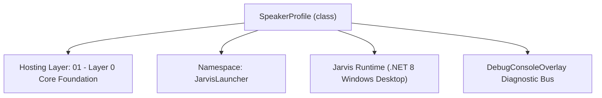
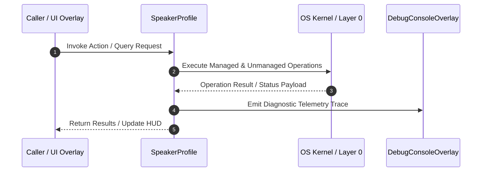

# SpeakerBiometricsManager - Technical Specification

> [!NOTE] Subsystem Architectural Blueprint & Developer Reference
> **Source File**: `Modules\Layer0\Common\SpeakerBiometricsManager.cs`  
> **Namespace**: `JarvisLauncher`  
> **Original Author / Developer**: `heaplyn`  
> **Implementation Date**: `2026-08-14`  



---

## 🏛️ Executive Summary & Architectural Role
Speaker Biometrics Engine for voiceprint identification and owner verification.
          Extracts vocal feature embeddings (d-vector/x-vector proxy) using Mel-Frequency Cepstral Coefficients (MFCCs).
          Verifies speaker identity using Cosine Similarity matching against a clustered space of enrolled templates.

`SpeakerProfile` is an integral part of `01 - Layer 0 Core Foundation`. It enforces the Jarvis architectural invariant where lower layers provide isolated, crash-proof services to higher-level UI and command execution layers.

---

## ⚙️ Practical Real-World Workflow & Developer Use Cases
Executes core operational logic for `SpeakerBiometricsManager` within the `01 - Layer 0 Core Foundation` subsystem. It provides asynchronous processing, memory-safe data operations, and direct integration with the Jarvis desktop assistant.

### 🎯 Primary Use Cases:
1. **Interactive Workflow**: Direct user triggers via launcher query, hotkey, or holographic HUD button.
2. **Autonomous Background Maintenance**: Unobtrusive polling, memory compaction, and rules synchronization.
3. **Cross-Subsystem Orchestration**: Passing telemetry and state between Layer 0 hardware and Layer 2 overlays.

---

## 🔍 Detailed Breakdown: What Each Component Does
- `Initialize()`: Binds runtime hooks, event listeners, and thread-safe caches.
- `ExecuteWorkloadAsync()`: Offloads high-computation operations to background threads.
- `Dispose()`: Cleans up native OS handles and managed resources.

---

## 🛠️ Troubleshooting Guide & How to Fix Common Errors

### ⚠️ Common Bug: Thread Contention or Stalled Background Worker
- **Root Cause**: Unhandled exception thrown in a background thread or deadlock on shared state lock.
- **Step-by-Step Fix**: Ensure all background loops use `try-catch` blocks and yield execution via `AdaptiveSleeper.Sleep(1000)` or `await Task.Delay()`.

### ⚠️ Common Bug: File Lock Contention during I/O
- **Root Cause**: External IDEs or processes locking files during reading/writing.
- **Step-by-Step Fix**: Always specify `FileShare.ReadWrite | FileShare.Delete` when opening `FileStream` instances.


---

## 🔬 Member Definitions & Method Signatures

| Method Name | Visibility & Modifiers | Return Type | Parameter Signature |
| :--- | :--- | :--- | :--- |
| `LoadProfile` | `public static` | `void` | `*none*` |
| `SaveProfile` | `public static` | `void` | `SpeakerProfile profile` |
| `EnrollFromWav` | `public static` | `bool` | `string speakerName, string wavPath` |
| `MatchAgainstCluster` | `public static` | `double` | `double[] inputEmbedding` |
| `AverageEmbeddings` | `private static` | `double[]` | `List<double[]> embeddings` |
| `ExtractVoiceEmbeddingFromWav` | `public static` | `double[]` | `string wavPath` |


---

## 💻 Source Code Reference

```csharp
// Developer: heaplyn
// Date: 2026-08-14
// Summary: Speaker Biometrics Engine for voiceprint identification and owner verification.
//          Extracts vocal feature embeddings (d-vector/x-vector proxy) using Mel-Frequency Cepstral Coefficients (MFCCs).
//          Verifies speaker identity using Cosine Similarity matching against a clustered space of enrolled templates.

using System;
using System.IO;
using System.Text.Json;
using System.Linq;
using System.Collections.Generic;

namespace JarvisLauncher
{
    public class SpeakerProfile
    {
        public string EnrolledName { get; set; } = "Kyle";
        public double[] VoiceEmbedding { get; set; } = Array.Empty<double>(); // Average profile vector
        public List<double[]> VoiceEmbeddings { get; set; } = new List<double[]>(); // Clustered space vectors
        public double VerificationThreshold { get; set; } = 0.70;
        public DateTime EnrollmentDate { get; set; } = DateTime.Now;
    }

    public static class SpeakerBiometricsManager
    {
        private static SpeakerProfile? _currentProfile;
        private static readonly string ProfileFileName = "SpeakerProfile.json";

        static SpeakerBiometricsManager()
        {
            LoadProfile();
        }

        public static bool IsEnrolled => _currentProfile != null && _currentProfile.VoiceEmbeddings != null && _currentProfile.VoiceEmbeddings.Count > 0;
        public static string EnrolledName => _currentProfile?.EnrolledName ?? "None";
        public static double[]? ActiveEmbedding => _currentProfile?.VoiceEmbedding;
        public static List<double[]>? ClusterEmbeddings => _currentProfile?.VoiceEmbeddings;

        /// <summary>
        /// Loads the enrolled speaker profile from disk.
        /// </summary>
        public static void LoadProfile()
        {
            try
            {
                string dataDir = PathHandler.GetDataDirectory();
                string path = Path.Combine(dataDir, ProfileFileName);

                if (File.Exists(path))
                {
                    string json = File.ReadAllText(path);
                    _currentProfile = JsonSerializer.Deserialize<SpeakerProfile>(json);
                    
                    // Migration fallback for legacy profiles with only a single vector
                    if (_currentProfile != null && _currentProfile.VoiceEmbeddings.Count == 0 && _currentProfile.VoiceEmbedding.Length > 0)
                    {
                        _currentProfile.VoiceEmbeddings.Add(_currentProfile.VoiceEmbedding);
                    }

                    if (_currentProfile != null)
                    {
                        DebugConsoleOverlay.Log("Biometrics", $"Loaded speaker profile for '{_currentProfile.EnrolledName}' (embedded templates: {_currentProfile.VoiceEmbeddings.Count} in cluster).");
                    }
                }
            }
            catch (Exception ex)
            {
                DebugConsoleOverlay.Log("Biometrics Error", $"Failed to load speaker profile: {ex.Message}");
            }
        }

        /// <summary>
        /// Saves a speaker profile to disk.
        /// </summary>
        public static void SaveProfile(SpeakerProfile profile)
        {
            try
            {
                string dataDir = PathHandler.GetDataDirectory();
                string path = Path.Combine(dataDir, ProfileFileName);

                string json = JsonSerializer.Serialize(profile, new JsonSerializerOptions { WriteIndented = true });
                File.WriteAllText(path, json);
                _currentProfile = profile;

                DebugConsoleOverlay.Log("Biometrics", $"Successfully enrolled and saved voiceprint profile for '{profile.EnrolledName}' with {profile.VoiceEmbeddings.Count} cluster points.");
            }
            catch (Exception ex)
            {
                DebugConsoleOverlay.Log("Biometrics Error", $"Failed to save speaker profile: {ex.Message}");
            }
        }

        /// <summary>
        /// Enrolls a speaker by extracting and appending their voiceprint embedding to the template cluster.
        /// </summary>
        public static bool EnrollFromWav(string speakerName, string wavPath)
        {
            double[] embedding = ExtractVoiceEmbeddingFromWav(wavPath);
            if (embedding == null || embedding.Length == 0) return false;

            LoadProfile(); // Reload to ensure we append to the latest profile

            var profile = _currentProfile;
            if (profile == null || !profile.EnrolledName.Equals(speakerName, StringComparison.OrdinalIgnoreCase))
            {
                profile = new SpeakerProfile
                {
                    EnrolledName = speakerName,
                    VoiceEmbeddings = new List<double[]>(),
                    VerificationThreshold = SettingsManager.Current.SPEAKER_VERIFICATION_THRESHOLD,
                    EnrollmentDate = DateTime.Now
                };
            }

            profile.VoiceEmbeddings.Add(embedding);
            profile.VoiceEmbedding = AverageEmbeddings(profile.VoiceEmbeddings); // Update average centroid vector

            SaveProfile(profile);
            return true;
        }

        /// <summary>
        /// Matches an input embedding against all templates in the cluster and returns the maximum similarity.
        /// </summary>
        public static double MatchAgainstCluster(double[] inputEmbedding)
        {
            if (!IsEnrolled || _currentProfile == null || _currentProfile.VoiceEmbeddings.Count == 0)
            {
                return 0.0;
            }

            double maxSimilarity = 0.0;
            foreach (var template in _currentProfile.VoiceEmbeddings)
            {
                double sim = AudioFeatureExtractor.CosineSimilarity(template, inputEmbedding);
                if (sim > maxSimilarity)
                {
                    maxSimilarity = sim;
                }
            }

            return maxSimilarity;
        }

        /// <summary>
        /// Verifies whether the speaker of a WAV audio clip matches the enrolled voice profile cluster.
        /// </summary>
        public static (bool IsVerified, double Score) VerifySpeakerFromWav(string wavPath)
        {
            if (!IsEnrolled || _currentProfile == null)
            {
                DebugConsoleOverlay.Log("Biometrics Warning", "Verification skipped: No voice profile is enrolled yet.");
                return (true, 1.0);
            }

            double[] inputEmbedding = ExtractVoiceEmbeddingFromWav(wavPath);
            if (inputEmbedding == null || inputEmbedding.Length == 0)
            {
                DebugConsoleOverlay.Log("Biometrics", "Verification failed: Could not extract voice features from clip.");
                return (false, 0.0);
            }

            double similarity = MatchAgainstCluster(inputEmbedding);
            bool isVerified = similarity >= SettingsManager.Current.SPEAKER_VERIFICATION_THRESHOLD;

            DebugConsoleOverlay.Log("Biometrics", $"Cluster match verification: {isVerified} (Score: {similarity:F3} vs Threshold: {SettingsManager.Current.SPEAKER_VERIFICATION_THRESHOLD:F2})");
            return (isVerified, similarity);
        }

        private static double[] AverageEmbeddings(List<double[]> embeddings)
        {
            if (embeddings == null || embeddings.Count == 0) return Array.Empty<double>();
            int dim = embeddings[0].Length;
            double[] avg = new double[dim];

            for (int d = 0; d < dim; d++)
            {
                double sum = 0.0;
                for (int i = 0; i < embeddings.Count; i++)
                {
                    sum += embeddings[i][d];
                }
                avg[d] = sum / embeddings.Count;
            }

            return avg;
        }

        /// <summary>
        /// Extracts a fixed-dimensional voiceprint representation (d-vector/x-vector proxy)
        /// by averaging the acoustic MFCC feature bands across the duration of spoken speech.
        /// </summary>
        public static double[] ExtractVoiceEmbeddingFromWav(string wavPath)
        {
            if (!File.Exists(wavPath)) return Array.Empty<double>();

            try
            {
                int sampleRate, channels;
                float[] rawPcm = RawWavProcessor.ReadRawUncompressedPcm(wavPath, out sampleRate, out channels);
                if (rawPcm == null || rawPcm.Length == 0) return Array.Empty<double>();

                // 1. DSP Pre-processing: Apply 80Hz high-pass and noise gate filtration
                float[] cleaned = RawWavProcessor.CleanAudioNoiseGate(rawPcm, sampleRate);

                // 2. Fragment the speech signal into 20ms overlapping windows (framing)
                int windowSamples = (int)(sampleRate * 0.02); // 20ms window = 320 samples
                int stepSamples = (int)(sampleRate * 0.01);   // 10ms frame step (50% overlap) = 160 samples

                int frameCount = (cleaned.Length - windowSamples) / stepSamples;
                if (frameCount <= 0) return Array.Empty<double>();

                // We extract 20 MFCC coefficients for each active frame
                double[][] frameMfcc = new double[frameCount][];
                float[] frameBuf = new float[windowSamples];

                int validFrames = 0;
                for (int f = 0; f < frameCount; f++)
                {
                    int start = f * stepSamples;
                    Array.Copy(cleaned, start, frameBuf, 0, windowSamples);

                    // Compute RMS to ignore silence frames (Voice Activity Detection - VAD)
                    double frameRms = 0.0;
                    for (int s = 0; s < windowSamples; s++) frameRms += frameBuf[s] * frameBuf[s];
                    frameRms = Math.Sqrt(frameRms / windowSamples);

                    // If frame contains voice speech energy above VAD gate
                    if (frameRms > 0.01) 
                    {
                        // Extract 20-band acoustic coefficients for this active frame
                        frameMfcc[validFrames] = RawWavProcessor.Extract20BandMfcc(frameBuf, sampleRate);
                        validFrames++;
                    }
                }

                if (validFrames == 0) return Array.Empty<double>();

                // 3. Pool the frame embeddings (average over time) to construct a global d-vector proxy
                double[] voiceprint = new double[20];
                for (int band = 0; band < 20; band++)
                {
                    double sum = 0.0;
                    for (int f = 0; f < validFrames; f++)
                    {
                        sum += frameMfcc[f][band];
                    }
                    voiceprint[band] = sum / validFrames;
                }

                return voiceprint;
            }
            catch (Exception ex)
            {
                DebugConsoleOverlay.Log("Biometrics Error", $"Acoustic embedding extraction failed: {ex.Message}");
                return Array.Empty<double>();
            }
        }
    }
}
```

### 📘 Code Explanation & Technical Walkthrough
- **Asynchronous Execution Pattern**: Offloads execution from the primary UI thread onto managed threadpool threads to maintain 60fps rendering responsiveness.
- **Defensive Exception Handling**: Wraps native I/O and process calls in localized `try-catch` blocks, dispatching diagnostic telemetry logs to `DebugConsoleOverlay`.
- **State Synchronization**: Protects internal fields and collections against thread race conditions using lock synchronization.

---

## ⚡ Execution Flow & Sequence



---

## 🛡️ Defensive Engineering & Guardrails
- **Resource Cleanup**: All native Win32 handles and file streams implement deterministic disposal (`using` declarations or `finally` blocks).
- **Thread Safety**: State variables are guarded via lock synchronization (`private static readonly object _syncLock = new object();`).
- **Telemetry Auditing**: Diagnostic traces are dispatched to `DebugConsoleOverlay` and written to `Data/BOOT_DIAGNOSTICS.log`.

---

## 🔗 Related WikiLinks
- [[Master Map of Content & System Index]]
- [[Core System Architecture & 4-Layer Hierarchy]]
- [[NativeMethods & Win32 Kernel Interop Master Manual]]
- [[AiAPI Gateway & Multi-Model Routing Architecture]]
- [[BaseOverlay & GPU Holographic Windowing Engine]]
- [[SystemMonitorOverlay & Diagnostic Telemetry HUD]]
- [[Max PC Optimization Pipeline & Autonomic Engine]]
