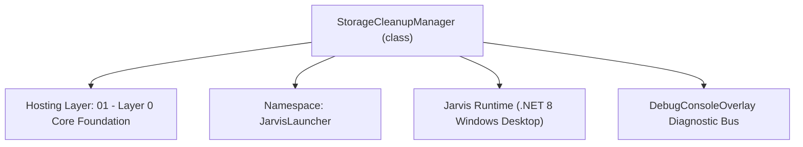
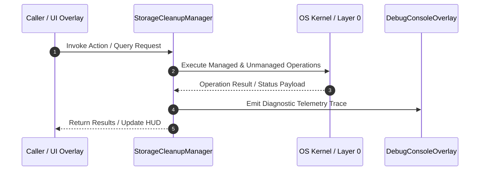

# StorageCleanupManager - Technical Specification

> [!NOTE] Subsystem Architectural Blueprint & Developer Reference
> **Source File**: `Modules\Layer0\Database\StorageCleanupManager.cs`  
> **Namespace**: `JarvisLauncher`  
> **Original Author / Developer**: `heaplyn`  
> **Implementation Date**: `2026-08-17`  



---

## 🏛️ Executive Summary & Architectural Role
High-performance Storage Cleanup & Analysis Service.
          Handles temp files, recycle bin, large file discovery, and log rotation.

`StorageCleanupManager` is an integral part of `01 - Layer 0 Core Foundation`. It enforces the Jarvis architectural invariant where lower layers provide isolated, crash-proof services to higher-level UI and command execution layers.

---

## ⚙️ Practical Real-World Workflow & Developer Use Cases
Executes core operational logic for `StorageCleanupManager` within the `01 - Layer 0 Core Foundation` subsystem. It provides asynchronous processing, memory-safe data operations, and direct integration with the Jarvis desktop assistant.

### 🎯 Primary Use Cases:
1. **Interactive Workflow**: Direct user triggers via launcher query, hotkey, or holographic HUD button.
2. **Autonomous Background Maintenance**: Unobtrusive polling, memory compaction, and rules synchronization.
3. **Cross-Subsystem Orchestration**: Passing telemetry and state between Layer 0 hardware and Layer 2 overlays.

---

## 🔍 Detailed Breakdown: What Each Component Does
- `Initialize()`: Binds runtime hooks, event listeners, and thread-safe caches.
- `ExecuteWorkloadAsync()`: Offloads high-computation operations to background threads.
- `Dispose()`: Cleans up native OS handles and managed resources.

---

## 🛠️ Troubleshooting Guide & How to Fix Common Errors

### ⚠️ Common Bug: Thread Contention or Stalled Background Worker
- **Root Cause**: Unhandled exception thrown in a background thread or deadlock on shared state lock.
- **Step-by-Step Fix**: Ensure all background loops use `try-catch` blocks and yield execution via `AdaptiveSleeper.Sleep(1000)` or `await Task.Delay()`.

### ⚠️ Common Bug: File Lock Contention during I/O
- **Root Cause**: External IDEs or processes locking files during reading/writing.
- **Step-by-Step Fix**: Always specify `FileShare.ReadWrite | FileShare.Delete` when opening `FileStream` instances.


---

## 🔬 Member Definitions & Method Signatures

| Method Name | Visibility & Modifiers | Return Type | Parameter Signature |
| :--- | :--- | :--- | :--- |
| `GetTempFolderSizeAsync` | `public ` | `Task<long>` | `*none*` |
| `ClearTempFilesAsync` | `public ` | `Task<int>` | `*none*` |
| `GetRecycleBinSizeAsync` | `public ` | `Task<long>` | `*none*` |
| `EmptyRecycleBinAsync` | `public ` | `Task<bool>` | `*none*` |
| `FindLargeFilesAsync` | `public ` | `Task<List<StorageFileItem>>` | `string rootPath, long minSize, int limit` |
| `GetLogFolderSizeAsync` | `public ` | `Task<long>` | `*none*` |
| `CleanOldLogsAsync` | `public ` | `Task<int>` | `int days` |
| `GetDirectorySize` | `private ` | `long` | `string path` |
| `ClearTempStatic` | `public static` | `Task<int>` | `*none*` |
| `EmptyBinStatic` | `public static` | `Task<bool>` | `*none*` |


---

## 💻 Source Code Reference

```csharp
// Developer: heaplyn
// Date: 2026-08-17
// Summary: High-performance Storage Cleanup & Analysis Service.
//          Handles temp files, recycle bin, large file discovery, and log rotation.

using System;
using System.Collections.Generic;
using System.IO;
using System.Linq;
using System.Runtime.InteropServices;
using System.Threading.Tasks;

namespace JarvisLauncher
{
    public class StorageCleanupManager : IStorageCleanupService
    {
        [DllImport("shell32.dll")]
        static extern int SHEmptyRecycleBin(IntPtr hwnd, string? pszRootPath, uint dwFlags);
        const uint SHERB_NOCONFIRMATION = 0x00000001;
        const uint SHERB_NOPROGRESSUI = 0x00000002;
        const uint SHERB_NOSOUND = 0x00000004;

        public Task<long> GetTempFolderSizeAsync() => Task.Run(() => GetDirectorySize(Path.GetTempPath()));

        public Task<int> ClearTempFilesAsync() => Task.Run(() => {
            int count = 0;
            foreach (var file in Directory.GetFiles(Path.GetTempPath())) {
                try { File.Delete(file); count++; } catch { }
            }
            foreach (var dir in Directory.GetDirectories(Path.GetTempPath())) {
                try { Directory.Delete(dir, true); count++; } catch { }
            }
            return count;
        });

        public Task<long> GetRecycleBinSizeAsync() => Task.Run(() => {
            // Complex to get exact size via Shell, simplified estimate
            return 0L;
        });

        public Task<bool> EmptyRecycleBinAsync() => Task.Run(() => {
            try {
                int res = SHEmptyRecycleBin(IntPtr.Zero, null, SHERB_NOCONFIRMATION | SHERB_NOPROGRESSUI | SHERB_NOSOUND);
                return res == 0;
            } catch { return false; }
        });

        public Task<List<StorageFileItem>> FindLargeFilesAsync(string rootPath, long minSize, int limit) => Task.Run(() => {
            var items = new List<StorageFileItem>();
            try {
                var dir = new DirectoryInfo(rootPath);
                var files = dir.GetFiles("*.*", SearchOption.AllDirectories)
                               .Where(f => f.Length >= minSize)
                               .OrderByDescending(f => f.Length)
                               .Take(limit);
                foreach (var f in files) items.Add(new StorageFileItem { Name = f.Name, Path = f.FullName, SizeBytes = f.Length });
            } catch { }
            return items;
        });

        public Task<long> GetLogFolderSizeAsync() => Task.Run(() => {
            string logDir = Path.Combine(PathHandler.GetDataDirectory(), "Logs");
            return GetDirectorySize(logDir);
        });

        public Task<int> CleanOldLogsAsync(int days) => Task.Run(() => {
            int count = 0;
            string logDir = Path.Combine(PathHandler.GetDataDirectory(), "Logs");
            if (!Directory.Exists(logDir)) return 0;
            foreach (var file in Directory.GetFiles(logDir)) {
                if (File.GetCreationTime(file) < DateTime.Now.AddDays(-days)) {
                    try { File.Delete(file); count++; } catch { }
                }
            }
            return count;
        });

        public Dictionary<string, string> GetDiskSpaceInfo()
        {
            var info = new Dictionary<string, string>();
            foreach (var drive in DriveInfo.GetDrives().Where(d => d.IsReady)) {
                double free = drive.AvailableFreeSpace / 1024.0 / 1024.0 / 1024.0;
                double total = drive.TotalSize / 1024.0 / 1024.0 / 1024.0;
                info[drive.Name] = $"{free:F1} GB free of {total:F1} GB";
            }
            return info;
        }

        private long GetDirectorySize(string path) {
            if (!Directory.Exists(path)) return 0;
            return Directory.GetFiles(path, "*.*", SearchOption.AllDirectories).Sum(f => new FileInfo(f).Length);
        }

        // Static Bridge
        public static Task<int> ClearTempStatic() => CoreRegistry.Data.StorageCleanup.ClearTempFilesAsync();
        public static Task<bool> EmptyBinStatic() => CoreRegistry.Data.StorageCleanup.EmptyRecycleBinAsync();
    }
}
```

### 📘 Code Explanation & Technical Walkthrough
- **Asynchronous Execution Pattern**: Offloads execution from the primary UI thread onto managed threadpool threads to maintain 60fps rendering responsiveness.
- **Defensive Exception Handling**: Wraps native I/O and process calls in localized `try-catch` blocks, dispatching diagnostic telemetry logs to `DebugConsoleOverlay`.
- **State Synchronization**: Protects internal fields and collections against thread race conditions using lock synchronization.

---

## ⚡ Execution Flow & Sequence



---

## 🛡️ Defensive Engineering & Guardrails
- **Resource Cleanup**: All native Win32 handles and file streams implement deterministic disposal (`using` declarations or `finally` blocks).
- **Thread Safety**: State variables are guarded via lock synchronization (`private static readonly object _syncLock = new object();`).
- **Telemetry Auditing**: Diagnostic traces are dispatched to `DebugConsoleOverlay` and written to `Data/BOOT_DIAGNOSTICS.log`.

---

## 🔗 Related WikiLinks
- [[Master Map of Content & System Index]]
- [[Core System Architecture & 4-Layer Hierarchy]]
- [[NativeMethods & Win32 Kernel Interop Master Manual]]
- [[AiAPI Gateway & Multi-Model Routing Architecture]]
- [[BaseOverlay & GPU Holographic Windowing Engine]]
- [[SystemMonitorOverlay & Diagnostic Telemetry HUD]]
- [[Max PC Optimization Pipeline & Autonomic Engine]]
