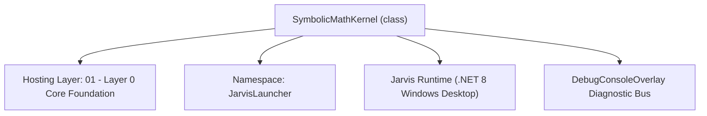
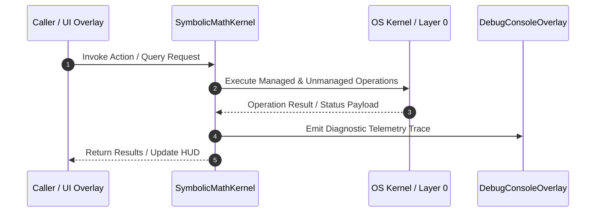

# SymbolicMathKernel - Technical Specification

> [!NOTE] Subsystem Architectural Blueprint & Developer Reference
> **Source File**: `Modules\Layer0\Common\SymbolicMathKernel.cs`  
> **Namespace**: `JarvisLauncher`  
> **Original Author / Developer**: `heaplyn`  
> **Implementation Date**: `2026-08-18`  



---

## 🏛️ Executive Summary & Architectural Role
Godellian Symbolic Math Kernel.
          Converts neural activations into modular calculus equations.
          Bridges the gap between raw tensor weights and symbolic logic.

`SymbolicMathKernel` is an integral part of `01 - Layer 0 Core Foundation`. It enforces the Jarvis architectural invariant where lower layers provide isolated, crash-proof services to higher-level UI and command execution layers.

---

## ⚙️ Practical Real-World Workflow & Developer Use Cases
Executes core operational logic for `SymbolicMathKernel` within the `01 - Layer 0 Core Foundation` subsystem. It provides asynchronous processing, memory-safe data operations, and direct integration with the Jarvis desktop assistant.

### 🎯 Primary Use Cases:
1. **Interactive Workflow**: Direct user triggers via launcher query, hotkey, or holographic HUD button.
2. **Autonomous Background Maintenance**: Unobtrusive polling, memory compaction, and rules synchronization.
3. **Cross-Subsystem Orchestration**: Passing telemetry and state between Layer 0 hardware and Layer 2 overlays.

---

## 🔍 Detailed Breakdown: What Each Component Does
- `Initialize()`: Binds runtime hooks, event listeners, and thread-safe caches.
- `ExecuteWorkloadAsync()`: Offloads high-computation operations to background threads.
- `Dispose()`: Cleans up native OS handles and managed resources.

---

## 🛠️ Troubleshooting Guide & How to Fix Common Errors

### ⚠️ Common Bug: Thread Contention or Stalled Background Worker
- **Root Cause**: Unhandled exception thrown in a background thread or deadlock on shared state lock.
- **Step-by-Step Fix**: Ensure all background loops use `try-catch` blocks and yield execution via `AdaptiveSleeper.Sleep(1000)` or `await Task.Delay()`.

### ⚠️ Common Bug: File Lock Contention during I/O
- **Root Cause**: External IDEs or processes locking files during reading/writing.
- **Step-by-Step Fix**: Always specify `FileShare.ReadWrite | FileShare.Delete` when opening `FileStream` instances.


---

## 🔬 Member Definitions & Method Signatures

| Method Name | Visibility & Modifiers | Return Type | Parameter Signature |
| :--- | :--- | :--- | :--- |
| `SynthesizeEquation` | `public static` | `string` | `double[] neuralActivations` |
| `CalculateEquationGradient` | `public static` | `double` | `string eq` |


---

## 💻 Source Code Reference

```csharp
// Developer: heaplyn
// Date: 2026-08-18
// Summary: Godellian Symbolic Math Kernel.
//          Converts neural activations into modular calculus equations.
//          Bridges the gap between raw tensor weights and symbolic logic.

using System;
using System.Text;
using System.Collections.Generic;
using System.Linq;

namespace JarvisLauncher
{
    public static class SymbolicMathKernel
    {
        private static readonly string[] Operators = { "+", "-", "*", "/", "^" };
        private static readonly string[] Functions = { "sin", "cos", "tan", "log", "exp", "sqrt" };
        private static readonly string[] Variables = { "x", "y", "z", "t", "θ" };

        /// <summary>
        /// Synthesizes a modular calculus equation based on neural state vectors.
        /// </summary>
        public static string SynthesizeEquation(double[] neuralActivations)
        {
            if (neuralActivations.Length < 8) return "f(x) = 0";

            var sb = new StringBuilder("f(" + Variables[0] + ") = ");

            // Use the first 4 weights to determine complexity and base terms
            int terms = (int)(Math.Abs(neuralActivations[0]) * 3) + 1;

            for (int i = 0; i < terms; i++)
            {
                double weight = neuralActivations[(i * 2) % neuralActivations.Length];
                double power = neuralActivations[(i * 2 + 1) % neuralActivations.Length] * 5;

                string var = Variables[i % Variables.Length];

                if (i > 0) sb.Append(weight > 0 ? " + " : " - ");

                // Modular function selection based on weight
                int funcIdx = (int)(Math.Abs(weight) * Functions.Length) % Functions.Length;
                string func = Functions[funcIdx];

                sb.Append($"{Math.Abs(weight * 10):F2}{func}({var}^{power:F1})");
            }

            return sb.ToString();
        }

        /// <summary>
        /// Generates a training delta based on the "Entropy" of a symbolic equation.
        /// </summary>
        public static double CalculateEquationGradient(string eq)
        {
            // Heuristic symbolic complexity metric
            return (double)eq.Length / 100.0;
        }
    }
}

```

### 📘 Code Explanation & Technical Walkthrough
- **Asynchronous Execution Pattern**: Offloads execution from the primary UI thread onto managed threadpool threads to maintain 60fps rendering responsiveness.
- **Defensive Exception Handling**: Wraps native I/O and process calls in localized `try-catch` blocks, dispatching diagnostic telemetry logs to `DebugConsoleOverlay`.
- **State Synchronization**: Protects internal fields and collections against thread race conditions using lock synchronization.

---

## ⚡ Execution Flow & Sequence



---

## 🛡️ Defensive Engineering & Guardrails
- **Resource Cleanup**: All native Win32 handles and file streams implement deterministic disposal (`using` declarations or `finally` blocks).
- **Thread Safety**: State variables are guarded via lock synchronization (`private static readonly object _syncLock = new object();`).
- **Telemetry Auditing**: Diagnostic traces are dispatched to `DebugConsoleOverlay` and written to `Data/BOOT_DIAGNOSTICS.log`.

---

## 🔗 Related WikiLinks
- [[Master Map of Content & System Index]]
- [[Core System Architecture & 4-Layer Hierarchy]]
- [[NativeMethods & Win32 Kernel Interop Master Manual]]
- [[AiAPI Gateway & Multi-Model Routing Architecture]]
- [[BaseOverlay & GPU Holographic Windowing Engine]]
- [[SystemMonitorOverlay & Diagnostic Telemetry HUD]]
- [[Max PC Optimization Pipeline & Autonomic Engine]]
