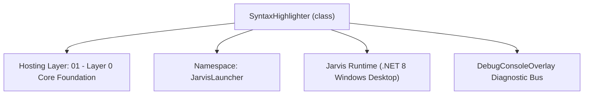
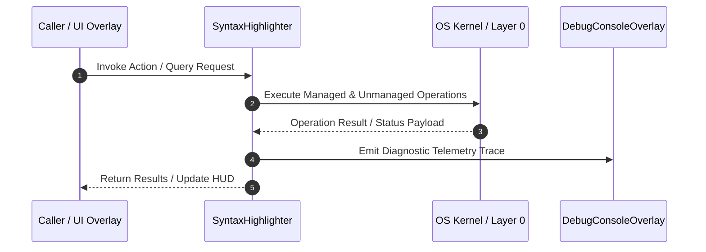

# SyntaxHighlighter - Technical Specification

> [!NOTE] Subsystem Architectural Blueprint & Developer Reference
> **Source File**: `Modules\Layer0\Common\SyntaxHighlighter.cs`  
> **Namespace**: `JarvisLauncher`  
> **Original Author / Developer**: `heaplyn`  
> **Implementation Date**: `2026-08-18`  



---

## 🏛️ Executive Summary & Architectural Role
High-performance syntax highlighter for WPF RichTextBox.
          Fixes the "broken words" issue by using a robust tokenization method
          and avoiding offset drift caused by document tags.

`SyntaxHighlighter` is an integral part of `01 - Layer 0 Core Foundation`. It enforces the Jarvis architectural invariant where lower layers provide isolated, crash-proof services to higher-level UI and command execution layers.

---

## ⚙️ Practical Real-World Workflow & Developer Use Cases
Executes core operational logic for `SyntaxHighlighter` within the `01 - Layer 0 Core Foundation` subsystem. It provides asynchronous processing, memory-safe data operations, and direct integration with the Jarvis desktop assistant.

### 🎯 Primary Use Cases:
1. **Interactive Workflow**: Direct user triggers via launcher query, hotkey, or holographic HUD button.
2. **Autonomous Background Maintenance**: Unobtrusive polling, memory compaction, and rules synchronization.
3. **Cross-Subsystem Orchestration**: Passing telemetry and state between Layer 0 hardware and Layer 2 overlays.

---

## 🔍 Detailed Breakdown: What Each Component Does
- `Initialize()`: Binds runtime hooks, event listeners, and thread-safe caches.
- `ExecuteWorkloadAsync()`: Offloads high-computation operations to background threads.
- `Dispose()`: Cleans up native OS handles and managed resources.

---

## 🛠️ Troubleshooting Guide & How to Fix Common Errors

### ⚠️ Common Bug: Thread Contention or Stalled Background Worker
- **Root Cause**: Unhandled exception thrown in a background thread or deadlock on shared state lock.
- **Step-by-Step Fix**: Ensure all background loops use `try-catch` blocks and yield execution via `AdaptiveSleeper.Sleep(1000)` or `await Task.Delay()`.

### ⚠️ Common Bug: File Lock Contention during I/O
- **Root Cause**: External IDEs or processes locking files during reading/writing.
- **Step-by-Step Fix**: Always specify `FileShare.ReadWrite | FileShare.Delete` when opening `FileStream` instances.


---

## 🔬 Member Definitions & Method Signatures

| Method Name | Visibility & Modifiers | Return Type | Parameter Signature |
| :--- | :--- | :--- | :--- |
| `Highlight` | `public static` | `void` | `RichTextBox rtb, string extension` |
| `GetPointAtOffset` | `private static` | `TextPointer` | `TextPointer start, int offset` |


---

## 💻 Source Code Reference

```csharp
// Developer: heaplyn
// Date: 2026-08-18
// Summary: High-performance syntax highlighter for WPF RichTextBox.
//          Fixes the "broken words" issue by using a robust tokenization method
//          and avoiding offset drift caused by document tags.

using System;
using System.Collections.Generic;
using System.Text.RegularExpressions;
using System.Windows;
using System.Windows.Controls;
using System.Windows.Documents;
using System.Windows.Media;
using System.Linq;

namespace JarvisLauncher
{
    public static class SyntaxHighlighter
    {
        public static void Highlight(RichTextBox rtb, string extension)
        {
            if (!EditorIntelligenceManager.SyntaxHighlightingRules.TryGetValue(extension, out var rules)) return;

            var document = rtb.Document;
            var totalRange = new TextRange(document.ContentStart, document.ContentEnd);
            string text = totalRange.Text;

            // Normalize line endings for regex consistency
            string normalizedText = text.Replace("\r\n", "\n");
            if (normalizedText.Length > 100000) return;

            rtb.BeginChange();
            try {
                // 1. Reset all formatting to default base state
                totalRange.ClearAllProperties();
                totalRange.ApplyPropertyValue(TextElement.ForegroundProperty, Brushes.White);
                totalRange.ApplyPropertyValue(TextElement.FontWeightProperty, FontWeights.Normal);

                // 2. Map matches using indices on the normalized text
                var matches = new List<(int Index, int Length, SyntaxRule Rule)>();
                foreach (var rule in rules) {
                    // Use word boundaries for keywords/registers to avoid partial matches (e.g., 'di' in 'Pointer')
                    foreach (Match m in Regex.Matches(normalizedText, rule.Pattern, RegexOptions.Compiled | RegexOptions.Multiline)) {
                        matches.Add((m.Index, m.Length, rule));
                    }
                }

                // 3. Apply matches in forward order using a reliable offset mapper
                var sorted = matches.OrderBy(m => m.Index).ToList();
                TextPointer startPos = document.ContentStart;

                foreach (var m in sorted) {
                    TextPointer p1 = GetPointAtOffset(startPos, m.Index);
                    TextPointer p2 = GetPointAtOffset(p1, m.Length);

                    if (p1 != null && p2 != null) {
                        var range = new TextRange(p1, p2);
                        try {
                            var brush = new SolidColorBrush((Color)ColorConverter.ConvertFromString(m.Rule.ColorHex));
                            range.ApplyPropertyValue(TextElement.ForegroundProperty, brush);
                            if (m.Rule.IsBold) range.ApplyPropertyValue(TextElement.FontWeightProperty, FontWeights.Bold);
                        } catch { }
                    }
                }
            } finally { rtb.EndChange(); }
        }

        private static TextPointer GetPointAtOffset(TextPointer start, int offset)
        {
            TextPointer p = start;
            int count = 0;

            while (p != null && count < offset)
            {
                var context = p.GetPointerContext(LogicalDirection.Forward);
                if (context == TextPointerContext.Text)
                {
                    int runLength = p.GetTextInRun(LogicalDirection.Forward).Length;
                    if (count + runLength >= offset)
                    {
                        return p.GetPositionAtOffset(offset - count);
                    }
                    count += runLength;
                }
                else if (context == TextPointerContext.ElementStart || context == TextPointerContext.ElementEnd)
                {
                    // Symbols like paragraph tags or runs don't count towards the character offset in normalized text
                }

                TextPointer next = p.GetNextContextPosition(LogicalDirection.Forward);
                if (next == null || next.CompareTo(p) == 0) break;
                p = next;
            }
            return p;
        }
    }
}
```

### 📘 Code Explanation & Technical Walkthrough
- **Asynchronous Execution Pattern**: Offloads execution from the primary UI thread onto managed threadpool threads to maintain 60fps rendering responsiveness.
- **Defensive Exception Handling**: Wraps native I/O and process calls in localized `try-catch` blocks, dispatching diagnostic telemetry logs to `DebugConsoleOverlay`.
- **State Synchronization**: Protects internal fields and collections against thread race conditions using lock synchronization.

---

## ⚡ Execution Flow & Sequence



---

## 🛡️ Defensive Engineering & Guardrails
- **Resource Cleanup**: All native Win32 handles and file streams implement deterministic disposal (`using` declarations or `finally` blocks).
- **Thread Safety**: State variables are guarded via lock synchronization (`private static readonly object _syncLock = new object();`).
- **Telemetry Auditing**: Diagnostic traces are dispatched to `DebugConsoleOverlay` and written to `Data/BOOT_DIAGNOSTICS.log`.

---

## 🔗 Related WikiLinks
- [[Master Map of Content & System Index]]
- [[Core System Architecture & 4-Layer Hierarchy]]
- [[NativeMethods & Win32 Kernel Interop Master Manual]]
- [[AiAPI Gateway & Multi-Model Routing Architecture]]
- [[BaseOverlay & GPU Holographic Windowing Engine]]
- [[SystemMonitorOverlay & Diagnostic Telemetry HUD]]
- [[Max PC Optimization Pipeline & Autonomic Engine]]
