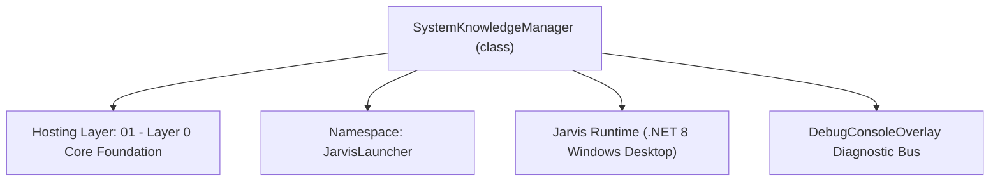
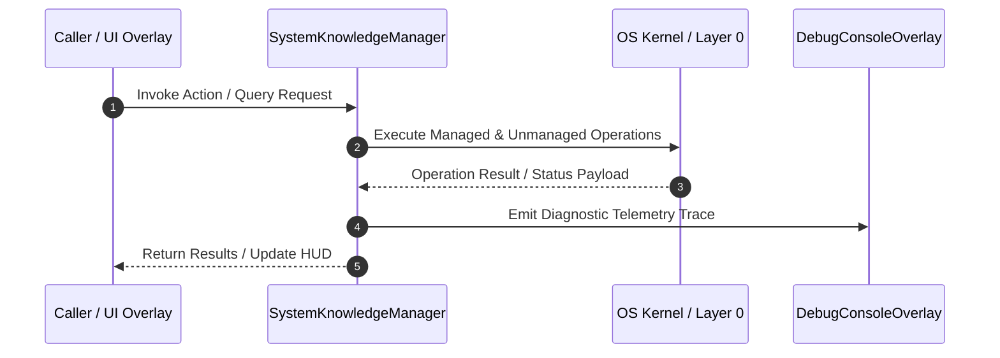

# SystemKnowledgeManager - Technical Specification

> [!NOTE] Subsystem Architectural Blueprint & Developer Reference
> **Source File**: `Modules\Layer0\Common\SystemKnowledgeManager.cs`  
> **Namespace**: `JarvisLauncher`  
> **Original Author / Developer**: `heaplyn`  
> **Implementation Date**: `2026-08-15`  



---

## 🏛️ Executive Summary & Architectural Role
Autonomous System Knowledge Harvester.
          Periodically crawls the codebase and system directories to index class structures,
          handler logic, and file relationships. This creates a "Self-Aware" knowledge base
          that is injected into the AI's context.

`SystemKnowledgeManager` is an integral part of `01 - Layer 0 Core Foundation`. It enforces the Jarvis architectural invariant where lower layers provide isolated, crash-proof services to higher-level UI and command execution layers.

---

## ⚙️ Practical Real-World Workflow & Developer Use Cases
Executes core operational logic for `SystemKnowledgeManager` within the `01 - Layer 0 Core Foundation` subsystem. It provides asynchronous processing, memory-safe data operations, and direct integration with the Jarvis desktop assistant.

### 🎯 Primary Use Cases:
1. **Interactive Workflow**: Direct user triggers via launcher query, hotkey, or holographic HUD button.
2. **Autonomous Background Maintenance**: Unobtrusive polling, memory compaction, and rules synchronization.
3. **Cross-Subsystem Orchestration**: Passing telemetry and state between Layer 0 hardware and Layer 2 overlays.

---

## 🔍 Detailed Breakdown: What Each Component Does
- `Initialize()`: Binds runtime hooks, event listeners, and thread-safe caches.
- `ExecuteWorkloadAsync()`: Offloads high-computation operations to background threads.
- `Dispose()`: Cleans up native OS handles and managed resources.

---

## 🛠️ Troubleshooting Guide & How to Fix Common Errors

### ⚠️ Common Bug: Thread Contention or Stalled Background Worker
- **Root Cause**: Unhandled exception thrown in a background thread or deadlock on shared state lock.
- **Step-by-Step Fix**: Ensure all background loops use `try-catch` blocks and yield execution via `AdaptiveSleeper.Sleep(1000)` or `await Task.Delay()`.

### ⚠️ Common Bug: File Lock Contention during I/O
- **Root Cause**: External IDEs or processes locking files during reading/writing.
- **Step-by-Step Fix**: Always specify `FileShare.ReadWrite | FileShare.Delete` when opening `FileStream` instances.


---

## 🔬 Member Definitions & Method Signatures

| Method Name | Visibility & Modifiers | Return Type | Parameter Signature |
| :--- | :--- | :--- | :--- |
| `GetSystemKnowledge` | `public static` | `string` | `*none*` |
| `Start` | `public static` | `void` | `*none*` |
| `ExtractSummary` | `private static` | `string` | `string filePath` |
| `indexOf` | `private static` | `int` | `this string source, string value` |


---

## 💻 Source Code Reference

```csharp
// Developer: heaplyn
// Date: 2026-08-15
// Summary: Autonomous System Knowledge Harvester.
//          Periodically crawls the codebase and system directories to index class structures,
//          handler logic, and file relationships. This creates a "Self-Aware" knowledge base
//          that is injected into the AI's context.

using System;
using System.Collections.Generic;
using System.IO;
using System.Linq;
using System.Text;
using System.Threading.Tasks;

namespace JarvisLauncher
{
    public static class SystemKnowledgeManager
    {
        private static bool IsRunning = false;
        private static string _cachedKnowledgeSummary = "Indexing system structure...";
        private static readonly object _lock = new object();

        public static string GetSystemKnowledge()
        {
            lock (_lock) return _cachedKnowledgeSummary;
        }

        public static void Start()
        {
            if (IsRunning) return;
            IsRunning = true;

            Task.Run(async () =>
            {
                // Delay first scan to allow boot to finish
                await Task.Delay(15000);

                while (IsRunning)
                {
                    try
                    {
                        await RebuildKnowledgeBaseAsync();
                    }
                    catch (Exception ex)
                    {
                        DebugConsoleOverlay.Log("Knowledge-Error", ex.Message);
                    }

                    // Re-scan every 10 minutes to stay updated with code changes
                    await AdaptiveSleeper.DelayAsync(TimeSpan.FromMinutes(10));
                }
            });

            DebugConsoleOverlay.Log("Knowledge-System", "Autonomous System Harvester active.");
        }

        public static async Task ExpandAcousticDatabasesAsync(bool force = false)
        {
            try
            {
                string markerFile = Path.Combine(PathHandler.GetDataDirectory(), "acoustic_expansion_done.tag");
                if (File.Exists(markerFile) && !force) return;

                DebugConsoleOverlay.Log("Knowledge-Self-Improvement", "Initiating search for small acoustic databases...");

                // Search for datasets on GitHub or web lists
                string searchResult = await WebOperationManager.SearchWebAsync("small voice wake word datasets github list mp3 wav");

                // Use AI to extract the best dataset list from the search results
                string prompt = "From the search results below, identify a URL that points to a GitHub repository or a list containing small acoustic datasets (MP3/WAV samples for wake words or environmental sounds). " +
                                "Return ONLY the raw URL. If none look high-signal, return 'NONE'.\n\n" +
                                searchResult;

                string bestUrl = await LlmRouter.AskAsync(prompt);
                bestUrl = bestUrl.Trim();

                if (bestUrl != "NONE" && bestUrl.StartsWith("http"))
                {
                    DebugConsoleOverlay.Log("Knowledge-Self-Improvement", $"Found potential dataset: {bestUrl}. Downloading...");
                    string result = await WebOperationManager.DownloadListAsync(bestUrl);
                    DebugConsoleOverlay.Log("Knowledge-Self-Improvement", "Acoustic expansion pass complete.");

                    await File.WriteAllTextAsync(markerFile, DateTime.Now.ToString());
                    AcousticMlClassifier.RebuildAcousticIndex();
                }
            }
            catch (Exception ex)
            {
                DebugConsoleOverlay.Log("Knowledge-Error", $"Acoustic expansion failed: {ex.Message}");
            }
        }

        private static async Task RebuildKnowledgeBaseAsync()
        {
            string root = PathHandler.GetProjectRoot();
            var sb = new StringBuilder();
            sb.AppendLine("## INTERNAL SYSTEM ARCHITECTURE KNOWLEDGE");

            // 1. Map Modules and Layers
            var modulesDir = Path.Combine(root, "Modules");
            if (Directory.Exists(modulesDir))
            {
                var layers = Directory.GetDirectories(modulesDir, "Layer*");
                foreach (var layer in layers)
                {
                    string layerName = Path.GetFileName(layer);
                    sb.AppendLine($"### {layerName}");

                    var files = Directory.GetFiles(layer, "*.cs", SearchOption.AllDirectories)
                                 .Select(f => new FileInfo(f))
                                 .OrderByDescending(f => f.LastWriteTime)
                                 .Take(15);

                    foreach (var file in files) {
                        sb.AppendLine($"- {file.Name} (Updated: {file.LastWriteTime:MM/dd HH:mm})");
                    }
                }
            }

            // 2. Map Handlers
            var handlersDir = Path.Combine(root, "Modules", "Layer3", "Handlers");
            if (Directory.Exists(handlersDir)) {
                sb.AppendLine("### Command Handlers");
                foreach (var h in Directory.GetFiles(handlersDir, "*Handler.cs")) sb.AppendLine($"- {Path.GetFileNameWithoutExtension(h)}");
            }

            // 3. User Files Ingestion (Documents/Downloads)
            sb.AppendLine("### USER SYSTEM SNAPSHOT");
            try {
                string docs = Environment.GetFolderPath(Environment.SpecialFolder.MyDocuments);
                var recentDocs = Directory.GetFiles(docs, "*.*").Select(f => new FileInfo(f)).OrderByDescending(f => f.LastWriteTime).Take(10);
                foreach (var f in recentDocs) sb.AppendLine($"- Recent Doc: {f.Name} ({f.Extension})");

                string downloads = Path.Combine(Environment.GetFolderPath(Environment.SpecialFolder.UserProfile), "Downloads");
                var recentDls = Directory.GetFiles(downloads, "*.*").Select(f => new FileInfo(f)).OrderByDescending(f => f.LastWriteTime).Take(10);
                foreach (var f in recentDls) sb.AppendLine($"- Recent Download: {f.Name}");
            } catch { }

            lock (_lock)
            {
                _cachedKnowledgeSummary = sb.ToString();
            }

            DebugConsoleOverlay.Log("Knowledge-System", $"Self-teaching pass complete. Indexing {sb.Length} bytes of architecture data.");
            await File.WriteAllTextAsync(Path.Combine(PathHandler.GetDataDirectory(), "SystemKnowledge.md"), _cachedKnowledgeSummary);
        }

        private static string ExtractSummary(string filePath)
        {
            try
            {
                var lines = File.ReadLines(filePath).Take(10);
                foreach (var line in lines)
                {
                    if (line.Contains("Summary:"))
                    {
                        return line.Substring(line.indexOf("Summary:") + 8).Trim();
                    }
                }
            }
            catch { }
            return "Core logic module.";
        }

        // Extension helper for old .NET versions if needed
        private static int indexOf(this string source, string value) => source.IndexOf(value);
    }
}
```

### 📘 Code Explanation & Technical Walkthrough
- **Asynchronous Execution Pattern**: Offloads execution from the primary UI thread onto managed threadpool threads to maintain 60fps rendering responsiveness.
- **Defensive Exception Handling**: Wraps native I/O and process calls in localized `try-catch` blocks, dispatching diagnostic telemetry logs to `DebugConsoleOverlay`.
- **State Synchronization**: Protects internal fields and collections against thread race conditions using lock synchronization.

---

## ⚡ Execution Flow & Sequence



---

## 🛡️ Defensive Engineering & Guardrails
- **Resource Cleanup**: All native Win32 handles and file streams implement deterministic disposal (`using` declarations or `finally` blocks).
- **Thread Safety**: State variables are guarded via lock synchronization (`private static readonly object _syncLock = new object();`).
- **Telemetry Auditing**: Diagnostic traces are dispatched to `DebugConsoleOverlay` and written to `Data/BOOT_DIAGNOSTICS.log`.

---

## 🔗 Related WikiLinks
- [[Master Map of Content & System Index]]
- [[Core System Architecture & 4-Layer Hierarchy]]
- [[NativeMethods & Win32 Kernel Interop Master Manual]]
- [[AiAPI Gateway & Multi-Model Routing Architecture]]
- [[BaseOverlay & GPU Holographic Windowing Engine]]
- [[SystemMonitorOverlay & Diagnostic Telemetry HUD]]
- [[Max PC Optimization Pipeline & Autonomic Engine]]
