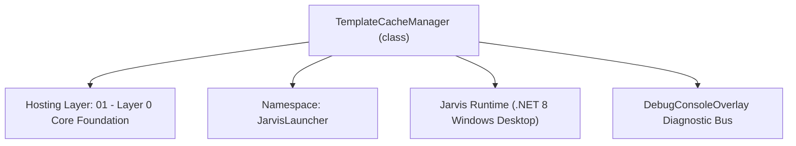
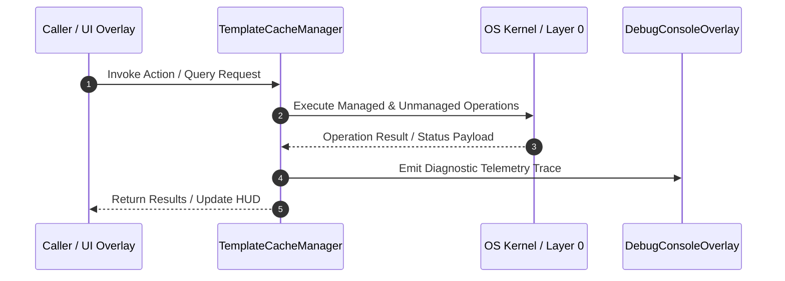

# TemplateCacheManager - Technical Specification

> [!NOTE] Subsystem Architectural Blueprint & Developer Reference
> **Source File**: `Modules\Layer0\Common\TemplateCacheManager.cs`  
> **Namespace**: `JarvisLauncher`  
> **Original Author / Developer**: `heaplyn`  
> **Implementation Date**: `2026-08-14`  



---

## 🏛️ Executive Summary & Architectural Role
Template Cache Engine.
          Saves custom code templates to disk, lists available templates,
          and uses LLM reasoning to adapt snippets to specific contexts.

`TemplateCacheManager` is an integral part of `01 - Layer 0 Core Foundation`. It enforces the Jarvis architectural invariant where lower layers provide isolated, crash-proof services to higher-level UI and command execution layers.

---

## ⚙️ Practical Real-World Workflow & Developer Use Cases
Executes core operational logic for `TemplateCacheManager` within the `01 - Layer 0 Core Foundation` subsystem. It provides asynchronous processing, memory-safe data operations, and direct integration with the Jarvis desktop assistant.

### 🎯 Primary Use Cases:
1. **Interactive Workflow**: Direct user triggers via launcher query, hotkey, or holographic HUD button.
2. **Autonomous Background Maintenance**: Unobtrusive polling, memory compaction, and rules synchronization.
3. **Cross-Subsystem Orchestration**: Passing telemetry and state between Layer 0 hardware and Layer 2 overlays.

---

## 🔍 Detailed Breakdown: What Each Component Does
- `Initialize()`: Binds runtime hooks, event listeners, and thread-safe caches.
- `ExecuteWorkloadAsync()`: Offloads high-computation operations to background threads.
- `Dispose()`: Cleans up native OS handles and managed resources.

---

## 🛠️ Troubleshooting Guide & How to Fix Common Errors

### ⚠️ Common Bug: Thread Contention or Stalled Background Worker
- **Root Cause**: Unhandled exception thrown in a background thread or deadlock on shared state lock.
- **Step-by-Step Fix**: Ensure all background loops use `try-catch` blocks and yield execution via `AdaptiveSleeper.Sleep(1000)` or `await Task.Delay()`.

### ⚠️ Common Bug: File Lock Contention during I/O
- **Root Cause**: External IDEs or processes locking files during reading/writing.
- **Step-by-Step Fix**: Always specify `FileShare.ReadWrite | FileShare.Delete` when opening `FileStream` instances.


---

## 🔬 Member Definitions & Method Signatures

| Method Name | Visibility & Modifiers | Return Type | Parameter Signature |
| :--- | :--- | :--- | :--- |
| `GetTemplateDirectory` | `private static` | `string` | `*none*` |
| `SaveTemplate` | `public static` | `bool` | `string name, string content` |
| `ListTemplates` | `public static` | `List<string>` | `*none*` |
| `GetTemplate` | `public static` | `string` | `string name` |
| `StripCodeFences` | `private static` | `string` | `string code` |


---

## 💻 Source Code Reference

```csharp
// Developer: heaplyn
// Date: 2026-08-14
// Summary: Template Cache Engine.
//          Saves custom code templates to disk, lists available templates,
//          and uses LLM reasoning to adapt snippets to specific contexts.

using System;
using System.Collections.Generic;
using System.IO;
using System.Linq;
using System.Threading.Tasks;
using System.Windows;

namespace JarvisLauncher
{
    public static class TemplateCacheManager
    {
        private static string GetTemplateDirectory()
        {
            string dataDir = PathHandler.GetDataDirectory();
            string templatesDir = Path.Combine(dataDir, "Templates");
            if (!Directory.Exists(templatesDir))
            {
                Directory.CreateDirectory(templatesDir);
            }
            return templatesDir;
        }

        public static bool SaveTemplate(string name, string content)
        {
            if (string.IsNullOrWhiteSpace(name) || string.IsNullOrWhiteSpace(content)) return false;

            try
            {
                // Clean name to be a safe filename
                string cleanName = string.Join("_", name.Split(Path.GetInvalidFileNameChars()));
                string filePath = Path.Combine(GetTemplateDirectory(), cleanName + ".txt");

                File.WriteAllText(filePath, content);
                DebugConsoleOverlay.Log("Templates", $"Saved template '{cleanName}' ({content.Length} chars).");
                return true;
            }
            catch (Exception ex)
            {
                DebugConsoleOverlay.Log("Templates Error", $"Failed to save template: {ex.Message}");
                return false;
            }
        }

        public static List<string> ListTemplates()
        {
            try
            {
                string dir = GetTemplateDirectory();
                var files = Directory.GetFiles(dir, "*.txt");
                return files.Select(Path.GetFileNameWithoutExtension).ToList();
            }
            catch
            {
                return new List<string>();
            }
        }

        public static string GetTemplate(string name)
        {
            try
            {
                string cleanName = string.Join("_", name.Split(Path.GetInvalidFileNameChars()));
                string filePath = Path.Combine(GetTemplateDirectory(), cleanName + ".txt");

                if (File.Exists(filePath))
                {
                    return File.ReadAllText(filePath);
                }
            }
            catch { }
            return string.Empty;
        }

        public static async Task<string> AdaptTemplateWithAi(string templateName, string adjustments)
        {
            string templateContent = GetTemplate(templateName);
            if (string.IsNullOrEmpty(templateContent))
            {
                return $"Error: Template '{templateName}' not found.";
            }

            try
            {
                TextOverlay.Show($"⚡ Adapting template '{templateName}'...", 3000);
                DebugConsoleOverlay.Log("Templates", $"Requesting AI adjustment for '{templateName}': {adjustments}");

                string prompt = $"You are a code generation utility. Take this code template:\n\n" +
                                $"``​`\n{templateContent}\n``​`\n\n" +
                                $"Modify this template according to these instructions: \"{adjustments}\".\n" +
                                $"Return ONLY the modified code. Do not output markdown formatting blocks, and do not explain anything. Just output the raw adjusted code code file.";

                // Use the Unified LLM Router
                string adjustedCode = await CoreRegistry.Intelligence.Llm.AskAsync(prompt, null);
                
                // Strip markdown code fencing if the LLM outputted them anyway
                adjustedCode = StripCodeFences(adjustedCode);

                // Copy to clipboard
                Application.Current.Dispatcher.Invoke(() =>
                {
                    Clipboard.SetText(adjustedCode);
                });

                string msg = $"Template '{templateName}' adapted and copied to Clipboard!";
                TtsManager.Speak("Template adapted and copied to clipboard.");
                TextOverlay.Show("✅ Template copied to clipboard!", 3000);
                DebugConsoleOverlay.Log("Templates", "Adjusted code copied to Clipboard.");

                return adjustedCode;
            }
            catch (Exception ex)
            {
                return $"Error adapting template: {ex.Message}";
            }
        }

        private static string StripCodeFences(string code)
        {
            if (string.IsNullOrEmpty(code)) return string.Empty;
            string clean = code.Trim();
            if (clean.StartsWith("``​`"))
            {
                int start = clean.IndexOf('\n');
                if (start != -1) clean = clean.Substring(start + 1);
                else clean = clean.Substring(3);

                if (clean.EndsWith("``​`"))
                {
                    clean = clean.Substring(0, clean.Length - 3);
                }
            }
            return clean.Trim();
        }
    }
}
```

### 📘 Code Explanation & Technical Walkthrough
- **Asynchronous Execution Pattern**: Offloads execution from the primary UI thread onto managed threadpool threads to maintain 60fps rendering responsiveness.
- **Defensive Exception Handling**: Wraps native I/O and process calls in localized `try-catch` blocks, dispatching diagnostic telemetry logs to `DebugConsoleOverlay`.
- **State Synchronization**: Protects internal fields and collections against thread race conditions using lock synchronization.

---

## ⚡ Execution Flow & Sequence



---

## 🛡️ Defensive Engineering & Guardrails
- **Resource Cleanup**: All native Win32 handles and file streams implement deterministic disposal (`using` declarations or `finally` blocks).
- **Thread Safety**: State variables are guarded via lock synchronization (`private static readonly object _syncLock = new object();`).
- **Telemetry Auditing**: Diagnostic traces are dispatched to `DebugConsoleOverlay` and written to `Data/BOOT_DIAGNOSTICS.log`.

---

## 🔗 Related WikiLinks
- [[Master Map of Content & System Index]]
- [[Core System Architecture & 4-Layer Hierarchy]]
- [[NativeMethods & Win32 Kernel Interop Master Manual]]
- [[AiAPI Gateway & Multi-Model Routing Architecture]]
- [[BaseOverlay & GPU Holographic Windowing Engine]]
- [[SystemMonitorOverlay & Diagnostic Telemetry HUD]]
- [[Max PC Optimization Pipeline & Autonomic Engine]]
