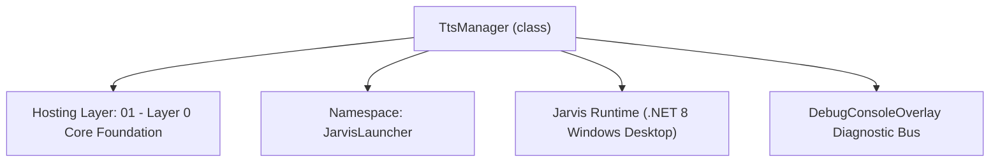
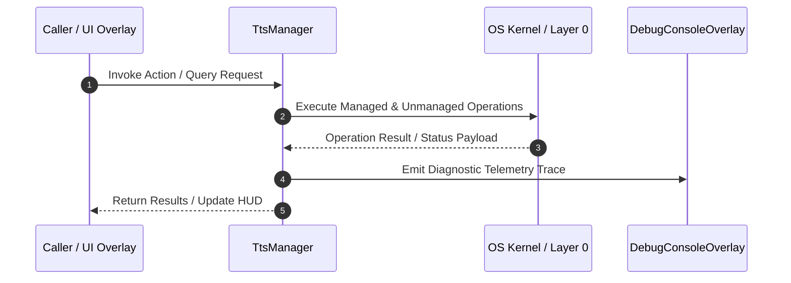

# TtsManager - Technical Specification

> [!NOTE] Subsystem Architectural Blueprint & Developer Reference
> **Source File**: `Modules\Layer0\Audio\TtsManager.cs`  
> **Namespace**: `JarvisLauncher`  
> **Original Author / Developer**: `heaplyn`  
> **Implementation Date**: `2026-08-17`  



---

## 🏛️ Executive Summary & Architectural Role
High-performance Text-to-Speech service implementation.

`TtsManager` is an integral part of `01 - Layer 0 Core Foundation`. It enforces the Jarvis architectural invariant where lower layers provide isolated, crash-proof services to higher-level UI and command execution layers.

---

## ⚙️ Practical Real-World Workflow & Developer Use Cases
Executes core operational logic for `TtsManager` within the `01 - Layer 0 Core Foundation` subsystem. It provides asynchronous processing, memory-safe data operations, and direct integration with the Jarvis desktop assistant.

### 🎯 Primary Use Cases:
1. **Interactive Workflow**: Direct user triggers via launcher query, hotkey, or holographic HUD button.
2. **Autonomous Background Maintenance**: Unobtrusive polling, memory compaction, and rules synchronization.
3. **Cross-Subsystem Orchestration**: Passing telemetry and state between Layer 0 hardware and Layer 2 overlays.

---

## 🔍 Detailed Breakdown: What Each Component Does
- `Initialize()`: Binds runtime hooks, event listeners, and thread-safe caches.
- `ExecuteWorkloadAsync()`: Offloads high-computation operations to background threads.
- `Dispose()`: Cleans up native OS handles and managed resources.

---

## 🛠️ Troubleshooting Guide & How to Fix Common Errors

### ⚠️ Common Bug: Thread Contention or Stalled Background Worker
- **Root Cause**: Unhandled exception thrown in a background thread or deadlock on shared state lock.
- **Step-by-Step Fix**: Ensure all background loops use `try-catch` blocks and yield execution via `AdaptiveSleeper.Sleep(1000)` or `await Task.Delay()`.

### ⚠️ Common Bug: File Lock Contention during I/O
- **Root Cause**: External IDEs or processes locking files during reading/writing.
- **Step-by-Step Fix**: Always specify `FileShare.ReadWrite | FileShare.Delete` when opening `FileStream` instances.


---

## 🔬 Member Definitions & Method Signatures

| Method Name | Visibility & Modifiers | Return Type | Parameter Signature |
| :--- | :--- | :--- | :--- |
| `ApplyCurrentSettings` | `public ` | `void` | `*none*` |
| `SpeakInternal` | `private ` | `void` | `string text` |
| `PlayCustomAudioInternal` | `private ` | `void` | `string path` |
| `PrepareSpeechText` | `private ` | `string` | `string text` |
| `FindLocalVoiceMatch` | `private ` | `string` | `string text, string dir` |
| `GetFile` | `private ` | `string` | `string dir, string prefix` |
| `Speak` | `public static` | `void` | `string text` |
| `Stop` | `public static` | `void` | `*none*` |
| `SpeakFile` | `public static` | `void` | `string path` |
| `GetInstalledVoices` | `public static` | `List<string>` | `*none*` |
| `SetVoice` | `public static` | `void` | `string v` |
| `SetRate` | `public static` | `void` | `int r` |
| `SetVolume` | `public static` | `void` | `int v` |
| `GetVoicesInternal` | `public ` | `List<string>` | `*none*` |
| `SetVoiceInternal` | `public ` | `void` | `string v` |


---

## 💻 Source Code Reference

```csharp
// Developer: heaplyn
// Date: 2026-08-17
// Summary: High-performance Text-to-Speech service implementation.

using System;
using System.Collections.Generic;
using System.Linq;
using System.Speech.Synthesis;
using System.Text.RegularExpressions;
using System.Threading.Tasks;
using System.Windows.Media;
using System.IO;

namespace JarvisLauncher
{
    public class TtsManager : ITtsService
    {
        public static event Action? OnSpeechStopped;

        private readonly SpeechSynthesizer _synthesizer = new SpeechSynthesizer();
        private MediaPlayer? _customAudioPlayer;
        private bool _isSpeaking;
        private DateTime _echoCooldownUntil = DateTime.MinValue;

        bool ITtsService.IsSpeaking => _isSpeaking;
        public bool IsSpeakingOrEchoingInternal => _isSpeaking || DateTime.Now < _echoCooldownUntil;

        public TtsManager()
        {
            ApplyCurrentSettings();
            _synthesizer.SpeakStarted += (s, e) => _isSpeaking = true;
            _synthesizer.SpeakCompleted += (s, e) =>
            {
                _isSpeaking = false;
                _echoCooldownUntil = DateTime.Now.AddMilliseconds(25);
                OnSpeechStopped?.Invoke();
            };
        }

        public void ApplyCurrentSettings()
        {
            var s = CoreRegistry.Data.Settings.Current;
            try { if (!string.IsNullOrWhiteSpace(s.SELECTED_TTS_VOICE)) _synthesizer.SelectVoice(s.SELECTED_TTS_VOICE); } catch { }
            _synthesizer.Rate = Math.Clamp(s.TTS_SPEECH_RATE, -10, 10);
            _synthesizer.Volume = Math.Clamp(s.TTS_SPEECH_VOLUME, 0, 100);
        }

        void ITtsService.Speak(string text) => SpeakInternal(text);

        private void SpeakInternal(string text)
        {
            if (string.IsNullOrWhiteSpace(text)) return;
            var s = CoreRegistry.Data.Settings.Current;
            _isSpeaking = true;
            _echoCooldownUntil = DateTime.Now.AddMilliseconds(25);

            if (s.USE_CUSTOM_TTS_SOUND_FILE && !string.IsNullOrEmpty(s.CUSTOM_TTS_SAMPLE_PATH))
            {
                if (Directory.Exists(s.CUSTOM_TTS_SAMPLE_PATH))
                {
                    string match = FindLocalVoiceMatch(text, s.CUSTOM_TTS_SAMPLE_PATH);
                    if (!string.IsNullOrEmpty(match)) { PlayCustomAudioInternal(match); return; }
                }
                else if (File.Exists(s.CUSTOM_TTS_SAMPLE_PATH))
                {
                    PlayCustomAudioInternal(s.CUSTOM_TTS_SAMPLE_PATH);
                    if (s.CUSTOM_SOUND_ONLY) return;
                }
            }

            Task.Run(() =>
            {
                try {
                    _synthesizer.SpeakAsyncCancelAll();
                    string cleanText = PrepareSpeechText(text);
                    if (!string.IsNullOrWhiteSpace(cleanText)) { ApplyCurrentSettings(); _synthesizer.SpeakAsync(cleanText); }
                } catch { }
            });
        }

        void ITtsService.Stop()
        {
            _synthesizer.SpeakAsyncCancelAll();
            System.Windows.Application.Current.Dispatcher.Invoke(() => _customAudioPlayer?.Stop());
            _isSpeaking = false;
            OnSpeechStopped?.Invoke();
        }

        private void PlayCustomAudioInternal(string path)
        {
            System.Windows.Application.Current.Dispatcher.Invoke(() =>
            {
                _customAudioPlayer?.Stop();
                _customAudioPlayer = new MediaPlayer();
                _customAudioPlayer.Open(new Uri(path, UriKind.Absolute));
                _customAudioPlayer.Volume = _synthesizer.Volume / 100.0;
                _customAudioPlayer.Play();
                _isSpeaking = true;
                _customAudioPlayer.MediaEnded += (s, e) => { _isSpeaking = false; OnSpeechStopped?.Invoke(); };
            });
        }

        private string PrepareSpeechText(string text)
        {
            string cleaned = Regex.Replace(text, @"``​`[\s\S]*?``​`", "");
            cleaned = Regex.Replace(cleaned, @"\[.*?\]", "");
            cleaned = Regex.Replace(cleaned, @"[*_`#~]", "");
            return cleaned.Trim();
        }

        private string FindLocalVoiceMatch(string text, string dir)
        {
            string lower = text.ToLowerInvariant();
            if (lower.Contains("yes")) return GetFile(dir, "yes");
            if (lower.Contains("no")) return GetFile(dir, "no");
            return "";
        }

        private string GetFile(string dir, string prefix)
        {
            try {
                var files = Directory.GetFiles(dir, prefix + "*.*");
                if (files.Length > 0) return files[new Random().Next(files.Length)];
            } catch { }
            return "";
        }

        // --- STATIC BRIDGES ---
        public static void Speak(string text) => CoreRegistry.Interaction.Tts.Speak(text);
        public static void Stop() => CoreRegistry.Interaction.Tts.Stop();
        public static bool IsSpeaking => CoreRegistry.Interaction.Tts.IsSpeaking;
        public static bool IsSpeakingOrEchoing => ((TtsManager)CoreRegistry.Interaction.Tts).IsSpeakingOrEchoingInternal;

        public static void SpeakFile(string path) { if (File.Exists(path)) Speak(File.ReadAllText(path)); }
        public static List<string> GetInstalledVoices() => ((TtsManager)CoreRegistry.Interaction.Tts).GetVoicesInternal();
        public static void SetVoice(string v) => ((TtsManager)CoreRegistry.Interaction.Tts).SetVoiceInternal(v);
        public static void SetRate(int r) => ((TtsManager)CoreRegistry.Interaction.Tts).SetRateInternal(r);
        public static void SetVolume(int v) => ((TtsManager)CoreRegistry.Interaction.Tts).SetVolumeInternal(v);

        public List<string> GetVoicesInternal() {
            var v = new List<string>();
            foreach (InstalledVoice iv in _synthesizer.GetInstalledVoices()) if (iv.Enabled) v.Add(iv.VoiceInfo.Name);
            return v;
        }
        public void SetVoiceInternal(string v) { try { _synthesizer.SelectVoice(v); } catch {} }
        public void SetRateInternal(int r) { _synthesizer.Rate = r; }
        public void SetVolumeInternal(int v) { _synthesizer.Volume = v; }
    }
}
```

### 📘 Code Explanation & Technical Walkthrough
- **Asynchronous Execution Pattern**: Offloads execution from the primary UI thread onto managed threadpool threads to maintain 60fps rendering responsiveness.
- **Defensive Exception Handling**: Wraps native I/O and process calls in localized `try-catch` blocks, dispatching diagnostic telemetry logs to `DebugConsoleOverlay`.
- **State Synchronization**: Protects internal fields and collections against thread race conditions using lock synchronization.

---

## ⚡ Execution Flow & Sequence



---

## 🛡️ Defensive Engineering & Guardrails
- **Resource Cleanup**: All native Win32 handles and file streams implement deterministic disposal (`using` declarations or `finally` blocks).
- **Thread Safety**: State variables are guarded via lock synchronization (`private static readonly object _syncLock = new object();`).
- **Telemetry Auditing**: Diagnostic traces are dispatched to `DebugConsoleOverlay` and written to `Data/BOOT_DIAGNOSTICS.log`.

---

## 🔗 Related WikiLinks
- [[Master Map of Content & System Index]]
- [[Core System Architecture & 4-Layer Hierarchy]]
- [[NativeMethods & Win32 Kernel Interop Master Manual]]
- [[AiAPI Gateway & Multi-Model Routing Architecture]]
- [[BaseOverlay & GPU Holographic Windowing Engine]]
- [[SystemMonitorOverlay & Diagnostic Telemetry HUD]]
- [[Max PC Optimization Pipeline & Autonomic Engine]]
