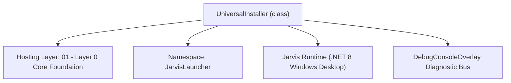
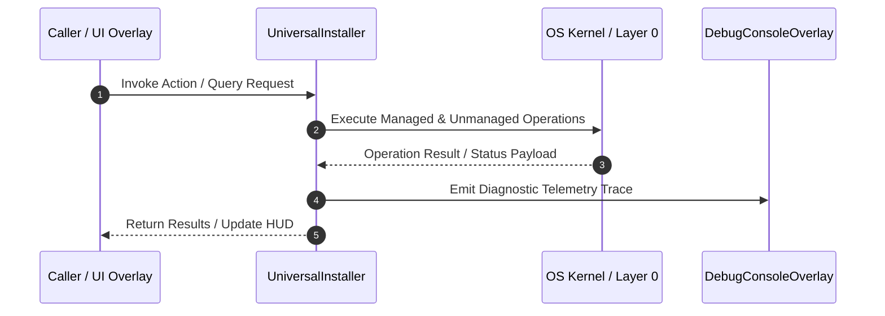

# UniversalInstaller - Technical Specification

> [!NOTE] Subsystem Architectural Blueprint & Developer Reference
> **Source File**: `Modules\Layer0\Common\UniversalInstaller.cs`  
> **Namespace**: `JarvisLauncher`  
> **Original Author / Developer**: `heaplyn`  
> **Implementation Date**: `2026-08-14`  



---

## 🏛️ Executive Summary & Architectural Role
Universal Web Scraper and Automatic Installer Engine.
 Scrapes target website pages, extracts download links for Windows installers, downloads files, and executes them.

`UniversalInstaller` is an integral part of `01 - Layer 0 Core Foundation`. It enforces the Jarvis architectural invariant where lower layers provide isolated, crash-proof services to higher-level UI and command execution layers.

---

## ⚙️ Practical Real-World Workflow & Developer Use Cases
Executes core operational logic for `UniversalInstaller` within the `01 - Layer 0 Core Foundation` subsystem. It provides asynchronous processing, memory-safe data operations, and direct integration with the Jarvis desktop assistant.

### 🎯 Primary Use Cases:
1. **Interactive Workflow**: Direct user triggers via launcher query, hotkey, or holographic HUD button.
2. **Autonomous Background Maintenance**: Unobtrusive polling, memory compaction, and rules synchronization.
3. **Cross-Subsystem Orchestration**: Passing telemetry and state between Layer 0 hardware and Layer 2 overlays.

---

## 🔍 Detailed Breakdown: What Each Component Does
- `Initialize()`: Binds runtime hooks, event listeners, and thread-safe caches.
- `ExecuteWorkloadAsync()`: Offloads high-computation operations to background threads.
- `Dispose()`: Cleans up native OS handles and managed resources.

---

## 🛠️ Troubleshooting Guide & How to Fix Common Errors

### ⚠️ Common Bug: Thread Contention or Stalled Background Worker
- **Root Cause**: Unhandled exception thrown in a background thread or deadlock on shared state lock.
- **Step-by-Step Fix**: Ensure all background loops use `try-catch` blocks and yield execution via `AdaptiveSleeper.Sleep(1000)` or `await Task.Delay()`.

### ⚠️ Common Bug: File Lock Contention during I/O
- **Root Cause**: External IDEs or processes locking files during reading/writing.
- **Step-by-Step Fix**: Always specify `FileShare.ReadWrite | FileShare.Delete` when opening `FileStream` instances.


---

## 🔬 Member Definitions & Method Signatures

| Method Name | Visibility & Modifiers | Return Type | Parameter Signature |
| :--- | :--- | :--- | :--- |


---

## 💻 Source Code Reference

```csharp
// Developer: heaplyn
// Date: 2026-08-14
// Summary: Universal Web Scraper and Automatic Installer Engine.
// Scrapes target website pages, extracts download links for Windows installers, downloads files, and executes them.

using System;
using System.Diagnostics;
using System.IO;
using System.Net.Http;
using System.Text.RegularExpressions;
using System.Threading.Tasks;

namespace JarvisLauncher
{
    public static class UniversalInstaller
    {
        private static readonly HttpClient _httpClient = new HttpClient();

        static UniversalInstaller()
        {
            _httpClient.DefaultRequestHeaders.Add("User-Agent", "Mozilla/5.0 (Windows NT 10.0; Win64; x64) AppleWebKit/537.36 (KHTML, like Gecko) Chrome/120.0.0.0 Safari/537.36");
        }

        public static async Task<string> InstallFromUrlAsync(string url)
        {
            try
            {
                TextOverlay.Show($"🌐 Scrapes page to find installer links...", 3000);
                string html = await _httpClient.GetStringAsync(url);

                // Regex to find download link references in hrefs
                var linkRegex = new Regex(@"href\s*=\s*[""'](https?://[^""']+\.(?:exe|msi|zip|bat))[""']", RegexOptions.IgnoreCase);
                var matches = linkRegex.Matches(html);

                string? bestDownloadLink = null;

                foreach (Match match in matches)
                {
                    string href = match.Groups[1].Value;
                    
                    // Prioritize windows 64-bit releases or standard install binaries
                    if (href.Contains("win", StringComparison.OrdinalIgnoreCase) || 
                        href.Contains("x64", StringComparison.OrdinalIgnoreCase) || 
                        href.Contains("setup", StringComparison.OrdinalIgnoreCase) ||
                        href.Contains("install", StringComparison.OrdinalIgnoreCase))
                    {
                        bestDownloadLink = href;
                        break;
                    }
                    bestDownloadLink ??= href;
                }

                // If no direct binary link, try scraping standard anchors
                if (string.IsNullOrEmpty(bestDownloadLink))
                {
                    var anchorRegex = new Regex(@"href\s*=\s*[""']([^""']+)[""']", RegexOptions.IgnoreCase);
                    var anchors = anchorRegex.Matches(html);
                    foreach (Match anchor in anchors)
                    {
                        string href = anchor.Groups[1].Value;
                        if (href.Contains("download", StringComparison.OrdinalIgnoreCase) && href.StartsWith("http"))
                        {
                            bestDownloadLink = href;
                            break;
                        }
                    }
                }

                if (string.IsNullOrEmpty(bestDownloadLink))
                {
                    return $"Error: No direct Windows installation executable (.exe/.msi) found on page: {url}";
                }

                TextOverlay.Show($"📥 Downloading installer: {Path.GetFileName(bestDownloadLink)}", 3500);

                string downloadDir = Path.Combine(Environment.GetFolderPath(Environment.SpecialFolder.UserProfile), "Downloads");
                if (!Directory.Exists(downloadDir)) downloadDir = Path.GetTempPath();

                string fileName = Path.GetFileName(new Uri(bestDownloadLink).AbsolutePath);
                if (string.IsNullOrEmpty(fileName)) fileName = "installer_setup.exe";

                string localFilePath = Path.Combine(downloadDir, fileName);

                using (var response = await _httpClient.GetAsync(bestDownloadLink))
                using (var fs = new FileStream(localFilePath, FileMode.Create, FileAccess.Write, FileShare.None))
                {
                    await response.Content.CopyToAsync(fs);
                }

                TextOverlay.Show($"🚀 Launching installer: {fileName}", 3000);

                var psi = new ProcessStartInfo
                {
                    FileName = localFilePath,
                    UseShellExecute = true
                };
                Process.Start(psi);

                return $"Successfully scraped page, downloaded installer to: {localFilePath}, and launched execution.";
            }
            catch (Exception ex)
            {
                return $"Error installing from webpage: {ex.Message}";
            }
        }
    }
}
```

### 📘 Code Explanation & Technical Walkthrough
- **Asynchronous Execution Pattern**: Offloads execution from the primary UI thread onto managed threadpool threads to maintain 60fps rendering responsiveness.
- **Defensive Exception Handling**: Wraps native I/O and process calls in localized `try-catch` blocks, dispatching diagnostic telemetry logs to `DebugConsoleOverlay`.
- **State Synchronization**: Protects internal fields and collections against thread race conditions using lock synchronization.

---

## ⚡ Execution Flow & Sequence



---

## 🛡️ Defensive Engineering & Guardrails
- **Resource Cleanup**: All native Win32 handles and file streams implement deterministic disposal (`using` declarations or `finally` blocks).
- **Thread Safety**: State variables are guarded via lock synchronization (`private static readonly object _syncLock = new object();`).
- **Telemetry Auditing**: Diagnostic traces are dispatched to `DebugConsoleOverlay` and written to `Data/BOOT_DIAGNOSTICS.log`.

---

## 🔗 Related WikiLinks
- [[Master Map of Content & System Index]]
- [[Core System Architecture & 4-Layer Hierarchy]]
- [[NativeMethods & Win32 Kernel Interop Master Manual]]
- [[AiAPI Gateway & Multi-Model Routing Architecture]]
- [[BaseOverlay & GPU Holographic Windowing Engine]]
- [[SystemMonitorOverlay & Diagnostic Telemetry HUD]]
- [[Max PC Optimization Pipeline & Autonomic Engine]]
