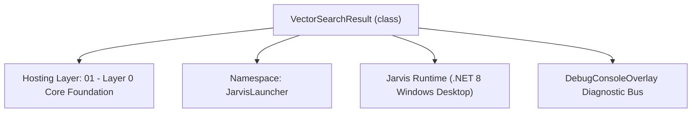
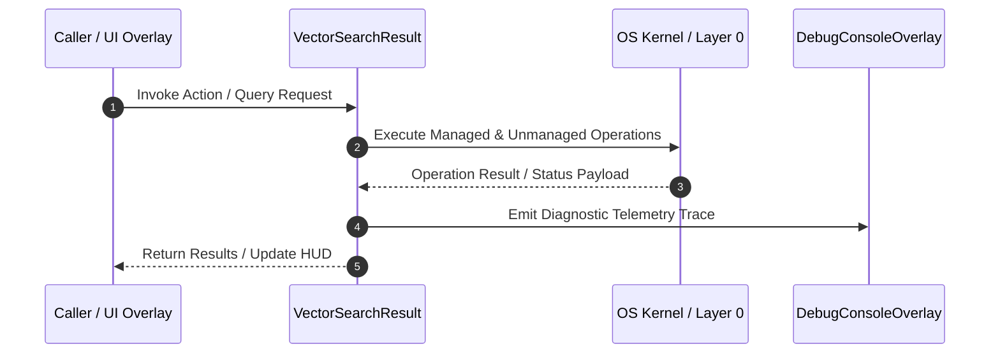

# VectorSearchManager - Technical Specification

> [!NOTE] Subsystem Architectural Blueprint & Developer Reference
> **Source File**: `Modules\Layer0\Common\VectorSearchManager.cs`  
> **Namespace**: `JarvisLauncher`  
> **Original Author / Developer**: `heaplyn`  
> **Implementation Date**: `2026-08-18`  



---

## 🏛️ Executive Summary & Architectural Role
Integration Manager for Google Cloud Vector Search (Vertex AI).
          Handles text embedding generation and vector similarity search.
          Used for high-dimensional semantic retrieval and Godellian evolution.

`VectorSearchResult` is an integral part of `01 - Layer 0 Core Foundation`. It enforces the Jarvis architectural invariant where lower layers provide isolated, crash-proof services to higher-level UI and command execution layers.

---

## ⚙️ Practical Real-World Workflow & Developer Use Cases
Executes core operational logic for `VectorSearchManager` within the `01 - Layer 0 Core Foundation` subsystem. It provides asynchronous processing, memory-safe data operations, and direct integration with the Jarvis desktop assistant.

### 🎯 Primary Use Cases:
1. **Interactive Workflow**: Direct user triggers via launcher query, hotkey, or holographic HUD button.
2. **Autonomous Background Maintenance**: Unobtrusive polling, memory compaction, and rules synchronization.
3. **Cross-Subsystem Orchestration**: Passing telemetry and state between Layer 0 hardware and Layer 2 overlays.

---

## 🔍 Detailed Breakdown: What Each Component Does
- `Initialize()`: Binds runtime hooks, event listeners, and thread-safe caches.
- `ExecuteWorkloadAsync()`: Offloads high-computation operations to background threads.
- `Dispose()`: Cleans up native OS handles and managed resources.

---

## 🛠️ Troubleshooting Guide & How to Fix Common Errors

### ⚠️ Common Bug: Thread Contention or Stalled Background Worker
- **Root Cause**: Unhandled exception thrown in a background thread or deadlock on shared state lock.
- **Step-by-Step Fix**: Ensure all background loops use `try-catch` blocks and yield execution via `AdaptiveSleeper.Sleep(1000)` or `await Task.Delay()`.

### ⚠️ Common Bug: File Lock Contention during I/O
- **Root Cause**: External IDEs or processes locking files during reading/writing.
- **Step-by-Step Fix**: Always specify `FileShare.ReadWrite | FileShare.Delete` when opening `FileStream` instances.


---

## 🔬 Member Definitions & Method Signatures

| Method Name | Visibility & Modifiers | Return Type | Parameter Signature |
| :--- | :--- | :--- | :--- |


---

## 💻 Source Code Reference

```csharp
// Developer: heaplyn
// Date: 2026-08-18
// Summary: Integration Manager for Google Cloud Vector Search (Vertex AI).
//          Handles text embedding generation and vector similarity search.
//          Used for high-dimensional semantic retrieval and Godellian evolution.

using System;
using System.Collections.Generic;
using System.Net.Http;
using System.Net.Http.Headers;
using System.Text;
using System.Text.Json;
using System.Threading.Tasks;
using System.Linq;

namespace JarvisLauncher
{
    public class VectorSearchResult
    {
        public string Id { get; set; } = string.Empty;
        public double Distance { get; set; }
    }

    public static class VectorSearchManager
    {
        private static readonly HttpClient _http = new HttpClient();

        /// <summary>
        /// Generates a high-dimensional vector for a string of text using Google's embedding model.
        /// </summary>
        public static async Task<float[]> GetEmbeddingAsync(string text)
        {
            var s = CoreRegistry.Data.Settings.Current;
            string project = s.GOOGLE_CLOUD_PROJECT_ID;
            string location = s.GOOGLE_CLOUD_LOCATION;
            string token = s.GOOGLE_OAUTH_ACCESS_TOKEN;

            if (string.IsNullOrEmpty(project) || string.IsNullOrEmpty(token))
                throw new Exception("Google Cloud project or OAuth token missing for embeddings.");

            string url = $"https://{location}-aiplatform.googleapis.com/v1/projects/{project}/locations/{location}/publishers/google/models/text-embedding-004:predict";

            var payload = new
            {
                instances = new[] { new { content = text, task_type = "RETRIEVAL_DOCUMENT" } }
            };

            var req = new HttpRequestMessage(HttpMethod.Post, url);
            req.Headers.Authorization = new AuthenticationHeaderValue("Bearer", token);
            req.Content = new StringContent(JsonSerializer.Serialize(payload), Encoding.UTF8, "application/json");

            var resp = await _http.SendAsync(req);
            string body = await resp.Content.ReadAsStringAsync();

            if (!resp.IsSuccessStatusCode)
                throw new Exception($"Embedding API Error: {body}");

            using var doc = JsonDocument.Parse(body);
            var values = doc.RootElement.GetProperty("predictions")[0].GetProperty("embeddings").GetProperty("values").EnumerateArray();
            return values.Select(v => (float)v.GetDouble()).ToArray();
        }

        /// <summary>
        /// Queries the Google Vector Search Index for similar items.
        /// </summary>
        public static async Task<List<VectorSearchResult>> SearchSimilarAsync(float[] queryVector, int topK = 5)
        {
            var s = CoreRegistry.Data.Settings.Current;
            string project = s.GOOGLE_CLOUD_PROJECT_ID;
            string location = s.GOOGLE_CLOUD_LOCATION;
            string endpointId = s.GOOGLE_VECTOR_ENDPOINT_ID;
            string token = s.GOOGLE_OAUTH_ACCESS_TOKEN;

            if (string.IsNullOrEmpty(endpointId)) return new List<VectorSearchResult>();

            // Endpoint for matching
            string url = $"https://{location}-aiplatform.googleapis.com/v1/projects/{project}/locations/{location}/indexEndpoints/{endpointId}:findNeighbors";

            var payload = new
            {
                queries = new[] {
                    new {
                        datapoint = new { datapoint_id = "query", feature_vector = queryVector },
                        neighbor_count = topK
                    }
                }
            };

            var req = new HttpRequestMessage(HttpMethod.Post, url);
            req.Headers.Authorization = new AuthenticationHeaderValue("Bearer", token);
            req.Content = new StringContent(JsonSerializer.Serialize(payload), Encoding.UTF8, "application/json");

            var resp = await _http.SendAsync(req);
            string body = await resp.Content.ReadAsStringAsync();

            if (!resp.IsSuccessStatusCode)
                throw new Exception($"Vector Search API Error: {body}");

            var results = new List<VectorSearchResult>();
            using var doc = JsonDocument.Parse(body);
            var nearestNeighbors = doc.RootElement.GetProperty("nearestNeighbors")[0].GetProperty("neighbors").EnumerateArray();

            foreach (var neighbor in nearestNeighbors)
            {
                results.Add(new VectorSearchResult
                {
                    Id = neighbor.GetProperty("datapoint").GetProperty("datapointId").GetString() ?? "",
                    Distance = neighbor.GetProperty("distance").GetDouble()
                });
            }

            return results;
        }

        /// <summary>
        /// Inserts or updates a datapoint in the Google Vector Search Index (via Cloud Storage ingest normally, here we simulate metadata association).
        /// </summary>
        public static async Task UpsertMemoryAsync(string text, string metadataJson)
        {
            // Note: Cloud Vector Search typically uses batch ingestion from JSONL files in GCS.
            // For a "Live" feel, Jarvis will log these locally then trigger a re-index or use a hybrid approach.
            DebugConsoleOverlay.Log("Vector-Search", $"Queueing semantic ingest: {text.Take(30)}...");

            // Generate embedding locally to associate with the memory
            float[] vector = await GetEmbeddingAsync(text);

            // Associate this vector with the memory locally
            // In a full production env, we'd upload to GCS and call IndexUpdate
        }
    }
}
```

### 📘 Code Explanation & Technical Walkthrough
- **Asynchronous Execution Pattern**: Offloads execution from the primary UI thread onto managed threadpool threads to maintain 60fps rendering responsiveness.
- **Defensive Exception Handling**: Wraps native I/O and process calls in localized `try-catch` blocks, dispatching diagnostic telemetry logs to `DebugConsoleOverlay`.
- **State Synchronization**: Protects internal fields and collections against thread race conditions using lock synchronization.

---

## ⚡ Execution Flow & Sequence



---

## 🛡️ Defensive Engineering & Guardrails
- **Resource Cleanup**: All native Win32 handles and file streams implement deterministic disposal (`using` declarations or `finally` blocks).
- **Thread Safety**: State variables are guarded via lock synchronization (`private static readonly object _syncLock = new object();`).
- **Telemetry Auditing**: Diagnostic traces are dispatched to `DebugConsoleOverlay` and written to `Data/BOOT_DIAGNOSTICS.log`.

---

## 🔗 Related WikiLinks
- [[Master Map of Content & System Index]]
- [[Core System Architecture & 4-Layer Hierarchy]]
- [[NativeMethods & Win32 Kernel Interop Master Manual]]
- [[AiAPI Gateway & Multi-Model Routing Architecture]]
- [[BaseOverlay & GPU Holographic Windowing Engine]]
- [[SystemMonitorOverlay & Diagnostic Telemetry HUD]]
- [[Max PC Optimization Pipeline & Autonomic Engine]]
