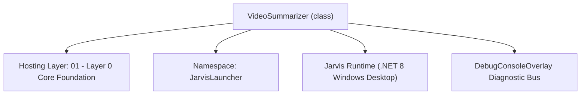
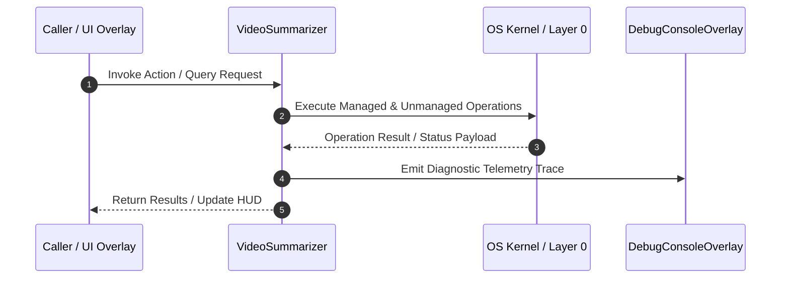

# VideoSummarizer - Technical Specification

> [!NOTE] Subsystem Architectural Blueprint & Developer Reference
> **Source File**: `Modules\Layer0\Common\VideoSummarizer.cs`  
> **Namespace**: `JarvisLauncher`  
> **Original Author / Developer**: `heaplyn`  
> **Implementation Date**: `2026-08-15`  



---

## 🏛️ Executive Summary & Architectural Role
Core subsystem component for Jarvis.

`VideoSummarizer` is an integral part of `01 - Layer 0 Core Foundation`. It enforces the Jarvis architectural invariant where lower layers provide isolated, crash-proof services to higher-level UI and command execution layers.

---

## ⚙️ Practical Real-World Workflow & Developer Use Cases
Executes core operational logic for `VideoSummarizer` within the `01 - Layer 0 Core Foundation` subsystem. It provides asynchronous processing, memory-safe data operations, and direct integration with the Jarvis desktop assistant.

### 🎯 Primary Use Cases:
1. **Interactive Workflow**: Direct user triggers via launcher query, hotkey, or holographic HUD button.
2. **Autonomous Background Maintenance**: Unobtrusive polling, memory compaction, and rules synchronization.
3. **Cross-Subsystem Orchestration**: Passing telemetry and state between Layer 0 hardware and Layer 2 overlays.

---

## 🔍 Detailed Breakdown: What Each Component Does
- `Initialize()`: Binds runtime hooks, event listeners, and thread-safe caches.
- `ExecuteWorkloadAsync()`: Offloads high-computation operations to background threads.
- `Dispose()`: Cleans up native OS handles and managed resources.

---

## 🛠️ Troubleshooting Guide & How to Fix Common Errors

### ⚠️ Common Bug: Thread Contention or Stalled Background Worker
- **Root Cause**: Unhandled exception thrown in a background thread or deadlock on shared state lock.
- **Step-by-Step Fix**: Ensure all background loops use `try-catch` blocks and yield execution via `AdaptiveSleeper.Sleep(1000)` or `await Task.Delay()`.

### ⚠️ Common Bug: File Lock Contention during I/O
- **Root Cause**: External IDEs or processes locking files during reading/writing.
- **Step-by-Step Fix**: Always specify `FileShare.ReadWrite | FileShare.Delete` when opening `FileStream` instances.


---

## 🔬 Member Definitions & Method Signatures

| Method Name | Visibility & Modifiers | Return Type | Parameter Signature |
| :--- | :--- | :--- | :--- |
| `GetYtDlpPath` | `private static` | `string` | `*none*` |
| `GetFFmpegPath` | `private static` | `string` | `*none*` |
| `ParseVtt` | `public static` | `string` | `string vttContent` |


---

## 💻 Source Code Reference

```csharp
using System;
using System.Diagnostics;
using System.IO;
using System.Linq;
using System.Text;
using System.Text.RegularExpressions;
using System.Threading.Tasks;

namespace JarvisLauncher
{
    public static class VideoSummarizer
    {
        private static string GetYtDlpPath()
        {
            string localPath = Path.Combine(PathHandler.GetProjectRoot(), "Modules", "Layer0", "DownloadMedia", "node_modules", "ytdlp-nodejs", "bin", "yt-dlp.exe");
            if (File.Exists(localPath)) return localPath;
            return "yt-dlp";
        }

        private static string GetFFmpegPath()
        {
            string localPath = Path.Combine(PathHandler.GetProjectRoot(), "Modules", "Layer0", "DownloadMedia", "node_modules", "ytdlp-nodejs", "bin", "ffmpeg.exe");
            if (File.Exists(localPath)) return localPath;
            return "ffmpeg";
        }

        public static async Task<string> SummarizeVideoAsync(string target, Action<string>? logProgress = null)
        {
            logProgress?.Invoke("🎬 Initializing summarizer...");
            bool isUrl = Uri.TryCreate(target, UriKind.Absolute, out var uriResult) 
                         && (uriResult.Scheme == Uri.UriSchemeHttp || uriResult.Scheme == Uri.UriSchemeHttps);

            string tempDir = Path.Combine(Path.GetTempPath(), "JarvisVideoSummarizer");
            if (!Directory.Exists(tempDir)) Directory.CreateDirectory(tempDir);

            string uniqueId = Guid.NewGuid().ToString("N");
            string outputBase = Path.Combine(tempDir, "summary_" + uniqueId);

            if (isUrl)
            {
                logProgress?.Invoke("🌐 Web URL detected. Checking for English subtitles/captions...");
                string? subtitleFile = await DownloadSubtitlesAsync(target, outputBase);

                if (subtitleFile != null && File.Exists(subtitleFile))
                {
                    logProgress?.Invoke("📃 Subtitles downloaded! Parsing transcript...");
                    string rawVtt = await File.ReadAllTextAsync(subtitleFile);
                    string cleanTranscript = ParseVtt(rawVtt);

                    try { File.Delete(subtitleFile); } catch { }

                    if (string.IsNullOrWhiteSpace(cleanTranscript))
                    {
                        logProgress?.Invoke("⚠️ Transcript was empty after parsing. Falling back to audio processing...");
                    }
                    else
                    {
                        logProgress?.Invoke("🧠 Analyzing transcript using JARVIS AI...");
                        string prompt = "Please provide a comprehensive summary of the following video transcript. " +
                                       "Identify the main topics covered, key takeaways/decisions made, and list them structured by bullet points with titles:\n\n" + cleanTranscript;
                        string res = await LlmRouter.AskAsync(prompt);
                        return res;
                    }
                }

                // If subtitles failed or empty, fallback to audio download
                logProgress?.Invoke("🎙️ No subtitles available. Downloading audio stream (this may take a few moments)...");
                string? audioFile = await DownloadAudioAsync(target, outputBase);
                if (audioFile != null && File.Exists(audioFile))
                {
                    logProgress?.Invoke("✅ Audio downloaded! Transcribing and summarizing with multimodal AI...");
                    byte[] audioBytes = await File.ReadAllBytesAsync(audioFile);
                    try { File.Delete(audioFile); } catch { }

                    string prompt = "Please listen to this audio track from a video and provide a detailed summary. " +
                                   "Key topics covered, main highlights, takeaways, and overall structured recap.";
                    string res = await LlmRouter.AskGeminiWithAudioAsync(audioBytes, prompt);
                    return res;
                }
                
                return "❌ Summarizer failed: Could not retrieve subtitles or audio from the URL.";
            }
            else
            {
                logProgress?.Invoke("📂 Local file detected. Verifying path...");
                if (!File.Exists(target))
                {
                    return $"❌ File not found: {target}";
                }

                string ext = Path.GetExtension(target).ToLower();
                string[] audioExts = { ".mp3", ".wav", ".m4a", ".flac", ".ogg" };
                string[] videoExts = { ".mp4", ".mkv", ".mov", ".avi", ".webm", ".wmv" };

                if (audioExts.Contains(ext))
                {
                    logProgress?.Invoke("🎵 Audio file detected. Compressing format...");
                    string compressedMp3 = outputBase + ".mp3";
                    string? ok = await CompressAudioAsync(target, compressedMp3);

                    if (ok != null && File.Exists(ok))
                    {
                        logProgress?.Invoke("🧠 Transcribing and summarizing with multimodal AI...");
                        byte[] audioBytes = await File.ReadAllBytesAsync(ok);
                        try { File.Delete(ok); } catch { }

                        string prompt = "Please analyze this audio file and provide a structured summary with key topics, timestamps/segments if applicable, and main takeaways.";
                        string res = await LlmRouter.AskGeminiWithAudioAsync(audioBytes, prompt);
                        return res;
                    }
                    return "❌ Failed to compress/process audio file.";
                }
                else if (videoExts.Contains(ext))
                {
                    logProgress?.Invoke("🎬 Video file detected. Extracting compressed audio track...");
                    string extractedMp3 = outputBase + ".mp3";
                    string? ok = await ExtractAudioFromLocalFileAsync(target, extractedMp3);

                    if (ok != null && File.Exists(ok))
                    {
                        logProgress?.Invoke("🧠 Transcribing and summarizing extracted audio...");
                        byte[] audioBytes = await File.ReadAllBytesAsync(ok);
                        try { File.Delete(ok); } catch { }

                        string prompt = "Please analyze the audio track extracted from this video and provide a structured summary with main highlights, topics, and key takeaways.";
                        string res = await LlmRouter.AskGeminiWithAudioAsync(audioBytes, prompt);
                        return res;
                    }
                    return "❌ Failed to extract audio track from video file.";
                }
                else
                {
                    return $"❌ Unsupported file format '{ext}'. Must be a standard audio or video file.";
                }
            }
        }

        private static async Task<string?> DownloadSubtitlesAsync(string url, string outputBaseName)
        {
            string ytdlp = GetYtDlpPath();
            var tcs = new TaskCompletionSource<string?>();

            var startInfo = new ProcessStartInfo
            {
                FileName = ytdlp,
                Arguments = $"--skip-download --write-auto-subs --write-subs --sub-lang en --sub-format vtt -o \"{outputBaseName}\" \"{url}\"",
                UseShellExecute = false,
                RedirectStandardOutput = true,
                RedirectStandardError = true,
                CreateNoWindow = true
            };

            var process = new Process { StartInfo = startInfo, EnableRaisingEvents = true };
            process.Exited += (s, e) => { process.Dispose(); tcs.TrySetResult(null); };

            try
            {
                process.Start();
                await tcs.Task;
            }
            catch { return null; }

            string pathWithLang = outputBaseName + ".en.vtt";
            if (File.Exists(pathWithLang)) return pathWithLang;

            string pathNoLang = outputBaseName + ".vtt";
            if (File.Exists(pathNoLang)) return pathNoLang;

            // Search fallback
            string dir = Path.GetDirectoryName(outputBaseName) ?? Path.GetTempPath();
            string pattern = Path.GetFileName(outputBaseName) + "*.vtt";
            try
            {
                string? matched = Directory.GetFiles(dir, pattern).FirstOrDefault();
                if (matched != null && File.Exists(matched)) return matched;
            }
            catch { }

            return null;
        }

        private static async Task<string?> DownloadAudioAsync(string url, string outputBaseName)
        {
            string ytdlp = GetYtDlpPath();
            string ffmpegBinDir = Path.GetDirectoryName(GetFFmpegPath()) ?? "";
            string ffmpegArg = string.IsNullOrEmpty(ffmpegBinDir) ? "" : $"--ffmpeg-location \"{ffmpegBinDir}\"";

            var tcs = new TaskCompletionSource<string?>();

            var startInfo = new ProcessStartInfo
            {
                FileName = ytdlp,
                Arguments = $"-f bestaudio -x --audio-format mp3 {ffmpegArg} -o \"{outputBaseName}.%(ext)s\" \"{url}\"",
                UseShellExecute = false,
                RedirectStandardOutput = true,
                RedirectStandardError = true,
                CreateNoWindow = true
            };

            var process = new Process { StartInfo = startInfo, EnableRaisingEvents = true };
            process.Exited += (s, e) => { process.Dispose(); tcs.TrySetResult(null); };

            try
            {
                process.Start();
                await tcs.Task;
            }
            catch { return null; }

            string expectedPath = outputBaseName + ".mp3";
            if (File.Exists(expectedPath)) return expectedPath;

            return null;
        }

        private static async Task<string?> ExtractAudioFromLocalFileAsync(string localFile, string outputMp3Path)
        {
            string ffmpeg = GetFFmpegPath();
            var tcs = new TaskCompletionSource<string?>();

            var startInfo = new ProcessStartInfo
            {
                FileName = ffmpeg,
                Arguments = $"-i \"{localFile}\" -vn -acodec libmp3lame -ac 1 -ar 16000 -ab 64k \"{outputMp3Path}\" -y",
                UseShellExecute = false,
                RedirectStandardOutput = true,
                RedirectStandardError = true,
                CreateNoWindow = true
            };

            var process = new Process { StartInfo = startInfo, EnableRaisingEvents = true };
            process.Exited += (s, e) => { process.Dispose(); tcs.TrySetResult(null); };

            try
            {
                process.Start();
                await tcs.Task;
            }
            catch { return null; }

            if (File.Exists(outputMp3Path)) return outputMp3Path;
            return null;
        }

        private static async Task<string?> CompressAudioAsync(string inputAudio, string outputMp3Path)
        {
            string ffmpeg = GetFFmpegPath();
            var tcs = new TaskCompletionSource<string?>();

            var startInfo = new ProcessStartInfo
            {
                FileName = ffmpeg,
                Arguments = $"-i \"{inputAudio}\" -acodec libmp3lame -ac 1 -ar 16000 -ab 64k \"{outputMp3Path}\" -y",
                UseShellExecute = false,
                RedirectStandardOutput = true,
                RedirectStandardError = true,
                CreateNoWindow = true
            };

            var process = new Process { StartInfo = startInfo, EnableRaisingEvents = true };
            process.Exited += (s, e) => { process.Dispose(); tcs.TrySetResult(null); };

            try
            {
                process.Start();
                await tcs.Task;
            }
            catch { return null; }

            if (File.Exists(outputMp3Path)) return outputMp3Path;
            return null;
        }

        public static string ParseVtt(string vttContent)
        {
            var lines = vttContent.Split(new[] { "\r\n", "\n" }, StringSplitOptions.RemoveEmptyEntries);
            var sb = new StringBuilder();
            string lastLine = "";

            foreach (var line in lines)
            {
                string trimmed = line.Trim();
                if (string.IsNullOrEmpty(trimmed)) continue;
                if (trimmed.StartsWith("WEBVTT") || trimmed.StartsWith("Kind:") || trimmed.StartsWith("Language:")) continue;
                if (trimmed.Contains("-->")) continue; // Skip timestamp lines
                
                string cleanLine = Regex.Replace(trimmed, @"<[^>]+>", "");

                if (int.TryParse(cleanLine, out _)) continue;

                cleanLine = cleanLine.Trim();
                if (string.IsNullOrEmpty(cleanLine)) continue;

                if (cleanLine == lastLine) continue;

                sb.AppendLine(cleanLine);
                lastLine = cleanLine;
            }

            return sb.ToString();
        }
    }
}
```

### 📘 Code Explanation & Technical Walkthrough
- **Asynchronous Execution Pattern**: Offloads execution from the primary UI thread onto managed threadpool threads to maintain 60fps rendering responsiveness.
- **Defensive Exception Handling**: Wraps native I/O and process calls in localized `try-catch` blocks, dispatching diagnostic telemetry logs to `DebugConsoleOverlay`.
- **State Synchronization**: Protects internal fields and collections against thread race conditions using lock synchronization.

---

## ⚡ Execution Flow & Sequence



---

## 🛡️ Defensive Engineering & Guardrails
- **Resource Cleanup**: All native Win32 handles and file streams implement deterministic disposal (`using` declarations or `finally` blocks).
- **Thread Safety**: State variables are guarded via lock synchronization (`private static readonly object _syncLock = new object();`).
- **Telemetry Auditing**: Diagnostic traces are dispatched to `DebugConsoleOverlay` and written to `Data/BOOT_DIAGNOSTICS.log`.

---

## 🔗 Related WikiLinks
- [[Master Map of Content & System Index]]
- [[Core System Architecture & 4-Layer Hierarchy]]
- [[NativeMethods & Win32 Kernel Interop Master Manual]]
- [[AiAPI Gateway & Multi-Model Routing Architecture]]
- [[BaseOverlay & GPU Holographic Windowing Engine]]
- [[SystemMonitorOverlay & Diagnostic Telemetry HUD]]
- [[Max PC Optimization Pipeline & Autonomic Engine]]
