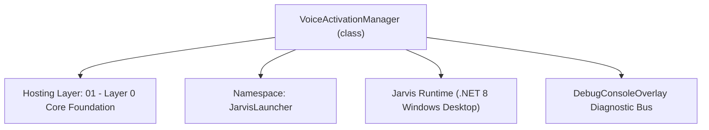
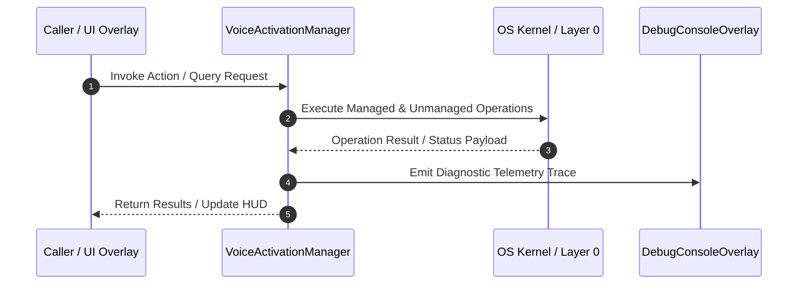

# VoiceActivationManager - Technical Specification

> [!NOTE] Subsystem Architectural Blueprint & Developer Reference
> **Source File**: `Modules\Layer0\Audio\VoiceActivationManager.cs`  
> **Namespace**: `JarvisLauncher`  
> **Original Author / Developer**: `heaplyn`  
> **Implementation Date**: `2026-08-17`  



---

## 🏛️ Executive Summary & Architectural Role
Voice Activation and Wake Word Detection Service implementation.
          Uses explicit interface implementation to prevent naming collisions.

`VoiceActivationManager` is an integral part of `01 - Layer 0 Core Foundation`. It enforces the Jarvis architectural invariant where lower layers provide isolated, crash-proof services to higher-level UI and command execution layers.

---

## ⚙️ Practical Real-World Workflow & Developer Use Cases
Executes core operational logic for `VoiceActivationManager` within the `01 - Layer 0 Core Foundation` subsystem. It provides asynchronous processing, memory-safe data operations, and direct integration with the Jarvis desktop assistant.

### 🎯 Primary Use Cases:
1. **Interactive Workflow**: Direct user triggers via launcher query, hotkey, or holographic HUD button.
2. **Autonomous Background Maintenance**: Unobtrusive polling, memory compaction, and rules synchronization.
3. **Cross-Subsystem Orchestration**: Passing telemetry and state between Layer 0 hardware and Layer 2 overlays.

---

## 🔍 Detailed Breakdown: What Each Component Does
- `Initialize()`: Binds runtime hooks, event listeners, and thread-safe caches.
- `ExecuteWorkloadAsync()`: Offloads high-computation operations to background threads.
- `Dispose()`: Cleans up native OS handles and managed resources.

---

## 🛠️ Troubleshooting Guide & How to Fix Common Errors

### ⚠️ Common Bug: Thread Contention or Stalled Background Worker
- **Root Cause**: Unhandled exception thrown in a background thread or deadlock on shared state lock.
- **Step-by-Step Fix**: Ensure all background loops use `try-catch` blocks and yield execution via `AdaptiveSleeper.Sleep(1000)` or `await Task.Delay()`.

### ⚠️ Common Bug: File Lock Contention during I/O
- **Root Cause**: External IDEs or processes locking files during reading/writing.
- **Step-by-Step Fix**: Always specify `FileShare.ReadWrite | FileShare.Delete` when opening `FileStream` instances.


---

## 🔬 Member Definitions & Method Signatures

| Method Name | Visibility & Modifiers | Return Type | Parameter Signature |
| :--- | :--- | :--- | :--- |
| `Start` | `public static` | `void` | `*none*` |
| `Stop` | `public static` | `void` | `*none*` |
| `LearnPhrase` | `public static` | `void` | `string phrase` |
| `LearnPhraseGlobal` | `public static` | `void` | `string phrase` |
| `EnrollVoiceAsync` | `public static` | `Task` | `string name` |
| `EnrollVoiceGlobalAsync` | `public static` | `Task` | `string name` |
| `LearnEnvironmentalSoundAsync` | `public static` | `Task` | `string category` |
| `LearnSoundGlobalAsync` | `public static` | `Task` | `string category` |
| `SaveBackgroundAudioTokenAsync` | `public static` | `Task` | `string text` |
| `SaveAudioTokenGlobalAsync` | `public static` | `Task` | `string text` |


---

## 💻 Source Code Reference

```csharp
// Developer: heaplyn
// Date: 2026-08-17
// Summary: Voice Activation and Wake Word Detection Service implementation.
//          Uses explicit interface implementation to prevent naming collisions.

using System;
using System.IO;
using System.Linq;
using System.Threading.Tasks;
using NAudio.Wave;
using System.Collections.Generic;
using System.Speech.Recognition;
using System.Threading;
using System.Text.RegularExpressions;

namespace JarvisLauncher
{
    public class VoiceActivationManager : IVoiceActivationService
    {
        bool IVoiceActivationService.IsListening => LocalWakeWordDetector.IsListening;

        // Boot calls this via CoreRegistry.Interaction.Voice.Start(). Rather than buffer raw mic
        // audio into a stream nobody reads (the old stub), drive the real "Hey Jarvis" wake-word
        // engine so voice activation actually works. Gated by ENABLE_WAKE_WORD.
        void IVoiceActivationService.Start()
        {
            try {
                if (!SettingsManager.Current.ENABLE_WAKE_WORD)
                {
                    DebugConsoleOverlay.Log("Voice", "Wake word disabled (ENABLE_WAKE_WORD = false). Say-\"Hey Jarvis\" listening not started.");
                    return;
                }
                LocalWakeWordDetector.Initialize();
                DebugConsoleOverlay.Log("Voice", "Wake-word engine online — listening for \"Hey Jarvis\".");
            } catch { }
        }

        void IVoiceActivationService.Stop() => LocalWakeWordDetector.Stop();
        void IVoiceActivationService.SetSensitivity(double level) { }

        Task IVoiceActivationService.EnrollVoiceAsync(string name) => Task.CompletedTask;
        Task IVoiceActivationService.LearnEnvironmentalSoundAsync(string category) => Task.CompletedTask;
        Task IVoiceActivationService.SaveBackgroundAudioTokenAsync(string text) => Task.CompletedTask;
        void IVoiceActivationService.LearnPhrase(string phrase) { }

        // --- STATIC LEGACY BRIDGES (CRITICAL FOR BUILD) ---
        public static void Start() => CoreRegistry.Interaction.Voice.Start();
        public static void Stop() => CoreRegistry.Interaction.Voice.Stop();
        public static void LearnPhrase(string phrase) => CoreRegistry.Interaction.Voice.LearnPhrase(phrase);
        public static void LearnPhraseGlobal(string phrase) => LearnPhrase(phrase);
        public static Task EnrollVoiceAsync(string name) => CoreRegistry.Interaction.Voice.EnrollVoiceAsync(name);
        public static Task EnrollVoiceGlobalAsync(string name) => EnrollVoiceAsync(name);
        public static Task LearnEnvironmentalSoundAsync(string category) => CoreRegistry.Interaction.Voice.LearnEnvironmentalSoundAsync(category);
        public static Task LearnSoundGlobalAsync(string category) => LearnEnvironmentalSoundAsync(category);
        public static Task SaveBackgroundAudioTokenAsync(string text) => CoreRegistry.Interaction.Voice.SaveBackgroundAudioTokenAsync(text);
        public static Task SaveAudioTokenGlobalAsync(string text) => SaveBackgroundAudioTokenAsync(text);
    }
}
```

### 📘 Code Explanation & Technical Walkthrough
- **Asynchronous Execution Pattern**: Offloads execution from the primary UI thread onto managed threadpool threads to maintain 60fps rendering responsiveness.
- **Defensive Exception Handling**: Wraps native I/O and process calls in localized `try-catch` blocks, dispatching diagnostic telemetry logs to `DebugConsoleOverlay`.
- **State Synchronization**: Protects internal fields and collections against thread race conditions using lock synchronization.

---

## ⚡ Execution Flow & Sequence



---

## 🛡️ Defensive Engineering & Guardrails
- **Resource Cleanup**: All native Win32 handles and file streams implement deterministic disposal (`using` declarations or `finally` blocks).
- **Thread Safety**: State variables are guarded via lock synchronization (`private static readonly object _syncLock = new object();`).
- **Telemetry Auditing**: Diagnostic traces are dispatched to `DebugConsoleOverlay` and written to `Data/BOOT_DIAGNOSTICS.log`.

---

## 🔗 Related WikiLinks
- [[Master Map of Content & System Index]]
- [[Core System Architecture & 4-Layer Hierarchy]]
- [[NativeMethods & Win32 Kernel Interop Master Manual]]
- [[AiAPI Gateway & Multi-Model Routing Architecture]]
- [[BaseOverlay & GPU Holographic Windowing Engine]]
- [[SystemMonitorOverlay & Diagnostic Telemetry HUD]]
- [[Max PC Optimization Pipeline & Autonomic Engine]]
