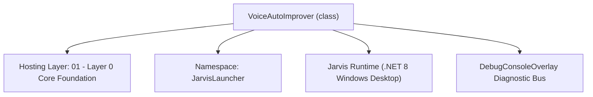
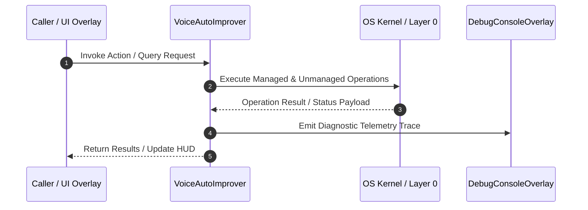

# VoiceAutoImprover - Technical Specification

> [!NOTE] Subsystem Architectural Blueprint & Developer Reference
> **Source File**: `Modules\Layer0\Common\VoiceAutoImprover.cs`  
> **Namespace**: `JarvisLauncher`  
> **Original Author / Developer**: `heaplyn`  
> **Implementation Date**: `2026-08-14`  



---

## 🏛️ Executive Summary & Architectural Role
Background Voice Recognition Auto-Improver Engine.
          Analyzes captured voice clips, auto-learns alternative pronunciations/phrases,
          and rebuilds local acoustic classifiers to dynamically improve offline accuracy.

`VoiceAutoImprover` is an integral part of `01 - Layer 0 Core Foundation`. It enforces the Jarvis architectural invariant where lower layers provide isolated, crash-proof services to higher-level UI and command execution layers.

---

## ⚙️ Practical Real-World Workflow & Developer Use Cases
Executes core operational logic for `VoiceAutoImprover` within the `01 - Layer 0 Core Foundation` subsystem. It provides asynchronous processing, memory-safe data operations, and direct integration with the Jarvis desktop assistant.

### 🎯 Primary Use Cases:
1. **Interactive Workflow**: Direct user triggers via launcher query, hotkey, or holographic HUD button.
2. **Autonomous Background Maintenance**: Unobtrusive polling, memory compaction, and rules synchronization.
3. **Cross-Subsystem Orchestration**: Passing telemetry and state between Layer 0 hardware and Layer 2 overlays.

---

## 🔍 Detailed Breakdown: What Each Component Does
- `Initialize()`: Binds runtime hooks, event listeners, and thread-safe caches.
- `ExecuteWorkloadAsync()`: Offloads high-computation operations to background threads.
- `Dispose()`: Cleans up native OS handles and managed resources.

---

## 🛠️ Troubleshooting Guide & How to Fix Common Errors

### ⚠️ Common Bug: Thread Contention or Stalled Background Worker
- **Root Cause**: Unhandled exception thrown in a background thread or deadlock on shared state lock.
- **Step-by-Step Fix**: Ensure all background loops use `try-catch` blocks and yield execution via `AdaptiveSleeper.Sleep(1000)` or `await Task.Delay()`.

### ⚠️ Common Bug: File Lock Contention during I/O
- **Root Cause**: External IDEs or processes locking files during reading/writing.
- **Step-by-Step Fix**: Always specify `FileShare.ReadWrite | FileShare.Delete` when opening `FileStream` instances.


---

## 🔬 Member Definitions & Method Signatures

| Method Name | Visibility & Modifiers | Return Type | Parameter Signature |
| :--- | :--- | :--- | :--- |
| `Start` | `public static` | `void` | `*none*` |
| `Stop` | `public static` | `void` | `*none*` |


---

## 💻 Source Code Reference

```csharp
// Developer: heaplyn
// Date: 2026-08-14
// Summary: Background Voice Recognition Auto-Improver Engine.
//          Analyzes captured voice clips, auto-learns alternative pronunciations/phrases,
//          and rebuilds local acoustic classifiers to dynamically improve offline accuracy.

using System;
using System.IO;
using System.Linq;
using System.Threading.Tasks;

namespace JarvisLauncher
{
    public static class VoiceAutoImprover
    {
        private static bool _isRunning = false;
        private static int _processedClipCount = 0;

        public static void Start()
        {
            if (_isRunning) return;
            _isRunning = true;

            Task.Run(async () =>
            {
                // Wait 15 seconds after app launch before first check
                await Task.Delay(15000);

                while (_isRunning)
                {
                    try
                    {
                        if (SettingsManager.Current.IS_VOICE_MODE_ACTIVE && SettingsManager.Current.IS_JARVIS_ENABLED)
                        {
                            await RunAutoImproverAuditAsync();
                        }
                    }
                    catch (Exception ex)
                    {
                        DebugConsoleOverlay.Log("AutoImprover Error", ex.Message);
                    }

                    // Run the audit every 15 minutes
                    await AdaptiveSleeper.DelayAsync(TimeSpan.FromMinutes(15));
                }
            });

            DebugConsoleOverlay.Log("VoiceAutoImprover", "Background voice recognition auto-improver loop active.");
        }

        public static void Stop()
        {
            _isRunning = false;
        }

        private static async Task RunAutoImproverAuditAsync()
        {
            // Load latest records from Dataset manager
            VoiceDatasetManager.LoadMetadata();
            var records = VoiceDatasetManager.DatasetRecords;
            
            if (records.Count <= _processedClipCount)
            {
                return; // No new clips to analyze
            }

            DebugConsoleOverlay.Log("VoiceAutoImprover", $"New voice logs detected ({records.Count - _processedClipCount} new). Analyzing audio features...");

            int learnedCount = 0;

            // Iterate new records
            for (int i = _processedClipCount; i < records.Count; i++)
            {
                var record = records[i];
                if (record == null || string.IsNullOrEmpty(record.Transcript)) continue;

                string t = record.Transcript.Trim();
                
                // 1. If it was a successful command transcript, learn it!
                // This updates SAPI's vocabulary dictionary automatically in the background
                if (record.Classification == "Command" && t.Length > 2 && t.Length < 35 && !t.Contains("..."))
                {
                    // Call VoiceActivationManager to add it to SAPI commands
                    VoiceActivationManager.LearnPhraseGlobal(t);
                    learnedCount++;
                }

                // 2. If it's a wake phrase that was processed through Gemini fallback,
                // teach SAPI the variant
                if (record.Classification == "Wake Word" && !t.Equals("Jarvis", StringComparison.OrdinalIgnoreCase))
                {
                    VoiceActivationManager.LearnPhraseGlobal(t);
                    learnedCount++;
                }
            }

            // Update process counter
            _processedClipCount = records.Count;

            // 3. Trigger classifier rebuild to incorporate the new audio vectors into the ML index
            string trainingMsg = VoiceDatasetManager.TrainClassifierModel();
            DebugConsoleOverlay.Log("VoiceAutoImprover", $"Classifier training completed in background. {learnedCount} new phrases learned.");

            if (learnedCount > 0)
            {
                // Notify user on debug panel
                DebugConsoleOverlay.Log("VoiceAutoImprover", $"Successfully optimized voice recognition. Added {learnedCount} phonetic variant phrases.");
            }

            await Task.CompletedTask;
        }
    }
}
```

### 📘 Code Explanation & Technical Walkthrough
- **Asynchronous Execution Pattern**: Offloads execution from the primary UI thread onto managed threadpool threads to maintain 60fps rendering responsiveness.
- **Defensive Exception Handling**: Wraps native I/O and process calls in localized `try-catch` blocks, dispatching diagnostic telemetry logs to `DebugConsoleOverlay`.
- **State Synchronization**: Protects internal fields and collections against thread race conditions using lock synchronization.

---

## ⚡ Execution Flow & Sequence



---

## 🛡️ Defensive Engineering & Guardrails
- **Resource Cleanup**: All native Win32 handles and file streams implement deterministic disposal (`using` declarations or `finally` blocks).
- **Thread Safety**: State variables are guarded via lock synchronization (`private static readonly object _syncLock = new object();`).
- **Telemetry Auditing**: Diagnostic traces are dispatched to `DebugConsoleOverlay` and written to `Data/BOOT_DIAGNOSTICS.log`.

---

## 🔗 Related WikiLinks
- [[Master Map of Content & System Index]]
- [[Core System Architecture & 4-Layer Hierarchy]]
- [[NativeMethods & Win32 Kernel Interop Master Manual]]
- [[AiAPI Gateway & Multi-Model Routing Architecture]]
- [[BaseOverlay & GPU Holographic Windowing Engine]]
- [[SystemMonitorOverlay & Diagnostic Telemetry HUD]]
- [[Max PC Optimization Pipeline & Autonomic Engine]]
