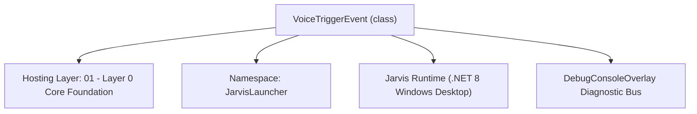
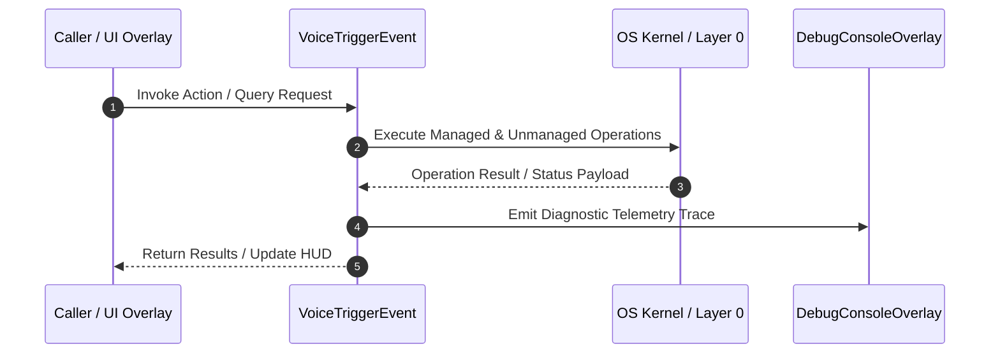

# VoiceDatasetManager - Technical Specification

> [!NOTE] Subsystem Architectural Blueprint & Developer Reference
> **Source File**: `Modules\Layer0\Common\VoiceDatasetManager.cs`  
> **Namespace**: `JarvisLauncher`  
> **Original Author / Developer**: `heaplyn`  
> **Implementation Date**: `2026-08-15`  



---

## 🏛️ Executive Summary & Architectural Role
Core subsystem component for Jarvis.

`VoiceTriggerEvent` is an integral part of `01 - Layer 0 Core Foundation`. It enforces the Jarvis architectural invariant where lower layers provide isolated, crash-proof services to higher-level UI and command execution layers.

---

## ⚙️ Practical Real-World Workflow & Developer Use Cases
Executes core operational logic for `VoiceDatasetManager` within the `01 - Layer 0 Core Foundation` subsystem. It provides asynchronous processing, memory-safe data operations, and direct integration with the Jarvis desktop assistant.

### 🎯 Primary Use Cases:
1. **Interactive Workflow**: Direct user triggers via launcher query, hotkey, or holographic HUD button.
2. **Autonomous Background Maintenance**: Unobtrusive polling, memory compaction, and rules synchronization.
3. **Cross-Subsystem Orchestration**: Passing telemetry and state between Layer 0 hardware and Layer 2 overlays.

---

## 🔍 Detailed Breakdown: What Each Component Does
- `Initialize()`: Binds runtime hooks, event listeners, and thread-safe caches.
- `ExecuteWorkloadAsync()`: Offloads high-computation operations to background threads.
- `Dispose()`: Cleans up native OS handles and managed resources.

---

## 🛠️ Troubleshooting Guide & How to Fix Common Errors

### ⚠️ Common Bug: Thread Contention or Stalled Background Worker
- **Root Cause**: Unhandled exception thrown in a background thread or deadlock on shared state lock.
- **Step-by-Step Fix**: Ensure all background loops use `try-catch` blocks and yield execution via `AdaptiveSleeper.Sleep(1000)` or `await Task.Delay()`.

### ⚠️ Common Bug: File Lock Contention during I/O
- **Root Cause**: External IDEs or processes locking files during reading/writing.
- **Step-by-Step Fix**: Always specify `FileShare.ReadWrite | FileShare.Delete` when opening `FileStream` instances.


---

## 🔬 Member Definitions & Method Signatures

| Method Name | Visibility & Modifiers | Return Type | Parameter Signature |
| :--- | :--- | :--- | :--- |
| `LoadMetadata` | `public static` | `void` | `*none*` |
| `TrainClassifierModel` | `public static` | `string` | `*none*` |
| `ClassifyRecord` | `public static` | `void` | `string filePath, string classification` |
| `DeleteRecord` | `public static` | `void` | `string filePath` |
| `SaveMetadata` | `private static` | `void` | `*none*` |
| `LogTrigger` | `public static` | `void` | `string source, string transcript, string context, byte[]? audioData = null` |
| `GetFewShotExamples` | `public static` | `string` | `*none*` |
| `LoadDataset` | `private static` | `void` | `*none*` |
| `SaveDataset` | `private static` | `void` | `*none*` |
| `ResetDatabase` | `public static` | `void` | `*none*` |


---

## 💻 Source Code Reference

```csharp
using System;
using System.Collections.Generic;
using System.IO;
using System.Linq;
using System.Text.Json;
using System.Threading.Tasks;

namespace JarvisLauncher
{
    public class VoiceTriggerEvent
    {
        public DateTime Timestamp { get; set; } = DateTime.Now;
        public string Source { get; set; } = string.Empty;
        public string Transcript { get; set; } = string.Empty;
        public string SystemContext { get; set; } = string.Empty;
        public bool IsSuccess { get; set; }
        public string AudioClipPath { get; set; } = string.Empty;
    }

    public class VoiceDatasetRecord
    {
        public string FileName { get; set; } = string.Empty;
        public string FilePath { get; set; } = string.Empty;
        public string Transcript { get; set; } = string.Empty; // Added Transcript field
        public double DurationSeconds { get; set; }
        public long FileSizeBytes { get; set; }
        public DateTime RecordedAt { get; set; } = DateTime.Now;
        public string Classification { get; set; } = "AI Chat";
    }

    public static class VoiceDatasetManager
    {
        private static readonly string DatasetDir = Path.Combine(PathHandler.GetDataDirectory(), "VoiceDataset");
        private static readonly string ClipsDir = Path.Combine(DatasetDir, "Clips");
        private static readonly string LogFilePath = Path.Combine(DatasetDir, "Triggers.json");
        private static readonly string MetadataFilePath = Path.Combine(DatasetDir, "DatasetMetadata.json");

        private static readonly List<VoiceTriggerEvent> _recentTriggers = new();
        public static List<VoiceDatasetRecord> DatasetRecords { get; private set; } = new();

        static VoiceDatasetManager()
        {
            // Minimal setup in static constructor to prevent UI blocking
            try
            {
                if (!Directory.Exists(DatasetDir)) Directory.CreateDirectory(DatasetDir);
                if (!Directory.Exists(ClipsDir)) Directory.CreateDirectory(ClipsDir);
            }
            catch { }
        }

        public static async Task InitializeAsync()
        {
            // Move heavy disk I/O to a background task
            await Task.Run(() => {
                try
                {
                    LoadDataset();
                    LoadMetadata();
                }
                catch (Exception ex)
                {
                    System.Diagnostics.Debug.WriteLine($"VoiceDataset init error: {ex.Message}");
                }
            });
        }

        public static void LoadMetadata()
        {
            try
            {
                if (File.Exists(MetadataFilePath))
                {
                    string json = File.ReadAllText(MetadataFilePath);
                    var list = JsonSerializer.Deserialize<List<VoiceDatasetRecord>>(json);
                    if (list != null)
                    {
                        DatasetRecords = list;
                    }
                }

                if (Directory.Exists(ClipsDir))
                {
                    var existingFiles = Directory.GetFiles(ClipsDir, "*.wav");
                    foreach (var file in existingFiles)
                    {
                        if (!DatasetRecords.Any(r => r.FilePath.Equals(file, StringComparison.OrdinalIgnoreCase)))
                        {
                            var fi = new FileInfo(file);
                            DatasetRecords.Add(new VoiceDatasetRecord
                            {
                                FileName = fi.Name,
                                FilePath = fi.FullName,
                                Transcript = "Unknown (Historical)",
                                FileSizeBytes = fi.Length,
                                RecordedAt = fi.CreationTime,
                                DurationSeconds = Math.Max(0.5, fi.Length / 32000.0),
                                Classification = fi.Name.Contains("Wake") ? "Wake Word" : "AI Chat"
                            });
                        }
                    }
                }

                // Also scan the official Trainer folder to ensure those are indexed in the Dataset UI too
                string trainerDir = Path.Combine(PathHandler.GetDataDirectory(), "Voice");
                if (Directory.Exists(trainerDir))
                {
                    var officialFiles = Directory.GetFiles(trainerDir, "*.wav");
                    foreach (var file in officialFiles)
                    {
                        if (!DatasetRecords.Any(r => r.FilePath.Equals(file, StringComparison.OrdinalIgnoreCase)))
                        {
                            var fi = new FileInfo(file);
                            DatasetRecords.Add(new VoiceDatasetRecord
                            {
                                FileName = fi.Name,
                                FilePath = fi.FullName,
                                Transcript = "Official Trainer Sample",
                                FileSizeBytes = fi.Length,
                                RecordedAt = fi.CreationTime,
                                DurationSeconds = Math.Max(0.5, fi.Length / 32000.0),
                                Classification = fi.Name.Contains("clean") ? "Command" : "AI Chat"
                            });
                        }
                    }
                }
                SaveMetadata();
            }
            catch { }
        }

        public static string TrainClassifierModel()
        {
            LoadMetadata();
            VoiceTrainerManager.LoadProfile(); // Ensure official samples are up to date

            int officialCount = VoiceTrainerManager.Profile.SAMPLES.Count;
            int historicalCount = DatasetRecords.Count;

            int cmds = DatasetRecords.Count(r => r.Classification == "Command") + VoiceTrainerManager.Profile.SAMPLES.Count(s => !string.IsNullOrEmpty(s.ASSOCIATED_COMMAND));
            int chats = DatasetRecords.Count(r => r.Classification == "AI Chat") + VoiceTrainerManager.Profile.SAMPLES.Count(s => string.IsNullOrEmpty(s.ASSOCIATED_COMMAND));
            int wakes = DatasetRecords.Count(r => r.Classification == "Wake Word");

            // Trigger acoustic ML re-indexing to include the new historical data
            Task.Run(() => AcousticMlClassifier.RebuildAcousticIndex());

            return $"✅ Training Complete!\n\nJarvis has incorporated {officialCount + historicalCount} recordings into his acoustic memory.\n\n" +
                   $"• Official Trainer Samples: {officialCount}\n" +
                   $"• Background Captured Logs: {historicalCount}\n\n" +
                   $"Breakdown:\n" +
                   $"• Commands/Shortcuts: {cmds}\n" +
                   $"• AI Chat/Phrases: {chats}\n" +
                   $"• Wake Words: {wakes}";
        }

        public static void ClassifyRecord(string filePath, string classification)
        {
            var record = DatasetRecords.FirstOrDefault(r => r.FilePath.Equals(filePath, StringComparison.OrdinalIgnoreCase));
            if (record != null)
            {
                record.Classification = classification;
                SaveMetadata();
            }
        }

        public static void DeleteRecord(string filePath)
        {
            try { if (File.Exists(filePath)) File.Delete(filePath); } catch { }
            DatasetRecords.RemoveAll(r => r.FilePath.Equals(filePath, StringComparison.OrdinalIgnoreCase));
            SaveMetadata();
        }

        private static void SaveMetadata()
        {
            try
            {
                string json = JsonSerializer.Serialize(DatasetRecords, new JsonSerializerOptions { WriteIndented = true });
                File.WriteAllText(MetadataFilePath, json);
            }
            catch { }
        }

        public static void LogTrigger(string source, string transcript, string context, byte[]? audioData = null)
        {
            var ev = new VoiceTriggerEvent { Source = source, Transcript = transcript, SystemContext = context, IsSuccess = !string.IsNullOrWhiteSpace(transcript) && transcript != "..." };
            if (audioData != null)
            {
                string fileName = $"Clip_{DateTime.Now:yyyyMMdd_HHmmss}_{source}.wav";
                string fullPath = Path.Combine(ClipsDir, fileName);
                try
                {
                    using (var ms = new MemoryStream())
                    {
                        using (var writer = new NAudio.Wave.WaveFileWriter(ms, new NAudio.Wave.WaveFormat(16000, 1))) writer.Write(audioData, 0, audioData.Length);
                        File.WriteAllBytes(fullPath, ms.ToArray());
                    }
                    ev.AudioClipPath = fullPath;
                    var fi = new FileInfo(fullPath);
                    DatasetRecords.Add(new VoiceDatasetRecord
                    {
                        FileName = fileName,
                        FilePath = fullPath,
                        Transcript = transcript, // Store the AI transcript
                        FileSizeBytes = fi.Length,
                        RecordedAt = DateTime.Now,
                        DurationSeconds = audioData.Length / 32000.0,
                        Classification = source.Contains("Wake") ? "Wake Word" : "AI Chat"
                    });
                    SaveMetadata();
                }
                catch { }
            }
            lock (_recentTriggers)
            {
                _recentTriggers.Add(ev);
                if (_recentTriggers.Count > 500) _recentTriggers.RemoveAt(0);
                SaveDataset();
            }
        }

        public static string GetFewShotExamples()
        {
            lock (_recentTriggers)
            {
                var successes = _recentTriggers.Where(t => t.IsSuccess).TakeLast(5);
                if (!successes.Any()) return "No recent history.";
                return string.Join("\n", successes.Select(s => $"- [{s.Source}] User said: \"{s.Transcript}\" while using {s.SystemContext}"));
            }
        }

        public static async Task<string> AnalyzeBitDataAsync(string filePath)
        {
            if (!File.Exists(filePath)) return "Error: File not found.";
            try
            {
                byte[] audioBytes = File.ReadAllBytes(filePath);
                string base64Audio = Convert.ToBase64String(audioBytes);
                string prompt = "Perform a deep technical 'bit data' analysis of this voice clip. Analyze signal-to-noise ratio, detect clipping/distortion, evaluate phonetic clarity, and identify background environmental noise profile. Provide a concise professional diagnostic report.";
                return await AiAPI.AnalyzeAudioAsync(prompt, base64Audio);
            }
            catch (Exception ex) { return $"Analysis failed: {ex.Message}"; }
        }

        private static void LoadDataset()
        {
            try { if (File.Exists(LogFilePath)) { string json = File.ReadAllText(LogFilePath); var list = JsonSerializer.Deserialize<List<VoiceTriggerEvent>>(json); if (list != null) _recentTriggers.AddRange(list.TakeLast(500)); } } catch { }
        }

        private static void SaveDataset()
        {
            try { string json = JsonSerializer.Serialize(_recentTriggers, new JsonSerializerOptions { WriteIndented = true }); File.WriteAllText(LogFilePath, json); } catch { }
        }

        public static void ResetDatabase()
        {
            try
            {
                if (Directory.Exists(ClipsDir))
                {
                    var files = Directory.GetFiles(ClipsDir, "*.wav");
                    foreach (var f in files) { try { File.Delete(f); } catch { } }
                }
                if (File.Exists(LogFilePath)) File.Delete(LogFilePath);
                if (File.Exists(MetadataFilePath)) File.Delete(MetadataFilePath);

                DatasetRecords.Clear();
                lock (_recentTriggers) _recentTriggers.Clear();

                DebugConsoleOverlay.Log("Voice-System", "Historical voice dataset has been reset.");
            }
            catch (Exception ex)
            {
                DebugConsoleOverlay.Log("Error", $"Failed to reset voice dataset: {ex.Message}");
            }
        }
    }
}
```

### 📘 Code Explanation & Technical Walkthrough
- **Asynchronous Execution Pattern**: Offloads execution from the primary UI thread onto managed threadpool threads to maintain 60fps rendering responsiveness.
- **Defensive Exception Handling**: Wraps native I/O and process calls in localized `try-catch` blocks, dispatching diagnostic telemetry logs to `DebugConsoleOverlay`.
- **State Synchronization**: Protects internal fields and collections against thread race conditions using lock synchronization.

---

## ⚡ Execution Flow & Sequence



---

## 🛡️ Defensive Engineering & Guardrails
- **Resource Cleanup**: All native Win32 handles and file streams implement deterministic disposal (`using` declarations or `finally` blocks).
- **Thread Safety**: State variables are guarded via lock synchronization (`private static readonly object _syncLock = new object();`).
- **Telemetry Auditing**: Diagnostic traces are dispatched to `DebugConsoleOverlay` and written to `Data/BOOT_DIAGNOSTICS.log`.

---

## 🔗 Related WikiLinks
- [[Master Map of Content & System Index]]
- [[Core System Architecture & 4-Layer Hierarchy]]
- [[NativeMethods & Win32 Kernel Interop Master Manual]]
- [[AiAPI Gateway & Multi-Model Routing Architecture]]
- [[BaseOverlay & GPU Holographic Windowing Engine]]
- [[SystemMonitorOverlay & Diagnostic Telemetry HUD]]
- [[Max PC Optimization Pipeline & Autonomic Engine]]
