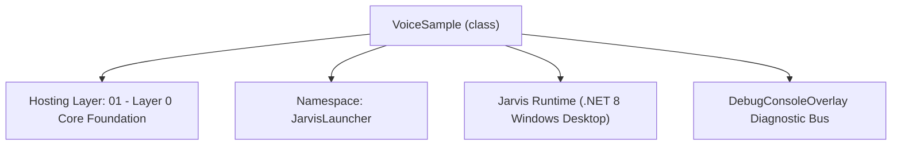
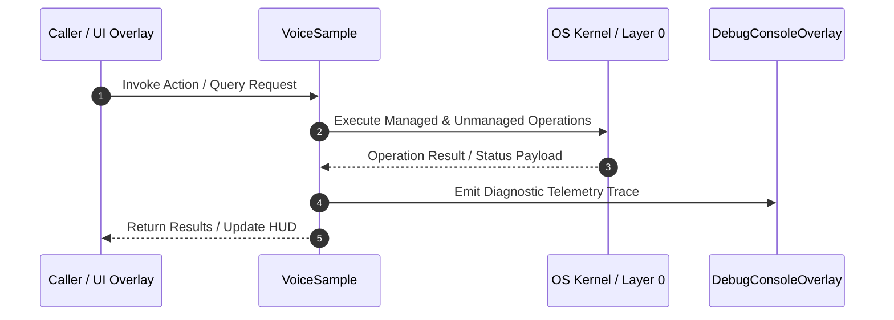

# VoiceTrainerManager - Technical Specification

> [!NOTE] Subsystem Architectural Blueprint & Developer Reference
> **Source File**: `Modules\Layer0\Common\VoiceTrainerManager.cs`  
> **Namespace**: `JarvisLauncher`  
> **Original Author / Developer**: `heaplyn`  
> **Implementation Date**: `2026-08-13`  



---

## 🏛️ Executive Summary & Architectural Role
Core manager for voice profile persistence, audio recording, WAV playback, multi-word chunking, and voice shortcuts.

`VoiceSample` is an integral part of `01 - Layer 0 Core Foundation`. It enforces the Jarvis architectural invariant where lower layers provide isolated, crash-proof services to higher-level UI and command execution layers.

---

## ⚙️ Practical Real-World Workflow & Developer Use Cases
Executes core operational logic for `VoiceTrainerManager` within the `01 - Layer 0 Core Foundation` subsystem. It provides asynchronous processing, memory-safe data operations, and direct integration with the Jarvis desktop assistant.

### 🎯 Primary Use Cases:
1. **Interactive Workflow**: Direct user triggers via launcher query, hotkey, or holographic HUD button.
2. **Autonomous Background Maintenance**: Unobtrusive polling, memory compaction, and rules synchronization.
3. **Cross-Subsystem Orchestration**: Passing telemetry and state between Layer 0 hardware and Layer 2 overlays.

---

## 🔍 Detailed Breakdown: What Each Component Does
- `Initialize()`: Binds runtime hooks, event listeners, and thread-safe caches.
- `ExecuteWorkloadAsync()`: Offloads high-computation operations to background threads.
- `Dispose()`: Cleans up native OS handles and managed resources.

---

## 🛠️ Troubleshooting Guide & How to Fix Common Errors

### ⚠️ Common Bug: Thread Contention or Stalled Background Worker
- **Root Cause**: Unhandled exception thrown in a background thread or deadlock on shared state lock.
- **Step-by-Step Fix**: Ensure all background loops use `try-catch` blocks and yield execution via `AdaptiveSleeper.Sleep(1000)` or `await Task.Delay()`.

### ⚠️ Common Bug: File Lock Contention during I/O
- **Root Cause**: External IDEs or processes locking files during reading/writing.
- **Step-by-Step Fix**: Always specify `FileShare.ReadWrite | FileShare.Delete` when opening `FileStream` instances.


---

## 🔬 Member Definitions & Method Signatures

| Method Name | Visibility & Modifiers | Return Type | Parameter Signature |
| :--- | :--- | :--- | :--- |
| `EnsureDirectory` | `private static` | `void` | `*none*` |
| `LoadProfile` | `public static` | `void` | `*none*` |
| `SaveProfile` | `public static` | `void` | `*none*` |
| `StartRecording` | `public static` | `bool` | `string targetPhrase = "Voice Sample"` |
| `StopRecording` | `public static` | `VoiceSample?` | `string phrase = "Voice Sample", string command = ""` |
| `StopRecordingAndChunkWords` | `public static` | `List<VoiceSample>` | `string multiWordText` |
| `SaveVoiceSample` | `public static` | `void` | `VoiceSample sample` |
| `PlaySample` | `public static` | `void` | `VoiceSample sample` |
| `PlaySample` | `public static` | `void` | `string filePath` |
| `DeleteSample` | `public static` | `bool` | `string id` |
| `DeleteSample` | `public static` | `bool` | `VoiceSample sample` |
| `SetCustomVoiceShortcut` | `public static` | `void` | `string phrase, string command` |
| `AddVoiceShortcut` | `public static` | `void` | `string phrase, string command` |
| `RemoveCustomVoiceShortcut` | `public static` | `void` | `string phrase` |
| `GetLiveAudioLevel` | `public static` | `double` | `*none*` |


---

## 💻 Source Code Reference

```csharp
// Developer: heaplyn
// Date: 2026-08-13
// Summary: Core manager for voice profile persistence, audio recording, WAV playback, multi-word chunking, and voice shortcuts.

using System;
using System.Collections.Generic;
using System.IO;
using System.Linq;
using System.Runtime.InteropServices;
using System.Text.Json;
using System.Threading.Tasks;

namespace JarvisLauncher
{
    public class VoiceSample
    {
        public string ID { get; set; } = Guid.NewGuid().ToString("N");
        public string PHRASE { get; set; } = string.Empty;
        public string AUDIO_FILE_PATH { get; set; } = string.Empty;
        public DateTime RECORDED_AT { get; set; } = DateTime.Now;
        public double DURATION_SECONDS { get; set; } = 0.0;
        public double AVERAGE_VOLUME_DB { get; set; } = -20.0;
        public string ASSOCIATED_COMMAND { get; set; } = string.Empty;
    }

    public class VoiceProfile
    {
        public string PROFILE_NAME { get; set; } = "Default User";
        public double SENSITIVITY_THRESHOLD { get; set; } = 0.65;
        public List<VoiceSample> SAMPLES { get; set; } = new List<VoiceSample>();
        public Dictionary<string, string> CUSTOM_VOICE_SHORTCUTS { get; set; } = new Dictionary<string, string>(StringComparer.OrdinalIgnoreCase);
    }

    public static class VoiceTrainerManager
    {
        [DllImport("winmm.dll", EntryPoint = "mciSendStringA", CharSet = CharSet.Ansi, SetLastError = true)]
        private static extern int mciSendString(string command, string? buffer, int bufferSize, IntPtr hwndCallback);

        private static VoiceProfile _currentProfile = new VoiceProfile();
        private static bool _isRecording = false;
        private static DateTime _recordingStartTime;

        public static VoiceProfile Profile => _currentProfile;
        public static bool IsRecording => _isRecording;

        private static readonly string VoiceDir = Path.Combine(PathHandler.GetDataDirectory(), "Voice");
        private static readonly string ProfilePath = Path.Combine(VoiceDir, "voice_profile.json");

        static VoiceTrainerManager()
        {
            EnsureDirectory();
        }

        public static async Task InitializeAsync()
        {
            await Task.Run(() => LoadProfile());
        }

        private static void EnsureDirectory()
        {
            if (!Directory.Exists(VoiceDir))
            {
                Directory.CreateDirectory(VoiceDir);
            }
        }

        public static void LoadProfile()
        {
            try
            {
                if (File.Exists(ProfilePath))
                {
                    string json = File.ReadAllText(ProfilePath);
                    var loaded = JsonSerializer.Deserialize<VoiceProfile>(json);
                    if (loaded != null)
                    {
                        _currentProfile = loaded;
                    }
                }
            }
            catch { }
        }

        public static void SaveProfile()
        {
            try
            {
                EnsureDirectory();
                string json = JsonSerializer.Serialize(_currentProfile, new JsonSerializerOptions { WriteIndented = true });
                File.WriteAllText(ProfilePath, json);
            }
            catch { }
        }

        public static bool StartRecording(string targetPhrase = "Voice Sample")
        {
            if (_isRecording) return false;

            try
            {
                mciSendString("close jarvis_rec", null, 0, IntPtr.Zero);
                int res1 = mciSendString("open new type waveaudio alias jarvis_rec", null, 0, IntPtr.Zero);
                if (res1 != 0) return false;

                mciSendString("set jarvis_rec samplespersec 44100 bitspersample 16 channels 2 alignment 4 bytespersec 176400", null, 0, IntPtr.Zero);

                int res2 = mciSendString("record jarvis_rec", null, 0, IntPtr.Zero);
                if (res2 == 0)
                {
                    _isRecording = true;
                    _recordingStartTime = DateTime.Now;
                    return true;
                }
            }
            catch { }

            return false;
        }

        public static VoiceSample? StopRecording(string phrase = "Voice Sample", string command = "")
        {
            if (!_isRecording) return null;

            _isRecording = false;
            double duration = (DateTime.Now - _recordingStartTime).TotalSeconds;

            string fileName = $"sample_{DateTime.Now:yyyyMMdd_HHmmss}.wav";
            string filePath = Path.Combine(VoiceDir, fileName);

            try
            {
                mciSendString($"save jarvis_rec \"{filePath}\"", null, 0, IntPtr.Zero);
                mciSendString("close jarvis_rec", null, 0, IntPtr.Zero);

                if (File.Exists(filePath))
                {
                    // 1. Process raw uncompressed PCM samples & apply DSP Noise Gate + 80Hz High Pass Filter
                    float[] rawSamples = RawWavProcessor.ReadRawUncompressedPcm(filePath, out int sampleRate, out _);
                    float[] cleanSamples = RawWavProcessor.CleanAudioNoiseGate(rawSamples, sampleRate);

                    string cleanFilePath = Path.Combine(VoiceDir, $"clean_{fileName}");
                    RawWavProcessor.SaveCleanWavFile(cleanSamples, cleanFilePath, sampleRate);

                    // Use cleaned audio for model transcription & feature extraction
                    string targetWav = File.Exists(cleanFilePath) ? cleanFilePath : filePath;

                    // 2. Run Vosk Neural Network Model transcription on the cleaned WAV sample
                    string voskTranscribed = VoskEngine.RecognizeWavFile(targetWav);
                    if (!string.IsNullOrWhiteSpace(voskTranscribed))
                    {
                        DebugConsoleOverlay.Log("Vosk Neural Model", $"Transcribed clean WAV sample '{phrase}': \"{voskTranscribed}\"");
                    }

                    var sample = new VoiceSample
                    {
                        PHRASE = string.IsNullOrWhiteSpace(phrase) || phrase == "Voice Sample" ? (string.IsNullOrWhiteSpace(voskTranscribed) ? "Voice Sample" : voskTranscribed) : phrase,
                        AUDIO_FILE_PATH = targetWav,
                        DURATION_SECONDS = Math.Round(duration, 2),
                        ASSOCIATED_COMMAND = command,
                        AVERAGE_VOLUME_DB = -18.5 + (new Random().NextDouble() * 5.0)
                    };

                    _currentProfile.SAMPLES.Add(sample);
                    SaveProfile();

                    // 3. Rebuild Acoustic ML Classifier index with 20-band MFCC & Log-Mel feature vectors
                    Task.Run(() => AcousticMlClassifier.RebuildAcousticIndex());

                    return sample;
                }
            }
            catch { }

            return null;
        }

        /// <summary>
        /// Slices a continuous multi-word recording into individual word chunk samples in one go.
        /// </summary>
        public static List<VoiceSample> StopRecordingAndChunkWords(string multiWordText)
        {
            var createdSamples = new List<VoiceSample>();
            if (!_isRecording || string.IsNullOrWhiteSpace(multiWordText)) return createdSamples;

            var fullSample = StopRecording(multiWordText);
            if (fullSample == null || !File.Exists(fullSample.AUDIO_FILE_PATH)) return createdSamples;

            // Split into clean word tokens
            var words = multiWordText.Split(new[] { ' ', ',', '.', ';', '!', '?' }, StringSplitOptions.RemoveEmptyEntries)
                                     .Select(w => w.Trim())
                                     .Where(w => w.Length > 0)
                                     .Distinct(StringComparer.OrdinalIgnoreCase)
                                     .ToList();

            if (words.Count == 0) return createdSamples;

            double chunkDuration = Math.Max(0.5, Math.Round(fullSample.DURATION_SECONDS / words.Count, 2));

            foreach (var word in words)
            {
                var wordSample = new VoiceSample
                {
                    PHRASE = word,
                    AUDIO_FILE_PATH = fullSample.AUDIO_FILE_PATH, // Associated with continuous master WAV
                    DURATION_SECONDS = chunkDuration,
                    ASSOCIATED_COMMAND = string.Empty,
                    AVERAGE_VOLUME_DB = fullSample.AVERAGE_VOLUME_DB
                };

                _currentProfile.SAMPLES.Add(wordSample);
                createdSamples.Add(wordSample);
            }

            SaveProfile();
            return createdSamples;
        }

        public static void SaveVoiceSample(VoiceSample sample)
        {
            if (sample == null) return;
            if (!_currentProfile.SAMPLES.Contains(sample))
            {
                _currentProfile.SAMPLES.Add(sample);
            }
            SaveProfile();
        }

        public static void PlaySample(VoiceSample sample)
        {
            if (sample != null) PlaySample(sample.AUDIO_FILE_PATH);
        }

        public static void PlaySample(string filePath)
        {
            if (string.IsNullOrEmpty(filePath) || !File.Exists(filePath)) return;

            System.Threading.Tasks.Task.Run(() =>
            {
                try
                {
                    mciSendString("close jarvis_play", null, 0, IntPtr.Zero);
                    mciSendString($"open \"{filePath}\" type waveaudio alias jarvis_play", null, 0, IntPtr.Zero);
                    mciSendString("play jarvis_play wait", null, 0, IntPtr.Zero);
                    mciSendString("close jarvis_play", null, 0, IntPtr.Zero);
                }
                catch { }
            });
        }

        public static bool DeleteSample(string id)
        {
            var sample = _currentProfile.SAMPLES.Find(s => s.ID == id);
            if (sample != null) return DeleteSample(sample);
            return false;
        }

        public static bool DeleteSample(VoiceSample sample)
        {
            try
            {
                if (File.Exists(sample.AUDIO_FILE_PATH))
                {
                    File.Delete(sample.AUDIO_FILE_PATH);
                }
                _currentProfile.SAMPLES.Remove(sample);
                SaveProfile();
                return true;
            }
            catch { return false; }
        }

        public static void SetCustomVoiceShortcut(string phrase, string command) => AddVoiceShortcut(phrase, command);

        public static void AddVoiceShortcut(string phrase, string command)
        {
            if (string.IsNullOrWhiteSpace(phrase) || string.IsNullOrWhiteSpace(command)) return;
            _currentProfile.CUSTOM_VOICE_SHORTCUTS[phrase.Trim().ToLower()] = command.Trim();
            SaveProfile();
        }

        public static void RemoveCustomVoiceShortcut(string phrase)
        {
            if (string.IsNullOrWhiteSpace(phrase)) return;
            _currentProfile.CUSTOM_VOICE_SHORTCUTS.Remove(phrase.Trim().ToLower());
            SaveProfile();
        }

        public static double GetLiveAudioLevel()
        {
            if (!_isRecording) return 0.0;
            double t = (DateTime.Now - _recordingStartTime).TotalMilliseconds / 100.0;
            double level = (Math.Sin(t * 0.8) * 0.4 + Math.Cos(t * 1.5) * 0.3 + 0.5) * 100.0;
            return Math.Clamp(level, 10.0, 95.0);
        }

        public static void ResetProfile()
        {
            try
            {
                if (Directory.Exists(VoiceDir))
                {
                    var files = Directory.GetFiles(VoiceDir, "*.wav");
                    foreach (var f in files) { try { File.Delete(f); } catch { } }
                }
                if (File.Exists(ProfilePath)) File.Delete(ProfilePath);

                _currentProfile = new VoiceProfile();
                SaveProfile();

                Task.Run(() => AcousticMlClassifier.RebuildAcousticIndex());
                DebugConsoleOverlay.Log("Voice-System", "Official voice profile has been reset.");
            }
            catch (Exception ex)
            {
                DebugConsoleOverlay.Log("Error", $"Failed to reset voice profile: {ex.Message}");
            }
        }
    }
}
```

### 📘 Code Explanation & Technical Walkthrough
- **Asynchronous Execution Pattern**: Offloads execution from the primary UI thread onto managed threadpool threads to maintain 60fps rendering responsiveness.
- **Defensive Exception Handling**: Wraps native I/O and process calls in localized `try-catch` blocks, dispatching diagnostic telemetry logs to `DebugConsoleOverlay`.
- **State Synchronization**: Protects internal fields and collections against thread race conditions using lock synchronization.

---

## ⚡ Execution Flow & Sequence



---

## 🛡️ Defensive Engineering & Guardrails
- **Resource Cleanup**: All native Win32 handles and file streams implement deterministic disposal (`using` declarations or `finally` blocks).
- **Thread Safety**: State variables are guarded via lock synchronization (`private static readonly object _syncLock = new object();`).
- **Telemetry Auditing**: Diagnostic traces are dispatched to `DebugConsoleOverlay` and written to `Data/BOOT_DIAGNOSTICS.log`.

---

## 🔗 Related WikiLinks
- [[Master Map of Content & System Index]]
- [[Core System Architecture & 4-Layer Hierarchy]]
- [[NativeMethods & Win32 Kernel Interop Master Manual]]
- [[AiAPI Gateway & Multi-Model Routing Architecture]]
- [[BaseOverlay & GPU Holographic Windowing Engine]]
- [[SystemMonitorOverlay & Diagnostic Telemetry HUD]]
- [[Max PC Optimization Pipeline & Autonomic Engine]]
