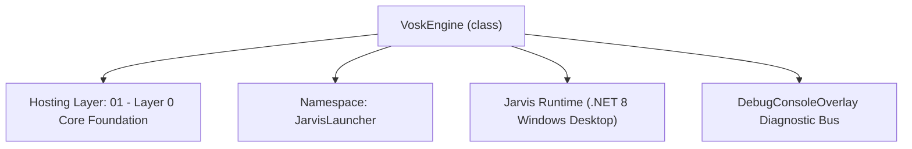
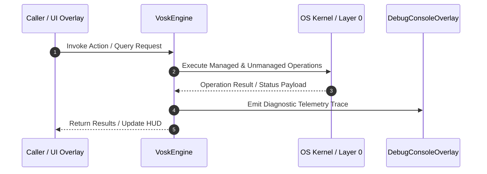

# VoskEngine - Technical Specification

> [!NOTE] Subsystem Architectural Blueprint & Developer Reference
> **Source File**: `Modules\Layer0\Common\VoskEngine.cs`  
> **Namespace**: `JarvisLauncher`  
> **Original Author / Developer**: `heaplyn`  
> **Implementation Date**: `2026-08-13`  



---

## 🏛️ Executive Summary & Architectural Role
High-accuracy offline Speech-to-Text engine powered by Vosk API.
 Features automatic background downloader for official Vosk acoustic neural network models.

`VoskEngine` is an integral part of `01 - Layer 0 Core Foundation`. It enforces the Jarvis architectural invariant where lower layers provide isolated, crash-proof services to higher-level UI and command execution layers.

---

## ⚙️ Practical Real-World Workflow & Developer Use Cases
Executes core operational logic for `VoskEngine` within the `01 - Layer 0 Core Foundation` subsystem. It provides asynchronous processing, memory-safe data operations, and direct integration with the Jarvis desktop assistant.

### 🎯 Primary Use Cases:
1. **Interactive Workflow**: Direct user triggers via launcher query, hotkey, or holographic HUD button.
2. **Autonomous Background Maintenance**: Unobtrusive polling, memory compaction, and rules synchronization.
3. **Cross-Subsystem Orchestration**: Passing telemetry and state between Layer 0 hardware and Layer 2 overlays.

---

## 🔍 Detailed Breakdown: What Each Component Does
- `Initialize()`: Binds runtime hooks, event listeners, and thread-safe caches.
- `ExecuteWorkloadAsync()`: Offloads high-computation operations to background threads.
- `Dispose()`: Cleans up native OS handles and managed resources.

---

## 🛠️ Troubleshooting Guide & How to Fix Common Errors

### ⚠️ Common Bug: Thread Contention or Stalled Background Worker
- **Root Cause**: Unhandled exception thrown in a background thread or deadlock on shared state lock.
- **Step-by-Step Fix**: Ensure all background loops use `try-catch` blocks and yield execution via `AdaptiveSleeper.Sleep(1000)` or `await Task.Delay()`.

### ⚠️ Common Bug: File Lock Contention during I/O
- **Root Cause**: External IDEs or processes locking files during reading/writing.
- **Step-by-Step Fix**: Always specify `FileShare.ReadWrite | FileShare.Delete` when opening `FileStream` instances.


---

## 🔬 Member Definitions & Method Signatures

| Method Name | Visibility & Modifiers | Return Type | Parameter Signature |
| :--- | :--- | :--- | :--- |
| `Initialize` | `public static` | `bool` | `*none*` |
| `IsModelPresent` | `public static` | `bool` | `*none*` |
| `ProcessAudioBuffer` | `public static` | `string` | `byte[] buffer, int length` |
| `RecognizeWavFile` | `public static` | `string` | `string wavFilePath` |
| `RecognizePcmData` | `public static` | `string` | `byte[] data` |
| `ExtractTextFromJson` | `private static` | `string` | `string json` |
| `ExtractPartialFromJson` | `private static` | `string` | `string json` |


---

## 💻 Source Code Reference

```csharp
// Developer: heaplyn
// Date: 2026-08-13
// Summary: High-accuracy offline Speech-to-Text engine powered by Vosk API.
// Features automatic background downloader for official Vosk acoustic neural network models.

using System;
using System.IO;
using System.IO.Compression;
using System.Net.Http;
using System.Text.Json;
using System.Threading.Tasks;
using System.Windows;
using Vosk;

namespace JarvisLauncher
{
    public static class VoskEngine
    {
        public static event Action<string>? OnPartialResult;
        public static event Action<string>? OnFinalResult;

        private static Model? _model;
        private static VoskRecognizer? _recognizer;
        private static bool _isInitialized = false;
        private static bool _isDownloading = false;
        private static readonly object _lock = new();

        public static bool IsInitialized => _isInitialized;
        public static bool IsDownloading => _isDownloading;

        public static readonly string ModelDirectory = Path.Combine(PathHandler.GetDataDirectory(), "Models", "vosk-model-en-us");
        private const string ModelZipUrl = "https://alphacephei.com/vosk/models/vosk-model-small-en-us-0.15.zip";

        public static bool Initialize()
        {
            lock (_lock)
            {
                if (_isInitialized) return true;

                try
                {
                    Vosk.Vosk.SetLogLevel(-1); // Silent native Vosk C++ logs

                    if (!Directory.Exists(ModelDirectory))
                    {
                        Directory.CreateDirectory(ModelDirectory);
                    }

                    if (IsModelPresent())
                    {
                        // Final safety check for native model file to prevent AccessViolationException
                        if (!File.Exists(Path.Combine(ModelDirectory, "am", "final.mdl")))
                        {
                            DebugConsoleOverlay.Log("Vosk-Error", "Critical model file 'am/final.mdl' missing. Aborting init.");
                            return false;
                        }

                        _model = new Model(ModelDirectory);
                        _recognizer = new VoskRecognizer(_model, 16000.0f);
                        _recognizer.SetMaxAlternatives(0);
                        _recognizer.SetWords(true);
                        _isInitialized = true;
                        DebugConsoleOverlay.Log("Vosk", "Speech-to-Text Engine initialized successfully!");
                        return true;
                    }
                    else
                    {
                        DebugConsoleOverlay.Log("Vosk", $"Model files not found in '{ModelDirectory}'. Background downloader triggered.");
                        // Trigger background downloader on launch if missing
                        Task.Run(async () => await EnsureModelDownloadedAsync(showToast: false));
                        return false;
                    }
                }
                catch (Exception ex)
                {
                    DebugConsoleOverlay.Log("Vosk-Error", $"Init failed: {ex.Message}");
                    _isInitialized = false;
                    return false;
                }
            }
        }

        public static bool IsModelPresent()
        {
            if (!Directory.Exists(ModelDirectory)) return false;
            return File.Exists(Path.Combine(ModelDirectory, "am", "final.mdl")) ||
                   File.Exists(Path.Combine(ModelDirectory, "graph", "HCLG.fst")) ||
                   Directory.GetFiles(ModelDirectory, "*.*", SearchOption.AllDirectories).Length > 3;
        }

        /// <summary>
        /// Automatically downloads and extracts the official Vosk neural speech model (~40MB).
        /// </summary>
        public static async Task<bool> EnsureModelDownloadedAsync(bool showToast = true)
        {
            if (IsModelPresent())
            {
                if (showToast) TextOverlay.Show("✅ Vosk Speech Model is already installed!", 2500);
                if (!_isInitialized) Initialize();
                return true;
            }

            if (_isDownloading) return false;

            _isDownloading = true;
            if (showToast) TextOverlay.Show("📥 Downloading Vosk Neural Speech Model (~40MB)...", 4000);

            string zipPath = Path.Combine(PathHandler.GetDataDirectory(), "Models", "vosk_model.zip");

            try
            {
                using (var client = new HttpClient())
                {
                    client.Timeout = TimeSpan.FromMinutes(5);
                    byte[] data = await client.GetByteArrayAsync(ModelZipUrl);
                    await File.WriteAllBytesAsync(zipPath, data);
                }

                if (showToast) TextOverlay.Show("📦 Extracting Vosk Speech Model...", 3000);

                string tempExtractDir = Path.Combine(PathHandler.GetDataDirectory(), "Models", "temp_vosk");
                if (Directory.Exists(tempExtractDir)) Directory.Delete(tempExtractDir, true);

                ZipFile.ExtractToDirectory(zipPath, tempExtractDir);

                // Find extracted inner folder (vosk-model-small-en-us-0.15)
                var subDirs = Directory.GetDirectories(tempExtractDir);
                string sourceDir = subDirs.Length > 0 ? subDirs[0] : tempExtractDir;

                if (!Directory.Exists(ModelDirectory)) Directory.CreateDirectory(ModelDirectory);

                // Move all files to ModelDirectory
                foreach (var file in Directory.GetFiles(sourceDir, "*.*", SearchOption.AllDirectories))
                {
                    string relative = Path.GetRelativePath(sourceDir, file);
                    string dest = Path.Combine(ModelDirectory, relative);
                    string? destDir = Path.GetDirectoryName(dest);
                    if (!string.IsNullOrEmpty(destDir) && !Directory.Exists(destDir)) Directory.CreateDirectory(destDir);
                    File.Copy(file, dest, true);
                }

                // Cleanup
                try
                {
                    if (File.Exists(zipPath)) File.Delete(zipPath);
                    if (Directory.Exists(tempExtractDir)) Directory.Delete(tempExtractDir, true);
                }
                catch { }

                _isDownloading = false;
                bool ok = Initialize();
                if (ok && showToast) TextOverlay.Show("✅ Vosk Neural Speech Model installed & active!", 3500);
                return ok;
            }
            catch (Exception ex)
            {
                _isDownloading = false;
                if (showToast) TextOverlay.Show($"⚠️ Vosk Download Error: {ex.Message}", 4000);
                System.Diagnostics.Debug.WriteLine($"Vosk model download failed: {ex.Message}");
                return false;
            }
        }

        /// <summary>
        /// Processes 16kHz 16-bit mono PCM audio buffer into Vosk Speech-to-Text engine.
        /// </summary>
        public static string ProcessAudioBuffer(byte[] buffer, int length)
        {
            if (!_isInitialized || _recognizer == null || buffer == null || length <= 0) return string.Empty;

            lock (_lock)
            {
                try
                {
                    if (_recognizer.AcceptWaveform(buffer, length))
                    {
                        string jsonResult = _recognizer.Result();
                        string text = ExtractTextFromJson(jsonResult);
                        if (!string.IsNullOrWhiteSpace(text))
                        {
                            OnFinalResult?.Invoke(text);
                            return text;
                        }
                    }
                    else
                    {
                        string jsonPartial = _recognizer.PartialResult();
                        string partialText = ExtractPartialFromJson(jsonPartial);
                        if (!string.IsNullOrWhiteSpace(partialText))
                        {
                            OnPartialResult?.Invoke(partialText);
                        }
                    }
                }
                catch (Exception ex)
                {
                    System.Diagnostics.Debug.WriteLine($"Vosk buffer processing error: {ex.Message}");
                }
            }

            return string.Empty;
        }

        /// <summary>
        /// Parses a full WAV file offline using Vosk Speech-to-Text engine.
        /// </summary>
        public static string RecognizeWavFile(string wavFilePath)
        {
            if (!File.Exists(wavFilePath)) return string.Empty;

            if (!_isInitialized && !Initialize())
            {
                return string.Empty;
            }

            lock (_lock)
            {
                if (_model == null) return string.Empty;
                try
                {
                    using var rec = new VoskRecognizer(_model, 16000.0f);
                    rec.SetMaxAlternatives(0);
                    rec.SetWords(true);

                    using var stream = File.OpenRead(wavFilePath);
                    byte[] buffer = new byte[4096];
                    int bytesRead;
                    var fullTextBuilder = new System.Text.StringBuilder();

                    while ((bytesRead = stream.Read(buffer, 0, buffer.Length)) > 0)
                    {
                        if (rec.AcceptWaveform(buffer, bytesRead))
                        {
                            string text = ExtractTextFromJson(rec.Result());
                            if (!string.IsNullOrWhiteSpace(text))
                            {
                                fullTextBuilder.Append(text).Append(" ");
                            }
                        }
                    }

                    string finalText = ExtractTextFromJson(rec.FinalResult());
                    if (!string.IsNullOrWhiteSpace(finalText))
                    {
                        fullTextBuilder.Append(finalText);
                    }

                    return fullTextBuilder.ToString().Trim();
                }
                catch (Exception ex)
                {
                    System.Diagnostics.Debug.WriteLine($"Vosk WAV file recognition error: {ex.Message}");
                    return string.Empty;
                }
            }
        }

        /// <summary>
        /// Parses raw 16kHz 16-bit mono PCM bytes offline using Vosk.
        /// </summary>
        public static string RecognizePcmData(byte[] data)
        {
            if (data == null || data.Length == 0) return string.Empty;

            if (!_isInitialized && !Initialize())
            {
                return string.Empty;
            }

            lock (_lock)
            {
                if (_model == null) return string.Empty;
                try
                {
                    using var rec = new VoskRecognizer(_model, 16000.0f);
                    rec.SetMaxAlternatives(0);
                    rec.SetWords(true);

                    if (rec.AcceptWaveform(data, data.Length))
                    {
                        // Fall through
                    }

                    return ExtractTextFromJson(rec.FinalResult()).Trim();
                }
                catch (Exception ex)
                {
                    System.Diagnostics.Debug.WriteLine($"Vosk PCM recognition error: {ex.Message}");
                    return string.Empty;
                }
            }
        }

        private static string ExtractTextFromJson(string json)
        {
            try
            {
                using var doc = JsonDocument.Parse(json);
                if (doc.RootElement.TryGetProperty("text", out JsonElement textElement))
                {
                    return textElement.GetString() ?? string.Empty;
                }
            }
            catch { }
            return string.Empty;
        }

        private static string ExtractPartialFromJson(string json)
        {
            try
            {
                using var doc = JsonDocument.Parse(json);
                if (doc.RootElement.TryGetProperty("partial", out JsonElement partialElement))
                {
                    return partialElement.GetString() ?? string.Empty;
                }
            }
            catch { }
            return string.Empty;
        }
    }
}
```

### 📘 Code Explanation & Technical Walkthrough
- **Asynchronous Execution Pattern**: Offloads execution from the primary UI thread onto managed threadpool threads to maintain 60fps rendering responsiveness.
- **Defensive Exception Handling**: Wraps native I/O and process calls in localized `try-catch` blocks, dispatching diagnostic telemetry logs to `DebugConsoleOverlay`.
- **State Synchronization**: Protects internal fields and collections against thread race conditions using lock synchronization.

---

## ⚡ Execution Flow & Sequence



---

## 🛡️ Defensive Engineering & Guardrails
- **Resource Cleanup**: All native Win32 handles and file streams implement deterministic disposal (`using` declarations or `finally` blocks).
- **Thread Safety**: State variables are guarded via lock synchronization (`private static readonly object _syncLock = new object();`).
- **Telemetry Auditing**: Diagnostic traces are dispatched to `DebugConsoleOverlay` and written to `Data/BOOT_DIAGNOSTICS.log`.

---

## 🔗 Related WikiLinks
- [[Master Map of Content & System Index]]
- [[Core System Architecture & 4-Layer Hierarchy]]
- [[NativeMethods & Win32 Kernel Interop Master Manual]]
- [[AiAPI Gateway & Multi-Model Routing Architecture]]
- [[BaseOverlay & GPU Holographic Windowing Engine]]
- [[SystemMonitorOverlay & Diagnostic Telemetry HUD]]
- [[Max PC Optimization Pipeline & Autonomic Engine]]
