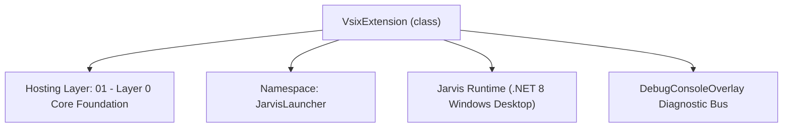
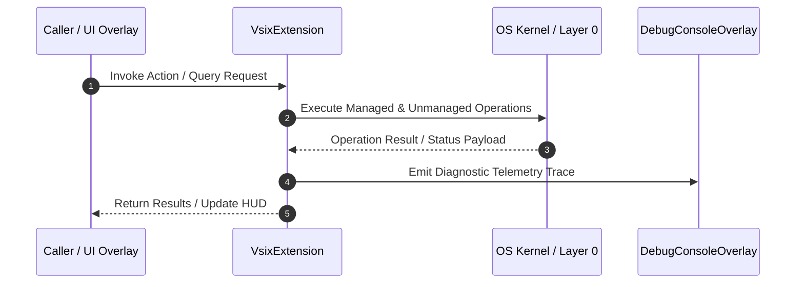

# VsixManager - Technical Specification

> [!NOTE] Subsystem Architectural Blueprint & Developer Reference
> **Source File**: `Modules\Layer0\Common\VsixManager.cs`  
> **Namespace**: `JarvisLauncher`  
> **Original Author / Developer**: `heaplyn`  
> **Implementation Date**: `2026-08-16`  



---

## 🏛️ Executive Summary & Architectural Role
VSIX / VS Code Extension Parser for Jarvis Studio.
          Extracts language definitions, grammars, and snippets to enhance editor intelligence.

`VsixExtension` is an integral part of `01 - Layer 0 Core Foundation`. It enforces the Jarvis architectural invariant where lower layers provide isolated, crash-proof services to higher-level UI and command execution layers.

---

## ⚙️ Practical Real-World Workflow & Developer Use Cases
Executes core operational logic for `VsixManager` within the `01 - Layer 0 Core Foundation` subsystem. It provides asynchronous processing, memory-safe data operations, and direct integration with the Jarvis desktop assistant.

### 🎯 Primary Use Cases:
1. **Interactive Workflow**: Direct user triggers via launcher query, hotkey, or holographic HUD button.
2. **Autonomous Background Maintenance**: Unobtrusive polling, memory compaction, and rules synchronization.
3. **Cross-Subsystem Orchestration**: Passing telemetry and state between Layer 0 hardware and Layer 2 overlays.

---

## 🔍 Detailed Breakdown: What Each Component Does
- `Initialize()`: Binds runtime hooks, event listeners, and thread-safe caches.
- `ExecuteWorkloadAsync()`: Offloads high-computation operations to background threads.
- `Dispose()`: Cleans up native OS handles and managed resources.

---

## 🛠️ Troubleshooting Guide & How to Fix Common Errors

### ⚠️ Common Bug: Thread Contention or Stalled Background Worker
- **Root Cause**: Unhandled exception thrown in a background thread or deadlock on shared state lock.
- **Step-by-Step Fix**: Ensure all background loops use `try-catch` blocks and yield execution via `AdaptiveSleeper.Sleep(1000)` or `await Task.Delay()`.

### ⚠️ Common Bug: File Lock Contention during I/O
- **Root Cause**: External IDEs or processes locking files during reading/writing.
- **Step-by-Step Fix**: Always specify `FileShare.ReadWrite | FileShare.Delete` when opening `FileStream` instances.


---

## 🔬 Member Definitions & Method Signatures

| Method Name | Visibility & Modifiers | Return Type | Parameter Signature |
| :--- | :--- | :--- | :--- |
| `ProcessContributes` | `private static` | `void` | `JsonElement root, string extBaseDir` |
| `LoadTextMateGrammar` | `private static` | `void` | `string path, string languageId` |
| `ExtractPatterns` | `private static` | `void` | `JsonElement patterns, List<SyntaxRule> rules` |
| `MapScopeToColor` | `private static` | `string` | `string scope` |
| `LoadInstalledExtensions` | `public static` | `void` | `*none*` |


---

## 💻 Source Code Reference

```csharp
// Developer: heaplyn
// Date: 2026-08-16
// Summary: VSIX / VS Code Extension Parser for Jarvis Studio.
//          Extracts language definitions, grammars, and snippets to enhance editor intelligence.

using System;
using System.Collections.Generic;
using System.IO;
using System.IO.Compression;
using System.Linq;
using System.Text;
using System.Text.Json;
using System.Text.RegularExpressions;
using System.Threading.Tasks;

namespace JarvisLauncher
{
    public class VsixExtension
    {
        public string Id { get; set; } = string.Empty;
        public string Name { get; set; } = string.Empty;
        public string Version { get; set; } = string.Empty;
        public string Publisher { get; set; } = string.Empty;
        public List<string> SupportedExtensions { get; set; } = new();
    }

    public static class VsixManager
    {
        private static readonly string ExtensionsDir = Path.Combine(AppDomain.CurrentDomain.BaseDirectory, "Data", "Extensions");

        static VsixManager()
        {
            if (!Directory.Exists(ExtensionsDir)) Directory.CreateDirectory(ExtensionsDir);
        }

        public static async Task<bool> InstallExtensionAsync(string vsixPath)
        {
            try
            {
                if (!File.Exists(vsixPath)) return false;

                using (ZipArchive archive = ZipFile.OpenRead(vsixPath))
                {
                    // 1. Find and Parse package.json
                    var packageEntry = archive.GetEntry("extension/package.json");
                    if (packageEntry == null) return false;

                    using var reader = new StreamReader(packageEntry.Open());
                    string json = await reader.ReadToEndAsync();
                    using var doc = JsonDocument.Parse(json);
                    var root = doc.RootElement;

                    string name = root.GetProperty("name").GetString() ?? "unknown";
                    string publisher = root.TryGetProperty("publisher", out var p) ? p.GetString() ?? "" : "";
                    string extDir = Path.Combine(ExtensionsDir, $"{publisher}.{name}");

                    if (Directory.Exists(extDir)) Directory.Delete(extDir, true);
                    Directory.CreateDirectory(extDir);

                    // 2. Extract relevant parts (grammars and snippets)
                    foreach (var entry in archive.Entries)
                    {
                        if (entry.FullName.StartsWith("extension/"))
                        {
                            string relPath = entry.FullName.Substring("extension/".Length);
                            if (string.IsNullOrEmpty(relPath)) continue;

                            string destPath = Path.Combine(extDir, relPath);
                            string? dir = Path.GetDirectoryName(destPath);
                            if (dir != null && !Directory.Exists(dir)) Directory.CreateDirectory(dir);

                            if (!destPath.EndsWith("/") && !destPath.EndsWith("\\"))
                                entry.ExtractToFile(destPath, true);
                        }
                    }

                    // 3. Process contributions
                    ProcessContributes(root, extDir);
                    return true;
                }
            }
            catch (Exception ex)
            {
                DebugConsoleOverlay.Log("VSIX", "Installation failed: " + ex.Message);
                return false;
            }
        }

        private static void ProcessContributes(JsonElement root, string extBaseDir)
        {
            if (!root.TryGetProperty("contributes", out var contributes)) return;

            // Handle Grammars (Syntax Highlighting)
            if (contributes.TryGetProperty("grammars", out var grammars))
            {
                foreach (var g in grammars.EnumerateArray())
                {
                    try
                    {
                        string lang = g.TryGetProperty("language", out var l) ? l.GetString() ?? "" : "";
                        string path = g.TryGetProperty("path", out var pt) ? pt.GetString() ?? "" : "";
                        if (string.IsNullOrEmpty(lang) || string.IsNullOrEmpty(path)) continue;

                        string absPath = Path.Combine(extBaseDir, path.TrimStart('.', '/', '\\'));
                        if (File.Exists(absPath))
                        {
                            LoadTextMateGrammar(absPath, lang);
                        }
                    }
                    catch { }
                }
            }

            // Handle Languages (Extensions)
            if (contributes.TryGetProperty("languages", out var languages))
            {
                foreach (var l in languages.EnumerateArray())
                {
                    string id = l.TryGetProperty("id", out var i) ? i.GetString() ?? "" : "";
                    if (l.TryGetProperty("extensions", out var exts))
                    {
                        foreach (var e in exts.EnumerateArray())
                        {
                            // Map extensions to language IDs if needed
                        }
                    }
                }
            }
        }

        private static void LoadTextMateGrammar(string path, string languageId)
        {
            try
            {
                string json = File.ReadAllText(path);
                using var doc = JsonDocument.Parse(json);
                var root = doc.RootElement;

                var rules = new List<SyntaxRule>();

                // Heuristic: Extract repository patterns or patterns directly
                if (root.TryGetProperty("patterns", out var patterns))
                {
                    ExtractPatterns(patterns, rules);
                }

                // Map to Jarvis extensions
                string ext = "." + languageId.ToLower();
                if (languageId.Equals("csharp", StringComparison.OrdinalIgnoreCase)) ext = ".cs";
                if (languageId.Equals("python", StringComparison.OrdinalIgnoreCase)) ext = ".py";
                if (languageId.Equals("javascript", StringComparison.OrdinalIgnoreCase)) ext = ".js";

                if (rules.Count > 0)
                {
                    EditorIntelligenceManager.SyntaxHighlightingRules[ext] = rules;
                    DebugConsoleOverlay.Log("VSIX", $"Loaded {rules.Count} rules for {ext}");
                }
            }
            catch { }
        }

        private static void ExtractPatterns(JsonElement patterns, List<SyntaxRule> rules)
        {
            foreach (var p in patterns.EnumerateArray())
            {
                if (p.TryGetProperty("match", out var match))
                {
                    string regex = match.GetString() ?? "";
                    string name = p.TryGetProperty("name", out var n) ? n.GetString() ?? "" : "";

                    if (!string.IsNullOrEmpty(regex))
                    {
                        rules.Add(new SyntaxRule
                        {
                            Pattern = regex,
                            ColorHex = MapScopeToColor(name),
                            Category = name
                        });
                    }
                }
            }
        }

        private static string MapScopeToColor(string scope)
        {
            if (scope.Contains("keyword")) return "#569CD6";
            if (scope.Contains("string")) return "#D69D85";
            if (scope.Contains("comment")) return "#6A9955";
            if (scope.Contains("variable")) return "#9CDCFE";
            if (scope.Contains("constant")) return "#4FC1FF";
            if (scope.Contains("entity.name.type")) return "#4EC9B0";
            if (scope.Contains("entity.name.function")) return "#DCDCAA";
            return "#FFFFFF";
        }

        public static void LoadInstalledExtensions()
        {
            if (!Directory.Exists(ExtensionsDir)) return;
            foreach (var dir in Directory.GetDirectories(ExtensionsDir))
            {
                string pkgJson = Path.Combine(dir, "package.json");
                if (File.Exists(pkgJson))
                {
                    try
                    {
                        string json = File.ReadAllText(pkgJson);
                        using var doc = JsonDocument.Parse(json);
                        ProcessContributes(doc.RootElement, dir);
                    }
                    catch { }
                }
            }
        }
    }
}
```

### 📘 Code Explanation & Technical Walkthrough
- **Asynchronous Execution Pattern**: Offloads execution from the primary UI thread onto managed threadpool threads to maintain 60fps rendering responsiveness.
- **Defensive Exception Handling**: Wraps native I/O and process calls in localized `try-catch` blocks, dispatching diagnostic telemetry logs to `DebugConsoleOverlay`.
- **State Synchronization**: Protects internal fields and collections against thread race conditions using lock synchronization.

---

## ⚡ Execution Flow & Sequence



---

## 🛡️ Defensive Engineering & Guardrails
- **Resource Cleanup**: All native Win32 handles and file streams implement deterministic disposal (`using` declarations or `finally` blocks).
- **Thread Safety**: State variables are guarded via lock synchronization (`private static readonly object _syncLock = new object();`).
- **Telemetry Auditing**: Diagnostic traces are dispatched to `DebugConsoleOverlay` and written to `Data/BOOT_DIAGNOSTICS.log`.

---

## 🔗 Related WikiLinks
- [[Master Map of Content & System Index]]
- [[Core System Architecture & 4-Layer Hierarchy]]
- [[NativeMethods & Win32 Kernel Interop Master Manual]]
- [[AiAPI Gateway & Multi-Model Routing Architecture]]
- [[BaseOverlay & GPU Holographic Windowing Engine]]
- [[SystemMonitorOverlay & Diagnostic Telemetry HUD]]
- [[Max PC Optimization Pipeline & Autonomic Engine]]
