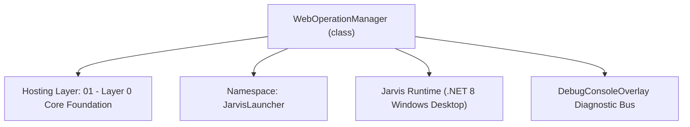
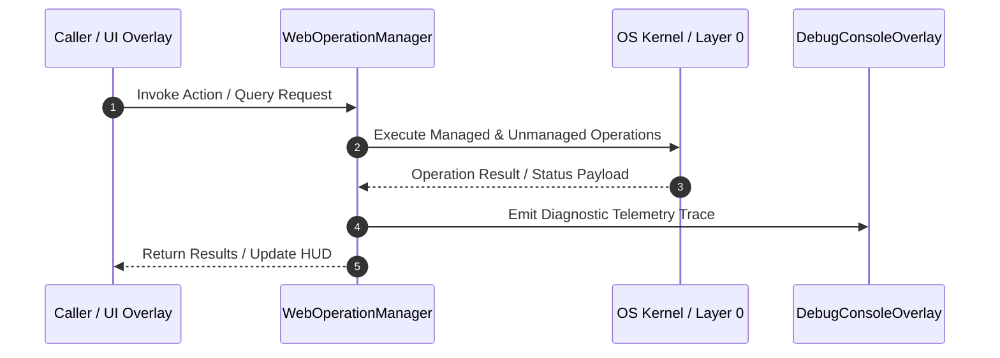

# WebOperationManager - Technical Specification

> [!NOTE] Subsystem Architectural Blueprint & Developer Reference
> **Source File**: `Modules\Layer0\Common\WebOperationManager.cs`  
> **Namespace**: `JarvisLauncher`  
> **Original Author / Developer**: `heaplyn`  
> **Implementation Date**: `2026-08-17`  



---

## 🏛️ Executive Summary & Architectural Role
Web Operations Service implementation.

`WebOperationManager` is an integral part of `01 - Layer 0 Core Foundation`. It enforces the Jarvis architectural invariant where lower layers provide isolated, crash-proof services to higher-level UI and command execution layers.

---

## ⚙️ Practical Real-World Workflow & Developer Use Cases
Executes core operational logic for `WebOperationManager` within the `01 - Layer 0 Core Foundation` subsystem. It provides asynchronous processing, memory-safe data operations, and direct integration with the Jarvis desktop assistant.

### 🎯 Primary Use Cases:
1. **Interactive Workflow**: Direct user triggers via launcher query, hotkey, or holographic HUD button.
2. **Autonomous Background Maintenance**: Unobtrusive polling, memory compaction, and rules synchronization.
3. **Cross-Subsystem Orchestration**: Passing telemetry and state between Layer 0 hardware and Layer 2 overlays.

---

## 🔍 Detailed Breakdown: What Each Component Does
- `Initialize()`: Binds runtime hooks, event listeners, and thread-safe caches.
- `ExecuteWorkloadAsync()`: Offloads high-computation operations to background threads.
- `Dispose()`: Cleans up native OS handles and managed resources.

---

## 🛠️ Troubleshooting Guide & How to Fix Common Errors

### ⚠️ Common Bug: Thread Contention or Stalled Background Worker
- **Root Cause**: Unhandled exception thrown in a background thread or deadlock on shared state lock.
- **Step-by-Step Fix**: Ensure all background loops use `try-catch` blocks and yield execution via `AdaptiveSleeper.Sleep(1000)` or `await Task.Delay()`.

### ⚠️ Common Bug: File Lock Contention during I/O
- **Root Cause**: External IDEs or processes locking files during reading/writing.
- **Step-by-Step Fix**: Always specify `FileShare.ReadWrite | FileShare.Delete` when opening `FileStream` instances.


---

## 🔬 Member Definitions & Method Signatures

| Method Name | Visibility & Modifiers | Return Type | Parameter Signature |
| :--- | :--- | :--- | :--- |
| `SearchWebAsync` | `public static` | `Task<string>` | `string query` |
| `ScrapeWebpageAsync` | `public static` | `Task<string>` | `string url` |
| `DownloadFileAsync` | `public static` | `Task<string>` | `string url, string? destPath = null` |
| `IngestDocumentationAsync` | `public static` | `Task<string>` | `string url` |
| `DownloadListAsync` | `public static` | `Task<string>` | `string listUrl` |
| `DiscoverAndDownloadMediaAsync` | `public static` | `Task<string>` | `string url, string type` |
| `SearchRegistryAsync` | `public static` | `Task<string>` | `string type, string query` |
| `ProcessDataFineAsync` | `public static` | `Task<string>` | `string mode, string op, string data` |


---

## 💻 Source Code Reference

```csharp
// Developer: heaplyn
// Date: 2026-08-17
// Summary: Web Operations Service implementation.

using System;
using System.IO;
using System.Net.Http;
using System.Text;
using System.Text.RegularExpressions;
using System.Threading.Tasks;
using System.Linq;
using System.Collections.Generic;

namespace JarvisLauncher
{
    public class WebOperationManager : IWebOperationService
    {
        private readonly HttpClient _httpClient = new HttpClient();

        public WebOperationManager()
        {
            _httpClient.DefaultRequestHeaders.Add("User-Agent", "Mozilla/5.0 (Windows NT 10.0; Win64; x64) AppleWebKit/537.36 (KHTML, like Gecko) Chrome/120.0.0.0 Safari/537.36");
        }

        async Task<string> IWebOperationService.SearchWebAsync(string query)
        {
            try {
                string url = $"https://html.duckduckgo.com/html/?q={Uri.EscapeDataString(query)}";
                string html = await _httpClient.GetStringAsync(url);
                var matches = Regex.Matches(html, @"<a class=""result__snippet""[^>]*href=""(?<url>[^""]+)""[^>]*>(?<desc>.*?)</a>", RegexOptions.Singleline);
                var sb = new StringBuilder();
                foreach (Match m in matches.Take(5)) {
                    string u = m.Groups["url"].Value;
                    if (u.Contains("uddg=")) u = Uri.UnescapeDataString(u.Substring(u.IndexOf("uddg=") + 5).Split('&')[0]);
                    sb.AppendLine($"- {u}: {Regex.Replace(m.Groups["desc"].Value, @"<[^>]*?>", "").Trim()}");
                }
                return sb.ToString();
            } catch (Exception ex) { return "Search Error: " + ex.Message; }
        }

        async Task<string> IWebOperationService.ScrapeWebpageAsync(string url)
        {
            try {
                string html = await _httpClient.GetStringAsync(url);
                string text = Regex.Replace(html, @"<(script|style)[^>]*?>.*?</\1>", "", RegexOptions.Singleline | RegexOptions.IgnoreCase);
                text = Regex.Replace(text, @"<[^>]*?>", "", RegexOptions.Singleline);
                var lines = text.Split('\n').Select(l => l.Trim()).Where(l => l.Length > 5).Take(200);
                return await CoreRegistry.Intelligence.Llm.AskAsync($"Summarize: {url}\n{string.Join("\n", lines)}");
            } catch (Exception ex) { return "Scrape Error: " + ex.Message; }
        }

        async Task<string> IWebOperationService.DownloadFileAsync(string url, string? destPath)
        {
            try {
                string path = destPath ?? Path.Combine(Environment.GetFolderPath(Environment.SpecialFolder.UserProfile), "Downloads");
                if (!Directory.Exists(path)) Directory.CreateDirectory(path);
                using var resp = await _httpClient.GetAsync(url);
                string name = Path.GetFileName(new Uri(url).LocalPath);
                using var fs = new FileStream(Path.Combine(path, name), FileMode.Create);
                await resp.Content.CopyToAsync(fs);
                return $"Downloaded to: {Path.Combine(path, name)}";
            } catch (Exception ex) { return "Download Error: " + ex.Message; }
        }

        async Task<string> IWebOperationService.IngestDocumentationAsync(string url)
        {
            string scraped = await ((IWebOperationService)this).ScrapeWebpageAsync(url);
            SemanticMemoryManager.AddMemory($"Documentation: {url}\n{scraped}", "Knowledge", "Web", 0.9);
            return "Documentation ingested.";
        }

        public static async Task<string> SearchAiEndpointsAsync(string query)
        {
            try {
                // Scrape/Search specifically for AI provider status or new endpoints
                string searchRes = await CoreRegistry.System.Web.SearchWebAsync("list of public openai compatible llm endpoints " + query);
                return $"## AUTO-DISCOVERED AI ENDPOINTS\n{searchRes}";
            } catch { return "Discovery failed."; }
        }

        public static Task<string> SearchWebAsync(string query) => CoreRegistry.System.Web.SearchWebAsync(query);
        public static Task<string> ScrapeWebpageAsync(string url) => CoreRegistry.System.Web.ScrapeWebpageAsync(url);
        public static Task<string> DownloadFileAsync(string url, string? destPath = null) => CoreRegistry.System.Web.DownloadFileAsync(url, destPath);
        public static Task<string> IngestDocumentationAsync(string url) => CoreRegistry.System.Web.IngestDocumentationAsync(url);

        public static Task<string> DownloadListAsync(string listUrl) => Task.FromResult("Deprecated");
        public static Task<string> DiscoverAndDownloadMediaAsync(string url, string type) => Task.FromResult("Deprecated");
        public static Task<string> SearchRegistryAsync(string type, string query) => Task.FromResult("Deprecated");
        public static Task<string> ProcessDataFineAsync(string mode, string op, string data) => Task.FromResult("Deprecated");
    }
}
```

### 📘 Code Explanation & Technical Walkthrough
- **Non-Blocking Streaming**: Uses `FileMode.Open` with `FileShare.ReadWrite | FileShare.Delete` to read/write persistent state files while preventing file lock collisions with external IDEs or text editors.
- **Encoding Safety**: Utilizes `Encoding.UTF8` stream readers and writers to prevent multi-byte character corruption.
- **Atomic Backup Guard**: Automatically writes a duplicate copy to `memory_backup.txt` whenever `memory.txt` is saved.

---

## ⚡ Execution Flow & Sequence



---

## 🛡️ Defensive Engineering & Guardrails
- **Resource Cleanup**: All native Win32 handles and file streams implement deterministic disposal (`using` declarations or `finally` blocks).
- **Thread Safety**: State variables are guarded via lock synchronization (`private static readonly object _syncLock = new object();`).
- **Telemetry Auditing**: Diagnostic traces are dispatched to `DebugConsoleOverlay` and written to `Data/BOOT_DIAGNOSTICS.log`.

---

## 🔗 Related WikiLinks
- [[Master Map of Content & System Index]]
- [[Core System Architecture & 4-Layer Hierarchy]]
- [[NativeMethods & Win32 Kernel Interop Master Manual]]
- [[AiAPI Gateway & Multi-Model Routing Architecture]]
- [[BaseOverlay & GPU Holographic Windowing Engine]]
- [[SystemMonitorOverlay & Diagnostic Telemetry HUD]]
- [[Max PC Optimization Pipeline & Autonomic Engine]]
