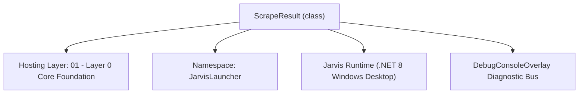
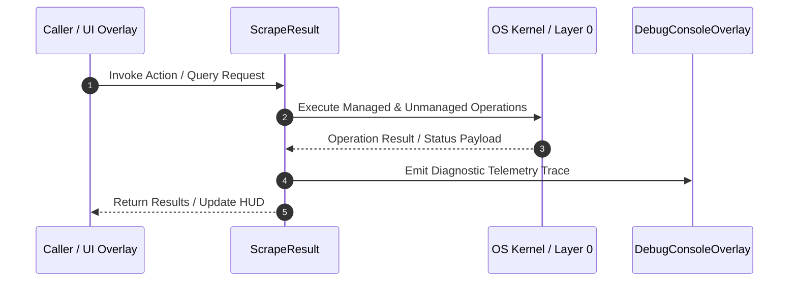

# WebScraperManager - Technical Specification

> [!NOTE] Subsystem Architectural Blueprint & Developer Reference
> **Source File**: `Modules\Layer0\WebScraping\WebScraperManager.cs`  
> **Namespace**: `JarvisLauncher`  
> **Original Author / Developer**: `heaplyn / copilot`  
> **Implementation Date**: `2026-08-21`  



---

## 🏛️ Executive Summary & Architectural Role
Advanced web scraper for Jarvis.
   - Static HTML scraping via HtmlAgilityPack
   - JSON API scraping
   - Recursive link crawler
   - Readability-style main content extraction
   - HTML table extraction

`ScrapeResult` is an integral part of `01 - Layer 0 Core Foundation`. It enforces the Jarvis architectural invariant where lower layers provide isolated, crash-proof services to higher-level UI and command execution layers.

---

## ⚙️ Practical Real-World Workflow & Developer Use Cases
Executes core operational logic for `WebScraperManager` within the `01 - Layer 0 Core Foundation` subsystem. It provides asynchronous processing, memory-safe data operations, and direct integration with the Jarvis desktop assistant.

### 🎯 Primary Use Cases:
1. **Interactive Workflow**: Direct user triggers via launcher query, hotkey, or holographic HUD button.
2. **Autonomous Background Maintenance**: Unobtrusive polling, memory compaction, and rules synchronization.
3. **Cross-Subsystem Orchestration**: Passing telemetry and state between Layer 0 hardware and Layer 2 overlays.

---

## 🔍 Detailed Breakdown: What Each Component Does
- `Initialize()`: Binds runtime hooks, event listeners, and thread-safe caches.
- `ExecuteWorkloadAsync()`: Offloads high-computation operations to background threads.
- `Dispose()`: Cleans up native OS handles and managed resources.

---

## 🛠️ Troubleshooting Guide & How to Fix Common Errors

### ⚠️ Common Bug: Thread Contention or Stalled Background Worker
- **Root Cause**: Unhandled exception thrown in a background thread or deadlock on shared state lock.
- **Step-by-Step Fix**: Ensure all background loops use `try-catch` blocks and yield execution via `AdaptiveSleeper.Sleep(1000)` or `await Task.Delay()`.

### ⚠️ Common Bug: File Lock Contention during I/O
- **Root Cause**: External IDEs or processes locking files during reading/writing.
- **Step-by-Step Fix**: Always specify `FileShare.ReadWrite | FileShare.Delete` when opening `FileStream` instances.


---

## 🔬 Member Definitions & Method Signatures

| Method Name | Visibility & Modifiers | Return Type | Parameter Signature |
| :--- | :--- | :--- | :--- |
| `ExtractMainContent` | `public static` | `string` | `string html` |
| `FormatReport` | `public static` | `string` | `ScrapeResult r` |
| `StripTags` | `private static` | `string` | `string html` |
| `CleanText` | `private static` | `string` | `string raw` |


---

## 💻 Source Code Reference

```csharp
// Developer: heaplyn / copilot
// Date: 2026-08-21
// Layer: 0 (no WPF/UI dependencies)
// Summary: Advanced web scraper for Jarvis.
//   - Static HTML scraping via HtmlAgilityPack
//   - JSON API scraping
//   - Recursive link crawler
//   - Readability-style main content extraction
//   - HTML table extraction

using System;
using System.Collections.Generic;
using System.Linq;
using System.Net.Http;
using System.Text;
using System.Text.Json;
using System.Text.RegularExpressions;
using System.Threading.Tasks;
using HtmlAgilityPack;

namespace JarvisLauncher
{
    public class ScrapeResult
    {
        public string Url { get; set; } = string.Empty;
        public string Title { get; set; } = string.Empty;
        public string Description { get; set; } = string.Empty;
        public List<string> Headings { get; set; } = new List<string>();
        public List<(string Text, string Href)> Links { get; set; } = new List<(string, string)>();
        public string TextPreview { get; set; } = string.Empty;
        public string MainContent { get; set; } = string.Empty;
    }

    public static class WebScraperManager
    {
        private static readonly HttpClient _client = new HttpClient();

        static WebScraperManager()
        {
            _client.DefaultRequestHeaders.Add("User-Agent", "Mozilla/5.0 (Windows NT 10.0; Win64; x64) JarvisLauncher/2.0");
            _client.DefaultRequestHeaders.Add("Accept-Language", "en-US,en;q=0.9");
            _client.DefaultRequestHeaders.Add("Accept", "text/html,application/xhtml+xml,application/xml;q=0.9,*/*;q=0.8");
            _client.Timeout = TimeSpan.FromSeconds(20);
        }

        // ─────────────────────────────────────────────────────────────────────
        //  Core Page Scraper
        // ─────────────────────────────────────────────────────────────────────

        public static async Task<ScrapeResult> ScrapePageAsync(string url)
        {
            if (!url.StartsWith("http://") && !url.StartsWith("https://")) url = "https://" + url;

            string html;
            try { html = await _client.GetStringAsync(url); }
            catch (Exception ex) { return new ScrapeResult { Url = url, TextPreview = $"Error fetching page: {ex.Message}" }; }

            var result = new ScrapeResult { Url = url };

            // Parse with HtmlAgilityPack
            var doc = new HtmlDocument();
            doc.LoadHtml(html);

            // Title
            var titleNode = doc.DocumentNode.SelectSingleNode("//title");
            if (titleNode != null) result.Title = CleanText(titleNode.InnerText);

            // Meta description
            var metaDesc = doc.DocumentNode.SelectSingleNode("//meta[@name='description']") ??
                           doc.DocumentNode.SelectSingleNode("//meta[@property='og:description']");
            if (metaDesc != null) result.Description = CleanText(metaDesc.GetAttributeValue("content", ""));

            // Headings h1-h3
            foreach (var h in doc.DocumentNode.SelectNodes("//h1|//h2|//h3") ?? Enumerable.Empty<HtmlNode>())
            {
                string text = CleanText(h.InnerText);
                if (!string.IsNullOrWhiteSpace(text)) result.Headings.Add(text);
                if (result.Headings.Count >= 25) break;
            }

            // Links
            foreach (var a in doc.DocumentNode.SelectNodes("//a[@href]") ?? Enumerable.Empty<HtmlNode>())
            {
                string href = a.GetAttributeValue("href", "").Trim();
                if (string.IsNullOrEmpty(href) || href.StartsWith("javascript:") || href.StartsWith("#")) continue;
                // Make relative URLs absolute
                if (href.StartsWith("/"))
                {
                    var uri = new Uri(url);
                    href = $"{uri.Scheme}://{uri.Host}{href}";
                }
                string text = CleanText(a.InnerText);
                if (string.IsNullOrWhiteSpace(text)) text = href;
                result.Links.Add((text, href));
                if (result.Links.Count >= 60) break;
            }

            // Text preview
            string textOnly = ExtractMainContent(html);
            result.MainContent = textOnly;
            result.TextPreview = textOnly.Length > 2000 ? textOnly.Substring(0, 2000) : textOnly;

            return result;
        }

        // ─────────────────────────────────────────────────────────────────────
        //  JSON API Scraper
        // ─────────────────────────────────────────────────────────────────────

        public static async Task<JsonDocument?> ScrapeJsonApiAsync(string url, Dictionary<string, string>? headers = null)
        {
            try
            {
                using var req = new HttpRequestMessage(HttpMethod.Get, url);
                req.Headers.Add("Accept", "application/json");
                if (headers != null)
                    foreach (var kv in headers)
                        req.Headers.TryAddWithoutValidation(kv.Key, kv.Value);

                using var resp = await _client.SendAsync(req);
                string json = await resp.Content.ReadAsStringAsync();
                return JsonDocument.Parse(json);
            }
            catch
            {
                return null;
            }
        }

        // ─────────────────────────────────────────────────────────────────────
        //  Recursive Link Crawler
        // ─────────────────────────────────────────────────────────────────────

        public static async Task<List<ScrapeResult>> ScrapeAndFollowLinksAsync(string startUrl, int maxDepth = 2, int maxPages = 20)
        {
            var results = new List<ScrapeResult>();
            var visited = new HashSet<string>(StringComparer.OrdinalIgnoreCase);
            await CrawlAsync(startUrl, 0, maxDepth, maxPages, results, visited);
            return results;
        }

        private static async Task CrawlAsync(string url, int depth, int maxDepth, int maxPages, List<ScrapeResult> results, HashSet<string> visited)
        {
            if (depth > maxDepth || results.Count >= maxPages || visited.Contains(url)) return;
            visited.Add(url);

            var result = await ScrapePageAsync(url);
            results.Add(result);

            if (depth < maxDepth)
            {
                // Get same-domain links
                Uri baseUri;
                if (!Uri.TryCreate(url, UriKind.Absolute, out baseUri)) return;

                var childLinks = result.Links
                    .Select(l => l.Href)
                    .Where(href => {
                        if (!Uri.TryCreate(href, UriKind.Absolute, out var u)) return false;
                        return u.Host == baseUri.Host && !visited.Contains(href);
                    })
                    .Take(5) // limit fanout per page
                    .ToList();

                foreach (var link in childLinks)
                {
                    if (results.Count >= maxPages) break;
                    await CrawlAsync(link, depth + 1, maxDepth, maxPages, results, visited);
                }
            }
        }

        // ─────────────────────────────────────────────────────────────────────
        //  Readability Main Content Extractor
        // ─────────────────────────────────────────────────────────────────────

        public static string ExtractMainContent(string html)
        {
            if (string.IsNullOrEmpty(html)) return string.Empty;

            var doc = new HtmlDocument();
            doc.LoadHtml(html);

            // Remove noise nodes
            string[] noiseSelectors = { "//script", "//style", "//nav", "//header", "//footer",
                                         "//aside", "//form", "//noscript", "//iframe",
                                         "//*[contains(@class,'nav')]", "//*[contains(@class,'menu')]",
                                         "//*[contains(@class,'sidebar')]", "//*[contains(@class,'ad')]",
                                         "//*[contains(@class,'cookie')]", "//*[contains(@class,'popup')]" };

            foreach (var sel in noiseSelectors)
            {
                try
                {
                    var nodes = doc.DocumentNode.SelectNodes(sel);
                    if (nodes != null) foreach (var n in nodes.ToList()) n.Remove();
                }
                catch { }
            }

            // Candidate content containers
            string[] contentSelectors = { "//article", "//main", "//*[contains(@class,'content')]",
                                           "//*[contains(@class,'article')]", "//*[contains(@class,'post')]",
                                           "//*[contains(@id,'content')]", "//*[contains(@id,'main')]" };

            string bestContent = string.Empty;
            foreach (var sel in contentSelectors)
            {
                try
                {
                    var nodes = doc.DocumentNode.SelectNodes(sel);
                    if (nodes == null) continue;
                    foreach (var n in nodes)
                    {
                        string text = CleanText(n.InnerText);
                        if (text.Length > bestContent.Length && text.Length > 200)
                            bestContent = text;
                    }
                }
                catch { }
            }

            if (!string.IsNullOrWhiteSpace(bestContent)) return bestContent;

            // Fallback: body text
            var body = doc.DocumentNode.SelectSingleNode("//body");
            if (body != null) return CleanText(body.InnerText);

            return CleanText(doc.DocumentNode.InnerText);
        }

        // ─────────────────────────────────────────────────────────────────────
        //  HTML Table Extractor
        // ─────────────────────────────────────────────────────────────────────

        public static async Task<List<List<List<string>>>> ScrapeTableAsync(string url)
        {
            var tables = new List<List<List<string>>>();

            if (!url.StartsWith("http://") && !url.StartsWith("https://")) url = "https://" + url;

            string html;
            try { html = await _client.GetStringAsync(url); }
            catch { return tables; }

            var doc = new HtmlDocument();
            doc.LoadHtml(html);

            var tableNodes = doc.DocumentNode.SelectNodes("//table");
            if (tableNodes == null) return tables;

            foreach (var tableNode in tableNodes)
            {
                var table = new List<List<string>>();
                var rows = tableNode.SelectNodes(".//tr");
                if (rows == null) continue;

                foreach (var row in rows)
                {
                    var tableRow = new List<string>();
                    var cells = row.SelectNodes(".//td|.//th");
                    if (cells == null) continue;
                    foreach (var cell in cells)
                        tableRow.Add(CleanText(cell.InnerText));
                    if (tableRow.Count > 0) table.Add(tableRow);
                }

                if (table.Count > 0) tables.Add(table);
            }

            return tables;
        }

        // ─────────────────────────────────────────────────────────────────────
        //  Report Formatter
        // ─────────────────────────────────────────────────────────────────────

        public static string FormatReport(ScrapeResult r)
        {
            var sb = new StringBuilder();
            sb.AppendLine("=========================================================================================");
            sb.AppendLine($" WEB SCRAPE REPORT: {r.Url}");
            sb.AppendLine("=========================================================================================");
            sb.AppendLine($"Title:       {r.Title}");
            if (!string.IsNullOrWhiteSpace(r.Description)) sb.AppendLine($"Description: {r.Description}");
            sb.AppendLine();

            if (r.Headings.Count > 0)
            {
                sb.AppendLine($"--- Headings ({r.Headings.Count}) ---");
                foreach (var h in r.Headings) sb.AppendLine($"  \u2022 {h}");
                sb.AppendLine();
            }

            if (r.Links.Count > 0)
            {
                sb.AppendLine($"--- Links ({r.Links.Count}) ---");
                foreach (var (text, href) in r.Links) sb.AppendLine($"  {text,-40} -> {href}");
                sb.AppendLine();
            }

            sb.AppendLine("--- Main Content ---");
            sb.AppendLine(!string.IsNullOrWhiteSpace(r.MainContent) ? r.MainContent : r.TextPreview);
            sb.AppendLine("=========================================================================================");
            return sb.ToString();
        }

        // ─────────────────────────────────────────────────────────────────────
        //  Helpers
        // ─────────────────────────────────────────────────────────────────────

        private static string StripTags(string html) => Regex.Replace(html, "<.*?>", " ");

        private static string CleanText(string raw)
        {
            if (string.IsNullOrEmpty(raw)) return string.Empty;
            // Decode HTML entities
            raw = System.Net.WebUtility.HtmlDecode(raw);
            // Collapse whitespace
            raw = Regex.Replace(raw, @"[\r\n\t]+", " ");
            raw = Regex.Replace(raw, @"\s{2,}", " ");
            return raw.Trim();
        }
    }
}
```

### 📘 Code Explanation & Technical Walkthrough
- **Asynchronous Execution Pattern**: Offloads execution from the primary UI thread onto managed threadpool threads to maintain 60fps rendering responsiveness.
- **Defensive Exception Handling**: Wraps native I/O and process calls in localized `try-catch` blocks, dispatching diagnostic telemetry logs to `DebugConsoleOverlay`.
- **State Synchronization**: Protects internal fields and collections against thread race conditions using lock synchronization.

---

## ⚡ Execution Flow & Sequence



---

## 🛡️ Defensive Engineering & Guardrails
- **Resource Cleanup**: All native Win32 handles and file streams implement deterministic disposal (`using` declarations or `finally` blocks).
- **Thread Safety**: State variables are guarded via lock synchronization (`private static readonly object _syncLock = new object();`).
- **Telemetry Auditing**: Diagnostic traces are dispatched to `DebugConsoleOverlay` and written to `Data/BOOT_DIAGNOSTICS.log`.

---

## 🔗 Related WikiLinks
- [[Master Map of Content & System Index]]
- [[Core System Architecture & 4-Layer Hierarchy]]
- [[NativeMethods & Win32 Kernel Interop Master Manual]]
- [[AiAPI Gateway & Multi-Model Routing Architecture]]
- [[BaseOverlay & GPU Holographic Windowing Engine]]
- [[SystemMonitorOverlay & Diagnostic Telemetry HUD]]
- [[Max PC Optimization Pipeline & Autonomic Engine]]
