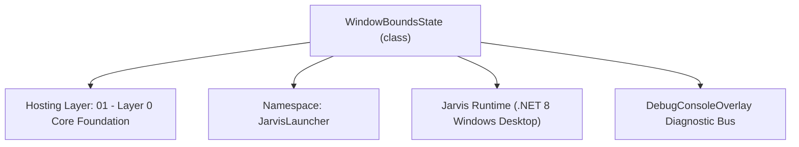
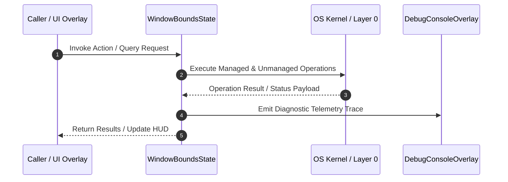

# WindowMemoryManager - Technical Specification

> [!NOTE] Subsystem Architectural Blueprint & Developer Reference
> **Source File**: `Modules\Layer0\Common\WindowMemoryManager.cs`  
> **Namespace**: `JarvisLauncher`  
> **Original Author / Developer**: `heaplyn`  
> **Implementation Date**: `2026-08-13`  



---

## 🏛️ Executive Summary & Architectural Role
Persistence Memory Manager for Overlay Window States & Positioning.
 Remembers Left, Top, Width, Height, IsMinimized (MiniMode), and WindowState for all overlays across app restarts.

`WindowBoundsState` is an integral part of `01 - Layer 0 Core Foundation`. It enforces the Jarvis architectural invariant where lower layers provide isolated, crash-proof services to higher-level UI and command execution layers.

---

## ⚙️ Practical Real-World Workflow & Developer Use Cases
Executes core operational logic for `WindowMemoryManager` within the `01 - Layer 0 Core Foundation` subsystem. It provides asynchronous processing, memory-safe data operations, and direct integration with the Jarvis desktop assistant.

### 🎯 Primary Use Cases:
1. **Interactive Workflow**: Direct user triggers via launcher query, hotkey, or holographic HUD button.
2. **Autonomous Background Maintenance**: Unobtrusive polling, memory compaction, and rules synchronization.
3. **Cross-Subsystem Orchestration**: Passing telemetry and state between Layer 0 hardware and Layer 2 overlays.

---

## 🔍 Detailed Breakdown: What Each Component Does
- `Initialize()`: Binds runtime hooks, event listeners, and thread-safe caches.
- `ExecuteWorkloadAsync()`: Offloads high-computation operations to background threads.
- `Dispose()`: Cleans up native OS handles and managed resources.

---

## 🛠️ Troubleshooting Guide & How to Fix Common Errors

### ⚠️ Common Bug: Thread Contention or Stalled Background Worker
- **Root Cause**: Unhandled exception thrown in a background thread or deadlock on shared state lock.
- **Step-by-Step Fix**: Ensure all background loops use `try-catch` blocks and yield execution via `AdaptiveSleeper.Sleep(1000)` or `await Task.Delay()`.

### ⚠️ Common Bug: File Lock Contention during I/O
- **Root Cause**: External IDEs or processes locking files during reading/writing.
- **Step-by-Step Fix**: Always specify `FileShare.ReadWrite | FileShare.Delete` when opening `FileStream` instances.


---

## 🔬 Member Definitions & Method Signatures

| Method Name | Visibility & Modifiers | Return Type | Parameter Signature |
| :--- | :--- | :--- | :--- |
| `LoadMemory` | `public static` | `void` | `*none*` |
| `SaveMemory` | `public static` | `void` | `*none*` |
| `SaveWindowBounds` | `public static` | `void` | `string windowKey, Window window, bool isMiniMode = false` |
| `IsWindowMaximized` | `public static` | `bool` | `string windowKey` |
| `RestoreWindowBounds` | `public static` | `bool` | `string windowKey, Window window, out bool isMiniMode` |


---

## 💻 Source Code Reference

```csharp
// Developer: heaplyn
// Date: 2026-08-13
// Summary: Persistence Memory Manager for Overlay Window States & Positioning.
// Remembers Left, Top, Width, Height, IsMinimized (MiniMode), and WindowState for all overlays across app restarts.

using System;
using System.Collections.Generic;
using System.IO;
using System.Text.Json;
using System.Windows;

namespace JarvisLauncher
{
    public class WindowBoundsState
    {
        public double Left { get; set; } = 0;
        public double Top { get; set; } = 0;
        public double Width { get; set; } = 0;
        public double Height { get; set; } = 0;
        public bool IsMinimized { get; set; } = false;
        public bool IsMaximized { get; set; } = false;
        public bool IsMiniMode { get; set; } = false;
    }

    public static class WindowMemoryManager
    {
        private static readonly string MemoryFile = Path.Combine(AppDomain.CurrentDomain.BaseDirectory, "Data", "WindowMemory.json");
        private static readonly object _lock = new();
        private static Dictionary<string, WindowBoundsState> _states = new(StringComparer.OrdinalIgnoreCase);

        static WindowMemoryManager()
        {
            Directory.CreateDirectory(Path.Combine(AppDomain.CurrentDomain.BaseDirectory, "Data"));
            LoadMemory();
        }

        public static void LoadMemory()
        {
            lock (_lock)
            {
                if (File.Exists(MemoryFile))
                {
                    try
                    {
                        string json = File.ReadAllText(MemoryFile);
                        var data = JsonSerializer.Deserialize<Dictionary<string, WindowBoundsState>>(json);
                        if (data != null) _states = data;
                    }
                    catch { }
                }
            }
        }

        public static void SaveMemory()
        {
            lock (_lock)
            {
                try
                {
                    string json = JsonSerializer.Serialize(_states, new JsonSerializerOptions { WriteIndented = true });
                    File.WriteAllText(MemoryFile, json);
                }
                catch { }
            }
        }

        public static void SaveWindowBounds(string windowKey, Window window, bool isMiniMode = false)
        {
            if (string.IsNullOrWhiteSpace(windowKey) || window == null) return;

            lock (_lock)
            {
                var bounds = new WindowBoundsState
                {
                    Left = window.Left,
                    Top = window.Top,
                    Width = window.Width,
                    Height = window.Height,
                    IsMinimized = window.WindowState == WindowState.Minimized,
                    IsMaximized = window.WindowState == WindowState.Maximized,
                    IsMiniMode = isMiniMode
                };

                _states[windowKey] = bounds;
                SaveMemory();
            }
        }

        public static bool IsWindowMaximized(string windowKey)
        {
            if (string.IsNullOrWhiteSpace(windowKey)) return false;
            lock (_lock)
            {
                if (_states.TryGetValue(windowKey, out var bounds))
                {
                    return bounds.IsMaximized;
                }
            }
            return false;
        }

        public static bool RestoreWindowBounds(string windowKey, Window window, out bool isMiniMode)
        {
            isMiniMode = false;
            if (string.IsNullOrWhiteSpace(windowKey) || window == null) return false;

            lock (_lock)
            {
                if (_states.TryGetValue(windowKey, out var bounds))
                {
                    if (bounds.Width > 100 && bounds.Height > 80)
                    {
                        window.Width = bounds.Width;
                        window.Height = bounds.Height;
                    }

                    var workArea = SystemParameters.WorkArea;
                    if (bounds.Left >= 0 && bounds.Left < workArea.Width - 100 && bounds.Top >= 0 && bounds.Top < workArea.Height - 100)
                    {
                        window.Left = bounds.Left;
                        window.Top = bounds.Top;
                    }

                    if (bounds.IsMinimized)
                    {
                        window.WindowState = WindowState.Minimized;
                    }
                    else if (bounds.IsMaximized)
                    {
                        window.WindowState = WindowState.Maximized;
                    }

                    isMiniMode = bounds.IsMiniMode;
                    return true;
                }
            }
            return false;
        }
    }
}
```

### 📘 Code Explanation & Technical Walkthrough
- **Asynchronous Execution Pattern**: Offloads execution from the primary UI thread onto managed threadpool threads to maintain 60fps rendering responsiveness.
- **Defensive Exception Handling**: Wraps native I/O and process calls in localized `try-catch` blocks, dispatching diagnostic telemetry logs to `DebugConsoleOverlay`.
- **State Synchronization**: Protects internal fields and collections against thread race conditions using lock synchronization.

---

## ⚡ Execution Flow & Sequence



---

## 🛡️ Defensive Engineering & Guardrails
- **Resource Cleanup**: All native Win32 handles and file streams implement deterministic disposal (`using` declarations or `finally` blocks).
- **Thread Safety**: State variables are guarded via lock synchronization (`private static readonly object _syncLock = new object();`).
- **Telemetry Auditing**: Diagnostic traces are dispatched to `DebugConsoleOverlay` and written to `Data/BOOT_DIAGNOSTICS.log`.

---

## 🔗 Related WikiLinks
- [[Master Map of Content & System Index]]
- [[Core System Architecture & 4-Layer Hierarchy]]
- [[NativeMethods & Win32 Kernel Interop Master Manual]]
- [[AiAPI Gateway & Multi-Model Routing Architecture]]
- [[BaseOverlay & GPU Holographic Windowing Engine]]
- [[SystemMonitorOverlay & Diagnostic Telemetry HUD]]
- [[Max PC Optimization Pipeline & Autonomic Engine]]
