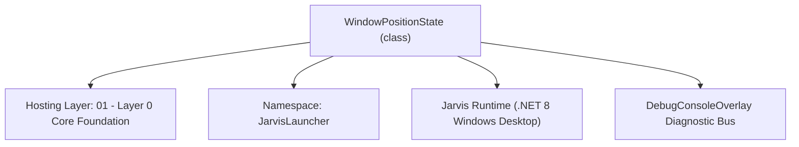
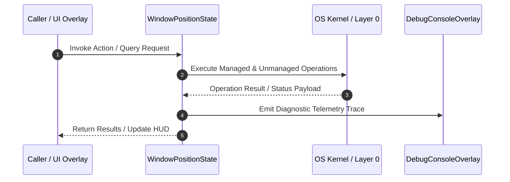

# WindowPositionManager - Technical Specification

> [!NOTE] Subsystem Architectural Blueprint & Developer Reference
> **Source File**: `Modules\Layer0\Common\WindowPositionManager.cs`  
> **Namespace**: `JarvisLauncher`  
> **Original Author / Developer**: `heaplyn`  
> **Implementation Date**: `2026-08-13`  



---

## 🏛️ Executive Summary & Architectural Role
Window position & open state persistence manager.
 Automatically records and restores screen coordinates, sizes, and open state of all Jarvis overlays across application restarts.

`WindowPositionState` is an integral part of `01 - Layer 0 Core Foundation`. It enforces the Jarvis architectural invariant where lower layers provide isolated, crash-proof services to higher-level UI and command execution layers.

---

## ⚙️ Practical Real-World Workflow & Developer Use Cases
Executes core operational logic for `WindowPositionManager` within the `01 - Layer 0 Core Foundation` subsystem. It provides asynchronous processing, memory-safe data operations, and direct integration with the Jarvis desktop assistant.

### 🎯 Primary Use Cases:
1. **Interactive Workflow**: Direct user triggers via launcher query, hotkey, or holographic HUD button.
2. **Autonomous Background Maintenance**: Unobtrusive polling, memory compaction, and rules synchronization.
3. **Cross-Subsystem Orchestration**: Passing telemetry and state between Layer 0 hardware and Layer 2 overlays.

---

## 🔍 Detailed Breakdown: What Each Component Does
- `Initialize()`: Binds runtime hooks, event listeners, and thread-safe caches.
- `ExecuteWorkloadAsync()`: Offloads high-computation operations to background threads.
- `Dispose()`: Cleans up native OS handles and managed resources.

---

## 🛠️ Troubleshooting Guide & How to Fix Common Errors

### ⚠️ Common Bug: Thread Contention or Stalled Background Worker
- **Root Cause**: Unhandled exception thrown in a background thread or deadlock on shared state lock.
- **Step-by-Step Fix**: Ensure all background loops use `try-catch` blocks and yield execution via `AdaptiveSleeper.Sleep(1000)` or `await Task.Delay()`.

### ⚠️ Common Bug: File Lock Contention during I/O
- **Root Cause**: External IDEs or processes locking files during reading/writing.
- **Step-by-Step Fix**: Always specify `FileShare.ReadWrite | FileShare.Delete` when opening `FileStream` instances.


---

## 🔬 Member Definitions & Method Signatures

| Method Name | Visibility & Modifiers | Return Type | Parameter Signature |
| :--- | :--- | :--- | :--- |
| `Load` | `public static` | `void` | `*none*` |
| `Save` | `public static` | `void` | `*none*` |
| `RegisterWindow` | `public static` | `void` | `Window window, string windowName` |
| `SaveWindowState` | `public static` | `void` | `Window window, string windowName, bool isOpen` |
| `GetSavedState` | `public static` | `WindowPositionState?` | `string windowName` |
| `RestoreOpenOverlays` | `public static` | `void` | `*none*` |


---

## 💻 Source Code Reference

```csharp
// Developer: heaplyn
// Date: 2026-08-13
// Summary: Window position & open state persistence manager.
// Automatically records and restores screen coordinates, sizes, and open state of all Jarvis overlays across application restarts.

using System;
using System.Collections.Generic;
using System.IO;
using System.Linq;
using System.Text.Json;
using System.Windows;

namespace JarvisLauncher
{
    public class WindowPositionState
    {
        public string WindowName { get; set; } = string.Empty;
        public double Left { get; set; }
        public double Top { get; set; }
        public double Width { get; set; }
        public double Height { get; set; }
        public bool IsOpen { get; set; }
    }

    public static class WindowPositionManager
    {
        private static string PositionsFilePath => Path.Combine(PathHandler.GetDataDirectory(), "window_positions.json");
        private static Dictionary<string, WindowPositionState> _cache = new();
        private static readonly object _lock = new();

        static WindowPositionManager()
        {
            Load();
        }

        public static void Load()
        {
            lock (_lock)
            {
                try
                {
                    if (File.Exists(PositionsFilePath))
                    {
                        string json = File.ReadAllText(PositionsFilePath);
                        var data = JsonSerializer.Deserialize<Dictionary<string, WindowPositionState>>(json);
                        if (data != null) _cache = data;
                    }
                }
                catch { _cache = new(); }
            }
        }

        public static void Save()
        {
            lock (_lock)
            {
                try
                {
                    string dir = Path.GetDirectoryName(PositionsFilePath)!;
                    if (!Directory.Exists(dir)) Directory.CreateDirectory(dir);

                    string json = JsonSerializer.Serialize(_cache, new JsonSerializerOptions { WriteIndented = true });
                    File.WriteAllText(PositionsFilePath, json);
                }
                catch { }
            }
        }

        public static void RegisterWindow(Window window, string windowName)
        {
            if (string.IsNullOrEmpty(windowName)) windowName = window.GetType().Name;

            // Apply saved bounds if present
            lock (_lock)
            {
                if (_cache.TryGetValue(windowName, out var state))
                {
                    if (state.Left > 0 && state.Top > 0 && state.Width > 100 && state.Height > 100)
                    {
                        window.WindowStartupLocation = WindowStartupLocation.Manual;
                        window.Left = state.Left;
                        window.Top = state.Top;
                        window.Width = state.Width;
                        window.Height = state.Height;
                    }
                }
            }

            // Track position updates on move / resize / close
            window.LocationChanged += (s, e) => SaveWindowState(window, windowName, isOpen: window.IsVisible);
            window.SizeChanged += (s, e) => SaveWindowState(window, windowName, isOpen: window.IsVisible);
            window.IsVisibleChanged += (s, e) => SaveWindowState(window, windowName, isOpen: window.IsVisible);
            window.Closed += (s, e) => SaveWindowState(window, windowName, isOpen: false);
        }

        public static void SaveWindowState(Window window, string windowName, bool isOpen)
        {
            if (window == null) return;
            if (string.IsNullOrEmpty(windowName)) windowName = window.GetType().Name;

            lock (_lock)
            {
                _cache[windowName] = new WindowPositionState
                {
                    WindowName = windowName,
                    Left = window.Left,
                    Top = window.Top,
                    Width = window.Width,
                    Height = window.Height,
                    IsOpen = isOpen
                };
            }
            Save();
        }

        public static WindowPositionState? GetSavedState(string windowName)
        {
            lock (_lock)
            {
                if (_cache.TryGetValue(windowName, out var state)) return state;
                return null;
            }
        }

        public static void RestoreOpenOverlays()
        {
            try
            {
                string path = @"C:\Users\Kyle\Downloads\Projects\Jarvis\Data\BOOT_DIAGNOSTICS.log";
                System.IO.File.AppendAllText(path, $"[{DateTime.Now:HH:mm:ss.fff}] [WPM] RestoreOpenOverlays called\n");
            } catch { }

            List<string> openWindows;
            lock (_lock)
            {
                openWindows = _cache.Values
                    .Where(v => v.IsOpen)
                    .Select(v => v.WindowName)
                    .ToList();
            }

            foreach (var name in openWindows)
            {
                try
                {
                    string path = @"C:\Users\Kyle\Downloads\Projects\Jarvis\Data\BOOT_DIAGNOSTICS.log";
                    System.IO.File.AppendAllText(path, $"[{DateTime.Now:HH:mm:ss.fff}] [WPM] Attempting to restore: {name}\n");
                } catch { }

                Application.Current.Dispatcher.Invoke(() =>
                {
                    try
                    {
                        switch (name)
                        {
                            case nameof(VoiceStudioOverlay): VoiceStudioOverlay.ShowOverlay(); break;
                            case nameof(LlmSettingsOverlay): LlmSettingsOverlay.ShowOverlay(); break;
                            case nameof(HuggingFaceOverlay): HuggingFaceOverlay.ShowOverlay(); break;
                            case nameof(TtsVoiceLibraryOverlay): TtsVoiceLibraryOverlay.ShowOverlay(); break;
                            case nameof(OfflineStudioOverlay): OfflineStudioOverlay.ShowOverlay(); break;
                            case nameof(SystemMonitorOverlay): SystemMonitorOverlay.ShowOverlay(); break;
                            case nameof(StickyNotesOverlay): StickyNotesOverlay.ShowOverlay(); break;
                            case nameof(MusicPlaylistOverlay): MusicPlaylistOverlay.ShowOverlay(); break;
                            case nameof(ChatOverlay): ChatOverlay.ShowOverlay(); break;
                            case nameof(SettingsOverlay): SettingsOverlay.ShowSettings(); break;
                            case nameof(CalculusStudioOverlay): CalculusStudioOverlay.ShowStudio(); break;
                        }
                    }
                    catch (Exception ex)
                    {
                        try
                        {
                            string path = @"C:\Users\Kyle\Downloads\Projects\Jarvis\BOOT_DIAGNOSTICS.log";
                            System.IO.File.AppendAllText(path, $"[{DateTime.Now:HH:mm:ss.fff}] [WPM] Restore Error ({name}): {ex.Message}\n");
                        } catch { }
                    }
                });
            }
        }
    }
}
```

### 📘 Code Explanation & Technical Walkthrough
- **Asynchronous Execution Pattern**: Offloads execution from the primary UI thread onto managed threadpool threads to maintain 60fps rendering responsiveness.
- **Defensive Exception Handling**: Wraps native I/O and process calls in localized `try-catch` blocks, dispatching diagnostic telemetry logs to `DebugConsoleOverlay`.
- **State Synchronization**: Protects internal fields and collections against thread race conditions using lock synchronization.

---

## ⚡ Execution Flow & Sequence



---

## 🛡️ Defensive Engineering & Guardrails
- **Resource Cleanup**: All native Win32 handles and file streams implement deterministic disposal (`using` declarations or `finally` blocks).
- **Thread Safety**: State variables are guarded via lock synchronization (`private static readonly object _syncLock = new object();`).
- **Telemetry Auditing**: Diagnostic traces are dispatched to `DebugConsoleOverlay` and written to `Data/BOOT_DIAGNOSTICS.log`.

---

## 🔗 Related WikiLinks
- [[Master Map of Content & System Index]]
- [[Core System Architecture & 4-Layer Hierarchy]]
- [[NativeMethods & Win32 Kernel Interop Master Manual]]
- [[AiAPI Gateway & Multi-Model Routing Architecture]]
- [[BaseOverlay & GPU Holographic Windowing Engine]]
- [[SystemMonitorOverlay & Diagnostic Telemetry HUD]]
- [[Max PC Optimization Pipeline & Autonomic Engine]]
